# Atlas Product Map

## The Master Blueprint of the Atlas AI Engineering Operating System

**Document class:** Internal Product & Engineering Blueprint
**Status:** Founding edition · 2026
**Audience:** Product Management, Engineering, Architecture, UX, AI Research, Program Management, Executive Staff
**Owner:** Office of the CPO / CTO
**Companion documents:** [ATLAS_CONSTITUTION.md](ATLAS_CONSTITUTION.md) · [ATLAS_PRODUCT_VISION.md](ATLAS_PRODUCT_VISION.md)

> **Product**
> Atlas

> **Category**
> AI Engineering Operating System (AEOS)

> **Mission**
> Atlas understands software projects, preserves engineering knowledge, reasons like an engineering organization, and helps users build production-ready software while explaining every engineering decision.

---

## Purpose and Status of This Document

This is not a Product Requirements Document. A PRD specifies *what to build in a release*. This document specifies *the structure everything else must fit into*. It is the master blueprint from which the PRD, the Software Requirements Specification, the System Architecture, the Database Design, the Agent Specifications, the UI/UX Specification, and the API Design are all derived. Those downstream documents may change every quarter. This document should not, except through a deliberate revision.

Consistent with that purpose, this document deliberately does not contain implementation details, API contracts, database schemas, or code. It defines **platforms, modules, workflows, users, agents, navigation, integrations, dependencies, and the evolution roadmap** — the product structure, not the product's construction.

> [!IMPORTANT]
> Every structural decision in this document is written with its reasoning attached. A downstream team that disagrees with a decision should be able to identify exactly which reasoning they are disagreeing with, not merely the conclusion.

---

## Table of Contents

1. [Platform Architecture: The Five Platforms of Atlas](#1-platform-architecture-the-five-platforms-of-atlas)
2. [Platform Decomposition: Every Module](#2-platform-decomposition-every-module)
3. [Major Workflows](#3-major-workflows)
4. [User Definitions](#4-user-definitions)
5. [AI Agent Definitions](#5-ai-agent-definitions)
6. [Product Module Specifications](#6-product-module-specifications)
7. [Navigation Structure](#7-navigation-structure)
8. [External Integrations](#8-external-integrations)
9. [Product Dependency Map](#9-product-dependency-map)
10. [Product Evolution Roadmap](#10-product-evolution-roadmap)
11. [Appendix](#11-appendix)

---

## 1. Platform Architecture: The Five Platforms of Atlas

An operating system is defined by the platforms it composes, not by any single feature. Atlas is composed of **five platforms** plus a **cross-cutting governance layer** that does not sit beside the other five but constrains all of them. Five is a deliberate number: fewer would conflate responsibilities that need independent evolution rates (the reasoning core does not change at the same pace as the execution sandbox); more would fragment ownership without a corresponding gain in clarity.

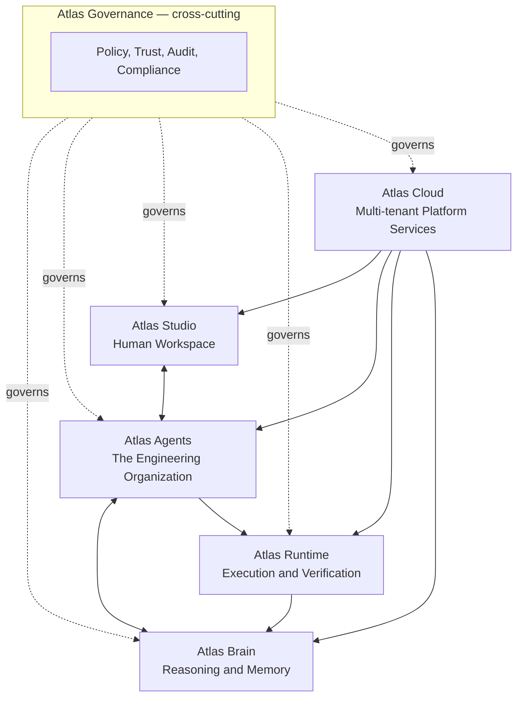

### 1.1 Atlas Brain

**What it is.** The persistent reasoning and memory substrate of Atlas. Atlas Brain holds the structured model of a project — its requirements, architecture, code relationships, decisions, and institutional knowledge — and exposes it as a queryable, continuously reconciled asset.

**Why it exists.** Every other platform is stateless without it. Atlas Studio would be a UI with nothing durable behind it; Atlas Agents would reason from a blank context every session; Atlas Runtime would execute changes with no memory of why the system looks the way it does. Atlas Brain exists because the mission's core promise — "understands software projects" and "preserves engineering knowledge" — cannot be satisfied by any component that resets between sessions. It is the one platform every other platform is structurally dependent on.

**What it is not.** Atlas Brain is not a chat history log and not a vector-search index alone. It is a structured, typed model (detailed in [Section 2.1](#21-atlas-brain-modules)) with provenance, currency tracking, and explicit relationships — the difference between "documents that mention X" and "what we know about X, from where, and how current it is."

### 1.2 Atlas Studio

**What it is.** The human-facing workspace where users create projects, review architecture, manage tasks, inspect code, run tests, track deployments, and observe analytics — the primary surface through which people interact with Atlas Brain and Atlas Agents.

**Why it exists.** Reasoning and memory are only valuable if a human can inspect, direct, and act on them. Atlas Studio exists to give every persona in [Section 4](#4-user-definitions) an appropriately scoped view into the same underlying Project Brain, so a founder's view and an enterprise architect's view are different surfaces over one consistent source of truth rather than two disconnected products.

**What it is not.** Atlas Studio is not "an IDE." It deliberately does not attempt to replace the code editors and IDEs users already have (Cursor, VS Code, JetBrains). It is the workspace for engineering *decisions* — planning, architecture, review, and oversight — while code editing itself can occur in existing tools that surface Atlas context through integrations ([Section 8](#8-external-integrations)).

### 1.3 Atlas Agents

**What it is.** The multi-role reasoning organization: fourteen specialized agents (Planner, Architect, Security Engineer, QA Engineer, and others detailed in [Section 5](#5-ai-agent-definitions)) that apply distinct engineering disciplines to a task, in the same way a real engineering organization distributes judgment across specialized roles rather than one generalist.

**Why it exists.** A single model reasoning in one pass reproduces the blind spots of a single perspective. Atlas Agents exists to structurally reproduce the disciplinary tension of a competent engineering organization — an architect's proposal tested against a security engineer's threat model and a database architect's data-integrity concerns — as a fixed, accountable organizational design rather than an ad hoc prompt.

**What it is not.** Atlas Agents is not a general-purpose agent framework for arbitrary tasks. It is a fixed, opinionated organizational model specialized entirely to software engineering, built using general orchestration substrates such as the Microsoft Agent Framework ([Section 8.16](#8-external-integrations)).

### 1.4 Atlas Runtime

**What it is.** The execution and verification layer: sandboxed environments, tool invocation, test execution, build and deployment orchestration, and the verification checks that must pass before a plan produced by Atlas Agents is allowed to affect a real system.

**Why it exists.** Reasoning that cannot act is advisory only, and reasoning that acts without verification is unsafe. Atlas Runtime exists to give Atlas Agents a bounded, observable, reversible way to execute engineering work — running a test suite, provisioning a sandbox environment, executing a deployment step — with every action instrumented so its outcome feeds back into Atlas Brain.

**What it is not.** Atlas Runtime is not a general compute platform. It exists solely to execute and verify engineering actions Atlas Agents have planned; it is not a substitute for the customer's own CI/CD or cloud infrastructure, which it orchestrates through integrations rather than replaces.

### 1.5 Atlas Cloud

**What it is.** The multi-tenant platform layer: identity and access, integration hub, billing and metering, observability, and data-residency and compliance controls that let Atlas operate as a governed, multi-customer service rather than a single-tenant tool.

**Why it exists.** Atlas Brain, Agents, Studio, and Runtime must be deployable at the scale of many organizations simultaneously, each with distinct data boundaries, policies, and integrations. Atlas Cloud exists to isolate tenants correctly, meter usage fairly, and give enterprises the platform-level guarantees (residency, uptime, access control) they require before granting Atlas any operational authority.

**What it is not.** Atlas Cloud is not a general-purpose cloud platform competing with Azure, AWS, or GCP. It is the tenancy, control-plane, and integration layer that lets Atlas run *on top of* those clouds, per customer preference (see [Section 8](#8-external-integrations)).

### 1.6 Atlas Governance (Cross-Cutting)

**What it is.** Governance is not a sixth platform beside the other five; it is a constraint layer that runs through all of them — policy enforcement, authority boundaries, audit trails, trust scoring, and compliance reporting.

**Why it exists as cross-cutting rather than a separate platform.** Governance that lived only inside one platform (for example, only inside Atlas Cloud) could be bypassed by action taken in another (for example, an agent executing directly through Atlas Runtime). Modeling governance as a layer that instruments every platform boundary is the only design that keeps the guarantee — every consequential action is bounded, explainable, and auditable — true regardless of which platform initiates the action.

### 1.7 Why These Five (and Not Fewer or More)

| Alternative considered | Why it was rejected |
|---|---|
| Merge Brain and Agents into one "AI Core" platform | Conflates *what Atlas knows* with *how Atlas reasons*; they must evolve independently — memory schemas change slowly, reasoning strategies change quickly |
| Merge Studio and Cloud into one "Platform" | Conflates the *user-facing workspace* with *multi-tenant infrastructure concerns*; different teams, different release cadences |
| Split Runtime into "Execution" and "Verification" platforms | Verification without execution authority is inert, and execution without mandatory verification is unsafe; keeping them one platform enforces that they are never separated in practice |
| Treat Governance as a sixth platform | Governance must constrain every platform boundary, including ones added in the future; a peer platform could be bypassed, a cross-cutting layer cannot |

---

## 2. Platform Decomposition: Every Module

### 2.1 Atlas Brain Modules

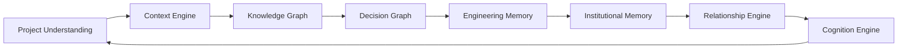

| Module | Explanation |
|---|---|
| **Project Understanding** | The entry module that constructs and continuously updates a testable model of a project's entities (services, schemas, requirements, teams) from ingested signals. It is the module responsible for distinguishing observed fact from inference, and for surfacing gaps rather than silently filling them. |
| **Context Engine** | Maintains the live, current-state map of the project's structure: service boundaries, dependencies, data flows, deployment topology. It continuously reconciles this map against Engineering Memory to detect drift between documented and actual architecture. |
| **Knowledge Graph** | Structures both Engineering and Institutional Memory into typed entities and relationships with provenance and currency tracked per claim, replacing a flat document index with a queryable structure that can answer "what do we know, from where, how current." |
| **Decision Graph** | Records engineering decisions as first-class nodes connected to the triggering requirement, alternatives considered, evidence, decision-maker, resulting code, and the condition under which the decision should be reconsidered. Decisions are superseded, never silently overwritten. |
| **Engineering Memory** | The factual substrate: commits, pull requests, test results, deployments, telemetry. This is Atlas's closest approximation of ground truth and the layer other modules must never contradict without an explicit, recorded reason. |
| **Institutional Memory** | The record of what the organization has learned: incidents, postmortems, deliberate trade-offs, and tacit team conventions, stored with explicit attribution to their human source and subject to revision. |
| **Relationship Engine** | Captures the human and organizational dimension — ownership, review responsibility, cross-team dependency, and actual (not org-chart) approval flow — enabling Atlas to reason about a system as the socio-technical artifact it is. |
| **Cognition Engine** | Executes the nine-stage Engineering Cognition loop (Observe → Understand → Remember → Reason → Plan → Review → Teach → Execute → Improve) over the other six modules; it is the operational reasoning process, not a data store. |

### 2.2 Atlas Studio Modules

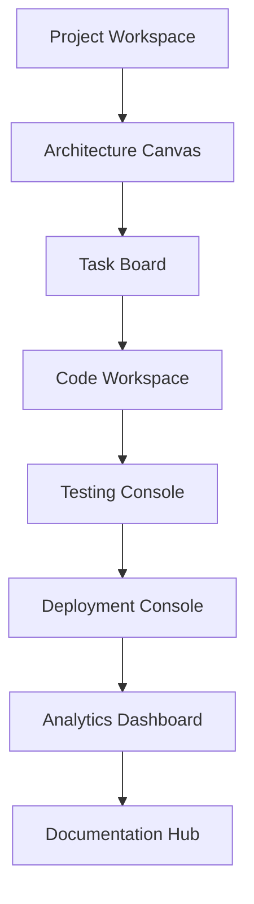

| Module | Explanation |
|---|---|
| **Project Workspace** | The container view for a single project: its current Project Brain summary, active work, and health status. The default landing surface for a project. |
| **Architecture Canvas** | A visual, editable representation of the Context Graph — services, boundaries, data flows — that lets architects review and annotate structure directly, with every annotation capable of becoming a Decision Graph entry. |
| **Task Board** | The human-visible view of the Planner agent's sequenced work, showing dependencies, ownership, and status, reconciled continuously with Atlas Agents' actual execution state. |
| **Code Workspace** | A read-oriented, context-rich view of code tied to its Decision Graph and Knowledge Graph entries — "why does this exist" answered inline — distinct from a full editing IDE, which remains an external integration. |
| **Testing Console** | Surfaces QA Engineer agent output: test coverage, verification results, and outstanding risk, connected to the specific requirement or decision each test is validating. |
| **Deployment Console** | Surfaces DevOps agent output: deployment plans, rollout status, rollback readiness, and environment health. |
| **Analytics Dashboard** | Aggregates Success Metrics ([Product Vision, Section 14](ATLAS_PRODUCT_VISION.md#14-success-metrics)) at the project and organization level for Engineering Managers and Product Managers. |
| **Documentation Hub** | The human-readable surface of the Knowledge Graph: living documentation with staleness indicators and source links, replacing a static wiki. |

### 2.3 Atlas Agents Modules

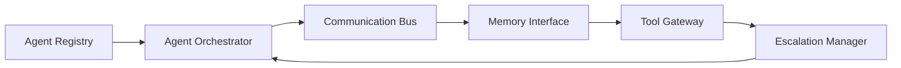

| Module | Explanation |
|---|---|
| **Agent Registry** | The authoritative definition of each of the fourteen agent roles (Section 5): their scope, authority boundary, and maturity stage. New agent roles or capability expansions are versioned here. |
| **Agent Orchestrator** | Sequences which agents engage for a given task, mirroring the collaboration pattern described in the [Product Vision, Section 12.3](ATLAS_PRODUCT_VISION.md#123-how-roles-collaborate-a-worked-example), and manages hand-offs between roles. |
| **Communication Bus** | The structured channel through which agents exchange findings, including explicit disagreement, ensuring conflicting conclusions are surfaced rather than silently merged. |
| **Memory Interface** | The sole path by which agents read from and write to Atlas Brain, ensuring every agent's reasoning is grounded in and recorded back to the Project Brain rather than held in an ephemeral context window. |
| **Tool Gateway** | The governed interface through which agents invoke external tools and integrations ([Section 8](#8-external-integrations)), enforcing authority boundaries at the point of action. |
| **Escalation Manager** | Detects when a task exceeds an agent's authority boundary or maturity stage ([Product Vision, Section 12.5](ATLAS_PRODUCT_VISION.md#125-role-maturity-model)) and routes it to the appropriate human owner. |

### 2.4 Atlas Runtime Modules

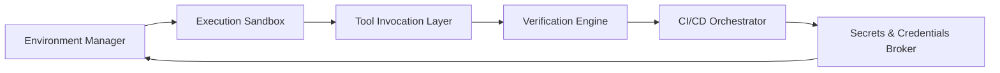

| Module | Explanation |
|---|---|
| **Environment Manager** | Provisions and tears down isolated environments (containers, ephemeral cloud resources) needed to safely execute or test a proposed change without affecting production. |
| **Execution Sandbox** | The isolated space in which generated code, migrations, or configuration changes are actually run and observed before being proposed for merge or deployment. |
| **Tool Invocation Layer** | The concrete mechanism for calling external tools (build systems, package managers, cloud CLIs) on behalf of an agent, within the boundary set by the Tool Gateway. |
| **Verification Engine** | Executes the checks a plan specifies (tests, static analysis, policy checks) and produces the pass/fail evidence that the Cognition Engine's Review stage depends on. |
| **CI/CD Orchestrator** | Coordinates multi-step build, test, and deployment pipelines, integrating with the customer's existing CI/CD systems rather than replacing them. |
| **Secrets & Credentials Broker** | Issues short-lived, scoped credentials for any runtime action requiring access to customer systems, ensuring no long-lived secret is held by an agent directly. |

### 2.5 Atlas Cloud Modules

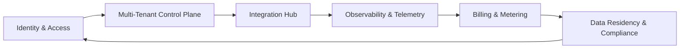

| Module | Explanation |
|---|---|
| **Multi-Tenant Control Plane** | Provisions and isolates each customer's Atlas instance — Project Brain, agent configuration, and runtime environments — ensuring no cross-tenant data leakage. |
| **Identity & Access** | Authentication, authorization, and role-based access control for every human user and every agent action, integrated with customer identity providers (SSO, SCIM). |
| **Integration Hub** | The managed connectors to every external system in [Section 8](#8-external-integrations), including credential management, sync scheduling, and webhook handling. |
| **Observability & Telemetry** | Operational monitoring of Atlas itself — latency, reliability, cost — distinct from the customer's own system telemetry, which is ingested as a Project Brain signal. |
| **Billing & Metering** | Usage measurement and billing across tenants, tied to metrics that reflect value delivered (e.g., Project Brain maturity, agent actions) rather than only raw compute consumption. |
| **Data Residency & Compliance** | Enforces regional data storage, retention, and deletion requirements per tenant, and produces the compliance evidence enterprise customers require. |

### 2.6 Atlas Governance Modules (Cross-Cutting)

| Module | Explanation |
|---|---|
| **Policy Engine** | Encodes organization-specific and regulatory policies (e.g., "no direct production database access," "PII requires masked test data") that constrain every agent and runtime action. |
| **Authority Boundary Manager** | Implements the maturity-staged authority model ([Product Vision, Section 12.5](ATLAS_PRODUCT_VISION.md#125-role-maturity-model)), the single source of truth for what any agent is currently allowed to do without human approval. |
| **Audit Trail** | An immutable, queryable record of every consequential action taken by any agent or user, required for enterprise compliance and for post-incident review. |
| **Trust Scoring** | Tracks calibration — how often Atlas's stated confidence matches observed correctness — per agent role and per customer domain, operationalizing Trust Intelligence ([Product Vision, Section 10.12](ATLAS_PRODUCT_VISION.md#1012-trust-intelligence)). |
| **Compliance Reporting** | Produces the specific reports (SOC 2 evidence, access reviews, change logs) enterprise customers and auditors require, generated from the Audit Trail rather than assembled manually. |

---

## 3. Major Workflows

### 3.1 The Primary Lifecycle Workflow

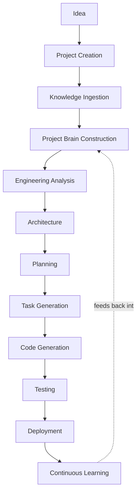

| Stage | What happens | Primary platform | Primary agent(s) involved |
|---|---|---|---|
| **Idea** | A user articulates an intent in natural language, a document, or an existing repository pointer | Atlas Studio | Business Analyst |
| **Project Creation** | A project is provisioned in Atlas Cloud's Multi-Tenant Control Plane, with an empty Project Brain instance | Atlas Cloud | — |
| **Knowledge Ingestion** | Authorized sources (repos, tickets, docs, telemetry) are connected via the Integration Hub and pulled into Atlas Brain | Atlas Cloud → Atlas Brain | — |
| **Project Brain Construction** | Project Understanding, Context Engine, and Knowledge Graph modules build the initial structured model | Atlas Brain | — |
| **Engineering Analysis** | Requirements are clarified and validated; ambiguities and missing constraints are surfaced | Atlas Brain / Atlas Agents | Business Analyst, Planner |
| **Architecture** | Structural, hard-to-reverse decisions are proposed, evaluated, and recorded in the Decision Graph | Atlas Studio / Atlas Agents | Architect, Database Architect, Security Engineer |
| **Planning** | Work is sequenced with dependencies and risk ordering | Atlas Studio | Planner, Engineering Manager |
| **Task Generation** | Concrete, assignable units of work are created and linked to requirements and decisions | Atlas Studio | Planner |
| **Code Generation** | Implementation is produced against the reviewed plan, grounded in Atlas Brain | Atlas Runtime | Backend Engineer, Frontend Engineer, Database Architect |
| **Testing** | Generated work is verified against explicit and inferred requirements, including adversarial cases | Atlas Runtime | QA Engineer, Reviewer |
| **Deployment** | Verified changes are released through the customer's CI/CD, staged and monitored | Atlas Runtime | DevOps Engineer |
| **Continuous Learning** | Outcomes (incidents, performance, usage) are observed and written back into Atlas Brain, closing the loop | Atlas Brain | All agents, via Cognition Engine's Improve stage |

### 3.2 Onboarding Workflow (Existing Codebase)

A large share of Atlas's real-world usage begins not with a blank project but with an existing, undocumented codebase. This workflow is distinct enough to warrant its own diagram.

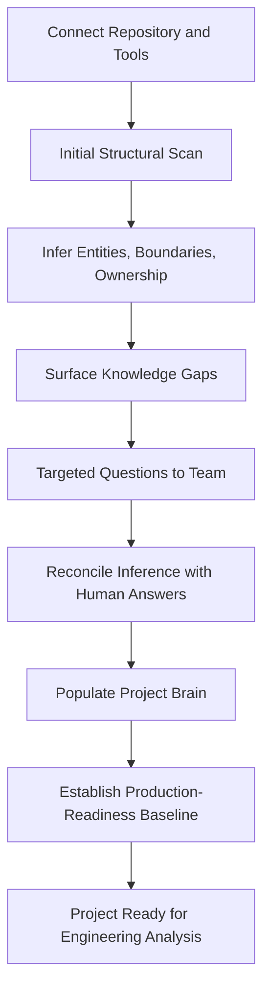

**Why this workflow exists separately.** Constructing a Project Brain for a greenfield project is primarily forward reasoning from stated intent. Constructing one for an existing system is primarily *inference under uncertainty* — Atlas must distinguish what it can determine directly from source (Engineering Memory) from what requires asking a human (Institutional Memory), and must never silently assume institutional context it cannot verify.

### 3.3 Agent Collaboration Sequence (Illustrative)

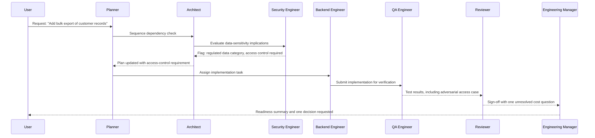

### 3.4 Decision Revision Workflow

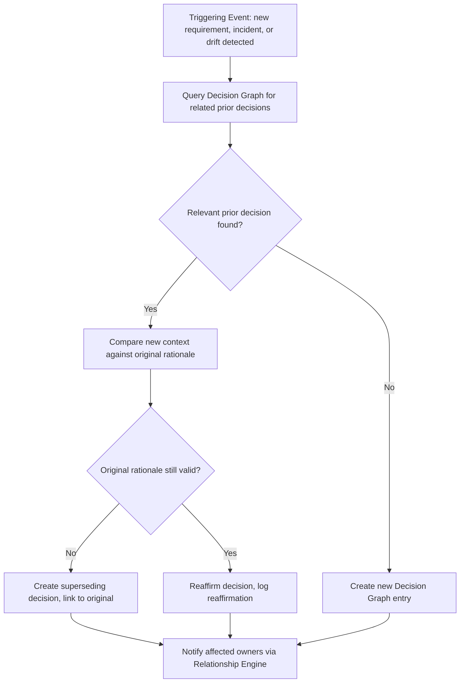

**Why this workflow matters.** This is the mechanical implementation of the Product Vision's requirement that decisions be revisable rather than fossilized ([Product Vision, Chapter 6.6 reference](ATLAS_PRODUCT_VISION.md#11-project-brain)). A decision is never deleted; it is reaffirmed or superseded, and both outcomes are recorded with equal rigor.

### 3.5 Knowledge Ingestion Sync Workflow

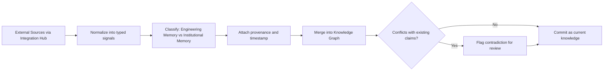

---

## 4. User Definitions

Each user type interacts with a different slice of Atlas Studio and expects different guarantees from Atlas Brain and Atlas Agents. Designing to an undifferentiated "developer" persona would produce a workspace that serves no one well; the table below is the reference every module owner uses when evaluating a design choice against a specific user's actual need.

| User | Goals | Pain Points Today | Expected Outcome With Atlas |
|---|---|---|---|
| **Students** | Learn real engineering judgment, not just syntax; complete coursework that demonstrates understanding | Tutorials teach isolated concepts; generated code is accepted without understanding why it works | Explanations that teach reasoning in the context of their own project; ability to defend every design choice |
| **Founders** | Move from idea to a working, defensible product quickly without a technical co-founder | No access to senior engineering judgment; expensive mistakes discovered only after traction | Early visibility into which decisions are hard to reverse; a system that scales without a rewrite at the first funding round |
| **Developers** | Implement features quickly and correctly without repeatedly re-explaining project context | Generic AI suggestions ignore the specific codebase's conventions and history | Suggestions grounded in the actual codebase, its Decision Graph, and its conventions |
| **Architects** | Make and defend structural decisions with full visibility into trade-offs and consequences | Architecture decisions undocumented or scattered across tools; no memory of why past decisions were made | A system that reasons about trade-offs transparently and surfaces relevant precedent automatically |
| **Engineering Managers** | Maintain visibility into delivery health, risk, and team capacity without micromanaging | Status reporting is manual, lagging, and often optimistic | Accurate, real-time readiness and risk visibility sourced directly from the Project Brain |
| **Product Managers** | Prioritize work against validated user and business outcomes | Requirements degrade into assumptions by the time they reach implementation | Traceability from business outcome to requirement to implementation, with drift visible early |
| **QA** | Verify behavior against real requirements, including edge cases nobody thought to specify | Test coverage tracks code paths, not business intent; regressions from undocumented invariants | Tests explicitly linked to requirements and past incidents, with adversarial cases generated systematically |
| **DevOps** | Ship safely with fast, observable, reversible deployments | Deployment risk assessed late, incident response lacks historical context | Continuous production-readiness visibility and a Project Brain that remembers prior incidents relevant to a change |
| **Security Engineers** | Catch security risk before merge, not after an incident | Security review is a late-stage gate, often skipped under deadline pressure | Continuous, threat-model-grounded review integrated into the Cognition Engine's Review stage, not a bolt-on gate |
| **Researchers** | Prototype and evaluate novel approaches with reproducible rigor | Ad hoc experimentation with no structured evidence trail | A platform that records evidence, alternatives, and calibrated uncertainty as part of the Decision Graph |
| **Enterprise Organizations** | Govern AI-assisted engineering with auditability, compliance, and integration into existing systems of record | AI tools operate outside governance, creating compliance and security exposure | Full provenance, policy enforcement, exportability, and integration via Atlas Cloud and Atlas Governance |

### 4.1 Persona-to-Platform Primary Touchpoints

| User | Primary platform touchpoint | Secondary touchpoint |
|---|---|---|
| Students | Atlas Studio (Code Workspace, Documentation Hub) | Atlas Agents (Mentor) |
| Founders | Atlas Studio (Project Workspace, Architecture Canvas) | Atlas Agents (Planner, Architect) |
| Developers | Atlas Studio (Code Workspace, Task Board) | Atlas Runtime |
| Architects | Atlas Studio (Architecture Canvas) | Atlas Brain (Decision Graph) |
| Engineering Managers | Atlas Studio (Analytics Dashboard) | Atlas Governance (Audit Trail) |
| Product Managers | Atlas Studio (Task Board, Analytics Dashboard) | Atlas Brain (Knowledge Graph) |
| QA | Atlas Studio (Testing Console) | Atlas Runtime (Verification Engine) |
| DevOps | Atlas Studio (Deployment Console) | Atlas Runtime (CI/CD Orchestrator) |
| Security Engineers | Atlas Agents (Security Engineer role) | Atlas Governance (Policy Engine) |
| Researchers | Atlas Studio (Documentation Hub) | Atlas Brain (Knowledge Graph) |
| Enterprise Organizations | Atlas Cloud (Control Plane, Compliance) | Atlas Governance (all modules) |

---

## 5. AI Agent Definitions

Each agent below is specified with the nine attributes required for downstream Agent Specification documents to be written without re-litigating scope. Agents are listed in the order they typically first engage in the primary lifecycle workflow ([Section 3.1](#31-the-primary-lifecycle-workflow)).

### 5.1 Planner

| Attribute | Definition |
|---|---|
| **Purpose** | Sequence engineering work into a coherent, dependency-aware plan. |
| **Responsibilities** | Break down requirements into ordered tasks; identify dependencies and risk ordering; re-sequence when new information arrives. |
| **Inputs** | Validated requirements (from Business Analyst), Context Graph, Decision Graph, team capacity (Relationship Engine). |
| **Outputs** | A sequenced task plan with dependencies, published to the Task Board. |
| **Memory** | Reads and writes to Engineering Memory (task history) and Decision Graph (sequencing rationale). |
| **Tools** | Atlas Studio Task Board API, Relationship Engine capacity queries. |
| **KPIs** | Plan re-sequencing rate (lower is better, indicates stable planning); dependency-miss rate. |
| **Communication Protocol** | Publishes plans to the Communication Bus for Architect and Engineering Manager review before tasks are released. |
| **Escalation Rules** | Escalates to Engineering Manager when a dependency cannot be resolved within known capacity or when scope conflicts with a Product Manager priority. |

### 5.2 Business Analyst

| Attribute | Definition |
|---|---|
| **Purpose** | Translate stated needs into validated, testable requirements. |
| **Responsibilities** | Identify the real underlying need behind a request; produce testable acceptance criteria; flag ambiguity for clarification. |
| **Inputs** | Raw user or stakeholder requests, existing Knowledge Graph context, prior related requirements. |
| **Outputs** | Structured, testable requirement records linked into the Decision Graph as triggering context. |
| **Memory** | Writes requirement records to Knowledge Graph; reads Institutional Memory for related past requirements. |
| **Tools** | Requirement-clarification interface in Atlas Studio, Knowledge Graph query API. |
| **KPIs** | Requirement clarity score (post-implementation rework attributable to ambiguous requirements); traceability completeness. |
| **Communication Protocol** | Submits validated requirements to Planner and Product Manager for prioritization sign-off. |
| **Escalation Rules** | Escalates to Product Manager when a request cannot be validated against any real user or business need. |

### 5.3 Architect

| Attribute | Definition |
|---|---|
| **Purpose** | Own consequential, hard-to-reverse structural decisions. |
| **Responsibilities** | Evaluate architectural alternatives against constraints; record trade-offs in the Decision Graph; review proposals from Database, Backend, and Frontend Engineers for structural consistency. |
| **Inputs** | Requirements, Context Graph, Decision Graph precedent, Security and Database Architect input. |
| **Outputs** | Architecture decisions recorded in the Decision Graph; updated Context Graph boundaries. |
| **Memory** | Primary writer to Decision Graph; reads full Project Brain. |
| **Tools** | Architecture Canvas, Context Graph editor. |
| **KPIs** | Decision reversal rate; cross-role disagreement resolution rate. |
| **Communication Protocol** | Circulates proposed decisions to Security Engineer, Database Architect, and Reviewer before finalizing. |
| **Escalation Rules** | Escalates to Engineering Manager when a structural decision has unresolved cost or organizational implications beyond engineering scope. |

### 5.4 Database Architect

| Attribute | Definition |
|---|---|
| **Purpose** | Own data model integrity, consistency, and migration safety. |
| **Responsibilities** | Design and review schema changes; evaluate migration risk; ensure data model aligns with architectural boundaries. |
| **Inputs** | Architecture decisions, current schema (Engineering Memory), data-sensitivity classifications (Security Engineer). |
| **Outputs** | Schema designs and migration plans, recorded as Decision Graph entries when structurally significant. |
| **Memory** | Reads and writes Engineering Memory (schema state) and Decision Graph. |
| **Tools** | Runtime's Environment Manager for migration testing, Verification Engine for migration validation. |
| **KPIs** | Migration failure rate; schema drift detection lead time. |
| **Communication Protocol** | Reviews with Architect before merge; notifies Backend Engineer of interface-affecting changes. |
| **Escalation Rules** | Escalates to Architect when a migration requires downtime or affects a cross-service data contract. |

### 5.5 Backend Engineer

| Attribute | Definition |
|---|---|
| **Purpose** | Implement service logic against requirements and architecture. |
| **Responsibilities** | Generate and modify server-side code within the reviewed plan; adhere to documented interfaces. |
| **Inputs** | Task assignments, architecture decisions, schema definitions. |
| **Outputs** | Code changes submitted to Atlas Runtime for verification. |
| **Memory** | Reads Decision Graph and Context Graph for grounding; writes Engineering Memory (commit history). |
| **Tools** | Execution Sandbox, Tool Invocation Layer. |
| **KPIs** | Post-merge defect rate; adherence rate to documented interfaces. |
| **Communication Protocol** | Submits work to QA Engineer and Reviewer via the Communication Bus. |
| **Escalation Rules** | Escalates to Architect when implementation reveals a gap in the architectural plan. |

### 5.6 Frontend Engineer

| Attribute | Definition |
|---|---|
| **Purpose** | Implement user-facing behavior, accessibility, and performance. |
| **Responsibilities** | Generate and modify client-side code; ensure accessibility and design adherence. |
| **Inputs** | Task assignments, design specifications, accessibility requirements (Business Analyst). |
| **Outputs** | Code changes submitted to Atlas Runtime for verification. |
| **Memory** | Reads Knowledge Graph for design conventions; writes Engineering Memory. |
| **Tools** | Execution Sandbox, design-tool integrations (Figma). |
| **KPIs** | Accessibility compliance rate; UI defect escape rate. |
| **Communication Protocol** | Submits work to QA Engineer and Reviewer. |
| **Escalation Rules** | Escalates to Product Manager when a design requirement conflicts with an accessibility or performance constraint. |

### 5.7 DevOps Engineer

| Attribute | Definition |
|---|---|
| **Purpose** | Own deployment, infrastructure, and operational reliability. |
| **Responsibilities** | Plan and execute deployments; manage environment configuration; ensure rollback readiness. |
| **Inputs** | Verified changes (from Reviewer), infrastructure state (Context Graph), operational history (Institutional Memory). |
| **Outputs** | Deployment plans and execution records; updated Context Graph deployment topology. |
| **Memory** | Reads and writes Engineering Memory (deployment events) and Institutional Memory (incidents). |
| **Tools** | CI/CD Orchestrator, Environment Manager. |
| **KPIs** | Deployment success rate; mean time to rollback; post-launch incident rate. |
| **Communication Protocol** | Coordinates with Reviewer for final sign-off and Engineering Manager for release scheduling. |
| **Escalation Rules** | Escalates to Engineering Manager for any deployment with unresolved rollback risk. |

### 5.8 Security Engineer

| Attribute | Definition |
|---|---|
| **Purpose** | Identify and mitigate security risk before merge. |
| **Responsibilities** | Threat-model proposed changes; classify data sensitivity; verify access-control adequacy. |
| **Inputs** | Architecture proposals, data classifications, Institutional Memory (past security incidents). |
| **Outputs** | Security findings, recorded in Decision Graph when they alter a design. |
| **Memory** | Reads full Project Brain; writes security-relevant Institutional Memory entries. |
| **Tools** | Policy Engine, Verification Engine (security checks). |
| **KPIs** | Pre-merge finding rate vs. post-incident discovery rate; false-positive rate. |
| **Communication Protocol** | Findings routed to Architect and Reviewer; unresolved findings block Reviewer sign-off. |
| **Escalation Rules** | Escalates directly to Engineering Manager and halts the pipeline when a finding meets a defined severity threshold. |

### 5.9 QA Engineer

| Attribute | Definition |
|---|---|
| **Purpose** | Find counterexamples and verify behavior against requirements. |
| **Responsibilities** | Design and execute tests, including adversarial cases; validate acceptance criteria are met. |
| **Inputs** | Requirements, implementation, prior incidents (Institutional Memory). |
| **Outputs** | Test results and coverage reports, surfaced in the Testing Console. |
| **Memory** | Writes Engineering Memory (test results); reads Decision Graph for acceptance criteria. |
| **Tools** | Verification Engine, Execution Sandbox. |
| **KPIs** | Defect escape rate; adversarial case coverage. |
| **Communication Protocol** | Submits results to Reviewer; flags QA-Security overlap findings to Security Engineer. |
| **Escalation Rules** | Escalates to Reviewer when a requirement cannot be verified as stated. |

### 5.10 Reviewer

| Attribute | Definition |
|---|---|
| **Purpose** | Independently validate a change before it proceeds. |
| **Responsibilities** | Confirm all required role sign-offs are present; verify unresolved conflicts are genuinely resolved, not merely acknowledged. |
| **Inputs** | Sign-offs and findings from all preceding roles. |
| **Outputs** | Final go/no-go recommendation with a consolidated rationale. |
| **Memory** | Reads full Project Brain; writes final review outcome to Decision Graph. |
| **Tools** | Communication Bus aggregation view. |
| **KPIs** | Post-review defect rate; unresolved-conflict pass-through rate (target: zero). |
| **Communication Protocol** | The final aggregation point before Engineering Manager visibility. |
| **Escalation Rules** | Escalates to Engineering Manager whenever any role's finding remains unresolved. |

### 5.11 Mentor

| Attribute | Definition |
|---|---|
| **Purpose** | Explain reasoning and build the user's independent engineering capability. |
| **Responsibilities** | Surface the reasoning, alternatives, and trade-offs behind any plan or decision, calibrated to the user's expertise. |
| **Inputs** | Decision Graph entries, user's inferred expertise level, the specific task at hand. |
| **Outputs** | Explanations delivered in the flow of work through Atlas Studio. |
| **Memory** | Reads full Project Brain; does not independently write decisions. |
| **Tools** | Documentation Hub, in-context explanation surfaces across Atlas Studio. |
| **KPIs** | Explanation utilization rate; independent competence growth (repeated-question decline). |
| **Communication Protocol** | Advisory to every other role; does not gate a pipeline but is present at every Teach stage of the Cognition Engine. |
| **Escalation Rules** | Escalates to Business Analyst or Product Manager when a user's question reveals a requirement gap rather than a knowledge gap. |

### 5.12 Researcher

| Attribute | Definition |
|---|---|
| **Purpose** | Evaluate novel approaches with rigorous, reproducible evidence. |
| **Responsibilities** | Investigate new architectural or algorithmic approaches; validate claims with reproducible evidence and calibrated uncertainty. |
| **Inputs** | Emerging patterns, published research, Researcher-persona requests. |
| **Outputs** | Evaluated findings recorded in the Knowledge Graph, feeding Architect decision-making. |
| **Memory** | Writes to Knowledge Graph with explicit uncertainty labeling. |
| **Tools** | Documentation Hub, external research integrations. |
| **KPIs** | Reproducibility rate; uncertainty calibration accuracy. |
| **Communication Protocol** | Findings routed to Architect for potential adoption. |
| **Escalation Rules** | Escalates to Architect when a finding materially challenges a standing architectural decision. |

### 5.13 Product Manager

| Attribute | Definition |
|---|---|
| **Purpose** | Own prioritization against business and user outcomes. |
| **Responsibilities** | Prioritize requirements; own the trade-off between scope, time, and business outcome. |
| **Inputs** | Business Analyst requirements, Analytics Dashboard outcome data. |
| **Outputs** | Prioritized backlog, business-outcome linkage recorded in Decision Graph. |
| **Memory** | Reads Knowledge Graph and Analytics; writes prioritization rationale to Decision Graph. |
| **Tools** | Analytics Dashboard, Task Board. |
| **KPIs** | Decision-to-business-outcome linkage rate; prioritization accuracy (validated post-hoc). |
| **Communication Protocol** | Interfaces with Planner for sequencing and Engineering Manager for capacity alignment. |
| **Escalation Rules** | Escalates to Engineering Manager when prioritization conflicts with a hard engineering constraint. |

### 5.14 Engineering Manager

| Attribute | Definition |
|---|---|
| **Purpose** | Own overall delivery health, risk posture, and escalation resolution. |
| **Responsibilities** | Aggregate evidence across all roles; resolve escalations; represent Atlas's engineering-organization output to human stakeholders. |
| **Inputs** | Escalations and aggregated findings from all other agents. |
| **Outputs** | Consolidated readiness and risk status; final human-facing recommendations. |
| **Memory** | Reads full Project Brain; the accountable human-facing summary point. |
| **Tools** | Analytics Dashboard, Escalation Manager. |
| **KPIs** | Escalation resolution time; accuracy of readiness reporting vs. actual outcomes. |
| **Communication Protocol** | The final aggregation and human-interface point for the entire Engineering Organization. |
| **Escalation Rules** | Is itself the terminal escalation point; unresolved items here go to the human accountable owner outside Atlas. |

### 5.15 Cross-Agent Communication Protocol Summary

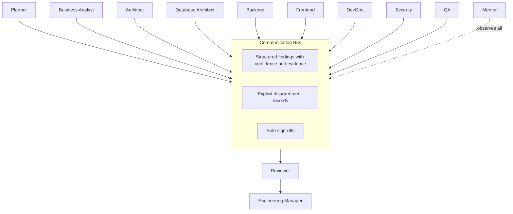

> [!NOTE]
> All fourteen agents communicate exclusively through the Communication Bus and the Memory Interface — never through direct, untracked calls to one another. This is a deliberate architectural constraint: it guarantees that every hand-off, finding, and disagreement is recorded in a form the Audit Trail (Atlas Governance) can reconstruct.

---

## 6. Product Module Specifications

This section specifies each module named in [Section 2](#2-platform-decomposition-every-module) against seven required attributes. Modules are grouped by platform for traceability.

### 6.1 Atlas Brain Module Specifications

**Project Understanding**
- *Purpose:* Construct a testable model of a project's entities and constraints.
- *Features:* Entity extraction, constraint identification, gap surfacing.
- *Capabilities:* Distinguish observed fact from inference; operate incrementally as new signals arrive.
- *Dependencies:* Integration Hub (signal sourcing), Context Engine (structural placement).
- *Owner:* Atlas Brain team.
- *Inputs:* Raw ingested signals (code, docs, tickets, telemetry).
- *Outputs:* Entity and constraint records populating the Knowledge Graph.
- *Future Versions:* Multi-repository entity resolution; cross-organization entity disambiguation.

**Context Engine**
- *Purpose:* Maintain the live map of a project's current structure.
- *Features:* Dependency mapping, deployment topology tracking, drift detection.
- *Capabilities:* Continuous reconciliation against Engineering Memory; visual export to Architecture Canvas.
- *Dependencies:* Engineering Memory, Relationship Engine.
- *Owner:* Atlas Brain team.
- *Inputs:* Code structure, infrastructure-as-code, deployment events.
- *Outputs:* Current Context Graph state, drift alerts.
- *Future Versions:* Predictive drift forecasting; multi-project context federation.

**Knowledge Graph**
- *Purpose:* Structure engineering knowledge with provenance and currency.
- *Features:* Typed entities and relationships, staleness flagging, contradiction detection.
- *Capabilities:* Query by entity, by source, by currency; support for revision history.
- *Dependencies:* Project Understanding, Institutional Memory.
- *Owner:* Atlas Brain team.
- *Inputs:* Structured entities from Project Understanding, documents, decisions.
- *Outputs:* Queryable knowledge responses for Documentation Hub and all agents.
- *Future Versions:* Automated staleness-decay prediction; cross-tenant pattern generalization (governed, opt-in).

**Decision Graph**
- *Purpose:* Record engineering decisions with full rationale and lineage.
- *Features:* Decision nodes with alternatives, evidence, owners, and reconsideration conditions.
- *Capabilities:* Supersession chains; linkage to code, requirements, and incidents.
- *Dependencies:* Knowledge Graph, Engineering Memory.
- *Owner:* Atlas Brain team.
- *Inputs:* Agent-proposed decisions, human approvals.
- *Outputs:* Decision records consumed by Architect, Reviewer, and Mentor agents.
- *Future Versions:* Automated "reconsider when" condition monitoring; decision-impact simulation.

**Engineering Memory**
- *Purpose:* Maintain the factual record of what has been built and observed.
- *Features:* Commit, PR, test, deployment, and telemetry ingestion.
- *Capabilities:* Immutable event history; queryable by entity and time range.
- *Dependencies:* Integration Hub.
- *Owner:* Atlas Brain team.
- *Inputs:* Direct system signals from connected tools.
- *Outputs:* Ground-truth facts consumed by all other Brain modules.
- *Future Versions:* Real-time streaming ingestion; anomaly detection on event patterns.

**Institutional Memory**
- *Purpose:* Preserve human-originated organizational learning.
- *Features:* Incident and postmortem capture, convention recording, attributed trade-offs.
- *Capabilities:* Explicit human-source attribution; revision as understanding evolves.
- *Dependencies:* Relationship Engine (for attribution), Knowledge Graph.
- *Owner:* Atlas Brain team.
- *Inputs:* Human-authored records, incident reports, retrospectives.
- *Outputs:* Contextual precedent consumed by Architect, Security Engineer, DevOps Engineer.
- *Future Versions:* Passive capture from meeting and incident-channel integrations (with explicit consent).

**Relationship Engine**
- *Purpose:* Model ownership and organizational dependency.
- *Features:* Ownership mapping, cross-team dependency tracking, actual-approval-flow modeling.
- *Capabilities:* Distinguish org-chart authority from actual working relationships.
- *Dependencies:* Identity & Access (Atlas Cloud), Institutional Memory.
- *Owner:* Atlas Brain team.
- *Inputs:* Team structure data, historical approval and review patterns.
- *Outputs:* Ownership and dependency context for Planner, DevOps Engineer, Engineering Manager.
- *Future Versions:* Cross-organization dependency modeling for vendor/partner engineering relationships.

**Cognition Engine**
- *Purpose:* Execute the nine-stage Engineering Cognition reasoning loop.
- *Features:* Stage sequencing, consequence-scaled rigor, feedback-loop closure.
- *Capabilities:* Enforce ordering (understand before generate); scale explicit review to risk.
- *Dependencies:* All other Brain modules; Atlas Agents for role-specific reasoning.
- *Owner:* Atlas Brain team.
- *Inputs:* A task or query from any platform.
- *Outputs:* A reasoned, grounded plan or answer, with updated Project Brain state.
- *Future Versions:* Adaptive rigor calibration learned per customer's actual risk tolerance.

### 6.2 Atlas Studio Module Specifications

**Project Workspace**
- *Purpose:* Provide the container view of a project's current state.
- *Features:* Health summary, active work overview, quick navigation.
- *Capabilities:* Real-time reflection of Project Brain state.
- *Dependencies:* All Atlas Brain modules (read-only).
- *Owner:* Atlas Studio team.
- *Inputs:* Aggregated Project Brain summaries.
- *Outputs:* The default project landing view.
- *Future Versions:* Personalized views per persona role.

**Architecture Canvas**
- *Purpose:* Visualize and edit the Context Graph.
- *Features:* Interactive diagrams, annotation-to-decision conversion.
- *Capabilities:* Bi-directional sync with Context Engine.
- *Dependencies:* Context Engine, Decision Graph.
- *Owner:* Atlas Studio team.
- *Inputs:* Context Graph state.
- *Outputs:* Architecture annotations, candidate Decision Graph entries.
- *Future Versions:* Real-time collaborative editing; simulation overlays (e.g., load projections).

**Task Board**
- *Purpose:* Surface the Planner's sequenced work to humans.
- *Features:* Dependency visualization, ownership assignment, status tracking.
- *Capabilities:* Continuous reconciliation with actual agent execution state.
- *Dependencies:* Agent Orchestrator, Relationship Engine.
- *Owner:* Atlas Studio team.
- *Inputs:* Planner output.
- *Outputs:* Human-actionable task views.
- *Future Versions:* Predictive capacity planning.

**Code Workspace**
- *Purpose:* Provide context-rich, read-oriented code review tied to rationale.
- *Features:* Inline Decision Graph and Knowledge Graph links.
- *Capabilities:* "Why does this exist" answered without leaving the view.
- *Dependencies:* Decision Graph, Knowledge Graph, external IDE integrations.
- *Owner:* Atlas Studio team.
- *Inputs:* Source code, linked Brain entries.
- *Outputs:* Annotated code views.
- *Future Versions:* Deeper bi-directional sync with external IDEs.

**Testing Console**
- *Purpose:* Surface QA verification status.
- *Features:* Coverage views, requirement-to-test traceability.
- *Capabilities:* Links test results to specific Decision Graph and requirement entries.
- *Dependencies:* Verification Engine.
- *Owner:* Atlas Studio team.
- *Inputs:* QA Engineer output.
- *Outputs:* Human-reviewable test status.
- *Future Versions:* Risk-weighted coverage visualization.

**Deployment Console**
- *Purpose:* Surface deployment and operational status.
- *Features:* Rollout tracking, rollback readiness indicators.
- *Capabilities:* Real-time integration with CI/CD Orchestrator.
- *Dependencies:* CI/CD Orchestrator, Context Engine.
- *Owner:* Atlas Studio team.
- *Inputs:* DevOps Engineer output.
- *Outputs:* Human-reviewable deployment status.
- *Future Versions:* Predictive incident risk scoring pre-deployment.

**Analytics Dashboard**
- *Purpose:* Aggregate success metrics at project and organization level.
- *Features:* Configurable views for Engineering Managers and Product Managers.
- *Capabilities:* Cross-project rollups for enterprise tenants.
- *Dependencies:* Observability & Telemetry, Decision Graph.
- *Owner:* Atlas Studio team.
- *Inputs:* Metrics defined in the Product Vision's Success Metrics section.
- *Outputs:* Dashboards and exportable reports.
- *Future Versions:* Predictive risk and readiness forecasting.

**Documentation Hub**
- *Purpose:* Present the Knowledge Graph as living documentation.
- *Features:* Staleness indicators, source links, search.
- *Capabilities:* Replace static wikis with continuously reconciled content.
- *Dependencies:* Knowledge Graph.
- *Owner:* Atlas Studio team.
- *Inputs:* Knowledge Graph entries.
- *Outputs:* Human-readable, sourced documentation.
- *Future Versions:* Auto-generated onboarding paths per new team member.

### 6.3 Atlas Agents Module Specifications

**Agent Registry**
- *Purpose:* Authoritative definition of all agent roles and their current authority.
- *Features:* Role scope definitions, maturity-stage tracking.
- *Capabilities:* Versioned role definitions.
- *Dependencies:* Authority Boundary Manager.
- *Owner:* Atlas Agents team.
- *Inputs:* Role specifications (Section 5).
- *Outputs:* Runtime role configuration for the Agent Orchestrator.
- *Future Versions:* Customer-specific role customization within governed limits.

**Agent Orchestrator**
- *Purpose:* Sequence agent engagement for a given task.
- *Features:* Hand-off management, parallel-role coordination.
- *Capabilities:* Mirrors the worked collaboration pattern in Section 3.3.
- *Dependencies:* Agent Registry, Communication Bus.
- *Owner:* Atlas Agents team.
- *Inputs:* Incoming tasks from Atlas Studio or Atlas Brain.
- *Outputs:* Sequenced agent engagement.
- *Future Versions:* Dynamic role invocation based on task classification confidence.

**Communication Bus**
- *Purpose:* Structured exchange of findings and disagreement between agents.
- *Features:* Confidence-tagged findings, explicit conflict records.
- *Capabilities:* Guarantees no silent averaging of disagreement.
- *Dependencies:* Audit Trail (for immutable logging).
- *Owner:* Atlas Agents team.
- *Inputs:* Agent findings and sign-offs.
- *Outputs:* Aggregated views for Reviewer and Engineering Manager.
- *Future Versions:* Structured negotiation protocols for multi-role conflicts.

**Memory Interface**
- *Purpose:* Sole path for agent read/write access to Atlas Brain.
- *Features:* Scoped read/write permissions per role.
- *Capabilities:* Guarantees all reasoning is grounded and recorded.
- *Dependencies:* All Atlas Brain modules.
- *Owner:* Atlas Agents team.
- *Inputs:* Agent queries and write requests.
- *Outputs:* Brain query results; committed Brain updates.
- *Future Versions:* Fine-grained provenance tagging per agent contribution.

**Tool Gateway**
- *Purpose:* Governed interface for agent tool and integration use.
- *Features:* Authority-boundary enforcement at point of action.
- *Capabilities:* Blocks out-of-scope tool invocation before it reaches Atlas Runtime.
- *Dependencies:* Authority Boundary Manager, Integration Hub.
- *Owner:* Atlas Agents team.
- *Inputs:* Agent tool-invocation requests.
- *Outputs:* Authorized tool calls to Atlas Runtime.
- *Future Versions:* Predictive authority-boundary recommendations based on track record.

**Escalation Manager**
- *Purpose:* Detect and route tasks exceeding current agent authority.
- *Features:* Threshold-based escalation, routing to the correct human owner.
- *Capabilities:* Maps each escalation type to the responsible role (Section 5's escalation rules).
- *Dependencies:* Authority Boundary Manager, Relationship Engine.
- *Owner:* Atlas Agents team.
- *Inputs:* Agent-flagged escalation events.
- *Outputs:* Routed notifications to human owners.
- *Future Versions:* Escalation-pattern analytics to recalibrate authority boundaries over time.

### 6.4 Atlas Runtime Module Specifications

**Environment Manager**
- *Purpose:* Provision and tear down isolated execution environments.
- *Features:* Ephemeral container/cloud-resource lifecycle management.
- *Capabilities:* Environment parity with production for realistic verification.
- *Dependencies:* Cloud integrations (Azure, AWS, GCP), Kubernetes/Docker integrations.
- *Owner:* Atlas Runtime team.
- *Inputs:* Environment specification from a task plan.
- *Outputs:* Ready-to-use isolated environments.
- *Future Versions:* Cost-optimized environment reuse across similar tasks.

**Execution Sandbox**
- *Purpose:* Safely execute and observe generated changes before merge.
- *Features:* Isolated execution, output capture.
- *Capabilities:* No effect on production systems until explicitly promoted.
- *Dependencies:* Environment Manager, Secrets & Credentials Broker.
- *Owner:* Atlas Runtime team.
- *Inputs:* Generated code or configuration changes.
- *Outputs:* Execution results for the Verification Engine.
- *Future Versions:* Multi-environment parallel execution for cross-platform validation.

**Tool Invocation Layer**
- *Purpose:* Concrete mechanism for calling external tools on an agent's behalf.
- *Features:* Build system, package manager, and CLI invocation.
- *Capabilities:* Operates strictly within Tool Gateway-authorized scope.
- *Dependencies:* Tool Gateway, Integration Hub.
- *Owner:* Atlas Runtime team.
- *Inputs:* Authorized tool-call requests.
- *Outputs:* Tool execution results.
- *Future Versions:* Expanded tool catalog with automatic capability discovery.

**Verification Engine**
- *Purpose:* Execute checks specified by a plan and produce pass/fail evidence.
- *Features:* Test execution, static analysis, policy compliance checks.
- *Capabilities:* Feeds the Cognition Engine's Review stage directly.
- *Dependencies:* Execution Sandbox, Policy Engine.
- *Owner:* Atlas Runtime team.
- *Inputs:* Generated changes and their verification plan.
- *Outputs:* Verification evidence.
- *Future Versions:* Risk-weighted, adaptive verification depth.

**CI/CD Orchestrator**
- *Purpose:* Coordinate multi-step build, test, and deployment pipelines.
- *Features:* Integration with customer CI/CD systems.
- *Capabilities:* Orchestrates without replacing existing pipelines.
- *Dependencies:* GitHub/GitLab/Azure DevOps integrations.
- *Owner:* Atlas Runtime team.
- *Inputs:* Verified changes ready for deployment.
- *Outputs:* Deployment execution and status.
- *Future Versions:* Cross-pipeline dependency orchestration for multi-service releases.

**Secrets & Credentials Broker**
- *Purpose:* Issue short-lived, scoped credentials for runtime actions.
- *Features:* Just-in-time credential issuance, automatic expiry.
- *Capabilities:* No agent holds long-lived secrets directly.
- *Dependencies:* Identity & Access (Atlas Cloud).
- *Owner:* Atlas Runtime team.
- *Inputs:* Credential requests scoped to a specific action.
- *Outputs:* Short-lived credentials.
- *Future Versions:* Anomaly detection on credential-usage patterns.

### 6.5 Atlas Cloud Module Specifications

**Multi-Tenant Control Plane**
- *Purpose:* Provision and isolate each customer's Atlas instance.
- *Features:* Tenant provisioning, resource isolation.
- *Capabilities:* Guarantees no cross-tenant data leakage.
- *Dependencies:* Identity & Access, Data Residency & Compliance.
- *Owner:* Atlas Cloud team.
- *Inputs:* Tenant onboarding requests.
- *Outputs:* Isolated tenant environments.
- *Future Versions:* Self-service tenant configuration for enterprise administrators.

**Identity & Access**
- *Purpose:* Authenticate and authorize every human and agent action.
- *Features:* SSO/SCIM integration, role-based access control.
- *Capabilities:* Unified identity model across humans and agents.
- *Dependencies:* Customer identity providers.
- *Owner:* Atlas Cloud team.
- *Inputs:* Authentication requests.
- *Outputs:* Authorization decisions.
- *Future Versions:* Fine-grained, attribute-based access control.

**Integration Hub**
- *Purpose:* Manage connectors to all external systems.
- *Features:* Credential management, sync scheduling, webhook handling.
- *Capabilities:* Single governed point for all external data flow.
- *Dependencies:* Each external system's API (Section 8).
- *Owner:* Atlas Cloud team.
- *Inputs:* Customer-authorized connection configurations.
- *Outputs:* Normalized signals to Atlas Brain.
- *Future Versions:* Expanded connector marketplace.

**Observability & Telemetry**
- *Purpose:* Monitor Atlas's own operational health.
- *Features:* Latency, reliability, and cost monitoring.
- *Capabilities:* Distinct from customer system telemetry (which is a Brain input).
- *Dependencies:* All platforms (as monitored subjects).
- *Owner:* Atlas Cloud team.
- *Inputs:* Internal system metrics.
- *Outputs:* Operational dashboards and alerts.
- *Future Versions:* Predictive capacity and reliability forecasting.

**Billing & Metering**
- *Purpose:* Measure usage and bill across tenants.
- *Features:* Value-aligned metering (Brain maturity, agent actions), not raw compute alone.
- *Capabilities:* Transparent, auditable usage reporting.
- *Dependencies:* Observability & Telemetry.
- *Owner:* Atlas Cloud team.
- *Inputs:* Usage events across all platforms.
- *Outputs:* Invoices and usage reports.
- *Future Versions:* Outcome-based pricing models.

**Data Residency & Compliance**
- *Purpose:* Enforce regional storage, retention, and deletion requirements.
- *Features:* Per-tenant residency configuration, retention policy enforcement.
- *Capabilities:* Produces compliance evidence for enterprise audits.
- *Dependencies:* Multi-Tenant Control Plane, Audit Trail.
- *Owner:* Atlas Cloud team.
- *Inputs:* Tenant compliance requirements.
- *Outputs:* Enforced residency configuration, compliance reports.
- *Future Versions:* Automated regulatory-change adaptation.

### 6.6 Atlas Governance Module Specifications

**Policy Engine**
- *Purpose:* Encode organization-specific and regulatory constraints.
- *Features:* Rule authoring, policy versioning.
- *Capabilities:* Constrains every agent and runtime action uniformly.
- *Dependencies:* Authority Boundary Manager.
- *Owner:* Atlas Governance team.
- *Inputs:* Customer-defined and regulatory policies.
- *Outputs:* Enforceable policy rules consumed by Tool Gateway and Verification Engine.
- *Future Versions:* Policy-conflict detection across nested organizational scopes.

**Authority Boundary Manager**
- *Purpose:* Single source of truth for agent authority.
- *Features:* Maturity-stage tracking per role (Product Vision, Section 12.5).
- *Capabilities:* Prevents any action from exceeding its currently earned authority.
- *Dependencies:* Trust Scoring, Audit Trail.
- *Owner:* Atlas Governance team.
- *Inputs:* Agent action requests, historical trust data.
- *Outputs:* Authorization or escalation decisions.
- *Future Versions:* Per-customer authority calibration based on their own evidence.

**Audit Trail**
- *Purpose:* Immutable record of every consequential action.
- *Features:* Full action logging with actor, rationale, and outcome.
- *Capabilities:* Reconstructable history for compliance and incident review.
- *Dependencies:* Communication Bus, CI/CD Orchestrator.
- *Owner:* Atlas Governance team.
- *Inputs:* Action events from all platforms.
- *Outputs:* Queryable audit records.
- *Future Versions:* Automated anomaly detection over audit patterns.

**Trust Scoring**
- *Purpose:* Track calibration of Atlas's confidence against observed correctness.
- *Features:* Per-role, per-domain calibration tracking.
- *Capabilities:* Feeds Authority Boundary Manager's maturity decisions.
- *Dependencies:* Audit Trail, Engineering Memory (outcomes).
- *Owner:* Atlas Governance team.
- *Inputs:* Predictions and their observed outcomes.
- *Outputs:* Calibration scores.
- *Future Versions:* Customer-specific trust dashboards.

**Compliance Reporting**
- *Purpose:* Produce enterprise compliance evidence.
- *Features:* SOC 2 evidence generation, access reviews, change logs.
- *Capabilities:* Generated directly from the Audit Trail, not assembled manually.
- *Dependencies:* Audit Trail, Data Residency & Compliance.
- *Owner:* Atlas Governance team.
- *Inputs:* Audit Trail records.
- *Outputs:* Formatted compliance reports.
- *Future Versions:* Continuous, real-time compliance attestation.

---

## 7. Navigation Structure

### 7.1 Top-Level Navigation

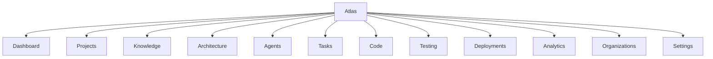

### 7.2 Page-by-Page Explanation

| Page | Explanation |
|---|---|
| **Dashboard** | Cross-project landing view: health summaries, active escalations, and recent Cognition Engine activity across everything the user has access to. Answers "what needs my attention today." |
| **Projects** | The list and management view of all projects a user or organization has access to; entry point to any single Project Workspace. |
| **Knowledge** | The Documentation Hub surface: browsable, searchable, sourced knowledge with staleness indicators, scoped to the current project or organization-wide. |
| **Architecture** | The Architecture Canvas surface: visual Context Graph, editable boundaries, and linked Decision Graph entries. |
| **Agents** | Visibility into the Engineering Organization: which agents are active, their current authority stage, recent findings, and escalations awaiting a human. |
| **Tasks** | The Task Board: sequenced work items, dependencies, ownership, and status. |
| **Code** | The Code Workspace: context-rich code browsing tied to Decision Graph and Knowledge Graph entries. |
| **Testing** | The Testing Console: verification status, coverage, and requirement traceability. |
| **Deployments** | The Deployment Console: rollout status, environment health, rollback readiness. |
| **Analytics** | The Analytics Dashboard: success metrics, trends, and exportable reports for Engineering Managers and Product Managers. |
| **Organizations** | Enterprise-tenant management: teams, roles, policy configuration, and cross-project rollups — visible only to organization administrators. |
| **Settings** | Identity, integrations, billing, and personal preferences, scoped to the user's permitted administrative reach. |

### 7.3 Second-Level Navigation (Selected)

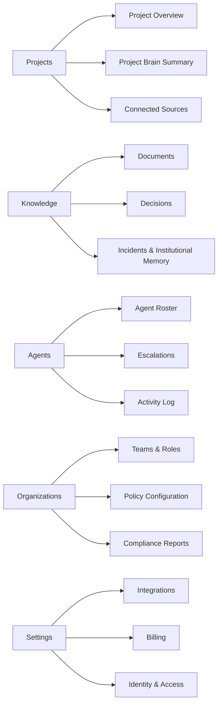

### 7.4 Access Scoping by Persona

| Page | Students | Founders | Developers | Architects | Eng. Managers | Product Managers | QA | DevOps | Security | Researchers | Enterprise Admins |
|---|---|---|---|---|---|---|---|---|---|---|---|
| Dashboard | ✓ | ✓ | ✓ | ✓ | ✓ | ✓ | ✓ | ✓ | ✓ | ✓ | ✓ |
| Projects | ✓ | ✓ | ✓ | ✓ | ✓ | ✓ | ✓ | ✓ | ✓ | ✓ | ✓ |
| Knowledge | ✓ | ✓ | ✓ | ✓ | ✓ | ✓ | ✓ | ✓ | ✓ | ✓ | ✓ |
| Architecture | — | ✓ | view | ✓ | view | view | — | view | ✓ | view | view |
| Agents | view | ✓ | view | ✓ | ✓ | view | view | view | ✓ | view | ✓ |
| Tasks | ✓ | ✓ | ✓ | ✓ | ✓ | ✓ | ✓ | ✓ | ✓ | — | view |
| Code | ✓ | view | ✓ | ✓ | view | — | view | view | ✓ | view | — |
| Testing | — | view | ✓ | view | ✓ | view | ✓ | view | ✓ | — | view |
| Deployments | — | view | view | view | ✓ | view | view | ✓ | view | — | view |
| Analytics | — | ✓ | view | view | ✓ | ✓ | view | view | view | view | ✓ |
| Organizations | — | ✓ | — | — | ✓ | ✓ | — | — | — | — | ✓ |
| Settings | own | own | own | own | own | own | own | own | own | own | full |

---

## 8. External Integrations

Atlas is deliberately interoperable rather than a walled garden. Every integration is justified by which platform it feeds and which module depends on it.

| Integration | Category | Why it exists |
|---|---|---|
| **GitHub** | Source control | Primary source of Engineering Memory (commits, PRs) for most customers; entry point for Knowledge Ingestion. |
| **GitLab** | Source control | Equivalent role to GitHub for organizations standardized on GitLab, including its native CI/CD. |
| **Azure DevOps** | Source control & planning | Common in enterprise Microsoft-stack customers; feeds both Engineering Memory and Task Board sync. |
| **Jira** | Planning | Source of requirements and task history for Business Analyst and Planner grounding. |
| **Confluence** | Knowledge management | A primary source of existing Institutional Memory that predates Atlas adoption; ingested into the Knowledge Graph. |
| **Slack** | Communication | Source of Institutional Memory captured in engineering discussion, and a surface for Mentor and Escalation Manager notifications. |
| **Notion** | Knowledge management | Alternative to Confluence for teams that standardize on Notion for documentation. |
| **Google Drive** | Document storage | Source of unstructured requirement and design documents for Knowledge Ingestion. |
| **OneDrive** | Document storage | Equivalent role to Google Drive for Microsoft 365-standardized organizations. |
| **Figma** | Design | Source of design specifications consumed by the Frontend Engineer agent and the Architecture Canvas. |
| **Docker** | Execution | The containerization standard used by the Environment Manager and Execution Sandbox for isolated execution. |
| **Kubernetes** | Execution / deployment | The orchestration standard the CI/CD Orchestrator and Environment Manager target for realistic environment parity. |
| **Azure** | Cloud infrastructure | A primary deployment target for the Environment Manager and CI/CD Orchestrator; also the natural home for enterprise customers standardized on Microsoft infrastructure. |
| **AWS** | Cloud infrastructure | Equivalent deployment target for AWS-standardized customers. |
| **GCP** | Cloud infrastructure | Equivalent deployment target for GCP-standardized customers. |
| **Microsoft Agent Framework** | Orchestration substrate | A production-grade substrate the Agent Orchestrator can be built on, providing enterprise-grade multi-agent runtime primitives Atlas specializes into its fixed Engineering Organization model. |
| **RAGFlow** | Retrieval infrastructure | A configurable retrieval-pipeline technique the Knowledge Graph's retrieval operations can draw on for document-heavy ingestion scenarios. |
| **OpenRouter** | Model routing | Provides flexible, provider-agnostic access to multiple underlying models, letting Atlas match model choice to task and cost without hard-coupling to one provider. |
| **OpenAI** | Reasoning substrate | One of the frontier model providers the Cognition Engine and agents can use as a reasoning component. |
| **Anthropic** | Reasoning substrate | Equivalent role to OpenAI; valued in particular for long-context, calibrated reasoning suited to Decision Graph analysis. |
| **Gemini** | Reasoning substrate | Equivalent role to OpenAI and Anthropic; valued for multimodal reasoning relevant to design and documentation ingestion. |

### 8.1 Integration Architecture

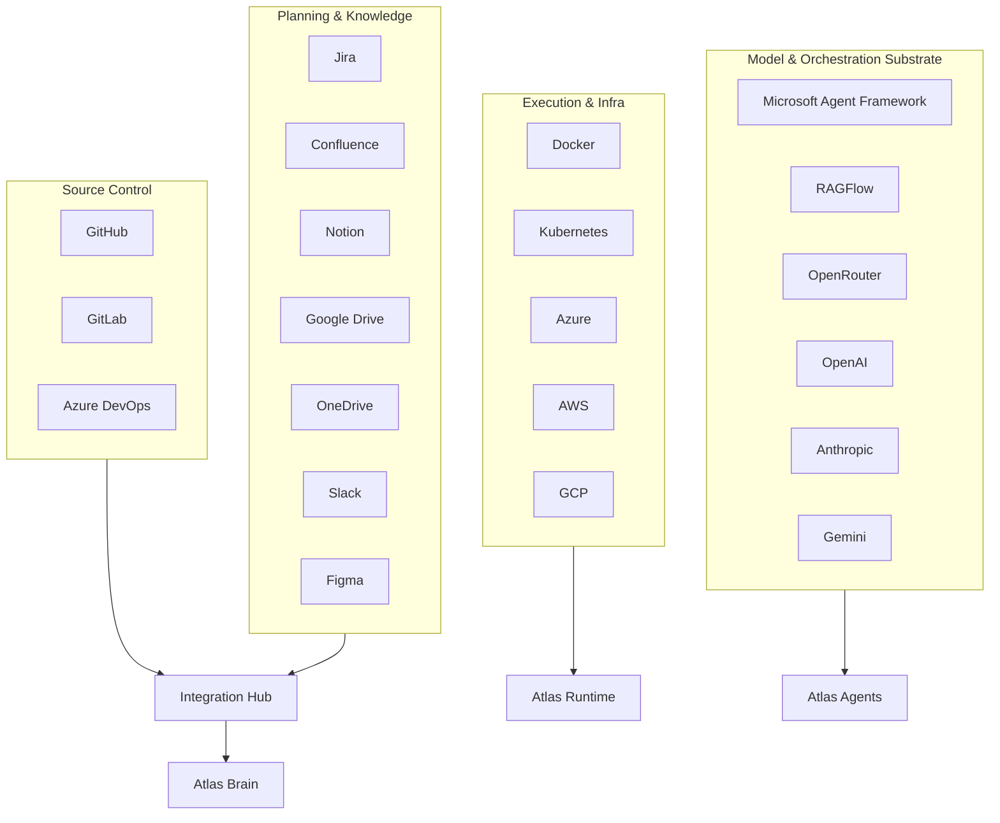

---

## 9. Product Dependency Map

### 9.1 Platform-Level Dependency Diagram

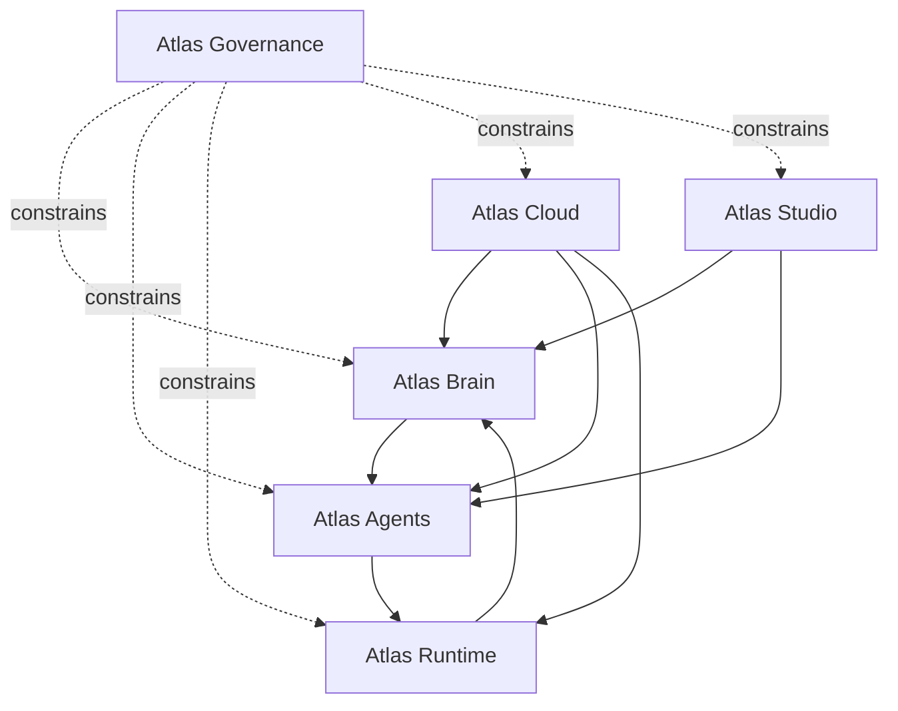

**Reasoning.** Atlas Brain has no upstream product dependency — it depends only on Atlas Cloud for tenancy and identity, which is an infrastructural rather than a reasoning dependency. Atlas Agents depends on Brain because it cannot reason without a grounded model. Atlas Runtime depends on Agents because it only executes what has been planned and reviewed, and writes back to Brain to close the Cognition Engine loop. Atlas Studio depends on both Brain and Agents because it is a view over their state, not an independent source of truth. Atlas Governance depends on nothing and constrains everything, by design (Section 1.6).

### 9.2 Module-Level Dependency Diagram (Atlas Brain)

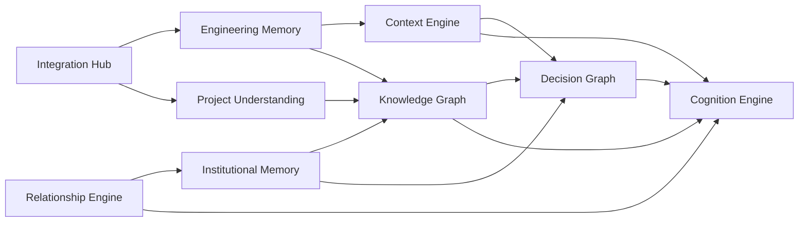

### 9.3 Module-Level Dependency Diagram (Atlas Agents ↔ Runtime ↔ Governance)

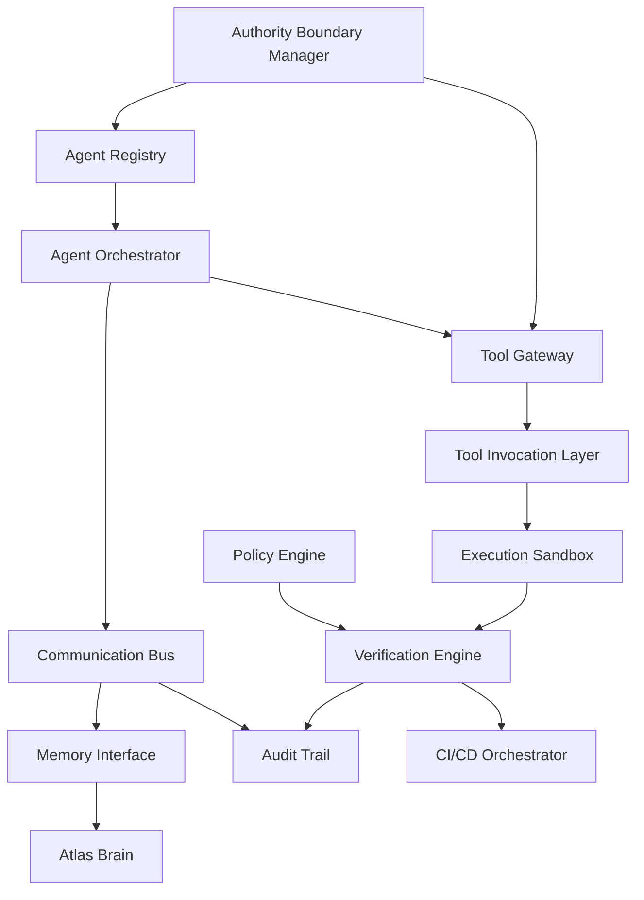

**Reasoning.** Every path from an agent's intent to an actual system effect passes through the Authority Boundary Manager and the Policy Engine at least once — via the Tool Gateway before invocation and via the Verification Engine before promotion. This double-checkpoint design is deliberate: it ensures governance cannot be bypassed by a single point of failure in either the planning path or the execution path.

### 9.4 Cross-Platform Data Flow Dependency

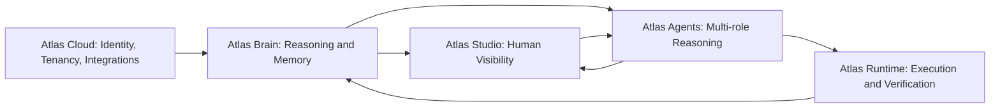

---

## 10. Product Evolution Roadmap

The roadmap below is organized by capability maturity, not by calendar quarter, because the ten-year vision in the Product Vision document is explicitly evidence-gated ([Product Vision, Section 15.7](ATLAS_PRODUCT_VISION.md#157-what-could-falsify-this-vision)). Each version is a capability threshold that must be evidenced before the next is pursued.

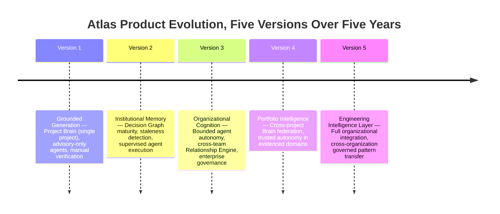

### 10.1 Version 1: Grounded Generation

**Capability threshold.** Atlas can construct a single-project Project Brain, ground code generation in it, and demonstrate measurably fewer reversed decisions and post-merge defects than ungrounded generation (Product Vision, Section 15.2).

**Platform maturity.**

| Platform | State in Version 1 |
|---|---|
| Atlas Brain | Single-project Knowledge Graph, Decision Graph, Context Graph operational |
| Atlas Studio | Project Workspace, Architecture Canvas, Task Board, Code Workspace live |
| Atlas Agents | All fourteen roles operate at Maturity Stage 1 (Advisory) only |
| Atlas Runtime | Execution Sandbox and Verification Engine operational; no autonomous promotion |
| Atlas Cloud | Single-tenant and small-team multi-tenancy; core integrations (GitHub, Jira) live |
| Atlas Governance | Policy Engine and Audit Trail operational as a foundation, not yet enforcing broad autonomy |

**Primary personas served.** Founders, Developers, Students.

### 10.2 Version 2: Institutional Memory

**Capability threshold.** The Decision Graph and Knowledge Graph are trusted as a system of record within organizations that have used Atlas for a full project lifecycle (Product Vision, Section 15.3).

**Platform maturity.**

| Platform | State in Version 2 |
|---|---|
| Atlas Brain | Institutional Memory capture matures; staleness detection operational |
| Atlas Studio | Testing Console, Deployment Console, Documentation Hub added |
| Atlas Agents | Backend Engineer, Frontend Engineer, DevOps Engineer, QA Engineer reach Stage 2 (Supervised Execution) |
| Atlas Runtime | CI/CD Orchestrator integrated with customer pipelines |
| Atlas Cloud | Expanded integration catalog (Confluence, Slack, Azure DevOps, GitLab) |
| Atlas Governance | Trust Scoring introduced to track calibration ahead of any autonomy expansion |

**Primary personas served.** Startups, SMEs, Architects, Engineering Managers.

### 10.3 Version 3: Organizational Cognition

**Capability threshold.** Engineering Organization roles reach Stage 2–3 autonomy with sustained low authority-boundary-violation rates; the Relationship Engine models real cross-team dependency (Product Vision, Section 15.4).

**Platform maturity.**

| Platform | State in Version 3 |
|---|---|
| Atlas Brain | Relationship Engine mature; multi-repository entity resolution |
| Atlas Studio | Analytics Dashboard mature with organization-wide rollups |
| Atlas Agents | Architect, Database Architect, Security Engineer, Reviewer reach Stage 2; select low-risk roles reach Stage 3 |
| Atlas Runtime | Environment Manager supports full production-parity environments |
| Atlas Cloud | Enterprise multi-tenancy hardened; SSO/SCIM, data residency controls mature |
| Atlas Governance | Full Compliance Reporting; Authority Boundary Manager governs autonomy expansion formally |

**Primary personas served.** Enterprise application teams, Security Engineers, Product Managers.

### 10.4 Version 4: Portfolio Intelligence

**Capability threshold.** Atlas's Project Brain federates across a customer's full portfolio of projects, and select agent roles reach Stage 4 (Trusted Autonomy) in well-evidenced, low-consequence domains (Product Vision, Section 15.5, adapted to a single-organization scope first).

**Platform maturity.**

| Platform | State in Version 4 |
|---|---|
| Atlas Brain | Cross-project Knowledge Graph federation within one organization |
| Atlas Studio | Portfolio-level dashboards; cross-project drift and risk visibility |
| Atlas Agents | Planner, Business Analyst, Mentor, Researcher reach Stage 3–4 in evidenced domains |
| Atlas Runtime | Multi-service, multi-repository orchestration |
| Atlas Cloud | Full enterprise-grade billing, observability, and compliance maturity |
| Atlas Governance | Governed, opt-in cross-project pattern reuse within a single tenant |

**Primary personas served.** Enterprise Organizations at scale, Researchers.

### 10.5 Version 5: The Engineering Intelligence Layer

**Capability threshold.** Atlas functions as the durable engineering intelligence layer across a customer's full software portfolio, with institutional memory that outlives individual employee tenure, and governed, consent-based pattern transfer across organizations (Product Vision, Section 15.6).

**Platform maturity.**

| Platform | State in Version 5 |
|---|---|
| Atlas Brain | Full lifecycle memory spanning years, resilient to organizational turnover |
| Atlas Studio | Fully persona-adapted navigation and reporting across the entire portfolio |
| Atlas Agents | Broad Stage 3–4 autonomy across roles, calibrated per-domain by Trust Scoring |
| Atlas Runtime | Mature, low-friction execution across arbitrary customer infrastructure choices |
| Atlas Cloud | Global multi-region, multi-compliance-regime operation |
| Atlas Governance | Cross-organization, consent-based, provenance-preserving pattern transfer operational |

**Primary personas served.** All personas defined in Section 4, at full maturity.

### 10.6 What Gates Advancement Between Versions

> [!IMPORTANT]
> Advancement from one version to the next is gated by evidence, not by calendar time. Specifically: no agent role advances a maturity stage (Section 5, Section 12.5 of the Product Vision) without sustained KPI evidence at its current stage, and no cross-project or cross-organization capability (Versions 4–5) ships without the Trust Scoring and Authority Boundary Manager modules demonstrating the calibration required at the smaller scope first.

---

## 11. Appendix

### 11.1 Consolidated Platform-and-Module Mind Map

```mermaid
mindmap
  root((Atlas))
    Atlas Brain
      Project Understanding
      Context Engine
      Knowledge Graph
      Decision Graph
      Engineering Memory
      Institutional Memory
      Relationship Engine
      Cognition Engine
    Atlas Studio
      Project Workspace
      Architecture Canvas
      Task Board
      Code Workspace
      Testing Console
      Deployment Console
      Analytics Dashboard
      Documentation Hub
    Atlas Agents
      Agent Registry
      Agent Orchestrator
      Communication Bus
      Memory Interface
      Tool Gateway
      Escalation Manager
    Atlas Runtime
      Environment Manager
      Execution Sandbox
      Tool Invocation Layer
      Verification Engine
      CI/CD Orchestrator
      Secrets and Credentials Broker
    Atlas Cloud
      Multi-Tenant Control Plane
      Identity and Access
      Integration Hub
      Observability and Telemetry
      Billing and Metering
      Data Residency and Compliance
    Atlas Governance
      Policy Engine
      Authority Boundary Manager
      Audit Trail
      Trust Scoring
      Compliance Reporting
```

### 11.2 Decision Tree: Which Platform Owns a New Capability

```mermaid
flowchart TD
    Q1{Does it primarily store or reason about project knowledge?} -->|Yes| Brain4[Atlas Brain]
    Q1 -->|No| Q2{Does it primarily present information or controls to a human?}
    Q2 -->|Yes| Studio4[Atlas Studio]
    Q2 -->|No| Q3{Does it primarily apply specialized engineering judgment?}
    Q3 -->|Yes| Agents4[Atlas Agents]
    Q3 -->|No| Q4{Does it primarily execute, verify, or deploy a change?}
    Q4 -->|Yes| Runtime4[Atlas Runtime]
    Q4 -->|No| Q5{Does it primarily concern tenancy, identity, or external systems?}
    Q5 -->|Yes| Cloud4[Atlas Cloud]
    Q5 -->|No| Gov4[Atlas Governance — if it constrains action across platforms]
```

### 11.3 Glossary Cross-Reference

| Term | Defined in this document | Related Product Vision reference |
|---|---|---|
| AI Engineering Operating System (AEOS) | Section: Category | Product Vision Section 6 (AI Engineering Workspace) |
| Project Brain | Section 2.1 | Product Vision Section 11 |
| Engineering Cognition Loop | Section 2.1 (Cognition Engine) | Product Vision Section 11.9 |
| Engineering Organization | Section 5 | Product Vision Section 12 |
| Authority Boundary | Section 2.6, Section 9.3 | Product Vision Section 10.9, Constitution Chapter 6.9 |
| Decision Graph | Section 2.1, Section 6.1 | Product Vision Section 11.5 |

### 11.4 Document Control

| Field | Value |
|---|---|
| Version | 1.0 — Founding edition |
| Status | Approved for internal circulation |
| Downstream documents to be derived from this map | PRD, SRS, System Architecture, Database Design, Agent Specifications, UI/UX Specification, API Design |
| Review cadence | Reviewed at the start of each Version milestone (Section 10) or upon material platform-boundary change |
| Change process | Structural changes (new platform, removed module) require CPO/CTO sign-off; module-level additions may be proposed by the owning platform team |

---

> [!IMPORTANT]
> This document defines structure, not implementation. Any downstream team beginning a PRD, SRS, architecture, database design, agent specification, UI/UX specification, or API design must trace their scope back to a named platform and module in this map before writing a single requirement.
