# Atlas Product Vision

## Defining the AI Engineering Workspace Category

**Document class:** Internal Engineering Strategy
**Status:** Founding edition · 2026
**Audience:** Founders, Product Managers, Architects, Software Engineers, AI Researchers, UX Designers, Investors, and AI Agents operating inside Atlas
**Owner:** Office of the CPO / CTO
**Companion document:** [ATLAS_CONSTITUTION.md](ATLAS_CONSTITUTION.md)

> **Mission**
> Atlas democratizes production-grade software engineering by acting as an AI Engineering Workspace that understands software projects, reasons like an engineering organization, preserves institutional engineering knowledge, and guides users from idea to production-ready software while explaining every engineering decision.

> **Vision**
> Atlas becomes the engineering intelligence layer behind every software organization.

---

## How to Read This Document

This is not a marketing document. It is a strategy and architecture document written in the register used inside product and engineering organizations at Microsoft, OpenAI, Google DeepMind, Amazon, and Stripe: precise claims, explicit trade-offs, falsifiable statements, and named alternatives that were not chosen.

Every section is written to be defensible in a design review. Where a claim cannot be supported with reasoning, evidence, or an explicit assumption, it has been removed rather than asserted. Where Atlas's position differs from an existing tool, the difference is explained mechanically — in terms of architecture, data model, or workflow — not through comparative adjectives.

---

## Table of Contents

1. [Executive Summary](#1-executive-summary)
2. [Why Atlas Exists](#2-why-atlas-exists)
3. [The Problems in Modern Software Engineering](#3-the-problems-in-modern-software-engineering)
4. [Market Opportunity](#4-market-opportunity)
5. [Current AI Landscape](#5-current-ai-landscape)
6. [The Category Atlas Creates](#6-the-category-atlas-creates)
7. [Who Atlas Serves](#7-who-atlas-serves)
8. [Customer Transformation](#8-customer-transformation)
9. [North Star](#9-north-star)
10. [Strategic Pillars](#10-strategic-pillars)
11. [Project Brain](#11-project-brain)
12. [Engineering Organization](#12-engineering-organization)
13. [Product Principles](#13-product-principles)
14. [Success Metrics](#14-success-metrics)
15. [Ten-Year Vision](#15-ten-year-vision)
16. [Appendix](#16-appendix)

---

## 1. Executive Summary

Atlas is built on a single structural bet: the constraint on software engineering has shifted from **producing candidate solutions** to **understanding, deciding, verifying, and remembering** them. Large language models have made generation cheap. They have not made a generated artifact correct for a specific project, safe to run in production, or comprehensible to the next engineer who touches it. That gap — between what can now be generated and what can be trusted — is the market Atlas is built for.

Three categories of tools currently address adjacent parts of this gap, and each stops short of closing it:

- **Chat-based assistants** (ChatGPT, Claude, Gemini) reason well in the abstract but hold no persistent, verified model of a specific project. Every session starts closer to zero than the last one ended.
- **Coding assistants and AI IDEs** (GitHub Copilot, Cursor, Windsurf, Devin) generate and modify code with increasing autonomy, but their unit of work is the file, the diff, or the task — not the engineering organization's accumulated reasoning about why the system looks the way it does.
- **RAG and knowledge platforms** (NotebookLM, RAGFlow) retrieve and summarize existing documents faithfully, but they do not reason about engineering trade-offs, generate verified engineering artifacts, or maintain a graph of decisions, code, and consequences over time.

Atlas is not a faster version of any of these. Atlas is the category that sits above and across all of them: an **AI Engineering Workspace (AEW)** — a persistent, reasoning system that models a software project the way a competent engineering organization understands it (requirements, architecture, code, data, operations, incidents, and the decisions that connect them), and that uses this model to guide, generate, verify, teach, and remember, continuously, across the full lifecycle from idea to production and beyond.

This document defines that category, explains why it does not yet exist, and specifies the strategic pillars, cognitive architecture (the **Project Brain**), and organizational agent design (the **Engineering Organization**) required to build it over the next ten years.

### 1.1 The Core Thesis

> **Generation is no longer the bottleneck. Judgment is.**

Every strategic decision in this document follows from that sentence. If generation were still the bottleneck, Atlas would be a better autocomplete. Because judgment is the bottleneck, Atlas must be a system that understands context before acting, reasons about trade-offs before recommending, teaches before automating, and preserves what it learns — permanently, verifiably, and for the organization, not just the session.

### 1.2 What Atlas Will Do Differently, in One Table

| Dimension | Status quo (chat / copilot / RAG) | Atlas (AI Engineering Workspace) |
|---|---|---|
| Unit of memory | Conversation turn or embedding chunk | Project Brain: entities, decisions, evidence, outcomes |
| Time horizon | Session | Lifetime of the project |
| Reasoning model | Single model, single pass | Multi-role engineering reasoning with checks and disagreement |
| Output | Text or a diff | Explained, verified, production-scoped change |
| Relationship to risk | Same confidence regardless of stakes | Confidence and control scale with consequence |
| Relationship to the user | Answers questions | Builds engineering capability in the user |
| Failure mode it avoids | Confident, ungrounded generation | Silent context loss and unexplained recommendations |

### 1.3 Ten-Year Ambition, Stated Plainly

By the end of the ten-year horizon defined in [Section 15](#15-ten-year-vision), Atlas should be the system that a software organization consults not because it always has an answer, but because it reliably improves how the organization frames the question, evaluates evidence, makes the decision, ships it safely, and remembers why. That is the engineering intelligence layer described in the Vision statement, and it is a role earned incrementally, not claimed at launch.

---

## 2. Why Atlas Exists

### 2.1 The Industry Solved Generation and Left Judgment Behind

Between 2021 and 2026, the cost of producing a plausible unit of software — a function, a schema, a component, a test — fell by more than an order of magnitude. This is a genuine and durable achievement. It is also incomplete, because producing a plausible unit of software was never the expensive part of building reliable systems. The expensive part was always:

- Knowing which unit was the right one to build, given constraints that are rarely written down completely.
- Knowing whether a change was safe, given a system whose behavior depends on interactions no single file reveals.
- Knowing why a past decision was made, so it can be revised deliberately rather than accidentally.
- Knowing whether a system is ready for the consequences of being used by real people with real data.

None of these are generation problems. They are **context, reasoning, verification, and memory** problems. The industry has spent five years compressing the cost of the first problem while the other four remained largely untouched by product innovation. Atlas exists to invert that ratio.

### 2.2 Institutional Engineering Knowledge Is the Scarcest Resource in Software

A five-year-old engineering organization is not more capable than a new one merely because its engineers are individually smarter. It is more capable because it has accumulated a body of situated knowledge: which approaches failed and why, which invariants must never be violated, which shortcuts were taken deliberately and which were taken under pressure, which incidents taught which lessons. This knowledge is rarely written anywhere durable. It lives in senior engineers, in Slack history nobody will search, and in the tacit judgment of people who "just know" that a certain service should never be touched on a Friday.

This knowledge is also the single most valuable and most fragile asset an engineering organization owns. It disappears through attrition, reorganization, and the simple erosion of memory over time. No current product treats this as its core problem. Atlas does.

### 2.3 The Only Way to Democratize Engineering Is to Externalize Judgment Support, Not Just Output

"Democratizing software engineering" is frequently used to mean "letting more people produce code." Under that definition, democratization already happened — code generation is now nearly free. But unequal access to *reliable* production software has not narrowed at the same rate, because the scarce resource was never typing speed. It was the judgment that turns a request into a system that will still work, still be safe, and still be understandable in eighteen months.

Atlas's founding premise is that democratization must target judgment: giving a solo founder access to the same evaluative rigor a staff engineer would apply, giving a junior developer the same review a senior engineer would give, and giving an enterprise architect a system that remembers what the organization has already learned. This is a materially different and harder problem than generating more code, and it is the problem worth solving.

### 2.4 Why Now

Three preconditions have only recently become simultaneously true, which is why this category was not viable before 2024–2026:

1. **Reasoning-capable models exist.** Frontier models can now sustain multi-step reasoning, self-critique, and tool use well enough to support structured engineering reasoning rather than single-shot completion.
2. **Long-context and retrieval infrastructure is mature enough to model whole projects.** Vector search, graph databases, and long-context windows make it economically feasible to hold a live, queryable model of a real codebase and its history, not just a document snippet.
3. **The cost of unverified generation has become visible.** Enough organizations have now shipped AI-generated code with unreviewed security and architectural consequences that "verify before trust" has shifted from a cautionary principle to an operational requirement. The market is ready to value a system that starts from that requirement rather than treating it as an afterthought.

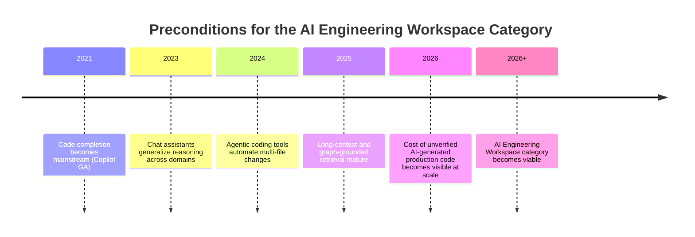

> [!IMPORTANT]
> Atlas exists because a precondition changed, not because a marketing opportunity appeared. The preconditions are: reasoning-capable models, project-scale context infrastructure, and market-wide evidence that ungoverned generation carries real cost. All three arrived together.

---

## 3. The Problems in Modern Software Engineering

This section enumerates the specific, mechanical problems Atlas is built to address. Each problem is stated with its root cause, its current partial mitigations, and why those mitigations are insufficient.

### 3.1 Context Fragmentation

**Problem.** The truth about a software system is distributed across source code, infrastructure-as-code, tickets, design documents, chat threads, telemetry, and the memory of individual engineers. These sources routinely disagree: a document may describe intended behavior, code may describe actual behavior, and telemetry may describe behavior under conditions nobody designed for.

**Current mitigation and its limit.** Search and RAG tools index these sources but treat reconciliation as the user's job. They can retrieve five documents that contradict each other; they do not resolve or even flag the contradiction.

**Consequence.** Engineers make decisions against a partial or stale model of the system, and errors introduced this way are discovered in production rather than in review.

### 3.2 Generation Without Verification

**Problem.** Generative tools optimize for producing plausible output quickly. Plausibility and correctness are different properties. A function can be syntactically valid, pass a shallow type check, and still violate a business invariant that exists only in a stakeholder's head or a six-month-old incident postmortem.

**Current mitigation and its limit.** Linting, type checking, and unit tests catch a narrow band of errors. They cannot catch violations of constraints that were never encoded as a test, which is the majority of real-world business logic.

**Consequence.** The industry has shifted review burden onto humans at exactly the moment that generation volume increased, producing a review bottleneck that most current tools do not acknowledge, let alone solve.

### 3.3 Lost Engineering Reasoning

**Problem.** Version control preserves *what* changed. It rarely preserves *why*, what alternatives were rejected, what evidence supported the choice, or under what future conditions the decision should be revisited.

**Current mitigation and its limit.** Architecture decision records (ADRs) are a well-known partial fix, but they are manually authored, inconsistently maintained, and disconnected from the code and requirements they describe. Adoption is a discipline problem, not a tooling problem — because no tool makes the record load-bearing for future work.

**Consequence.** Organizations repeat analysis they have already paid for, and reverse decisions accidentally because nothing distinguishes a deliberate constraint from an arbitrary one.

### 3.4 The Production Readiness Gap

**Problem.** The distance between "the demo works" and "this can run in production" spans security, reliability, data governance, observability, deployment, rollback, cost, accessibility, and ownership. This distance has not shrunk as generation has accelerated — it has, if anything, grown more consequential, because more prototypes now reach a state that looks finished.

**Current mitigation and its limit.** Checklists and platform engineering standards exist at mature organizations, but they are applied late, inconsistently, and are invisible to the tools generating the code in the first place.

**Consequence.** Teams — especially under-resourced ones — ship systems that pass a demo and fail the first real incident, real audit, or real scale event.

### 3.5 Knowledge Decay

**Problem.** Documentation, once written, is treated as permanently valid. It is not. Systems change; documents do not automatically follow. A document that looks authoritative but describes a prior version of reality is more dangerous than no document at all, because it is trusted.

**Current mitigation and its limit.** Wikis and documentation platforms provide storage, not currency. No mechanism connects documentation to the system's actual, current state.

**Consequence.** Institutional knowledge decays silently, and organizations discover it has decayed only when someone acts on stale information.

### 3.6 Fragmented, Non-Collaborative AI Reasoning

**Problem.** A single model, prompted once, reasons the way a single generalist engineer would — without the constructive friction that a security reviewer, a database specialist, and a product manager would each independently apply to the same proposal.

**Current mitigation and its limit.** Multi-agent frameworks exist (see [Section 5](#5-current-ai-landscape)) but are typically used to parallelize *tasks*, not to reproduce the *disciplinary tension* of a real engineering organization, where a proposal is expected to survive challenge from multiple legitimate perspectives before it ships.

**Consequence.** AI-assisted engineering inherits the blind spots of a single reasoning pass, repeated at scale.

### 3.7 Summary Table: Problem, Root Cause, Gap Left by the Market

| # | Problem | Root cause | What the market provides today | What remains unsolved |
|---|---|---|---|---|
| 1 | Context fragmentation | Truth distributed across disconnected systems | Search, RAG retrieval | Reconciliation of contradictory sources |
| 2 | Generation without verification | Plausibility is cheap; correctness is contextual | Linting, tests, type checks | Verification against unwritten invariants |
| 3 | Lost engineering reasoning | Version control records artifacts, not rationale | ADRs (manual, inconsistent) | Rationale connected to code and kept current |
| 4 | Production readiness gap | Prototypes now look finished sooner | Platform checklists (late-stage) | Readiness visible during design, not after |
| 5 | Knowledge decay | Docs don't track system state | Wikis, documentation platforms | Currency and provenance of knowledge |
| 6 | Non-collaborative AI reasoning | Single-pass generation | Multi-agent task parallelization | Disciplinary tension and structured disagreement |

---

## 4. Market Opportunity

### 4.1 Framing the Market Correctly

Atlas does not compete for the "AI coding tools" budget line. It competes for the far larger and more durable budget category that funds **engineering productivity, developer platforms, and knowledge management** — because the AI Engineering Workspace subsumes parts of all three. Framing the opportunity narrowly (as a Copilot alternative) understates both the addressable spend and the defensibility of the position; framing it as "the engineering intelligence layer" is more accurate to what the product actually replaces and extends.

### 4.2 Demand-Side Evidence

| Signal | Observation | Implication for Atlas |
|---|---|---|
| AI-assisted code volume | A majority of new code at AI-forward organizations is now AI-generated or AI-assisted | Verification and context become the constraint, not generation |
| Security incident data | AI-generated code defects are increasingly cited in post-incident reviews at organizations that adopted generation tools early | Demand for governed, verified generation is rising, not falling |
| Engineer time allocation | Engineers report spending a growing share of time reviewing and reconciling AI output rather than writing new code | The market is already paying the "verification tax" Atlas is designed to reduce |
| Documentation tooling spend | Wikis and knowledge bases remain widely deployed but are broadly reported as untrusted or stale by their own users | Knowledge-currency is a funded, unmet need |
| Enterprise AI governance | Enterprises are building internal review layers around third-party coding assistants rather than trusting default output | Governance-native design is a purchase criterion, not a differentiator to bolt on later |

### 4.3 Market Segmentation by Buyer

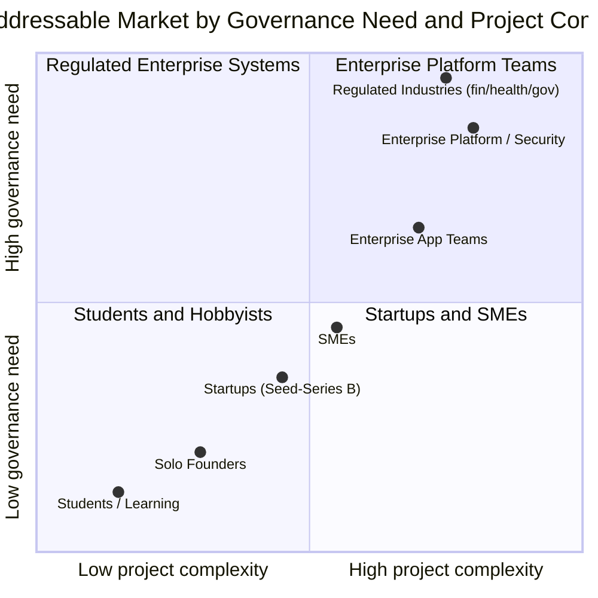

### 4.4 Why Existing Categories Under-Serve This Demand

No existing category is structurally positioned to serve the full curve above with one architecture:

- **Chat assistants** serve the low-complexity, low-governance corner well and degrade as governance need rises, because they hold no durable, auditable project model.
- **Coding assistants / AI IDEs** serve mid-complexity individual and team workflows well but were not built with organization-wide governance, decision provenance, or cross-project memory as first-class primitives.
- **RAG and knowledge platforms** serve high-governance, low-complexity knowledge retrieval (e.g., "what does this policy say") but do not generate or verify engineering artifacts.
- **Autonomous coding agents** (e.g., Devin-class systems) push toward high complexity and high autonomy but currently under-invest in the governance, explanation, and institutional-memory dimensions enterprises require before granting that autonomy.

Atlas's market opportunity is the white space these four categories jointly leave open: **high-complexity, high-governance engineering work, served by a system that explains itself and remembers.**

### 4.5 Total Addressable Market, Structurally Defined

Rather than quoting a single blended TAM figure, the addressable spend is the sum of four budget pools Atlas can credibly displace or absorb over time as capability matures:

| Budget pool | What it currently funds | Why Atlas is a substitute or superset over time |
|---|---|---|
| Developer tools & AI coding assistants | Autocomplete, chat-in-IDE, agentic coding | Atlas includes this as one interaction surface, not the whole product |
| Engineering knowledge management | Wikis, ADR tooling, internal documentation platforms | Atlas's Project Brain is a superset: current, provenance-linked, queryable |
| Application security & code review tooling | Static analysis, manual security review augmentation | Atlas's Security and Reviewer roles (Section 12) operate continuously, pre-merge |
| Engineering management & platform tooling | Planning tools, architecture governance, onboarding | Atlas's Decision Graph and Context Graph reduce reliance on separate systems |

> [!NOTE]
> This is a structural argument about where budget currently sits, not a revenue forecast. Atlas's commercial strategy is addressed in a separate go-to-market document; this document defines the product category the strategy serves.

---

## 5. Current AI Landscape

This section analyzes the systems most relevant to Atlas's category. Consistent with our principle that evidence outranks eloquence, each entry is described by what it is architecturally built to do well, followed by where Atlas's design differs — not by ranking or criticism. Several of these systems are complementary to Atlas rather than purely substitutive; Atlas is designed to interoperate with a number of them (see [Section 6](#6-the-category-atlas-creates)).

### 5.1 Analysis Table

| System | What it is optimized for | Primary unit of work | Where Atlas differs structurally |
|---|---|---|---|
| **NotebookLM** | Grounded synthesis and explanation from a bounded set of user-provided sources | The document set | Atlas's grounding set is the live project (code, infra, tickets, telemetry) and it acts on that model, not only explains it |
| **GitHub Copilot** | In-editor code completion and increasingly agentic, task-scoped code changes | The file / the diff | Atlas's unit of work is the project decision; code changes are one downstream output of a reasoning process, not the starting point |
| **Cursor** | AI-native IDE experience with deep codebase-aware editing | The editing session within a codebase | Atlas is not bound to an IDE surface; its Project Brain persists and reasons across sessions, tools, and non-code artifacts (requirements, incidents, decisions) |
| **Windsurf** | Agentic, flow-based development inside an IDE with multi-step task execution | The multi-step coding task | Atlas separates planning/decision reasoning from execution and requires explicit verification and explanation before and after execution |
| **Devin** | Increasing autonomy over end-to-end coding tasks, including environment setup and debugging | The autonomous task | Atlas scopes autonomy to explicit authority boundaries tied to consequence (Chapter 6.9 of the Constitution) and treats explanation and memory as mandatory outputs, not optional artifacts |
| **RAGFlow** | Configurable retrieval-augmented generation pipelines over enterprise documents | The retrieval pipeline | Atlas's Project Brain is a structured graph (entities, decisions, relationships), not a document-chunk index; retrieval is one query type among several reasoning operations |
| **LangGraph** | A framework for building controllable, stateful multi-agent and workflow graphs | The developer-defined agent graph | Atlas is a product built on this class of orchestration technique, specialized to one domain (software engineering) with a fixed, opinionated organizational model (Section 12) rather than a general-purpose graph-building framework |
| **Microsoft Agent Framework** | A production-grade SDK for building and orchestrating multi-agent systems with enterprise integration | The agent runtime and orchestration substrate | Atlas can be implemented on top of frameworks in this class; its differentiation is the domain-specific cognition model (Section 11) and engineering organization design (Section 12) built on that substrate |
| **OpenAI (ChatGPT / API models)** | General-purpose, frontier reasoning and generation across arbitrary domains | The conversation or API call | Atlas is a specific application of frontier models to one domain, with persistent project-scoped memory and a governed multi-role reasoning process that a general-purpose chat product does not maintain |
| **Claude** | Strong instruction-following, long-context reasoning, and careful, calibrated responses | The conversation or API call | Same distinction as above: Atlas is a durable, project-grounded system built using models like Claude, not an alternative to the model itself |
| **Gemini** | Multimodal, large-context reasoning integrated across a broad product ecosystem | The conversation or integrated product surface | Same distinction: Atlas is a specialized workspace, not a general assistant; it may use Gemini-class models as a reasoning component |

### 5.2 Reading the Landscape Correctly

> [!NOTE]
> Frontier model providers (OpenAI, Claude, Gemini) are not competitors to Atlas in the category sense — they are potential reasoning substrates Atlas is built on. The comparison that matters is between **general-purpose reasoning surfaces** (chat, API) and **a domain-specific workspace with persistent memory and governed multi-role reasoning** (Atlas). Similarly, Microsoft Agent Framework and LangGraph are orchestration substrates, not finished products in this category; Atlas can be built using either.

The systems that *are* closest to Atlas's surface area — Copilot, Cursor, Windsurf, Devin — share one architectural trait: their unit of memory and action is scoped to the editing session or the task. None of them treat the **decision graph of the organization** as the primary object being built and maintained. That is the specific, falsifiable architectural difference Atlas is designed around, and it is elaborated fully in [Section 6](#6-the-category-atlas-creates) and [Section 11](#11-project-brain).

### 5.3 Where Atlas Interoperates Rather Than Competes

Atlas's strategy explicitly avoids the "replace everything" trap. The following relationships are additive:

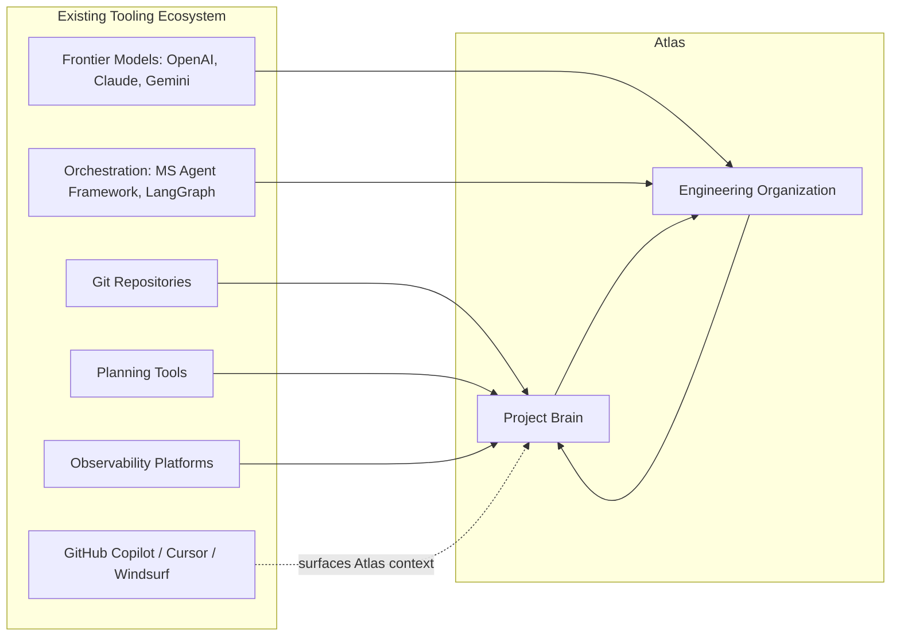

---

## 6. The Category Atlas Creates

### 6.1 Defining the AI Engineering Workspace

> **AI Engineering Workspace (AEW):** a persistent system that maintains a governed, evidence-linked model of a software project's requirements, architecture, code, data, operations, and decision history, and uses that model — through multi-role engineering reasoning — to guide, generate, verify, teach, and remember engineering work across the full lifecycle from idea to production and beyond.

Each clause in this definition rules out a category of existing tool from qualifying, which is the point of a category definition — it must be falsifiable.

| Clause | What it requires | What it excludes |
|---|---|---|
| "Persistent" | State that survives beyond a session or task | Stateless chat, single-task agents |
| "Governed, evidence-linked model" | Claims traceable to sources with provenance | Ungrounded generation, unverified retrieval |
| "Requirements, architecture, code, data, operations, and decision history" | A model spanning the whole lifecycle | Tools scoped to one artifact type (code-only, docs-only) |
| "Multi-role engineering reasoning" | Structured disciplinary tension (Section 12), not one pass | Single-model, single-perspective generation |
| "Guide, generate, verify, teach, and remember" | All five functions, not a subset | Tools that only generate, or only retrieve, or only chat |
| "Full lifecycle from idea to production and beyond" | Continuity across time | Point-in-time tools that reset context |

### 6.2 Why This Is Not a Chatbot

A chatbot's unit of state is the conversation. Even with memory features, that memory is typically a flat log of prior exchanges, not a structured, queryable model of a project with typed entities and relationships. A chatbot also has no organizational reasoning structure — one model responds, regardless of whether the question is a security question, a database design question, or a product trade-off. Atlas requires that different classes of question invoke different reasoning disciplines, explicitly modeled (Section 12), because that is how real engineering organizations avoid single-perspective blind spots.

### 6.3 Why This Is Not a Coding Assistant

A coding assistant's success metric is typically the acceptance rate of a suggested completion or diff. This is a legitimate and valuable metric for its scope, but it measures generation quality, not engineering judgment. A coding assistant does not need to know *why* a service boundary exists, whether a proposed change contradicts a decision made eight months ago, or whether the team has the operational maturity to support what it is about to ship. Atlas is built around exactly those questions; code generation is a downstream capability, not the product's center of gravity.

### 6.4 Why This Is Not a RAG Platform

RAG platforms retrieve and synthesize from a document corpus. Their correctness bar is faithfulness to the retrieved text. Atlas must go further in two directions simultaneously: **upstream**, by modeling entities and relationships (a decision, a service, an incident) as structured graph nodes rather than opaque chunks, so contradictions and staleness can be detected mechanically rather than left to the reader; and **downstream**, by acting — generating, verifying, and executing engineering work — rather than stopping at a synthesized answer.

### 6.5 Why This Is Not a Knowledge Base

A knowledge base is a place people *look things up*. It is not staffed reasoning. Atlas's Project Brain resembles a knowledge base in that it stores information durably, but it differs because the information is continuously reasoned over by an engineering organization model that can notice contradictions, flag staleness, and connect a document to the code and decisions it describes. A knowledge base is passive; the Project Brain is active.

### 6.6 Why This Is Not an AI IDE

An AI IDE (Cursor, Windsurf) is a development environment with AI woven into the editing loop. It is an excellent execution surface. But an IDE is, by definition, scoped to the artifacts a developer edits — mainly code. It has no natural place to hold a product requirement, a security policy, an incident postmortem, or a decision rationale as first-class, interconnected objects. Atlas is IDE-agnostic by design: it can surface its reasoning inside an IDE, inside a chat surface, inside a planning tool, or through direct action — because the workspace is the Project Brain, not any single editing surface.

### 6.7 Positioning Diagram

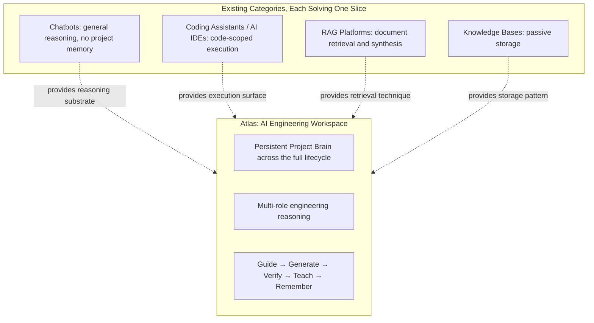

> [!IMPORTANT]
> The AI Engineering Workspace category is defined by what persists (a governed project model), what reasons (a multi-role engineering organization), and what it is accountable for (the full lifecycle, explained). No single existing category claims all three simultaneously, which is why this is a new category rather than a repositioning of an existing one.

---

## 7. Who Atlas Serves

Atlas serves a wide range of users, but it does not serve them identically. Each persona has a distinct entry point, a distinct primary need, and a distinct definition of trust. Designing for "developers" as an undifferentiated group would collapse these differences and produce a mediocre product for all of them.

### 7.1 Persona Table

| Persona | Primary need from Atlas | Definition of "trustworthy" for this persona | Primary risk if unserved |
|---|---|---|---|
| **Students** | Learn real engineering judgment, not just syntax | Explanations that teach reasoning, not just answers | Learned dependency without understanding |
| **Founders** | Move from idea to a working, defensible product quickly | Confidence the system won't hide a fatal flaw to seem helpful | Building on an architecture that cannot survive traction |
| **Startups** | Ship fast without accumulating unmanageable technical debt | Debt is visible and prioritized, not invisible | Debt discovered only at a fundraising or scale event |
| **SMEs** | Modernize and maintain systems with limited specialist staff | Guidance calibrated to their actual operational capacity | Over-engineered recommendations they cannot operate |
| **Enterprise** | Governance, auditability, and integration with existing systems of record | Full provenance, policy enforcement, exportability | Ungoverned AI action creating compliance or security exposure |
| **Architects** | A system that reasons about trade-offs and consequences, not templates | Transparent alternatives-and-trade-offs reasoning | Recommendations that ignore real organizational constraints |
| **Managers** | Visibility into engineering health, risk, and decision history | Accurate, non-inflated status and risk reporting | False confidence in project readiness |
| **Developers** | Faster, safer implementation with less repeated context-explaining | Suggestions grounded in the actual codebase and its history | Generic suggestions that ignore the specific system |
| **Researchers** | A platform to prototype, evaluate, and reason about novel systems rigorously | Rigorous, reproducible evaluation and honest uncertainty | Unverified or non-reproducible claims presented as results |

### 7.2 Persona Journeys (Illustrative)

**Student.** A computer science student asks Atlas to help build a course project's backend. Instead of generating a finished service, Atlas asks what data the service owns, proposes two schema options with trade-offs suited to the assignment's actual constraints, and explains why a naive design would fail under a specific test case the course will grade. The student ships a smaller system than an autocomplete tool would have produced, but can defend every part of it in a viva.

**Founder.** A solo founder describes a marketplace idea. Atlas identifies the three architectural decisions that will be expensive to reverse (identity, payments boundary, data ownership between buyer and seller) and sequences the build so those are decided deliberately and early, while deferring decisions that are cheap to change later. The founder ships a first version in the same time as before, but the system does not need a rewrite at their first funding round.

**Enterprise Architect.** An architect at a regulated bank asks Atlas to evaluate a proposed change to a payments service. Atlas retrieves the original decision record for the service's boundary, cross-references a related incident from fourteen months earlier, and produces a recommendation that explicitly reconciles the new proposal with both, flagging one unresolved conflict with data-residency policy for a human compliance reviewer. No existing tool in the architect's toolchain currently connects these three sources automatically.

### 7.3 Persona Prioritization

Not all personas can be served with equal depth in early phases. Prioritization is set by (a) how acutely the persona feels the "judgment gap" described in Section 2, and (b) how directly serving them validates the Project Brain and Engineering Organization architecture.

| Phase | Primary persona focus | Rationale |
|---|---|---|
| Years 1–2 | Founders, Startups, Developers | Fastest feedback loops; judgment gap is acute and immediately monetizable |
| Years 3–5 | SMEs, Architects, Managers | Requires maturing governance, decision graph, and reporting surfaces |
| Years 5–10 | Enterprise, Researchers, Students at scale | Requires full compliance, auditability, and multi-tenant institutional memory maturity |

---

## 8. Customer Transformation

Atlas's value is best measured by how an engineering organization's behavior changes after sustained use, not by feature counts. This section describes the transformation mechanically, stage by stage.

### 8.1 Before Atlas: The Typical State

| Dimension | Typical state without Atlas |
|---|---|
| Decision rationale | Exists only in memory, chat history, or nowhere |
| Onboarding a new engineer | Weeks of reconstructing tribal knowledge |
| Architecture review | Ad hoc, dependent on which senior engineer is available |
| AI-generated code | Reviewed with the same rigor as human code, but at higher volume, creating a review bottleneck |
| Documentation | Written once, trusted indefinitely, rarely correct after six months |
| Production readiness | Assessed late, often at a launch-readiness meeting under time pressure |

### 8.2 After Sustained Atlas Use

| Dimension | State after sustained use |
|---|---|
| Decision rationale | Recorded automatically as part of the Decision Graph, linked to code and requirements |
| Onboarding a new engineer | Query the Project Brain for "why does this exist" and receive a sourced answer in minutes |
| Architecture review | A standing, always-available discipline (Architect + Reviewer roles) applied consistently |
| AI-generated code | Verified against the project's own constraints and decision history before reaching a human reviewer |
| Documentation | Continuously reconciled against actual system state; staleness is flagged, not silent |
| Production readiness | Visible continuously from the design phase onward, not assessed only at the end |

### 8.3 The Transformation Curve

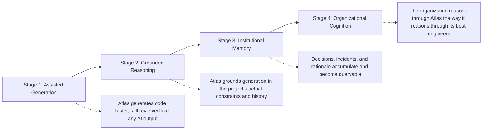

### 8.4 What Does Not Change

> [!CAUTION]
> Atlas does not transform an organization's accountability. Humans remain responsible for decisions, for the systems they operate, and for the consequences of automation, consistent with Chapter 6.9 of the Constitution. The transformation described here is a transformation in *available judgment and memory*, not a transfer of *responsibility*.

---

## 9. North Star

### 9.1 North Star Statement

> **An engineering organization using Atlas makes better decisions, ships more reliable software, and loses less institutional knowledge over time than the same organization would without it — and can prove it.**

The clause "and can prove it" is deliberate. A North Star that cannot be measured is a slogan. Section 14 defines the metrics that operationalize this statement; this section defines why the statement is structured the way it is.

### 9.2 Why the North Star Is a Comparative Claim, Not an Absolute One

Atlas does not claim to make engineering decisions perfect. It claims a *relative* improvement over the counterfactual — the same organization, same people, same constraints, without Atlas's model of their project. This framing keeps the product honest: it must be evaluated against what the organization would otherwise do, not against an abstract ideal.

### 9.3 The Three Components of the North Star

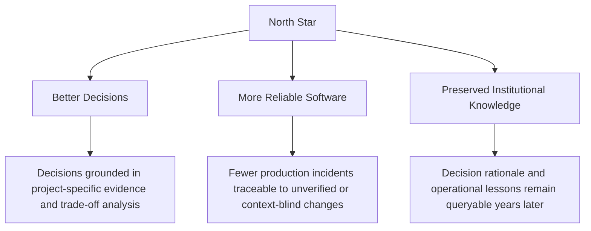

### 9.4 North Star Anti-Patterns

| Anti-pattern | Why it violates the North Star | Guardrail |
|---|---|---|
| Optimizing for engagement (session length, message count) | Does not measure decision quality or reliability | Section 14 explicitly excludes engagement-only metrics as success signals |
| Measuring only code acceptance rate | Measures generation convenience, not judgment | Acceptance rate is tracked alongside downstream defect and revert rate |
| Treating "knowledge captured" as "knowledge preserved" | Capture without retrievability and currency is not preservation | Project Brain requires staleness detection, not just storage |

---

## 10. Strategic Pillars

Atlas's roadmap is organized around twelve strategic pillars. Each pillar names a durable capability area, not a feature list, because features will change every year and these capability areas will not change over the ten-year horizon in [Section 15](#15-ten-year-vision).

### 10.1 Pillar Overview

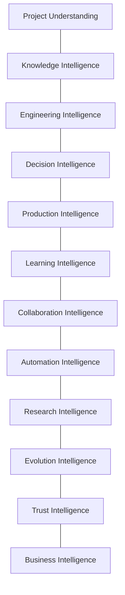

### 10.2 Project Understanding

**Purpose.** Construct a testable, current model of a software project's entities, relationships, constraints, and behavior — the foundation every other pillar depends on.

**Importance.** Every downstream capability (decisions, generation, verification, teaching) is only as good as the model of the project it is grounded in. Without this pillar, Atlas degrades into a stateless assistant.

**KPIs.**

| KPI | Definition |
|---|---|
| Entity coverage | Share of a project's meaningful entities (services, schemas, requirements, owners) represented in the model |
| Model staleness | Median time between a real-world change and its reflection in the model |
| Contradiction detection rate | Share of source contradictions surfaced rather than silently resolved |

**Future evolution.** From indexing a single repository, to modeling a multi-repository system, to modeling a multi-organization supply chain of dependent software systems.

### 10.3 Knowledge Intelligence

**Purpose.** Keep engineering knowledge current, sourced, and retrievable at the point of need, replacing static documentation with a living, provenance-linked knowledge layer.

**Importance.** Knowledge that cannot be trusted is worse than no knowledge, because it is acted on with false confidence (Section 3.5). This pillar is what prevents the Project Brain from decaying the way wikis do.

**KPIs.**

| KPI | Definition |
|---|---|
| Staleness flag precision | Share of flagged-stale knowledge confirmed stale on review |
| Time-to-answer | Median time for an engineer to get a sourced answer to a "why" question |
| Source coverage | Share of knowledge claims with a traceable source |

**Future evolution.** From flagging staleness reactively, to predicting which knowledge is likely to decay next based on the rate of change of what it describes.

### 10.4 Engineering Intelligence

**Purpose.** Apply structured, multi-disciplinary engineering reasoning (architecture, security, data, operations) to a specific problem, reproducing the disciplinary tension of a real engineering organization.

**Importance.** This is the pillar that differentiates Atlas from single-pass generation; it is described in full architectural detail in [Section 12](#12-engineering-organization).

**KPIs.**

| KPI | Definition |
|---|---|
| Cross-role disagreement rate | Frequency with which distinct reasoning roles surface a genuine conflict before it reaches a human |
| Defect escape rate | Defects found in production that a relevant role should have caught pre-merge |
| Recommendation reversal rate | Share of Atlas recommendations later reversed due to missed context |

**Future evolution.** From general software engineering roles, to domain-specialized reasoning (e.g., embedded systems, distributed ledger, bioinformatics pipelines) with calibrated, domain-specific evidence standards.

### 10.5 Decision Intelligence

**Purpose.** Capture, structure, and connect engineering decisions to the requirements, code, evidence, and owners behind them, and surface them again exactly when relevant.

**Importance.** This pillar is the direct answer to the "lost reasoning" problem in Section 3.3 and is elaborated in the Decision Graph description in [Section 11](#11-project-brain).

**KPIs.**

| KPI | Definition |
|---|---|
| Decision capture rate | Share of consequential decisions with a recorded rationale |
| Decision retrieval relevance | Precision of surfaced past decisions when a related question arises |
| Decision revisit rate | Share of decisions revisited when their triggering conditions changed |

**Future evolution.** From capturing decisions when prompted, to proactively detecting when an undocumented decision is being made and prompting capture in the moment.

### 10.6 Production Intelligence

**Purpose.** Make the gap between current state and production readiness visible and actionable throughout the lifecycle, not only at launch.

**Importance.** Directly answers Section 3.4. This pillar converts production-readiness from a late-stage gate into a continuously visible score.

**KPIs.**

| KPI | Definition |
|---|---|
| Readiness visibility lead time | How early in the lifecycle a readiness gap is surfaced, relative to when it would traditionally be discovered |
| Post-launch incident rate | Incidents per production system, tracked against a pre-Atlas baseline |
| Readiness dimension coverage | Share of the required dimensions (security, reliability, observability, cost, ownership) actively assessed |

**Future evolution.** From checklist-style readiness assessment, to continuous, risk-weighted readiness scoring integrated with live telemetry.

### 10.7 Learning Intelligence

**Purpose.** Convert every engineering interaction into situated learning for the user, consistent with the Constitution's commitment that "dependency without learning is not customer success."

**Importance.** Differentiates Atlas from tools that optimize for the user never needing to understand the output.

**KPIs.**

| KPI | Definition |
|---|---|
| Independent competence growth | Change in a user's ability to evaluate similar decisions without Atlas over time |
| Explanation utilization | Share of explanations actually read/expanded rather than dismissed |
| Repeated-question rate | Decline in repeated basic questions from the same user over time, indicating retained learning |

**Future evolution.** From generic explanations, to a personalized model of each engineer's current understanding, targeting explanation depth precisely to their gap.

### 10.8 Collaboration Intelligence

**Purpose.** Support the way real engineering organizations coordinate — across roles, teams, and time zones — rather than treating engineering as a single-user activity.

**Importance.** Engineering is a team sport; a workspace that only optimizes one person's session misses most of the value described in Section 8.

**KPIs.**

| KPI | Definition |
|---|---|
| Cross-team context reuse | Frequency with which one team's captured context is successfully reused by another |
| Handoff time | Time required to transfer ownership of a component, measured against pre-Atlas baseline |
| Conflicting-change detection rate | Share of conflicting concurrent changes detected before merge |

**Future evolution.** From supporting a single team, to modeling and mediating dependencies across teams and organizational boundaries (e.g., vendor and partner engineering teams).

### 10.9 Automation Intelligence

**Purpose.** Expand the scope of engineering work Atlas can safely execute autonomously, with authority strictly bounded to demonstrated reliability and consequence, per Chapter 6.9 of the Constitution.

**Importance.** Automation is where trust is either earned durably or destroyed quickly; this pillar governs the pace of that expansion deliberately rather than by default.

**KPIs.**

| KPI | Definition |
|---|---|
| Autonomous action success rate | Share of autonomously executed actions that require no human correction |
| Authority-boundary violation rate | Incidents where an action exceeded its granted authority (target: zero) |
| Escalation precision | Share of correctly escalated (vs. over- or under-escalated) decisions |

**Future evolution.** From suggestion-only, to bounded autonomous execution in low-consequence domains, to (eventually, and only with sustained evidence) higher-consequence domains with equivalently mature verification.

### 10.10 Research Intelligence

**Purpose.** Support rigorous exploration of novel engineering approaches — new architectures, algorithms, or system designs — with the same evidentiary discipline applied to production work.

**Importance.** Serves the Researcher persona (Section 7) and keeps Atlas's own reasoning grounded in current engineering and AI research rather than only historical patterns.

**KPIs.**

| KPI | Definition |
|---|---|
| Reproducibility rate | Share of research-oriented conclusions that are reproducible from recorded evidence |
| Novel-pattern integration lag | Time between a validated new engineering pattern's publication and its availability as reasoning input |
| Uncertainty calibration | Correlation between stated confidence and actual correctness on research-adjacent claims |

**Future evolution.** From incorporating published research as reasoning context, to running structured internal experiments (e.g., architecture simulations) whose results feed back into the Project Brain.

### 10.11 Evolution Intelligence

**Purpose.** Track how a system and its requirements change over time and reason about the implications of that drift — architectural decay, requirement obsolescence, and technology migration needs.

**Importance.** Software is never static; a workspace that only reasons about the present state will systematically miss the risks that accumulate through change.

**KPIs.**

| KPI | Definition |
|---|---|
| Drift detection lead time | How early architectural or requirement drift is flagged relative to when it becomes costly |
| Migration recommendation accuracy | Share of recommended migrations later validated as net-beneficial |
| Decision half-life tracking | Share of decisions with an associated "reconsider when" condition that is actively monitored |

**Future evolution.** From flagging drift reactively, to simulating the multi-year consequences of current architectural trends before they become irreversible.

### 10.12 Trust Intelligence

**Purpose.** Ensure every claim, recommendation, and action carries calibrated confidence, provenance, and an explicit boundary of what Atlas does not know, per Chapter 6.8 of the Constitution.

**Importance.** Trust is the product's central asset; this pillar is the mechanism that keeps confidence honest rather than a function of model fluency.

**KPIs.**

| KPI | Definition |
|---|---|
| Calibration error | Divergence between stated confidence and observed correctness across recommendation classes |
| Provenance completeness | Share of claims with a traceable source or explicit assumption label |
| "I don't know" precision | Share of declined/uncertain responses that were, on investigation, genuinely under-determined |

**Future evolution.** From per-claim confidence, to organization-level trust scoring that tracks Atlas's calibration specifically against a given team's domain over time.

### 10.13 Business Intelligence

**Purpose.** Connect engineering decisions to business consequences — cost, time-to-market, risk exposure — so technical trade-offs can be evaluated in terms the organization ultimately optimizes for.

**Importance.** Engineering does not happen in a vacuum; a workspace that cannot translate a technical trade-off into business terms will be ignored by the stakeholders who fund the work.

**KPIs.**

| KPI | Definition |
|---|---|
| Cost-attribution accuracy | Accuracy of Atlas's predicted cost impact of an engineering decision, validated post-hoc |
| Decision-to-business-outcome linkage | Share of major decisions with a traceable link to a business metric they were intended to affect |
| Trade-off comprehension | Stakeholder-reported clarity of business-facing trade-off explanations |

**Future evolution.** From qualitative trade-off framing, to quantitative, project-specific cost and risk modeling integrated directly into the decision process.

### 10.14 Pillar Summary Matrix

| Pillar | Primary problem it answers (Section 3 ref.) | Primary Project Brain component it depends on (Section 11) |
|---|---|---|
| Project Understanding | 3.1 Context fragmentation | Context Graph |
| Knowledge Intelligence | 3.5 Knowledge decay | Knowledge Graph |
| Engineering Intelligence | 3.6 Non-collaborative reasoning | Engineering Cognition |
| Decision Intelligence | 3.3 Lost engineering reasoning | Decision Graph |
| Production Intelligence | 3.4 Production readiness gap | Context Graph + Decision Graph |
| Learning Intelligence | 3.2 Generation without verification (user side) | Engineering Cognition |
| Collaboration Intelligence | 3.1, 3.6 combined at team scale | Relationship Graph |
| Automation Intelligence | 3.2 Generation without verification (system side) | Engineering Cognition |
| Research Intelligence | Emerging patterns not yet institutionalized | Knowledge Graph |
| Evolution Intelligence | 3.5 Knowledge decay, extended over time | Decision Graph |
| Trust Intelligence | Cross-cutting: calibration for all pillars | All components (provenance layer) |
| Business Intelligence | Cross-cutting: business translation | Decision Graph |

---

## 11. Project Brain

### 11.1 Overview

The **Project Brain** is Atlas's persistent model of a software project. It is the component that makes every strategic pillar in Section 10 possible, and it is the structural answer to the mission's requirement that Atlas "understands software projects" and "preserves institutional engineering knowledge." It is not a single database; it is a set of interconnected graphs, each capturing a distinct dimension of engineering truth, unified by shared provenance and identity.

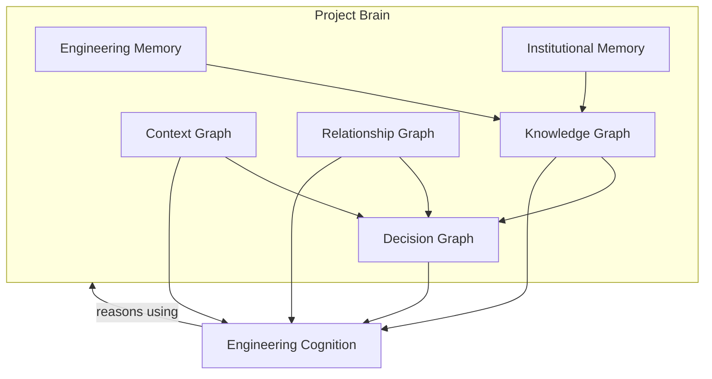

### 11.2 Engineering Memory

Engineering Memory is the record of what has been built, changed, tested, deployed, and observed — the factual substrate. It is derived primarily from direct, verifiable signals: commits, pull requests, test results, deployment events, and telemetry. Engineering Memory answers "what happened" with source-level precision and timestamps, and it is the layer other components must never contradict without an explicit, recorded reason, because it is the closest thing Atlas has to ground truth.

### 11.3 Institutional Memory

Institutional Memory is the record of what the organization has learned — incidents, postmortems, retrospectives, deliberate trade-offs, and the tacit conventions a team has adopted (e.g., "we don't deploy on Fridays," "this queue is single-consumer for a documented reason"). Unlike Engineering Memory, Institutional Memory often originates from human judgment rather than system telemetry, so it is stored with explicit attribution to its human source and is subject to revision as the organization's understanding evolves. This is the layer most vulnerable to attrition in organizations without Atlas, and its preservation is one of Atlas's most durable value propositions.

### 11.4 Knowledge Graph

The Knowledge Graph structures both Engineering Memory and Institutional Memory into typed entities (services, schemas, APIs, teams, policies, incidents) and their relationships, with provenance and currency tracked per claim. It replaces the flat document store of a traditional wiki with a queryable structure that can answer "what do we know about X, from where, and how current is it" rather than only "find documents mentioning X."

### 11.5 Decision Graph

The Decision Graph records engineering decisions as first-class nodes, each connected to: the requirement or problem that triggered it, the alternatives considered, the evidence used, the decision-maker, the resulting code or architecture, and — critically — the conditions under which the decision should be reconsidered. This is the direct structural answer to Section 3.3. A decision in this graph is never silently overwritten; it is superseded, with the supersession itself recorded.

**Example decision node (illustrative schema):**

```yaml
decision_id: D-2027-0114
title: "Use per-tenant database schema instead of shared schema with tenant_id column"
triggered_by: [ requirement: "REQ-118 data isolation for enterprise tier" ]
alternatives_considered:
  - option: "Shared schema with tenant_id filtering"
    rejected_because: "Insufficient isolation guarantee for enterprise compliance requirement"
  - option: "Separate database per tenant"
    rejected_because: "Operational cost exceeds projected enterprise tenant count for 18 months"
evidence:
  - "REQ-118 compliance requirement document"
  - "Cost model: infra-cost-projection-2027-01"
decision_maker: "platform-architecture-team"
implemented_in: [ "services/tenant-provisioning", "migrations/2027-01-14-schema-split" ]
reconsider_when: "Enterprise tenant count exceeds 500, revisit cost model"
status: active
```

### 11.6 Context Graph

The Context Graph is the live map of the project's current structural reality: services, their boundaries, dependencies, data flows, deployment topology, and ownership. It is the layer most sensitive to staleness and is continuously reconciled against Engineering Memory (Section 11.2) to detect drift between documented and actual architecture — directly answering the Context Fragmentation problem in Section 3.1.

### 11.7 Relationship Graph

The Relationship Graph captures the human and organizational dimension: who owns what, who reviews what, which teams depend on which other teams, and how communication and approval actually flow (as distinct from how an org chart claims they flow). This is what enables the Collaboration Intelligence pillar (Section 10.8) and prevents Atlas from reasoning about a system as if it existed independent of the people responsible for it, consistent with the Constitution's belief that "software is a socio-technical system" (Chapter 6.1).

### 11.8 Engineering Cognition

Engineering Cognition is the reasoning process that operates *over* the five components above. It is not a separate data store; it is the sequence of cognitive operations Atlas performs before, during, and after any engineering action. This sequence is Atlas's Primary Innovation and is described in full in the next subsection.

### 11.9 The Engineering Cognition Loop, Explained in Depth

The mission requires Atlas to "understand before generating, reason before recommending, teach before automating." Engineering Cognition is the operational form of that requirement — a nine-stage loop that governs every non-trivial unit of engineering work Atlas performs.

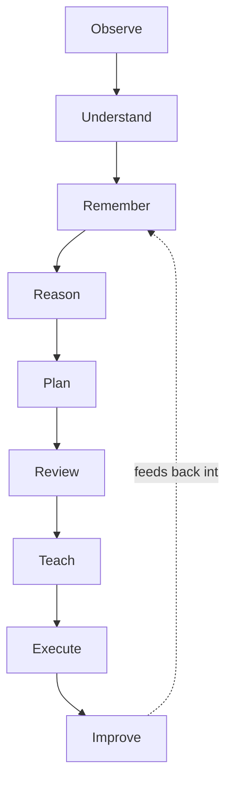

**Observe.** Atlas ingests authorized signals relevant to the task at hand — code, requirements, tickets, telemetry, and prior conversation — without yet interpreting them. This stage is deliberately kept separate from Understand because conflating observation with interpretation is how systems silently smuggle in assumptions; Atlas must first establish *what was seen* before deciding *what it means*.

**Understand.** Atlas builds or updates a testable model of the relevant part of the project using the Project Brain, explicitly distinguishing observed fact from inference. If the available signals are insufficient to understand the task's context, this stage must surface the gap rather than let a later stage compensate with a plausible guess. This is the direct implementation of "understand before generating."

**Remember.** Atlas retrieves relevant Engineering Memory, Institutional Memory, and prior Decisions connected to the current task, and — new to this loop compared to a stateless assistant — writes back any new understanding gained so far into the Project Brain, so this specific act of understanding is not lost even if the task is interrupted.

**Reason.** Atlas applies multi-role engineering reasoning (Section 12) to the understood context: identifying constraints, trade-offs, risks, and relevant precedent from the Decision Graph. This is where disciplinary tension is introduced deliberately — a proposal is tested against architecture, security, data, and operational perspectives before it is allowed to become a plan.

**Plan.** Atlas converts the reasoning output into a concrete, sequenced course of action, including what will be verified and how, what could go wrong, and what the rollback path is. A plan without a verification and rollback strategy is treated as incomplete, not merely as unpolished.

**Review.** Before execution, the plan is checked against explicit authority boundaries (Chapter 6.9 of the Constitution) and against the specific risk profile of the task. Higher-consequence plans require correspondingly stronger evidence and, where the authority boundary requires it, human approval at this stage.

**Teach.** Atlas surfaces the reasoning, alternatives, and trade-offs behind the plan to the user *before* execution, calibrated to the user's stated or inferred expertise level, per the mission's requirement to "teach before automating." This is not a courtesy step; it is treated as load-bearing, because a user who cannot evaluate the plan cannot meaningfully authorize it.

**Execute.** Atlas performs or hands off the approved action — generating code, opening a change, provisioning infrastructure, or another bounded action — strictly within the reviewed plan and authority boundary. Execution is instrumented so its effects can be observed.

**Improve.** Atlas compares the observed outcome of execution against the plan's expectations, updates the Project Brain (new Engineering Memory, a new or revised Decision node, an updated Context Graph edge), and feeds this outcome back into Remember for the next cycle — closing the loop and satisfying the mission's commitment to "preserve engineering knowledge forever."

> [!IMPORTANT]
> The Engineering Cognition loop is not optional ceremony applied uniformly regardless of stakes. Its depth scales with consequence: a low-risk, easily reversible task moves through the loop quickly and mostly implicitly; a high-consequence, hard-to-reverse task is required to make every stage explicit and, where warranted, human-reviewed. What must never change is the *order* — Atlas must not execute before it has observed, understood, remembered, reasoned, planned, reviewed, and taught, because that ordering is the mechanical expression of "understand before generating."

### 11.10 Why This Loop, and Not a Simpler One

A simpler loop — "generate, then check" — is what most current coding assistants implement. It is cheaper to build and faster to demonstrate. It is rejected here because it inverts the causal structure of good engineering: it treats verification as a filter on generation rather than treating generation as a constrained output of understanding. Section 3.2 documented the cost of that inversion at industry scale; the nine-stage loop is Atlas's structural refusal to repeat it.

---

## 12. Engineering Organization

### 12.1 Why an Organization, Not a Model

A single model, however capable, reasons from one vantage point per pass. Real engineering organizations avoid single-perspective blind spots by design: a security reviewer is expected to distrust a backend engineer's default assumptions; a database engineer is expected to challenge a schema an application developer finds convenient. Atlas reproduces this structurally, as a fixed set of reasoning roles with distinct responsibilities, evidentiary standards, and areas of legitimate disagreement — not as decorative personas wrapped around one undifferentiated model call.

### 12.2 Roles, Responsibilities, and Collaboration

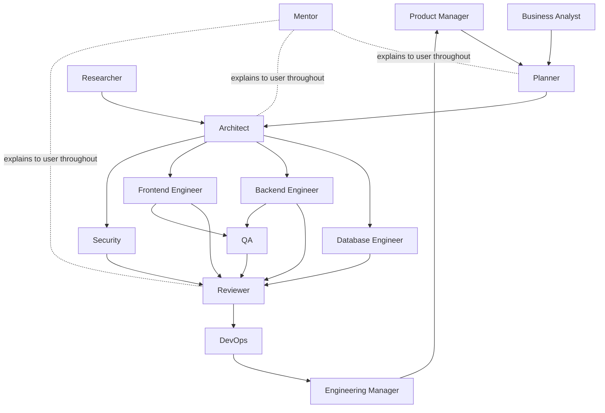

| Role | Core responsibility | Primary evidentiary standard | Escalates to |
|---|---|---|---|
| **Planner** | Sequence work into a coherent, dependency-aware plan | Explicit dependency and risk ordering | Engineering Manager |
| **Business Analyst** | Translate stated needs into validated, testable requirements | Traceability to a real user or business need | Product Manager |
| **Architect** | Own consequential, hard-to-reverse structural decisions | Trade-off analysis against stated constraints | Engineering Manager |
| **Database Engineer** | Own data model integrity, consistency, and migration safety | Schema and query correctness under real data volume | Architect |
| **Backend Engineer** | Implement service logic against requirements and architecture | Passing tests and adherence to documented interfaces | Reviewer |
| **Frontend Engineer** | Implement user-facing behavior, accessibility, and performance | Adherence to design and accessibility standards | Reviewer |
| **DevOps** | Own deployment, infrastructure, and operational reliability | Reproducible, observable, rollback-capable deployment | Engineering Manager |
| **Security** | Identify and mitigate security risk before merge | Threat-model-grounded findings, not generic checklists | Architect / Reviewer |
| **QA** | Find counterexamples and verify behavior against requirements | Reproducible test evidence | Reviewer |
| **Reviewer** | Independently validate a change before it proceeds | Cross-role sign-off and unresolved-conflict surfacing | Engineering Manager |
| **Mentor** | Explain reasoning and build the user's independent capability | Clarity and correctness calibrated to user expertise | (advisory to all roles) |
| **Researcher** | Evaluate novel approaches with rigorous, reproducible evidence | Reproducibility and calibrated uncertainty | Architect |
| **Product Manager** | Own prioritization against business and user outcomes | Outcome data, not output volume | Engineering Manager |
| **Engineering Manager** | Own overall delivery health, risk posture, and escalation resolution | Aggregated evidence across all roles | Human accountable owner |

### 12.3 How Roles Collaborate: A Worked Example

Consider a request to "add bulk export of customer records" to an existing service.

1. **Business Analyst** confirms the actual need (a specific customer segment cannot currently retrieve their data for a contractual reason) rather than accepting the feature request at face value.
2. **Product Manager** prioritizes it against other committed work and confirms the business outcome it serves.
3. **Planner** sequences the work: schema review before endpoint implementation, before UI, before rollout.
4. **Architect** identifies that bulk export interacts with a rate-limiting boundary decided in a prior Decision Graph entry and confirms the new work is consistent with it.
5. **Database Engineer** evaluates whether a bulk read at the proposed scale requires a read replica to avoid degrading transactional performance.
6. **Security** flags that customer records include a regulated data category, requiring an access-control check not present in the initial plan.
7. **Backend Engineer** implements the export endpoint against the reviewed plan, including the added access control.
8. **QA** writes and executes tests, including an adversarial case attempting export without proper authorization.
9. **Frontend Engineer** implements the export UI, incorporating an accessibility requirement flagged by the Business Analyst's original research.
10. **Reviewer** confirms all role sign-offs are present and that Security's flag was resolved, not merely acknowledged.
11. **DevOps** manages a staged rollout with monitoring on the new endpoint's load impact.
12. **Mentor** explains to the requesting user why the access-control addition was necessary, connecting it to the specific regulatory constraint, so the lesson generalizes to their next feature request.
13. **Engineering Manager** view aggregates the above into a single readiness status, escalating only the one unresolved question (the read-replica cost trade-off) that requires a human budget decision.

This sequence is a direct enactment of the Engineering Cognition loop (Section 11.9) distributed across roles rather than compressed into a single pass.

### 12.4 Disagreement Is a Feature, Not a Bug

> [!NOTE]
> When Security and Backend Engineer reach different conclusions about acceptable risk, Atlas does not silently average their positions into a bland compromise. It surfaces the disagreement explicitly, with each role's reasoning, to the human accountable owner — consistent with the Constitution's belief that "disagreement is information" (Chapter 5).

### 12.5 Role Maturity Model

Roles do not launch with equal autonomy. Each role's authority expands only as its verification track record earns it, mirroring the Automation Intelligence pillar (Section 10.9).

| Maturity stage | Role behavior |
|---|---|
| Stage 1: Advisory | Role produces analysis and recommendations only; a human decides and executes |
| Stage 2: Supervised execution | Role executes bounded actions with mandatory human review before merge/deploy |
| Stage 3: Bounded autonomy | Role executes within a pre-approved, narrow authority boundary with post-hoc audit |
| Stage 4: Trusted autonomy | Role executes broader classes of action with continuous monitoring and rare escalation |

---

## 13. Product Principles

These principles govern day-to-day product decisions and are the operational counterpart to the Constitution's Product Philosophy chapter.

1. **Ground before you generate.** No engineering artifact is produced without first checking it against the Project Brain's relevant entities, decisions, and constraints.
2. **Explain every consequential recommendation.** An answer without accessible reasoning, evidence, and alternatives is treated as incomplete, not merely terse.
3. **Scale rigor to consequence, not uniformly.** A one-line config change and a payments-schema migration must not receive the same ceremony; both must receive proportionate ceremony.
4. **Prefer a surfaced gap to a plausible guess.** When context is insufficient, ask or flag uncertainty rather than filling the gap with a confident assumption.
5. **Preserve reasoning as durably as code.** A decision without a recorded rationale is treated as technical debt in the Decision Graph, not as a closed matter.
6. **Teach in the flow of work.** Explanation is delivered at the point of the decision it concerns, not as separate, generic educational content.
7. **Automation earns its authority.** Every expansion of autonomous action requires a demonstrated verification track record (Section 12.5), not a product deadline.
8. **Interoperate before replacing.** Atlas integrates with the systems teams already use (Section 5.3) before asking them to abandon those systems.
9. **Make disagreement visible.** Conflicting evidence or role conclusions are surfaced, not resolved by silent averaging (Section 12.4).
10. **Build for the maintainer, not the demo.** Every feature is evaluated against whether it helps the engineer who must operate the system in a year, not only the one seeing it work today.

---

## 14. Success Metrics

Success metrics are organized into three tiers: leading indicators of adoption, core indicators of the North Star (Section 9), and guardrail metrics that must never be optimized away.

### 14.1 Leading Adoption Indicators

| Metric | Why it leads |
|---|---|
| Weekly active projects with a maintained Project Brain | Indicates durable use, not one-off generation |
| Decision Graph entries created per active project per month | Indicates the core differentiator is being used, not bypassed |
| Cross-session context reuse rate | Indicates memory is functioning as designed |

### 14.2 Core North Star Indicators

| Metric | Maps to North Star component (Section 9.3) |
|---|---|
| Decision quality: rate of decisions later reversed due to missed context | Better Decisions |
| Production incident rate per shipped system, vs. pre-Atlas baseline | More Reliable Software |
| Time-to-answer for "why does this exist" queries, at 6 and 24 months | Preserved Institutional Knowledge |

### 14.3 Guardrail Metrics

> [!CAUTION]
> The following must never be treated as success signals in isolation, because each can be improved in ways that actively harm the mission.

| Guardrail | Risk if used as a primary metric |
|---|---|
| Raw code acceptance rate | Rewards convenient generation over correct generation |
| Session length / message volume | Rewards engagement over resolution and learning |
| Autonomous action volume | Rewards automation expansion ahead of earned trust |
| Explanation length | Rewards verbosity over clarity |

### 14.4 Metric Governance

Every metric above is reviewed against the Mission Test (Constitution, Chapter 3.10) at each planning cycle: does improving this metric increase democratization, production-orientation, understanding, knowledge preservation, guidance, or explanation — or does it merely look good in isolation?

---

## 15. Ten-Year Vision

### 15.1 Horizon Structure

The ten-year vision is staged, because claiming a finished ten-year picture would violate the evidentiary discipline this document otherwise insists on. Each stage is a falsifiable claim about capability, gated by evidence from the prior stage.

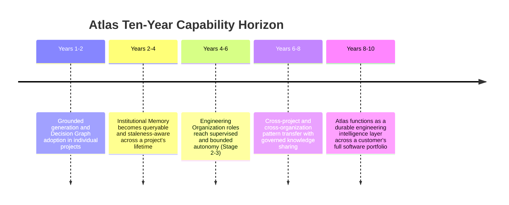

### 15.2 Years 1–2: Prove Grounded Reasoning Beats Ungrounded Generation

The goal is narrow and falsifiable: demonstrate, with measured evidence, that grounding generation in a project-specific Project Brain produces fewer reversed decisions and fewer post-merge defects than ungrounded generation, for the Founder and Startup personas (Section 7.3). If this cannot be demonstrated, the rest of the roadmap does not proceed as designed.

### 15.3 Years 2–4: Institutional Memory Becomes a Trusted System of Record

Atlas's Knowledge Graph and Decision Graph mature to the point where engineers consult them before consulting a colleague's memory, for at least the organizations that have used Atlas continuously for a full project lifecycle. Success here is evidenced by Section 14.2's institutional-knowledge metric improving materially over the pre-Atlas baseline.

### 15.4 Years 4–6: Bounded Organizational Autonomy

Engineering Organization roles (Section 12) earn expanded autonomy strictly through the maturity model in Section 12.5, evidenced by sustained low authority-boundary-violation rates (Section 10.9 KPIs). This stage explicitly does not assume autonomy expands on a fixed timeline; it expands only as evidence permits, and the document commits to slower autonomy growth over premature trust.

### 15.5 Years 6–8: Governed Cross-Organization Pattern Transfer

Atlas begins to responsibly generalize validated patterns (not raw customer data) across organizations that opt in, similar in spirit to how a consulting practice's collective experience benefits each new client, but with explicit governance, consent, and provenance — never silently pooling one customer's institutional knowledge into another's without authorization.

### 15.6 Years 8–10: The Engineering Intelligence Layer

By this stage, Atlas should be integrated deeply enough into a customer's engineering organization that its Project Brain spans that organization's full software portfolio, its Engineering Organization roles operate at Stage 3–4 autonomy in well-evidenced domains, and its institutional memory outlives any individual employee's tenure — fully realizing the Vision statement.

### 15.7 What Could Falsify This Vision

Intellectual honesty requires naming the conditions under which this vision should be revised rather than pursued regardless of evidence:

- If grounded reasoning does not measurably outperform ungrounded generation at Years 1–2, the core architectural thesis (Section 1.1) is wrong and must be revisited before further investment.
- If autonomy expansion produces authority-boundary violations at a rate inconsistent with Section 10.9's guardrails, automation timelines must slow regardless of competitive pressure.
- If customers do not adopt the Decision Graph and Project Brain as a trusted system of record by Years 2–4, the Institutional Memory thesis (Section 2.2) requires re-examination.

---

## 16. Appendix

### 16.1 Consolidated Architecture Diagram

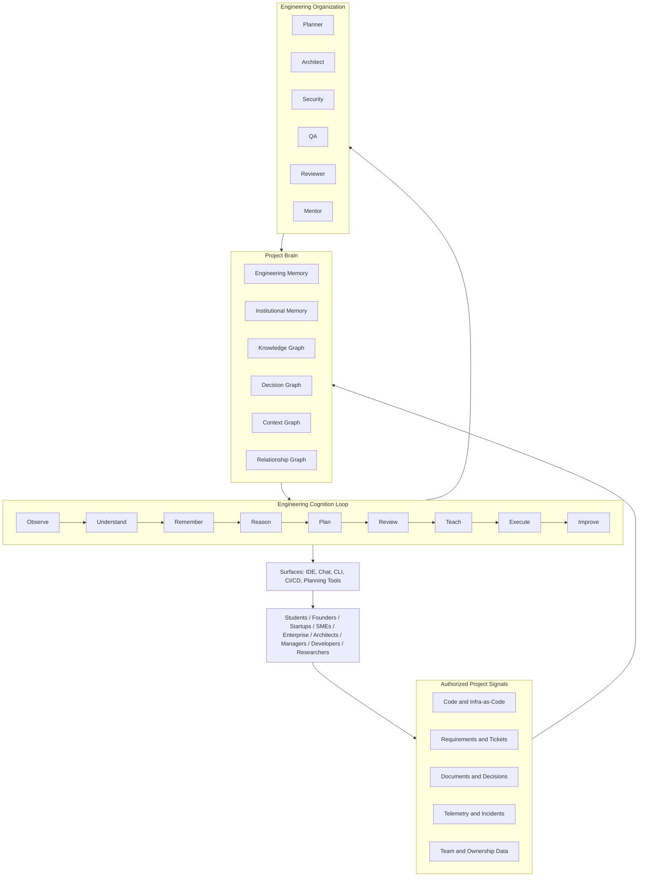

### 16.2 Glossary

| Term | Definition |
|---|---|
| AI Engineering Workspace (AEW) | The category Atlas creates; see Section 6.1 |
| Project Brain | Atlas's persistent, multi-graph model of a project; see Section 11 |
| Engineering Cognition | The nine-stage reasoning loop; see Section 11.9 |
| Decision Graph | Structured store of engineering decisions and their rationale; see Section 11.5 |
| Context Graph | Live map of a project's current structural reality; see Section 11.6 |
| Relationship Graph | Map of ownership and organizational dependencies; see Section 11.7 |
| Engineering Organization | The set of specialized reasoning roles; see Section 12 |
| Authority boundary | The explicit, bounded scope within which an automated action may execute; see Constitution Chapter 6.9 |

### 16.3 Cross-References to the Atlas Constitution

| This document | Related Constitution chapter |
|---|---|
| Section 2 (Why Atlas Exists) | Chapter 2: Why Atlas Exists |
| Section 6 (The Category Atlas Creates) | Chapter 14–15: What Atlas Is / Is Not |
| Section 10 (Strategic Pillars) | Chapter 16: Strategic Pillars |
| Section 11 (Project Brain) | Chapter 17: Project Brain Philosophy |
| Section 12 (Engineering Organization) | Chapter 18: Atlas Engineering Organization |
| Section 15 (Ten-Year Vision) | Chapter 21: Long-Term Vision |
| Section 14 (Success Metrics) | Chapter 22: Success Metrics |

### 16.4 Document Control

| Field | Value |
|---|---|
| Version | 1.0 — Founding edition |
| Status | Approved for internal circulation |
| Review cadence | Annual, or upon material evidence contradicting Section 15.7 |
| Change process | Aligned with the constitutional amendment process, Constitution Chapter 23 |

---

> [!IMPORTANT]
> This document defines what Atlas is building toward. It is deliberately silent on release dates, pricing, and go-to-market sequencing, which belong in separate operating documents. Its purpose is to keep every subsequent product and engineering decision answerable to one question: does this deepen understanding, sharpen judgment, and preserve knowledge — or does it merely generate faster?
