# Atlas Reference Architecture

---

| Field | Value |
|---|---|
| **Title** | Atlas Reference Architecture |
| **Version** | 1.0 |
| **Status** | Approved — Baseline |
| **Document Class** | Engineering Reference |
| **Purpose** | Define the complete platform layering, information flows, decision flows, and learning flows of Atlas Version 1, serving as the canonical technical blueprint from which all downstream Sprint 1 engineering documents derive their structural scope |
| **Scope** | All five platforms (Atlas Brain, Atlas Studio, Atlas Agents, Atlas Runtime, Atlas Cloud), the cross-cutting Atlas Governance layer, all inter-platform flows, and the Engineering Cognition Loop |
| **Out of Scope** | Specific API contracts (Document 9), database schemas (Document 6), deployment runbooks (Document 10), and individual agent behavioral specifications (Document 7) |
| **Dependencies** | ATLAS_CONSTITUTION.md · ATLAS_PRODUCT_VISION.md · ATLAS_PRODUCT_MAP.md |
| **Owner** | Principal Software Architect |
| **Reviewers** | CTO · Distinguished Engineer · Principal Security Architect · Principal Database Architect · Staff Backend Engineer · Staff Frontend Engineer |

### Revision History

| Version | Date | Author | Change |
|---|---|---|---|
| 1.0 | 2026-07-28 | Principal Architect | Founding edition derived from Company Bible, Product Vision, and Product Map |

---

## Table of Contents

1. [Architecture Philosophy](#1-architecture-philosophy)
2. [Platform Layer Diagram](#2-platform-layer-diagram)
3. [Platform Definitions](#3-platform-definitions)
4. [Engineering Intelligence Core](#4-engineering-intelligence-core)
5. [Project Brain Architecture](#5-project-brain-architecture)
6. [Agent Platform Architecture](#6-agent-platform-architecture)
7. [Runtime Architecture](#7-runtime-architecture)
8. [Knowledge Platform](#8-knowledge-platform)
9. [Trust Platform](#9-trust-platform)
10. [Studio Architecture](#10-studio-architecture)
11. [Infrastructure Layer](#11-infrastructure-layer)
12. [Information Flow](#12-information-flow)
13. [Decision Flow](#13-decision-flow)
14. [Learning Flow](#14-learning-flow)
15. [Architecture Decision Records](#15-architecture-decision-records)
16. [Trade-offs and Future Evolution](#16-trade-offs-and-future-evolution)
17. [Glossary](#17-glossary)
18. [References](#18-references)
19. [Engineering Review](#19-engineering-review)

---

## 1. Architecture Philosophy

### 1.1 Governing Constraint

Every architectural choice in Atlas Version 1 is governed by a single constraint derived from the Atlas Constitution, Chapter 9.3:

> *"The default is a modular, observable system with the fewest independently operated parts that meet current requirements."*

Atlas Version 1 is not a speculative architecture. It is the minimum architecture that satisfies the Version 1 capability threshold defined in the Product Map, Section 10.1: **construct a single-project Project Brain, ground generation in it, and demonstrate measurably fewer reversed decisions and post-merge defects than ungrounded generation**.

This means:
- We do not distribute what can be modular-monolith today.
- We do not automate what requires human review today.
- We do not generalize what is specific today.
- Every component must be independently deployable, observable, and replaceable.

### 1.2 Architectural Bets

Atlas makes three foundational architectural bets, each derived from the Product Vision (Section 1.1):

| Bet | Architectural Expression | Falsification Condition |
|---|---|---|
| Generation is not the bottleneck; judgment is | Project Brain is the primary object, not the output buffer | If projects without a Project Brain outperform those with one, this bet is wrong |
| Persistent, structured memory beats session context | Multi-graph Project Brain persists across all sessions | If users ignore the Project Brain and return to stateless generation, this bet is wrong |
| Multi-role reasoning beats single-pass generation | Engineering Organization with 14 distinct roles | If single-role generation produces equivalent decision quality, this bet is wrong |

### 1.3 Design Principles

| Principle | Expression in Atlas V1 |
|---|---|
| Understand before generating | Engineering Cognition Loop: Observe → Understand before Plan → Execute |
| Grounded claims only | Every agent recommendation cites a Knowledge Graph, Decision Graph, or Engineering Memory source |
| Humans remain accountable | All consequential actions require human approval in Version 1 (Stage 1: Advisory) |
| Reversibility creates speed | All Runtime executions are sandboxed; no direct production writes in V1 |
| Evidence outranks eloquence | Confidence must cite provenance; uncertainty is surfaced, not concealed |
| Trust is cross-cutting | Governance constrains every platform boundary; no platform can bypass it |

---

## 2. Platform Layer Diagram

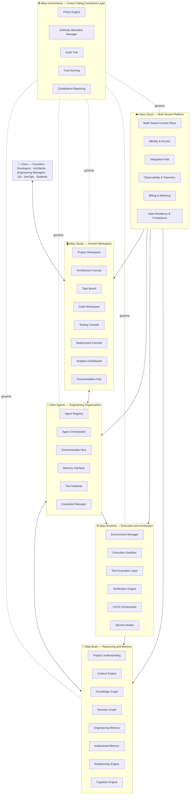

**Why this layering:**

The layer ordering from bottom to top represents dependency direction. Atlas Brain depends on no other Atlas platform — it is the foundational reasoning substrate. Atlas Agents depends on Brain (cannot reason without memory). Atlas Runtime depends on Agents (only executes what has been planned). Atlas Studio depends on Brain and Agents (it is a view over their state). Atlas Cloud provides the tenancy layer all others run within. Governance is not a peer — it is a constraint layer that governs every inter-platform boundary.

---

## 3. Platform Definitions

### 3.1 Platform Responsibility Table

| Platform | Primary Responsibility | Constitutional Reference | Version 1 Scope |
|---|---|---|---|
| **Atlas Brain** | Persistent reasoning and memory substrate — the governed, temporal, evidence-backed model of the project | Constitution Ch. 17 | Single-project Knowledge Graph, Decision Graph, Context Graph, Engineering Memory |
| **Atlas Studio** | Human-facing workspace — the surface through which every persona interacts with Brain and Agents | Product Vision §11, Product Map §1.2 | Project Workspace, Architecture Canvas, Task Board, Code Workspace |
| **Atlas Agents** | Multi-role engineering reasoning organization — 14 specialized roles with distinct responsibilities and evidentiary standards | Product Vision §12, Product Map §5 | All 14 roles at Maturity Stage 1 (Advisory) only |
| **Atlas Runtime** | Execution and verification layer — sandboxed environments for safe, observable, reversible engineering actions | Product Map §1.4, §2.4 | Execution Sandbox, Verification Engine; no autonomous promotion to production |
| **Atlas Cloud** | Multi-tenant platform services — identity, integration hub, tenancy isolation, billing, compliance | Product Map §1.5, §2.5 | Core tenancy + GitHub/Jira/Confluence integrations |
| **Atlas Governance** | Cross-cutting policy, trust, audit, and compliance — constrains every platform boundary | Product Map §1.6, §2.6 | Policy Engine, Authority Boundary Manager, Audit Trail |

### 3.2 Why Five Platforms, Not Fewer or More

| Alternative | Rejection Rationale |
|---|---|
| Merge Brain + Agents → "AI Core" | Brain evolves slowly (memory schemas are stable); Agents evolve rapidly (reasoning strategies change). Merging conflates incompatible change rates. |
| Merge Studio + Cloud → "Platform" | Studio is user-facing; Cloud is infrastructure. Different teams, different release cadences, different trust boundaries. |
| Split Runtime → "Execution" + "Verification" | Verification without execution authority is inert; execution without mandatory verification is unsafe. Keeping them one platform enforces their inseparability. |
| Governance as a sixth platform | A peer platform can be bypassed by a path through another platform. A cross-cutting layer cannot. Governance must constrain every current and future platform boundary. |

---

## 4. Engineering Intelligence Core

The Engineering Intelligence Core is Atlas's primary innovation. It is the combination of the **Project Brain** (memory substrate) and the **Engineering Cognition Loop** (reasoning process) operating over it. Together they form what the Product Vision calls the "AI Engineering Workspace" — distinct from a chatbot (stateless), a coding assistant (file-scoped), or a RAG platform (retrieval-only).

### 4.1 The Engineering Cognition Loop

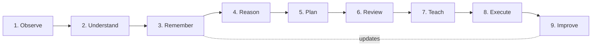

**Critical property:** The loop is ordered. Atlas must not execute before it has observed, understood, remembered, reasoned, planned, reviewed, and taught. This ordering is not ceremony — it is the mechanical expression of "understand before generating" (Constitution §3.2, Product Vision §11.10).

| Stage | What Atlas does | What it produces | Failure if skipped |
|---|---|---|---|
| Observe | Ingest authorized signals without yet interpreting them | Raw, provenance-tagged evidence | Assumptions smuggled in as facts |
| Understand | Build testable model of relevant project context | Updated entity/relationship claims with uncertainty | Generation without grounding |
| Remember | Retrieve relevant memory; write new understanding to Brain | Context assembly + Brain update | Knowledge lost between sessions |
| Reason | Apply multi-role engineering reasoning | Trade-off analysis, risk identification, constraint checking | Single-perspective blind spots |
| Plan | Convert reasoning to sequenced, verifiable action plan | Plan with verification criteria + rollback path | Unverifiable execution |
| Review | Check authority boundaries and risk profile | Approval or escalation | Ungoverned action |
| Teach | Surface reasoning to user before execution | Explanation calibrated to expertise | User cannot evaluate or authorize |
| Execute | Perform approved action within sandboxed boundary | Artifacts + execution evidence | None (final step) |
| Improve | Compare outcome to plan; update Brain | Brain updates closing the feedback loop | No learning from outcomes |

### 4.2 Cognition Loop Depth Scaling

> [!IMPORTANT]
> The depth of the Cognition Loop scales with consequence, not uniformly. A low-risk reversible change may traverse the loop implicitly and quickly. A high-consequence irreversible change must make every stage explicit and human-reviewed. What never changes is the ordering.

| Consequence Level | Loop Behavior | V1 Authority |
|---|---|---|
| Exploration / Analysis | Observe → Understand → Teach (no execution) | All agents |
| Advisory with human execution | Full loop; human executes approved plan | All agents (Stage 1) |
| Supervised execution | Full loop with mandatory human review before any system effect | Not yet — V2+ |
| Bounded autonomy | Full loop with post-hoc audit | Not yet — V3+ |

---

## 5. Project Brain Architecture

### 5.1 Brain Layer Model

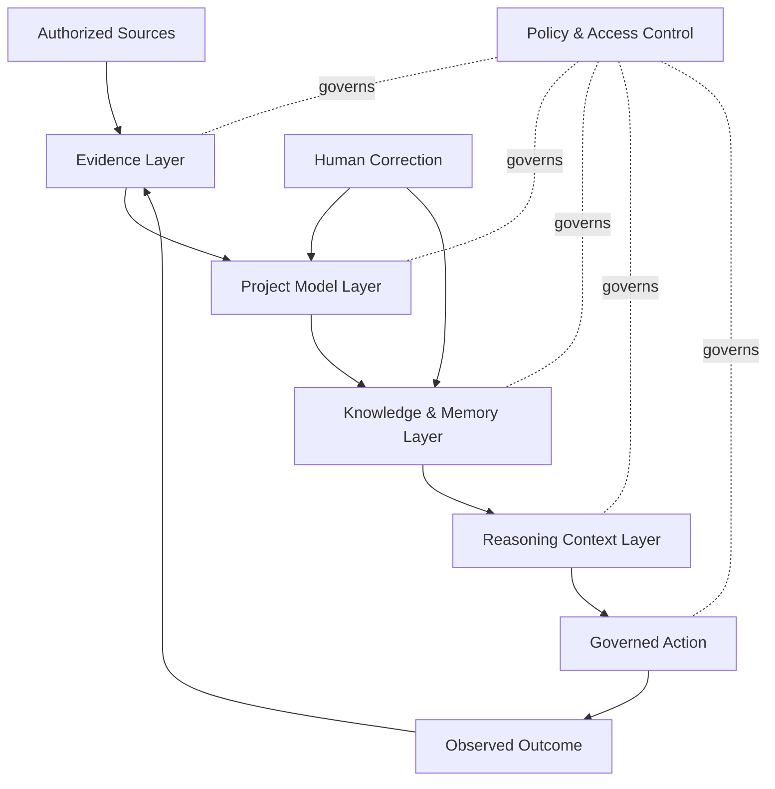

### 5.2 Brain Module Architecture

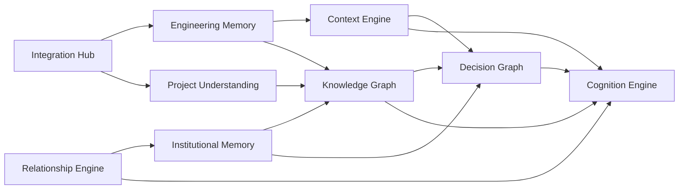

### 5.3 Module Specifications

| Module | Type | Primary Purpose | V1 Scope |
|---|---|---|---|
| **Project Understanding** | Entry processor | Construct testable model of project entities from ingested signals; surface gaps rather than fill them | Active: ingests GitHub repos, Jira, Confluence |
| **Context Engine** | Live map | Maintain current-state map: service boundaries, dependencies, data flows, deployment topology | Active: derived from code analysis |
| **Knowledge Graph** | Structured store | Typed entities + relationships with provenance and currency tracking | Active: core graph operations |
| **Decision Graph** | Structured store | Engineering decisions as first-class nodes linked to requirements, alternatives, evidence, code, and reconsideration conditions | Active: advisory mode; decisions created through human-agent collaboration |
| **Engineering Memory** | Factual substrate | Commits, PRs, test results, deployments, telemetry — closest approximation to ground truth | Active: GitHub sync |
| **Institutional Memory** | Learned knowledge | Incidents, postmortems, deliberate trade-offs, tacit conventions — with explicit human attribution | Active: manual entry + Confluence ingestion |
| **Relationship Engine** | Organizational map | Human ownership, review responsibility, cross-team dependencies, actual approval flow | Active: basic ownership; rich cross-team graph deferred to V2 |
| **Cognition Engine** | Reasoning process | Executes the 9-stage Engineering Cognition Loop over the other six modules | Active: all stages |

### 5.4 Why Project Brain Is Not Traditional RAG

| Traditional RAG | Atlas Project Brain |
|---|---|
| Retrieves text similar to a query | Retrieves evidence relevant to task, role, policy, version, and decision |
| Treats chunks as independent | Preserves typed entities, relationships, boundaries, and source structure |
| Represents current corpus | Represents change over time and point-in-time state |
| Optimizes contextual similarity | Combines semantic, structural, causal, temporal, authority, and access relevance |
| Returns supporting passages | Exposes disagreement, missing coverage, confidence, and provenance |
| Ends after answer generation | Connects action, verification, outcome, and memory update |
| Assumes documents are benign | Treats retrieved content as untrusted data subject to policy and threat controls |

### 5.5 Knowledge Representation

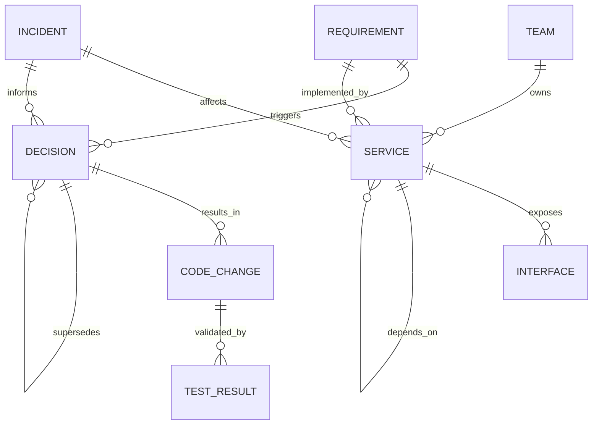

---

## 6. Agent Platform Architecture

### 6.1 Agent Platform Module Diagram

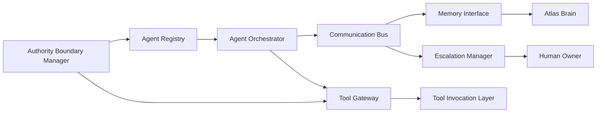

### 6.2 Engineering Organization — 14 Roles

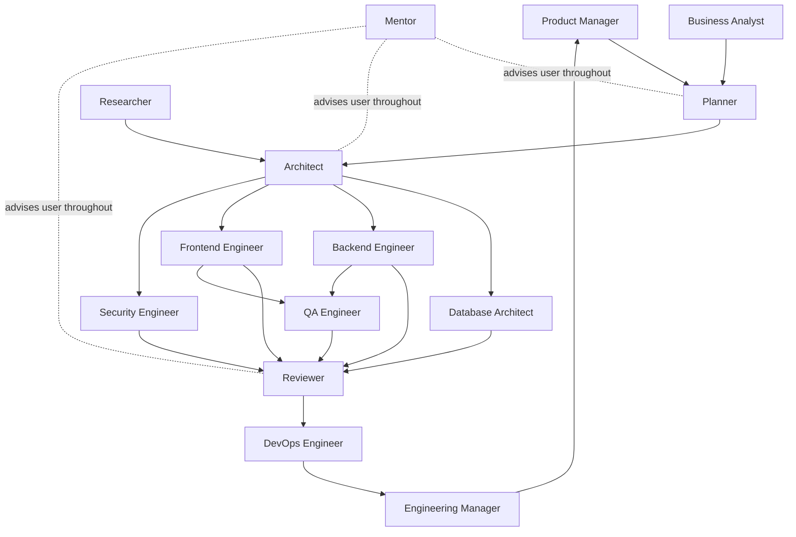

### 6.3 Agent Communication Protocol

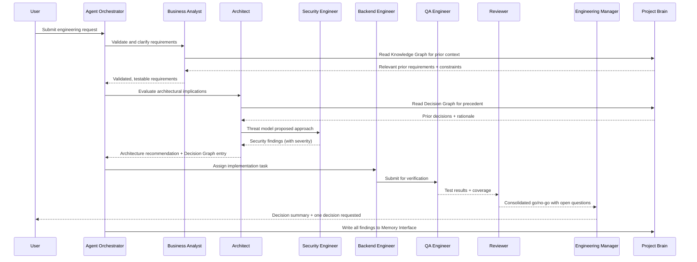

### 6.4 Disagreement Handling

When two roles reach conflicting conclusions, the Communication Bus captures both positions explicitly. The Reviewer aggregates them. The Engineering Manager surfaces unresolved conflicts to the human owner.

> [!NOTE]
> When Security Engineer and Backend Engineer reach different conclusions about acceptable risk, Atlas does not average their positions. It surfaces both, with each role's reasoning, to the human accountable owner. Disagreement is information (Constitution §5).

---

## 7. Runtime Architecture

### 7.1 Runtime Module Flow

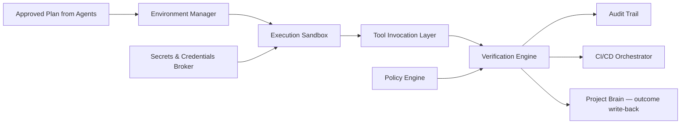

### 7.2 V1 Runtime Constraints

| Constraint | Rationale |
|---|---|
| No autonomous promotion to production | All V1 agents operate at Stage 1 (Advisory); human must execute merges and deployments |
| All execution in isolated sandboxes | Prevents unintended side effects; reinforces reversibility |
| Short-lived credentials only | No agent holds long-lived secrets; Secrets Broker issues just-in-time, scoped credentials |
| All actions logged to Audit Trail | Irrevocable audit record required before any autonomy expansion in V2+ |
| Verification Engine must pass before any human-facing output is labeled "verified" | Prevents generation from being presented as validated |

---

## 8. Knowledge Platform

The Knowledge Platform is the combination of the Knowledge Graph, Decision Graph, Engineering Memory, and Institutional Memory within Atlas Brain, exposed through the Documentation Hub in Atlas Studio.

### 8.1 Knowledge Lifecycle

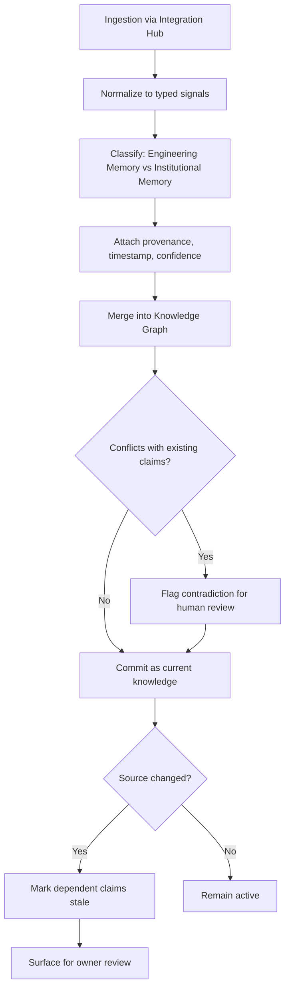

### 8.2 Decision Graph Entry Schema

Every engineering decision recorded in V1 must include:

| Field | Required | Description |
|---|---|---|
| Decision ID | ✓ | Unique identifier; never reused |
| Triggering requirement | ✓ | Link to Knowledge Graph requirement node |
| Decision statement | ✓ | What was decided, in plain language |
| Alternatives considered | ✓ | At least one alternative must be recorded |
| Evidence used | ✓ | Links to Engineering Memory or Institutional Memory |
| Trade-offs accepted | ✓ | What is deliberately given up |
| Decision owner | ✓ | Human accountable owner |
| Resulting code/artifacts | ○ | Links to Engineering Memory |
| Reconsideration condition | ✓ | Explicit condition that would make this decision worth revisiting |
| Status | ✓ | Active / Superseded / Reaffirmed |
| Superseded by | ○ | Link to superseding Decision Graph node |

> [!IMPORTANT]
> Decisions are superseded, never deleted. A superseded decision remains as historical evidence and must not silently control current recommendations.

---

## 9. Trust Platform

### 9.1 Trust Architecture Overview

The Trust Platform is not a single module. It is the composition of the Atlas Governance layer modules, operating across all platform boundaries.

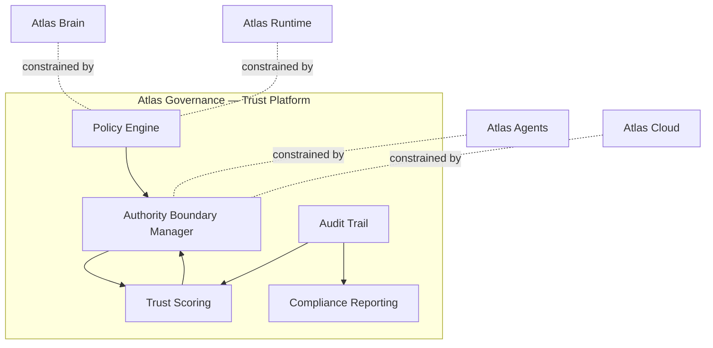

### 9.2 Zero-Trust Agent Execution Model

Every agent action in V1 follows this authorization path:

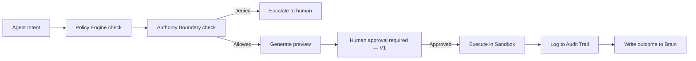

### 9.3 Threat Model — Atlas-Specific Concerns

| Threat | Atlas-Specific Form | Mitigation |
|---|---|---|
| Prompt injection | Malicious instructions embedded in ingested documents, code comments, or ticket content | Retrieved content treated as untrusted data, never as policy or instruction |
| Poisoned memory | Adversarial knowledge inserted into Project Brain to corrupt future recommendations | Provenance tracking; human correction surface; contradiction detection |
| Cross-tenant leakage | One tenant's project context surfacing in another tenant's session | Multi-Tenant Control Plane; strict tenant ID isolation in all Brain queries |
| Privilege escalation via tool chaining | Agent invoking tools in sequence to achieve permissions beyond any single authorized action | Tool Gateway enforces authority boundary at every invocation; no accumulated permissions |
| Unsafe autonomy expansion | Pressure to advance agent maturity stage faster than trust evidence warrants | Authority Boundary Manager requires KPI evidence before any stage advance; deadline is not evidence |

---

## 10. Studio Architecture

### 10.1 Studio Module Map

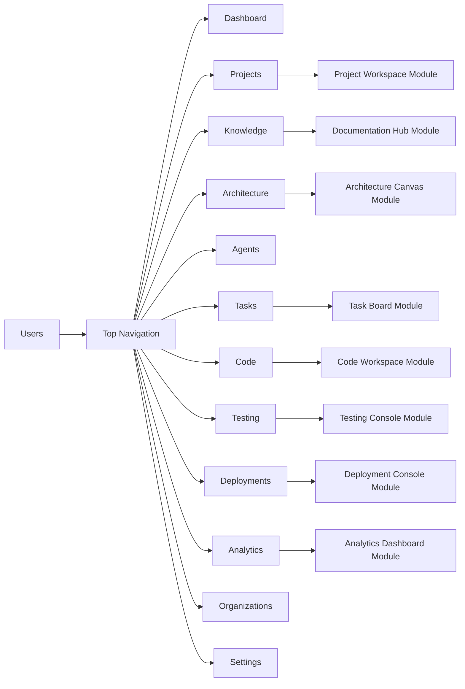

### 10.2 Studio Data Contract

Atlas Studio is **read-only with respect to Atlas Brain's raw data**. All writes to the Project Brain occur through the Memory Interface of Atlas Agents, or through explicit human correction surfaces. Studio never writes directly to Brain. This preserves data integrity and maintains a clear audit path.

---

## 11. Infrastructure Layer

### 11.1 Infrastructure Principles

1. **Multi-tenant by design** — every resource is scoped to a tenant ID from creation.
2. **Portable across clouds** — Azure is the primary target; AWS and GCP are supported with equivalent capability.
3. **Container-native** — all services run in containers orchestrated by Kubernetes.
4. **Immutable infrastructure** — infrastructure changes are applied through CI/CD pipelines, never manual console operations.
5. **Observability-first** — every service emits structured logs, metrics, and traces from day one.

### 11.2 V1 Infrastructure Components

| Component | Technology | Purpose |
|---|---|---|
| Container runtime | Docker + Kubernetes | Isolated execution for all Atlas services |
| Primary cloud | Azure | Hosting, storage, identity integration |
| Graph database | To be specified in Document 6 (Database Design) | Knowledge Graph, Decision Graph |
| Relational database | To be specified in Document 6 | Engineering Memory structured data |
| Vector store | To be specified in Document 6 | Semantic retrieval for Knowledge Graph |
| Identity provider | Azure AD / OIDC | Authentication for humans and service accounts |
| Secret management | Azure Key Vault | Secrets Broker implementation |
| Message bus | To be specified in Document 9 (API Design) | Agent Communication Bus |
| CDN / Edge | Azure CDN | Atlas Studio asset delivery |

---

## 12. Information Flow

### 12.1 Primary Ingestion Flow

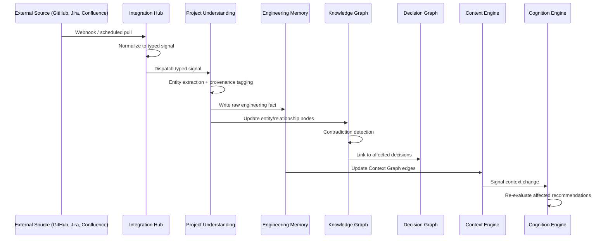

### 12.2 Query and Retrieval Flow

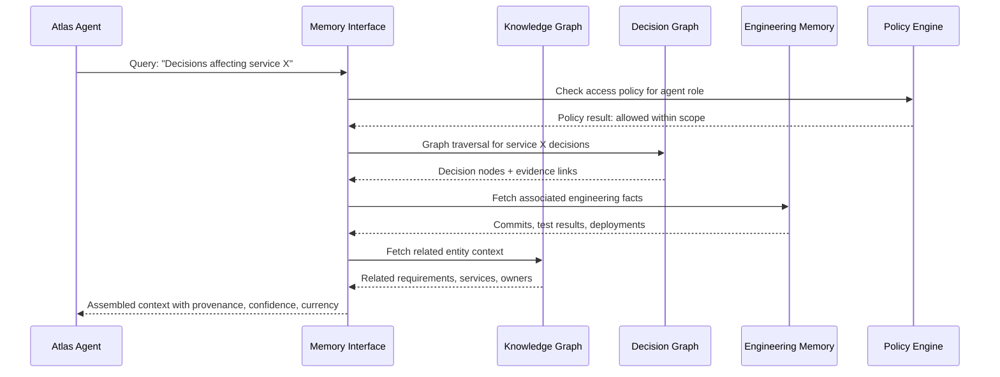

### 12.3 Human Correction Flow

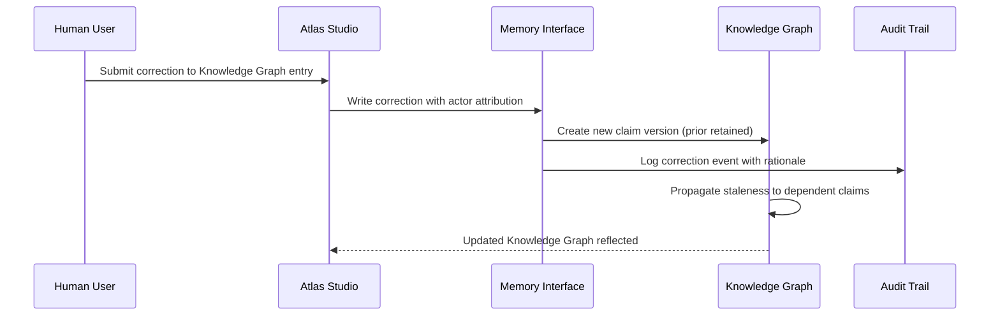

---

## 13. Decision Flow

### 13.1 Decision Creation Flow

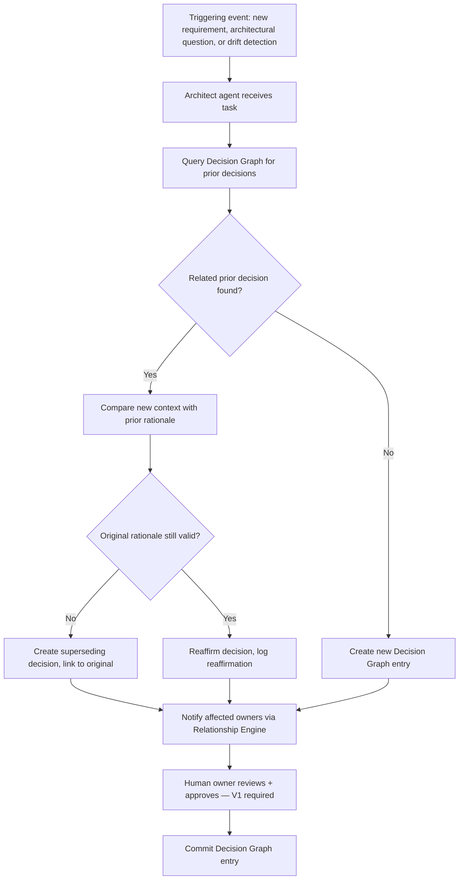

### 13.2 Decision Propagation

When a decision is superseded, all downstream decisions that referenced it as a dependency are flagged for review. This prevents a superseded decision from silently constraining a recommendation that the human owner believes is based on current rationale.

---

## 14. Learning Flow

### 14.1 Outcome-to-Brain Learning Loop

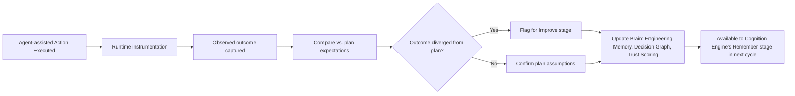

### 14.2 Trust Scoring Update Cycle

| Input | Frequency | Trust Scoring Action |
|---|---|---|
| Verified plan executed successfully | Per action | Increment role calibration score for this domain |
| Plan produced incorrect outcome | Per action | Decrement role calibration score; flag for human review |
| Human overrides agent recommendation | Per event | Analyze divergence; update domain-specific confidence |
| Agent recommendation reversed post-merge | Per event | Strong negative signal; re-evaluate authority boundary |

### 14.3 Institutional Memory Creation

Institutional Memory is created explicitly, not inferred. Sources:

1. **Human-authored postmortems** ingested via Confluence or direct entry
2. **Mentor agent teaching sessions** — summarized, human-reviewed, stored as learnings
3. **Decision Graph reaffirmations** that contain new rationale
4. **Engineering Manager escalation resolutions** — recorded as organizational precedent

---

## 15. Architecture Decision Records

### ADR-001: Project Brain as the Primary Object

**Status:** Accepted

**Context:** Every AI engineering tool today is centered on the output artifact (a diff, a file, a chat message). Atlas's core thesis (Product Vision §1.1) is that judgment, not generation, is the bottleneck. This requires the system to be centered on the model of the project, not the output.

**Decision:** Atlas Brain is the primary object. All platforms read from and write to it. Studio is a view over it. Agents reason against it. Runtime feeds outcomes back to it.

**Alternatives considered:**
- Conversation-history-centered: rejected because conversations do not model project structure or preserve rationale across sessions
- File-index-centered: rejected because a file index has no typed relationships, no decision provenance, and no temporal model

**Trade-off accepted:** Higher initial engineering investment in Brain construction compared to a stateless generation product. Justified because the V1 capability threshold cannot be met without a persistent project model.

**Reconsideration condition:** If projects with a mature Project Brain do not demonstrate measurably fewer reversed decisions than projects using the system in a stateless mode, this architecture should be revisited at the V1 → V2 transition.

---

### ADR-002: Governance as a Cross-Cutting Layer

**Status:** Accepted

**Context:** Governance (policy, authority, audit, trust) must apply to every platform boundary. If governance lived inside one platform, it could be bypassed by actions through another.

**Decision:** Atlas Governance is a constraint layer that instruments every inter-platform boundary, not a peer platform.

**Alternatives considered:**
- Governance as a sixth platform: rejected because peer platforms can be bypassed by paths between other platforms
- Governance embedded in each platform: rejected because inconsistent enforcement across platforms is worse than a governance gap — it creates false confidence

**Reconsideration condition:** If the cross-cutting governance layer becomes a performance or development bottleneck, evaluate whether some enforcement can be pushed into platform-local policy engines while maintaining a global audit trail.

---

### ADR-003: V1 Agents at Stage 1 (Advisory) Only

**Status:** Accepted

**Context:** The Product Map (§12.5) specifies a role maturity model. Roles advance from Advisory → Supervised Execution → Bounded Autonomy → Trusted Autonomy based on earned trust evidence, not schedules.

**Decision:** All 14 Engineering Organization roles operate at Stage 1 (Advisory) in Version 1. No agent autonomously merges code, deploys infrastructure, or modifies production systems.

**Alternatives considered:**
- V1 with selective Stage 2 for low-risk operations: rejected because the Audit Trail and Trust Scoring systems needed to safely gate Stage 2 are not yet mature enough in V1 to make the trust claim credible
- V1 with full Stage 1 plus opt-in Stage 2: rejected because opt-in autonomy creates inconsistent governance expectations

**Trade-off accepted:** V1 delivers less autonomous action than competitors. Justified by the constitutional principle that "automation earns its authority" (Product Vision §13.7) and the V1 capability threshold of demonstrating decision quality, not execution speed.

**Reconsideration condition:** When the Audit Trail and Trust Scoring modules demonstrate a sufficient calibration baseline (defined in Document 12: Testing Strategy), Stage 2 for Backend and Frontend Engineer roles can be evaluated for V2.

---

### ADR-004: Model Provider Agnosticism

**Status:** Accepted

**Context:** Frontier AI model capabilities, pricing, and availability change rapidly. Hard-coupling to one provider creates strategic and operational risk.

**Decision:** All AI reasoning in Atlas is routed through OpenRouter for model selection flexibility. The Cognition Engine defines a model capability contract; specific models are configuration, not architecture.

**Alternatives considered:**
- Single-provider (OpenAI only): rejected due to strategic concentration risk and licensing uncertainty
- Build own model: not viable at V1 given resource constraints and Constitutional principle of "build and buy deliberately" (§9.9)

**Trade-off accepted:** Slight latency overhead from routing layer. Acceptable given the strategic benefit of provider independence.

---

### ADR-005: Studio Is Read-Only to the Project Brain

**Status:** Accepted

**Context:** Allowing the Studio UI to write directly to the Project Brain would create an unbounded write surface that bypasses the Memory Interface's access control and audit logging.

**Decision:** Studio reads Brain state but never writes directly. All writes flow through the Memory Interface (Agent-initiated) or explicit Human Correction surfaces (human-initiated), both of which are logged to the Audit Trail.

**Reconsideration condition:** If a user-facing write operation cannot reasonably be routed through a Memory Interface abstraction without unacceptable latency, evaluate a thin, explicitly-bounded Studio write API with mandatory audit logging.

---

## 16. Trade-offs and Future Evolution

### 16.1 V1 Known Trade-offs

| Trade-off | What is given up | Why accepted | V2 path |
|---|---|---|---|
| Stage 1 advisory-only agents | Autonomous execution capability | Trust must be earned before it is granted | Stage 2 after Trust Scoring matures |
| Single-project Brain | Cross-project pattern reuse | Brain federation is complex; single-project model is the foundation | Cross-project federation in V4 |
| Limited integration catalog (GitHub, Jira, Confluence) | Breadth of institutional knowledge ingestion | MVP integrations cover majority of early customers | Expand in V2: GitLab, Slack, Azure DevOps |
| Azure-primary cloud deployment | Multi-cloud flexibility | Azure integration is most mature for V1 enterprise customers | AWS parity in V2; GCP in V3 |
| Manual decision entry for Institutional Memory | Speed of knowledge capture | Institutional Memory quality requires human attribution | Semi-automated capture from Slack, postmortem templates in V2 |

### 16.2 Future Evolution — 5-Year Architecture Trajectory

| Version | Architecture Evolution |
|---|---|
| V1 | Single-project Brain; advisory agents; sandboxed runtime; Azure-primary |
| V2 | Institutional Memory automated capture; Stage 2 agents (supervised execution); CI/CD Orchestrator; expanded integrations |
| V3 | Cross-team Relationship Engine; Stage 2–3 agents; production-parity environments; enterprise multi-tenancy hardened |
| V4 | Cross-project Brain federation; Stage 3–4 agents in evidenced domains; portfolio dashboards |
| V5 | Full lifecycle memory; global multi-region; cross-organization governed pattern transfer |

---

## 17. Glossary

| Term | Definition | Source |
|---|---|---|
| AI Engineering Operating System (AEOS) | The product category Atlas creates | Product Map §Category |
| AI Engineering Workspace (AEW) | The type of system Atlas instantiates | Product Vision §6.1 |
| Project Brain | Governed, temporal, evidence-backed model of a software project | Constitution Ch. 17 |
| Engineering Cognition Loop | Nine-stage reasoning process: Observe → Improve | Product Vision §11.9 |
| Engineering Organization | The 14 specialized reasoning roles with distinct responsibilities | Product Vision §12 |
| Decision Graph | Structured store of engineering decisions as first-class graph nodes | Product Map §2.1 |
| Knowledge Graph | Typed entities and relationships with provenance and currency | Product Map §2.1 |
| Engineering Memory | Factual substrate: commits, PRs, tests, deployments | Product Map §2.1 |
| Institutional Memory | Learned organizational knowledge: incidents, patterns, trade-offs | Product Map §2.1 |
| Context Engine | Live map of current project structure | Product Map §2.1 |
| Relationship Engine | Human and organizational ownership map | Product Map §2.1 |
| Authority Boundary | Explicit bounded scope within which an automated action may execute | Constitution §6.9 |
| Trust Scoring | Calibration tracking: how often stated confidence matches observed correctness | Product Map §2.6 |
| Stage 1 / Advisory | Maturity stage where agents produce recommendations only; humans execute | Product Vision §12.5 |

---

## 18. References

| Document | Relevance |
|---|---|
| [ATLAS_CONSTITUTION.md](../../ATLAS_CONSTITUTION.md) | Governing constraints: Chapters 9, 10, 14–18 |
| [ATLAS_PRODUCT_VISION.md](../../ATLAS_PRODUCT_VISION.md) | Engineering Cognition Loop (§11.9), Engineering Organization (§12), Strategic Pillars (§10) |
| [ATLAS_PRODUCT_MAP.md](../../ATLAS_PRODUCT_MAP.md) | Platform architecture (§1–2), Module specs (§6), Dependency map (§9) |
| Document 5: System Architecture | C4 Model decomposition of this reference architecture |
| Document 6: Database Design | Storage implementation for Knowledge Graph, Decision Graph, Engineering Memory |
| Document 7: Agent Specifications | Full behavioral specifications for each of the 14 Engineering Organization roles |
| Document 8: Security & Trust Architecture | Full zero-trust implementation design |

---

## 19. Engineering Review

### Review Checklist

- [x] Every platform has a unique, non-overlapping responsibility
- [x] No platform can bypass the Governance cross-cutting layer
- [x] Every information flow has a provenance and audit path
- [x] The Engineering Cognition Loop ordering is preserved in all sequence diagrams
- [x] V1 agents are correctly constrained to Stage 1 (Advisory)
- [x] All ADRs document alternatives considered and reconsideration conditions
- [x] Trade-offs are explicit, not hidden
- [x] No proprietary lock-in decisions made without a documented alternative and migration path
- [x] All terminology is derived from and consistent with the three source-of-truth documents
- [x] Every claim in this document can be traced to a Constitutional requirement or Product Vision principle

### Open Questions for V1 Design Review

> [!IMPORTANT]
> The following questions must be resolved before the V1 System Architecture document (Document 5) is finalized:
>
> 1. **Graph database selection**: Which graph database best satisfies the Knowledge Graph's requirement for typed relationships with temporal versioning at V1 scale? (Candidates: Neo4j, Amazon Neptune, Azure Cosmos DB for Gremlin — detailed in Document 6)
> 2. **Cognition Engine implementation**: Is the Cognition Engine a single orchestration service or is it the Agent Orchestrator itself, specialized to the 9-stage loop? Resolution impacts the Agent Platform boundary.
> 3. **Memory Interface access control granularity**: At V1, should role-based access at the agent level be sufficient, or is attribute-based access control (ABAC) required from day one? (Detailed in Document 8)

---

*Document 01 · Atlas Sprint 1 Engineering Package · Version 1.0 · 2026-07-28*
