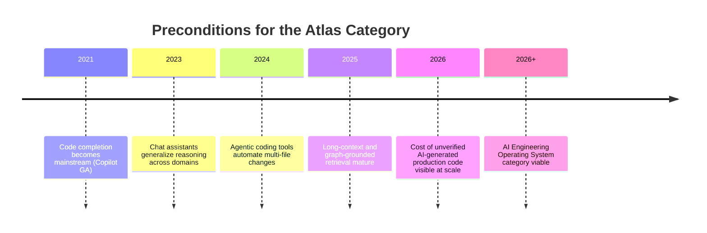
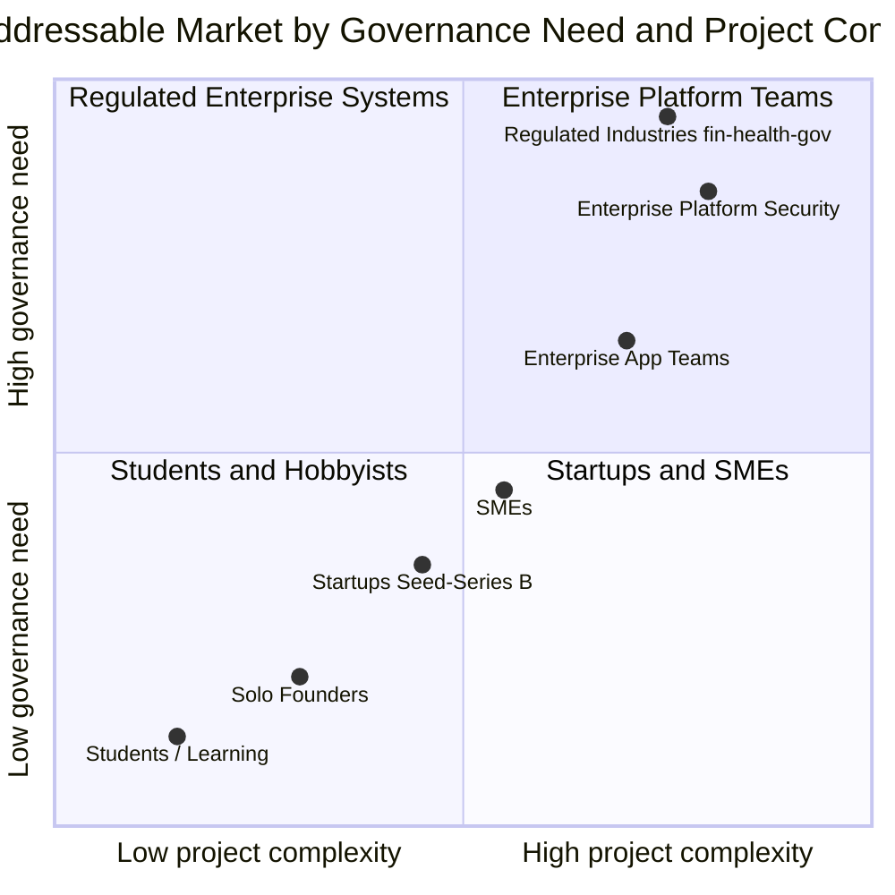
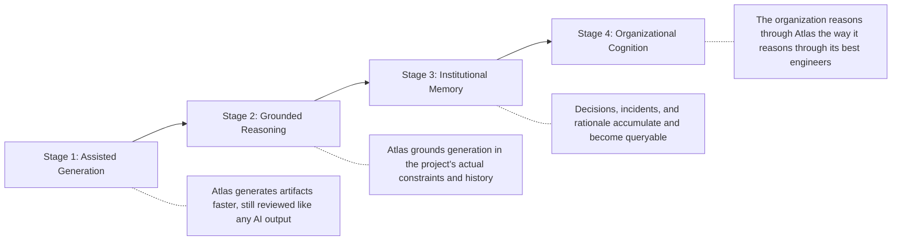
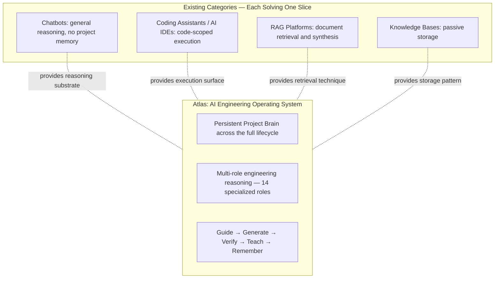
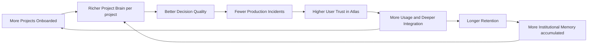
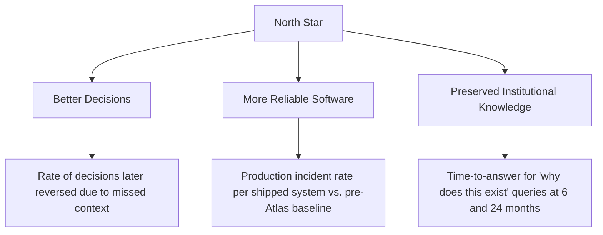
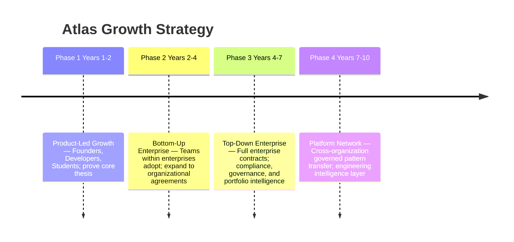

# Atlas Product Strategy

---

| Field | Value |
|---|---|
| **Title** | Atlas Product Strategy |
| **Version** | 1.0 |
| **Status** | Approved — Baseline |
| **Document Class** | Strategic |
| **Purpose** | Define Atlas's target market, customer segmentation, pricing model, competitive positioning, growth strategy, business flywheel, defensible moat, North Star Metric, and adoption strategy, derived exclusively from the Company Bible, Product Vision, and Product Map |
| **Scope** | Go-to-market strategy for Atlas Version 1 through Version 3; long-term category definition through Year 10 |
| **Out of Scope** | Marketing copy, sales scripts, specific partnership agreements, financial models |
| **Dependencies** | ATLAS_CONSTITUTION.md · ATLAS_PRODUCT_VISION.md · ATLAS_PRODUCT_MAP.md |
| **Owner** | Chief Product Officer |
| **Reviewers** | CEO · CTO · Principal UX Designer · Distinguished Engineer |

### Revision History

| Version | Date | Author | Change |
|---|---|---|---|
| 1.0 | 2026-07-28 | CPO | Founding edition |

---

## Table of Contents

1. [Strategic Foundation](#1-strategic-foundation)
2. [Target Market](#2-target-market)
3. [Customer Segments](#3-customer-segments)
4. [Competitive Positioning](#4-competitive-positioning)
5. [Business Flywheel](#5-business-flywheel)
6. [Defensible Moat](#6-defensible-moat)
7. [North Star Metric](#7-north-star-metric)
8. [Pricing Strategy](#8-pricing-strategy)
9. [Growth Strategy](#9-growth-strategy)
10. [Adoption Strategy](#10-adoption-strategy)
11. [Risk Analysis](#11-risk-analysis)
12. [Success Metrics](#12-success-metrics)
13. [Glossary](#13-glossary)
14. [References](#14-references)
15. [Engineering Review](#15-engineering-review)

---

## 1. Strategic Foundation

### 1.1 The Core Strategic Bet

> **Generation is no longer the bottleneck. Judgment is.**

Between 2021 and 2026, the cost of generating a plausible unit of software fell by more than an order of magnitude. This is a genuine achievement. It is also incomplete: the expensive part of building reliable systems was never typing speed. It was always knowing which unit was the right one to build, whether a change was safe, why a past decision was made, and whether a system was ready for real users.

The strategic bet Atlas makes is that the market will pay for **judgment** — the ability to understand, decide, verify, and remember — far more durably than it will pay for incremental generation speed. This bet is explicitly falsifiable: if projects using Atlas's Project Brain do not measurably outperform ungrounded generation on decision quality and defect rate, the strategy must be revisited (Product Vision §15.7).

### 1.2 Category Definition

Atlas is not competing for the "AI coding tools" budget. Atlas is defining a new category:

> **AI Engineering Operating System (AEOS)** — a persistent system that maintains a governed, evidence-linked model of a software project and uses that model through multi-role engineering reasoning to guide, generate, verify, teach, and remember engineering work across the full lifecycle.

This category definition is precise and falsifiable. Every clause of it excludes a class of existing product:
- "Persistent" excludes stateless chat assistants
- "Governed, evidence-linked model" excludes ungrounded generation tools
- "Full lifecycle" excludes point-in-time tools that reset context
- "Multi-role engineering reasoning" excludes single-pass generation

### 1.3 Why Now

Three preconditions became simultaneously true in 2024–2026 (Product Vision §2.4):

| Precondition | Why It Matters |
|---|---|
| Reasoning-capable frontier models exist | Multi-step engineering reasoning is now possible at scale |
| Long-context and graph infrastructure is mature | A live, queryable model of a real codebase is now economically feasible |
| Cost of unverified AI generation is visible at scale | "Verify before trust" has shifted from a principle to an operational requirement |

---

## 2. Target Market

### 2.1 Market Framing

Atlas does not compete for the "AI coding tools" budget line. It competes for the far larger and more durable budget categories that fund **engineering productivity, developer platforms, and knowledge management**. The AI Engineering Operating System category subsumes parts of all three.

### 2.2 Budget Pools Atlas Addresses

| Budget Pool | What It Currently Funds | Why Atlas Is a Substitute or Superset |
|---|---|---|
| Developer tools & AI coding assistants | Autocomplete, chat-in-IDE, agentic coding | Atlas includes this as one interaction surface, not the whole product |
| Engineering knowledge management | Wikis, ADR tooling, internal documentation platforms | Atlas's Project Brain is a superset: current, provenance-linked, queryable |
| Application security & code review tooling | Static analysis, manual security review augmentation | Atlas's Security Engineer role operates continuously, pre-merge |
| Engineering management & platform tooling | Planning tools, architecture governance, onboarding | Atlas's Decision Graph and Context Graph reduce reliance on separate systems |

### 2.3 Addressable Market by Governance Need vs. Project Complexity

**V1 Beachhead:** Founders and early-stage startups (Seed → Series A). They feel the judgment gap most acutely, have the fastest feedback loops, and validate the Project Brain and Engineering Organization architecture with the lowest governance overhead.

---

## 3. Customer Segments

### 3.1 Primary Personas and Their Strategic Value

| Persona | Primary Need | Definition of Trust | V1 Priority | Revenue Profile |
|---|---|---|---|---|
| **Founders** | Move from idea to defensible product; avoid expensive architectural mistakes | System won't hide a fatal flaw to appear helpful | ★★★★★ High | Product-led; self-serve |
| **Startups (Seed–B)** | Ship fast without accumulating unmanageable technical debt | Debt visible and prioritized, not invisible | ★★★★★ High | Product-led; team plans |
| **Developers** | Implement correctly without repeatedly re-explaining project context | Suggestions grounded in actual codebase and history | ★★★★☆ High | Seat-based |
| **Architects** | Structural decisions with full trade-off visibility | Transparent alternatives-and-trade-offs reasoning | ★★★☆☆ Medium | Enterprise deal |
| **Engineering Managers** | Visibility into delivery health, risk, and decision history | Accurate, non-inflated status and risk reporting | ★★★☆☆ Medium | Enterprise deal |
| **Enterprise Organizations** | Governance, auditability, integration with systems of record | Full provenance, policy enforcement, exportability | ★★☆☆☆ V3 | Enterprise contract |
| **Students** | Learn real engineering judgment, not just syntax | Explanations that teach reasoning | ★★☆☆☆ Long-term | Free / education |

### 3.2 Customer Transformation Journey

### 3.3 Before and After Atlas

| Dimension | Before Atlas | After Sustained Atlas Use |
|---|---|---|
| Decision rationale | Exists only in memory or nowhere | Recorded automatically in Decision Graph, linked to code and requirements |
| Onboarding a new engineer | Weeks reconstructing tribal knowledge | Query the Project Brain for "why does this exist" in minutes |
| Architecture review | Ad hoc, dependent on which senior engineer is available | A standing, consistently applied discipline |
| AI-generated code review | Same rigor as human code, at higher volume — creating a bottleneck | Verified against the project's own constraints before reaching a human reviewer |
| Documentation | Written once, trusted indefinitely, rarely correct after 6 months | Continuously reconciled against actual system state; staleness is flagged |
| Production readiness | Assessed late, under time pressure | Visible continuously from the design phase onward |

---

## 4. Competitive Positioning

### 4.1 Category Positioning Map

### 4.2 Competitive Analysis

| Competitor | What It Does Well | Where Atlas Differs Structurally |
|---|---|---|
| **GitHub Copilot** | In-editor code completion; task-scoped agentic changes | Unit of work is the project decision; code is a downstream output of a reasoning process, not the starting point |
| **Cursor / Windsurf** | AI-native IDE; deep codebase-aware editing | Atlas is not bound to an IDE; Project Brain persists and reasons across sessions, tools, and non-code artifacts |
| **Devin** | Increasing autonomy over end-to-end coding tasks | Atlas scopes autonomy to explicit authority boundaries; explanation and memory are mandatory outputs, not optional |
| **NotebookLM** | Grounded synthesis from user-provided document sets | Atlas's grounding set is the live project (code, infra, tickets, telemetry) and it acts on that model, not only explains it |
| **RAGFlow** | Configurable retrieval pipelines over enterprise documents | Project Brain is a structured graph, not a document-chunk index; retrieval is one query type among several reasoning operations |
| **ChatGPT / Claude / Gemini** | General-purpose frontier reasoning | Atlas is a specific application of frontier models with persistent project-scoped memory and governed multi-role reasoning |

> [!NOTE]
> Frontier model providers (OpenAI, Anthropic, Google) are not competitors to Atlas — they are potential reasoning substrates Atlas is built on. The comparison that matters is between general-purpose reasoning surfaces and an AI Engineering Operating System with persistent memory and governed multi-role reasoning.

### 4.3 Where Atlas Interoperates Rather Than Competes

Atlas explicitly avoids the "replace everything" trap:

| System | Relationship to Atlas |
|---|---|
| GitHub Copilot / Cursor / Windsurf | Can surface Atlas context as a plugin; Atlas does not replace the code editing experience |
| Git repositories (GitHub, GitLab, Azure DevOps) | Primary source of Engineering Memory |
| Planning tools (Jira, Linear) | Synchronized with Task Board; Atlas does not replace project management |
| Observability platforms (Datadog, Grafana) | Source of Production Intelligence signals |
| OpenAI / Anthropic / Gemini | Reasoning substrates; Atlas is model-agnostic |

---

## 5. Business Flywheel

**The flywheel mechanism:**

1. Each project onboarded enriches the Project Brain for that organization.
2. A richer Project Brain produces higher-quality decisions and fewer production incidents.
3. Demonstrated better outcomes increase user trust in Atlas.
4. Higher trust leads to deeper integration: more sources connected, more workflows automated.
5. Deeper integration accumulates more Institutional Memory — decisions, incidents, learnings.
6. More Institutional Memory makes the Project Brain even richer for future decisions.
7. Demonstrated value leads to additional projects being onboarded, restarting the cycle.

**The flywheel is non-transferable.** Each organization's Project Brain is theirs. Accumulated Institutional Memory creates a switching cost that is not data lock-in (customers own and can export their data) but rather **value lock-in**: the engineering knowledge accumulated in Atlas becomes more valuable over time, making it genuinely expensive to leave — not because leaving is blocked, but because the knowledge would need to be rebuilt elsewhere.

---

## 6. Defensible Moat

### 6.1 Moat Components

| Moat Layer | Description | Durability |
|---|---|---|
| **Institutional Memory accumulation** | Each project brain becomes richer over time; switching means rebuilding years of accumulated decisions, incidents, and rationale | Very high — compounds with time |
| **Decision Graph network effects** | As more decisions are recorded and cross-referenced, the value of each new decision entry increases | High — intra-project compounding |
| **Engineering Organization design** | Fixed, opinionated 14-role organization specialized entirely to software engineering — not a general-purpose agent framework | High — takes 12–24 months to replicate at quality |
| **Trust Scoring calibration** | Each role's trust score calibrates to a specific domain; calibration evidence is proprietary to the customer | Medium — calibration takes months of use |
| **Integration depth** | Deep integration with the customer's repositories, planning tools, CI/CD, and observability creates operational dependency | Medium — comparable to other platform integrations |
| **Constitutional alignment** | The Atlas Constitution creates a consistent, principled product design philosophy that produces trust; this is a cultural moat, not a technical one | Very high — cannot be replicated by copying features |

### 6.2 What the Moat Is Not

> [!CAUTION]
> The moat is not data monopoly. Customers own their engineering knowledge. Atlas is a steward, not a claimant (Constitution §5). Interoperability and exportability are **strategic requirements** — a layer that cannot be removed cannot be fully trusted, and untrustworthy products do not accumulate the institutional memory that creates the moat.

### 6.3 Moat Defense Strategy

| Threat | Defense |
|---|---|
| Competitor copies the 14-role organization | Organization design quality requires months of calibration; copying the structure does not copy the behavioral quality |
| Frontier model providers enter the product space | Atlas's moat is the customer's Project Brain, not the model. Provider competition makes the reasoning substrate cheaper, not less valuable |
| Customer builds internal tooling | Internal tooling has no flywheel; it accumulates knowledge more slowly without the product investment in retrieval, contradiction detection, and staleness management |
| Open-source alternative emerges | Open-source reduces the tool cost but not the operational cost of running the platform. Atlas's SaaS value is in the managed, continuously maintained Brain |

---

## 7. North Star Metric

### 7.1 North Star Statement

> **An engineering organization using Atlas makes better decisions, ships more reliable software, and loses less institutional knowledge over time than the same organization would without it — and can prove it.**

### 7.2 North Star Structure

### 7.3 Why a Comparative Claim

Atlas does not claim to make engineering decisions perfect. It claims a **relative improvement** over the counterfactual — the same organization, same people, same constraints, without Atlas's model of their project. This framing keeps the product honest: it must be evaluated against what the organization would otherwise do, not against an abstract ideal.

### 7.4 North Star Anti-Patterns

| Anti-Pattern | Why It Violates the North Star | Guardrail |
|---|---|---|
| Optimizing for session engagement (length, message count) | Does not measure decision quality or reliability | Excluded from success metrics explicitly |
| Measuring only code acceptance rate | Measures generation convenience, not judgment | Tracked alongside downstream defect and revert rate |
| "Knowledge captured" = "knowledge preserved" | Capture without retrievability and currency is not preservation | Project Brain requires staleness detection, not just storage |
| Autonomous action volume | Rewards automation expansion ahead of earned trust | Guardrail metric: must not grow faster than trust evidence |

---

## 8. Pricing Strategy

### 8.1 Pricing Philosophy

Pricing must reflect value delivered, not compute consumed. A Project Brain that prevents one critical architectural mistake is worth more than a thousand code completions. This requires pricing that:

1. Aligns with **decision quality and knowledge accumulation**, not session volume
2. Scales with **team size and project complexity**, not raw token usage
3. Does not create **perverse incentives** to maximize AI usage rather than maximize outcomes

### 8.2 V1 Pricing Tiers

| Tier | Target | Project Brain | Agents | Integrations | Price Signal |
|---|---|---|---|---|---|
| **Solo** | Founders, Students | 1 project; full Knowledge Graph + Decision Graph | All 14 roles at Stage 1 | GitHub, Jira | Free during beta; low monthly |
| **Team** | Startups, SMEs | Up to 5 projects; full Brain | All 14 roles at Stage 1 | GitHub, GitLab, Jira, Confluence, Slack | Per seat, monthly |
| **Business** | Growing companies | Up to 20 projects; full Brain + Institutional Memory | Stage 1 agents; Trust Scoring | All V1 integrations + priority support | Per seat + project |
| **Enterprise** | Enterprise orgs | Unlimited projects; full Brain federation | Stage 1 agents; Compliance Reporting | SSO/SCIM + custom integrations | Annual contract; custom |

### 8.3 Pricing Principles

- **No usage-based pricing for AI reasoning** in V1 — reasoning costs are included in the tier fee. This removes the perverse incentive to minimize Atlas use to control costs.
- **Decision Graph entries created** is a leading value indicator; pricing can be aligned to this in future tiers.
- **Enterprise pricing** includes data residency, compliance reporting, and air-gapped deployment options.

### 8.4 Freemium Strategy

A generous Solo tier serves two purposes:
1. **Validates the core thesis** — if founders and students don't use the Project Brain even when it's free, the thesis that judgment is the bottleneck may be wrong.
2. **Bottom-up growth engine** — individual developers who use Atlas as students or at startups become internal advocates when they join enterprise organizations.

---

## 9. Growth Strategy

### 9.1 Growth Phases

### 9.2 Phase 1 — Product-Led Growth (V1)

| Motion | Mechanism |
|---|---|
| Self-serve onboarding | Founder connects GitHub repo; Project Brain construction begins immediately |
| Value-to-wow moment | First meaningful Decision Graph entry created within the first engineering session |
| Viral signal | Founders share Atlas-generated architecture decisions with their teams and investors |
| Community | Public architecture decision library — anonymized, consented Decision Graph examples |
| Content | Engineering blog demonstrating how Atlas grounded a real-world decision; backed by evidence not marketing |

### 9.3 Phase 2 — Bottom-Up Enterprise

| Motion | Mechanism |
|---|---|
| Team expansion | Solo founder's company grows; extends Atlas to engineering team |
| Champion program | Developers who use Atlas become internal champions when joining or influencing larger organizations |
| Integration depth | Deep GitHub/Jira integration creates organizational stickiness before a formal enterprise purchase |

### 9.4 Phase 3 — Top-Down Enterprise

| Motion | Mechanism |
|---|---|
| Compliance unlock | SOC 2 Type II, data residency, and audit trail features unlock enterprise procurement |
| Security partnership | Co-sell with cloud providers (Azure-first) who benefit from Atlas running on their infrastructure |
| Executive value | Analytics Dashboard provides Engineering Managers with real-time readiness and risk visibility — an executive value proposition distinct from developer tools |

### 9.5 Channel Strategy

| Channel | Phase | Rationale |
|---|---|---|
| Direct self-serve (website) | 1, 2, 3 | Core PLG motion; lowest customer acquisition cost |
| Developer community (GitHub, Discord, blog) | 1, 2 | Engineers evaluate tools through peers, not sales |
| Azure Marketplace | 2, 3 | Reduces enterprise procurement friction; aligns with Azure-primary infrastructure strategy |
| Partner: GitHub / GitLab | 2, 3 | Integration placement in existing developer workflows |
| Direct enterprise sales | 3 | Required for multi-year contracts; enabled after PLG builds pipeline |

---

## 10. Adoption Strategy

### 10.1 Adoption Friction Analysis

| Friction Point | Source | Mitigation |
|---|---|---|
| Project Brain setup time | Time to connect sources and build initial model | Immediate GitHub sync; progressive Brain enrichment (Brain is useful at day 1, better at day 30) |
| Learning the 14-agent model | Cognitive overhead of understanding Engineering Organization | Mentor agent explains the organization in context of user's actual work; no upfront training required |
| Changing established workflows | Engineers have existing tools and habits | Atlas integrates with, not replaces, existing tools; interoperate before replacing |
| Enterprise procurement | Security, compliance, and legal review | SOC 2 readiness from day one; data residency controls; DPA templates |
| Trust in AI recommendations | Past experience with hallucinating AI tools | Every recommendation cites provenance; uncertainty is explicit; humans retain authority |

### 10.2 Time-to-Value Targets (V1)

| Milestone | Target | Measurement |
|---|---|---|
| Project Brain first useful | < 15 minutes from GitHub connection | First Knowledge Graph entity populated |
| First Decision Graph entry | < 1 engineering session | Human-approved decision recorded with rationale |
| First prevented mistake | < 1 week | Agent surfaces a constraint from Decision Graph that would have been violated |
| Institutional Memory alive | < 1 month | Second project session retrieves context from the first without user re-explanation |

### 10.3 Adoption by Persona

| Persona | Entry Point | First Value Moment | Retention Driver |
|---|---|---|---|
| Founder | Connect GitHub + describe idea | Architecture Canvas populated from existing code | Decision Graph prevents rewrite at first fundraising round |
| Developer | Code Workspace + Task Board | Suggestion grounded in project's actual decision history | Less time re-explaining context to AI |
| Architect | Architecture Canvas | Atlas retrieves prior Decision Graph entries relevant to proposed change | Structural decisions no longer lost |
| Engineering Manager | Analytics Dashboard | Real-time project readiness score | Replaces manual status reporting |
| Student | Solo tier + Documentation Hub | Explanation of why a design choice was made in context | Learning from real engineering, not tutorials |

---

## 11. Risk Analysis

### 11.1 Strategic Risks

| Risk | Probability | Impact | Mitigation |
|---|---|---|---|
| Core thesis wrong: judgment is not the bottleneck | Low — demand-side evidence supports it | Critical | V1 is designed to falsify this quickly; pivot is possible because Project Brain is platform-agnostic |
| Frontier model providers build equivalent product | Medium | High | Moat is the Project Brain and Institutional Memory, not the model. Providers building a product means they are our customer for reasoning substrate. |
| Customers do not adopt Decision Graph | Medium | High | Adoption metrics tracked as a leading indicator; if Decision Graph adoption lags, investigate whether the friction is UX or thesis |
| Competitor achieves similar institutional memory depth first | Low-medium | High | 12–24 month head start; engineering organization design is not easily replicated |
| Regulatory change restricts AI-generated code in regulated industries | Low | Medium | Atlas's governance-native design is a compliance asset, not a liability |

### 11.2 Product Risks

| Risk | Mitigation |
|---|---|
| Project Brain construction quality is poor for large, complex codebases | Progressive enrichment; explicit coverage reporting so gaps are visible, not hidden |
| Agents produce low-quality recommendations that erode trust | Provenance on every recommendation; human remains in authority loop; Trust Scoring detects calibration failures |
| Knowledge becomes stale and is trusted as current | Staleness detection is a first-class feature; stale knowledge is visually flagged |

---

## 12. Success Metrics

### 12.1 Leading Adoption Indicators

| Metric | Why It Leads |
|---|---|
| Weekly active projects with a maintained Project Brain | Indicates durable use, not one-off generation |
| Decision Graph entries created per active project per month | Indicates the core differentiator is being used |
| Cross-session context reuse rate | Indicates memory is functioning as designed |

### 12.2 Core North Star Indicators

| Metric | Maps To |
|---|---|
| Rate of decisions later reversed due to missed context | Better Decisions |
| Production incident rate per shipped system vs. pre-Atlas baseline | More Reliable Software |
| Time-to-answer for "why does this exist" queries at 6 and 24 months | Preserved Institutional Knowledge |

### 12.3 Business Metrics

| Metric | V1 Target | V2 Target |
|---|---|---|
| Monthly Active Projects | 100+ | 500+ |
| Decision Graph entries per active project per month | 5+ | 15+ |
| Net Promoter Score (engineering quality) | > 50 | > 65 |
| Enterprise logo count | 5 | 25 |
| Revenue retention | > 90% | > 95% |

### 12.4 Guardrail Metrics

> [!CAUTION]
> These must never be treated as success signals in isolation:
> - Raw code acceptance rate (rewards convenient generation over correct generation)
> - Session length / message volume (rewards engagement over resolution and learning)
> - Autonomous action volume (rewards automation expansion ahead of earned trust)
> - Explanation length (rewards verbosity over clarity)

---

## 13. Glossary

| Term | Definition |
|---|---|
| AI Engineering Operating System (AEOS) | The product category Atlas creates |
| Project Brain | Persistent, governed model of a software project |
| Decision Graph | Structured store of engineering decisions with rationale |
| Engineering Organization | The 14 specialized reasoning roles |
| Institutional Memory | Accumulated learned knowledge: incidents, patterns, conventions |
| Flywheel | Self-reinforcing growth mechanism driven by accumulating Institutional Memory |
| Stage 1 / Advisory | Agent maturity level where agents produce recommendations; humans execute |
| North Star Metric | The comparative improvement in decision quality, reliability, and knowledge preservation |

---

## 14. References

| Document | Relevance |
|---|---|
| [ATLAS_CONSTITUTION.md](../../ATLAS_CONSTITUTION.md) | Mission (Ch. 3), Vision (Ch. 4), Strategic Pillars (Ch. 16) |
| [ATLAS_PRODUCT_VISION.md](../../ATLAS_PRODUCT_VISION.md) | Market Opportunity (§4), Current AI Landscape (§5), North Star (§9), Success Metrics (§14) |
| [ATLAS_PRODUCT_MAP.md](../../ATLAS_PRODUCT_MAP.md) | User Definitions (§4), Product Evolution Roadmap (§10) |
| Document 1: Reference Architecture | Platform definitions that strategy is built on |
| Document 3: PRD | Feature requirements that implement this strategy |

---

## 15. Engineering Review

### Alignment Checks

- [x] Strategy derived from and consistent with Atlas Constitution
- [x] No new terminology introduced; all terms from source documents
- [x] Target market consistent with Product Vision §4 and §7
- [x] Pricing aligned with Constitutional principle that customers own their data
- [x] Growth strategy respects Constitutional principle of interoperability
- [x] North Star Metric matches Product Vision §9 exactly
- [x] No "replace everything" positioning; interoperation-first strategy confirmed
- [x] Moat does not depend on data lock-in (export capability is a strategic requirement)

---

*Document 02 · Atlas Sprint 1 Engineering Package · Version 1.0 · 2026-07-28*
