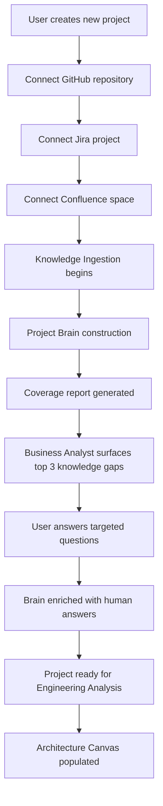
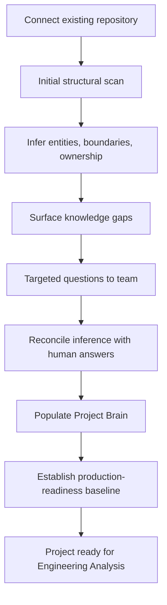
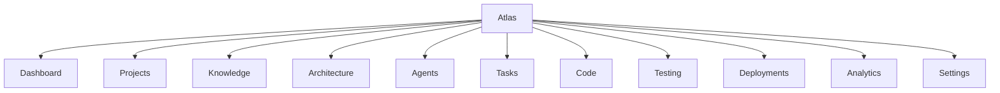
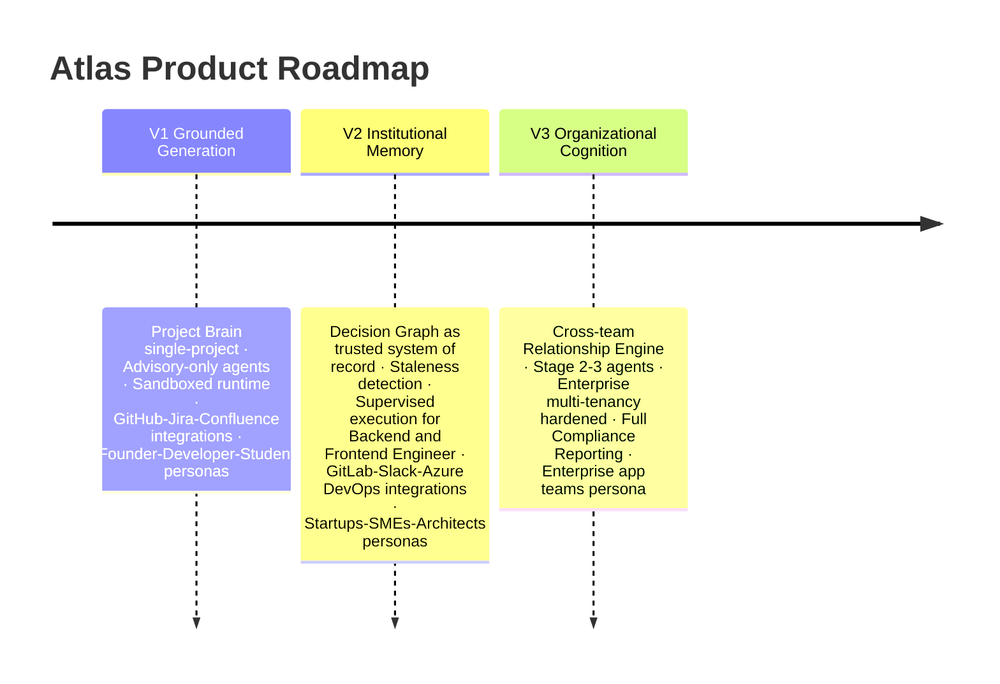

# Atlas Product Requirements Document

---

| Field | Value |
|---|---|
| **Title** | Atlas Product Requirements Document |
| **Version** | 1.0 |
| **Status** | Approved — Baseline |
| **Document Class** | Product |
| **Purpose** | Define every feature, module, workflow, screen, and capability of Atlas Version 1, with acceptance criteria, release plan, roadmap, and success metrics, derived from the Product Map and grounded in the Constitution and Product Vision |
| **Scope** | Atlas Version 1 — Grounded Generation capability threshold. All five platforms at their V1 maturity level. |
| **Out of Scope** | Version 2+ features (supervised execution, Institutional Memory automation, cross-project federation); marketing features; billing system internals |
| **Dependencies** | Document 1 (Reference Architecture) · Document 2 (Product Strategy) · ATLAS_PRODUCT_MAP.md §§1–10 |
| **Owner** | Chief Product Officer |
| **Reviewers** | CTO · Distinguished Engineer · Principal UX Designer · Staff Backend Engineer · Staff Frontend Engineer · Principal Security Architect |

### Revision History

| Version | Date | Author | Change |
|---|---|---|---|
| 1.0 | 2026-07-28 | CPO | Founding edition |

---

## Table of Contents

1. [Product Overview](#1-product-overview)
2. [User Definitions and Personas](#2-user-definitions-and-personas)
3. [Atlas Brain — Features and Modules](#3-atlas-brain--features-and-modules)
4. [Atlas Studio — Features and Modules](#4-atlas-studio--features-and-modules)
5. [Atlas Agents — Features and Modules](#5-atlas-agents--features-and-modules)
6. [Atlas Runtime — Features and Modules](#6-atlas-runtime--features-and-modules)
7. [Atlas Cloud — Features and Modules](#7-atlas-cloud--features-and-modules)
8. [Atlas Governance — Features and Modules](#8-atlas-governance--features-and-modules)
9. [Major Workflows](#9-major-workflows)
10. [External Integrations](#10-external-integrations)
11. [Navigation and UX Structure](#11-navigation-and-ux-structure)
12. [Acceptance Criteria Framework](#12-acceptance-criteria-framework)
13. [Release Plan](#13-release-plan)
14. [Roadmap — V1 Through V3](#14-roadmap--v1-through-v3)
15. [Success Metrics](#15-success-metrics)
16. [Glossary](#16-glossary)
17. [References](#17-references)
18. [Engineering Review](#18-engineering-review)

---

## 1. Product Overview

### 1.1 What Atlas V1 Must Do

Atlas Version 1 must achieve the capability threshold defined in the Product Map, Section 10.1:

> **Atlas can construct a single-project Project Brain, ground code generation in it, and demonstrate measurably fewer reversed decisions and post-merge defects than ungrounded generation.**

This is not a minimum viable chatbot. It is a minimum viable AI Engineering Operating System. Every feature in this PRD either directly contributes to this capability threshold or is infrastructure required to make the threshold measurable.

### 1.2 V1 Platform Maturity Summary

| Platform | V1 State |
|---|---|
| Atlas Brain | Single-project Knowledge Graph, Decision Graph, Context Engine, Engineering Memory operational |
| Atlas Studio | Project Workspace, Architecture Canvas, Task Board, Code Workspace operational |
| Atlas Agents | All 14 roles at Stage 1 (Advisory) only |
| Atlas Runtime | Execution Sandbox and Verification Engine operational; no autonomous promotion to production |
| Atlas Cloud | Core tenancy + GitHub, Jira, Confluence integrations live |
| Atlas Governance | Policy Engine and Audit Trail operational |

### 1.3 V1 Primary Personas

Founders, Developers, Students (Product Vision §7.3). These personas have the fastest feedback loops and the most acute experience of the judgment gap.

---

## 2. User Definitions and Personas

### 2.1 User Table

| User | Goals in V1 | Atlas Entry Point | Trust Requirement |
|---|---|---|---|
| **Founders** | Move from idea to defensible product without a technical co-founder | Project Workspace → Architecture Canvas | System won't hide a fatal flaw to appear helpful |
| **Developers** | Implement features correctly without re-explaining project context | Task Board → Code Workspace | Suggestions grounded in actual codebase and decision history |
| **Students** | Learn real engineering judgment, not just syntax | Documentation Hub → Code Workspace | Explanations that teach reasoning, not just answers |
| **Architects** | Make structural decisions with full trade-off visibility | Architecture Canvas → Decision Graph | Transparent alternatives-and-trade-offs reasoning |
| **Engineering Managers** | Visibility into delivery health and risk | Analytics Dashboard | Accurate, non-inflated status and risk reporting |
| **QA Engineers** | Verify behavior against real requirements including edge cases | Testing Console | Tests explicitly linked to requirements |
| **DevOps Engineers** | Ship safely with observable, reversible deployments | Deployment Console | Continuous production-readiness visibility |
| **Security Engineers** | Catch security risk before merge | Security Engineer agent interface | Continuous threat-model-grounded review |

### 2.2 Persona-to-Module Map

| Persona | Primary Module | Secondary Module | V1 Access Level |
|---|---|---|---|
| Founders | Project Workspace, Architecture Canvas | Task Board, Agents view | Full |
| Developers | Code Workspace, Task Board | Testing Console | Full |
| Students | Code Workspace, Documentation Hub | Task Board | Full (Solo tier) |
| Architects | Architecture Canvas | Decision Graph browser | Full |
| Engineering Managers | Analytics Dashboard | Task Board | View + approve |
| QA | Testing Console | Code Workspace | Full |
| DevOps | Deployment Console | Testing Console | Full |
| Security | Agents view (Security Engineer role) | Architecture Canvas | Full |

---

## 3. Atlas Brain — Features and Modules

### 3.1 Project Understanding

**Purpose:** Construct and continuously update a testable model of a project's entities from ingested signals. Surface gaps rather than fill them silently.

**V1 Features:**

| Feature ID | Feature | User Benefit | Acceptance Criteria |
|---|---|---|---|
| PU-001 | Repository ingestion | Automatically extract services, interfaces, schemas, and ownership from connected repositories | Given a GitHub repo is connected, within 15 minutes the Project Workspace shows a populated entity list with at least: services, interfaces, data stores, and identified owners |
| PU-002 | Entity coverage report | Users know what the Brain does and does not know | Coverage report shows: known entities, inferred entities (labeled), and explicit gaps |
| PU-003 | Contradiction detection | Conflicting claims between documents and code are surfaced | When a document says a service does X and code evidence shows it does Y, both claims are flagged with their sources; neither is silently resolved |
| PU-004 | Incremental refresh | Knowledge stays current as code changes | Within 5 minutes of a merged PR, affected Knowledge Graph entities are updated |
| PU-005 | Human correction surface | Users can correct inferred facts | A user can override any inferred entity claim; the correction is attributed to the user and logged to the Audit Trail |

### 3.2 Context Engine

**Purpose:** Maintain the live, current-state map: service boundaries, dependencies, data flows, deployment topology.

**V1 Features:**

| Feature ID | Feature | User Benefit | Acceptance Criteria |
|---|---|---|---|
| CE-001 | Service dependency map | Understand which services depend on which | Architecture Canvas displays dependency graph derived from code analysis; updated on each ingestion cycle |
| CE-002 | Data flow visualization | Understand where data moves | Data flows between services visible in Architecture Canvas |
| CE-003 | Drift detection | Know when documented architecture diverges from actual | When Context Engine detects a service boundary that differs from the Decision Graph's recorded architecture, flag the discrepancy for Architect review |
| CE-004 | Deployment topology | Know what is running where | Deployment topology visible from connected CI/CD sources in V1 |

### 3.3 Knowledge Graph

**Purpose:** Structured store of typed entities and relationships with provenance and currency tracking.

**V1 Features:**

| Feature ID | Feature | User Benefit | Acceptance Criteria |
|---|---|---|---|
| KG-001 | Entity creation | All project entities are represented | Entities include: Requirement, Service, Interface, DataStore, Team, Owner, Incident, Policy |
| KG-002 | Relationship mapping | Entities are meaningfully connected | Typed relationships: implements, depends_on, owns, exposes, affects, triggers, supersedes |
| KG-003 | Provenance tracking | Every claim has a traceable source | Every Knowledge Graph claim exposes: source, timestamp, confidence level, and access scope |
| KG-004 | Currency tracking | Users know if knowledge is stale | Claims have a freshness indicator; claims with changed source evidence are marked stale |
| KG-005 | Staleness notification | Engineers are alerted to stale knowledge | When a claim is marked stale, the module that depends on it (e.g., a Decision Graph entry) also surfaces a staleness indicator |
| KG-006 | Search and query | Engineers can retrieve specific knowledge | Full-text and entity-type search returns results with provenance; confidence displayed |

### 3.4 Decision Graph

**Purpose:** Record engineering decisions as first-class nodes connected to requirements, alternatives, evidence, code, and reconsideration conditions.

**V1 Features:**

| Feature ID | Feature | User Benefit | Acceptance Criteria |
|---|---|---|---|
| DG-001 | Decision creation | Record a decision with full context | Decision entry must include: statement, alternatives, evidence links, trade-offs, owner, reconsideration condition; creation blocked if required fields are absent |
| DG-002 | Decision linking | Decisions connected to requirements and code | A decision can be linked to one or more Requirement nodes and one or more code artifacts |
| DG-003 | Decision supersession | Old decisions are not deleted; they are superseded | A superseding decision creates a new node; the original is retained with status "Superseded"; both are visible |
| DG-004 | Decision reaffirmation | Re-examine a decision without superseding it | A user can reaffirm a decision; the reaffirmation is logged with the rationale and timestamp |
| DG-005 | Decision browsing | Engineers can discover prior decisions | Decision Graph is browsable by: date, owner, related service, related requirement, status |
| DG-006 | Relevant decision surfacing | Decisions are surfaced at the point of need | When an agent proposes an action that intersects a prior Decision Graph entry, that entry is cited in the recommendation |
| DG-007 | Decision export | Organizations own their decisions | All Decision Graph entries exportable in JSON and Markdown formats |

### 3.5 Engineering Memory

**Purpose:** The factual substrate: commits, PRs, test results, deployments — the closest approximation to ground truth.

**V1 Features:**

| Feature ID | Feature | User Benefit | Acceptance Criteria |
|---|---|---|---|
| EM-001 | Commit history ingestion | Code change history is part of the Brain | All commits from connected repositories are ingested within 5 minutes |
| EM-002 | PR and review ingestion | Review history informs future recommendations | Pull request descriptions, review comments, and resolution state are ingested |
| EM-003 | Test result ingestion | Known test failures inform risk assessment | Test results from connected CI/CD systems are ingested and linked to the relevant code and requirement |
| EM-004 | Deployment record ingestion | Deployment history informs production-readiness assessment | Deployment events linked to commits and environments |

### 3.6 Institutional Memory

**Purpose:** Preserve what the organization has learned — incidents, trade-offs, conventions — with human attribution.

**V1 Features:**

| Feature ID | Feature | User Benefit | Acceptance Criteria |
|---|---|---|---|
| IM-001 | Manual incident entry | Record incidents that inform future decisions | An Engineering Manager or DevOps can enter an incident postmortem; it is linked to affected services and Decision Graph entries |
| IM-002 | Confluence ingestion | Existing documentation becomes Institutional Memory | Connected Confluence spaces are ingested; documents classified as Engineering Memory or Institutional Memory based on content type |
| IM-003 | Attribution requirement | All Institutional Memory has a human source | Every Institutional Memory entry must have a human-attributed source; AI-generated summaries are labeled as "AI-generated, pending review" |

### 3.7 Relationship Engine

**Purpose:** Map human and organizational ownership, review responsibility, and actual approval flow.

**V1 Features:**

| Feature ID | Feature | User Benefit | Acceptance Criteria |
|---|---|---|---|
| RE-001 | Service ownership assignment | Know who owns each service | Ownership mapped from CODEOWNERS files, PR reviewers, and manual assignment |
| RE-002 | Escalation routing | Escalations reach the right human | When an agent escalates, the Relationship Engine routes to the service owner, not a generic notification |

### 3.8 Cognition Engine

**Purpose:** Execute the 9-stage Engineering Cognition Loop over the other modules.

**V1 Features:**

| Feature ID | Feature | User Benefit | Acceptance Criteria |
|---|---|---|---|
| COG-001 | Loop execution | Every agent task follows the 9-stage loop | No agent produces a recommendation without first completing Observe → Understand → Remember |
| COG-002 | Context threshold enforcement | Atlas asks before assuming | If context is insufficient, Atlas surfaces the gap and asks a targeted question; it does not fill gaps with convenient assumptions |
| COG-003 | Loop depth scaling | Simple tasks are not over-ceremonialized | Low-consequence tasks complete the loop quickly; high-consequence tasks require explicit stages |

---

## 4. Atlas Studio — Features and Modules

### 4.1 Project Workspace

**Purpose:** Container view for a single project — its Project Brain summary, active work, and health status.

| Feature ID | Feature | Acceptance Criteria |
|---|---|---|
| PW-001 | Project Brain health summary | Dashboard shows: entity coverage %, active Decision Graph entries, last ingestion timestamp, and open contradictions |
| PW-002 | Active work overview | Lists active tasks with owner, status, and linked decisions |
| PW-003 | Knowledge gap alerts | Surfaces top 3 knowledge gaps that would most improve recommendation quality |
| PW-004 | Recent agent activity feed | Shows last 10 agent actions with their reasoning summary and evidence citation |

### 4.2 Architecture Canvas

**Purpose:** Visual, editable representation of the Context Graph — services, boundaries, data flows.

| Feature ID | Feature | Acceptance Criteria |
|---|---|---|
| AC-001 | Service graph visualization | Visual representation of services and their dependency relationships; derived from Context Engine |
| AC-002 | Data flow overlay | Toggleable view showing data flows between services |
| AC-003 | Annotation → Decision Graph | An Architect can annotate a canvas element; the annotation can be promoted to a Decision Graph entry |
| AC-004 | Decision overlay | Toggle shows which services are covered by active Decision Graph entries |
| AC-005 | Drift highlighting | Services with detected drift between documented and actual architecture are visually highlighted |

### 4.3 Task Board

**Purpose:** Human-visible view of the Planner agent's sequenced work.

| Feature ID | Feature | Acceptance Criteria |
|---|---|---|
| TB-001 | Task list with dependencies | Tasks displayed with explicit dependency ordering; circular dependencies flagged |
| TB-002 | Task-to-requirement traceability | Each task links to the Requirement node in the Knowledge Graph that it fulfills |
| TB-003 | Task-to-decision traceability | Each task links to relevant Decision Graph entries |
| TB-004 | Status tracking | Tasks have statuses: Proposed, In Progress, Blocked, Done, Verified |
| TB-005 | Human task assignment | A human can assign a task to themselves or another team member |

### 4.4 Code Workspace

**Purpose:** Read-oriented, context-rich view of code tied to its Decision Graph and Knowledge Graph entries.

| Feature ID | Feature | Acceptance Criteria |
|---|---|---|
| CW-001 | Code browsing | Browse repository code within Atlas Studio |
| CW-002 | Inline decision context | For any function or module, display: linked Decision Graph entries, linked requirements, and who owns this code |
| CW-003 | "Why does this exist?" | For selected code, Cognition Engine retrieves the Decision Graph rationale and displays it inline |
| CW-004 | Change impact preview | Given a proposed change, display: which Decision Graph entries are potentially affected, which requirements are potentially affected, which other services might be impacted |

### 4.5 Testing Console

**Purpose:** Surfaces QA Engineer agent output — test coverage, verification results, outstanding risk.

| Feature ID | Feature | Acceptance Criteria |
|---|---|---|
| TC-001 | Test coverage by requirement | Shows what percentage of Requirement nodes have at least one linked test |
| TC-002 | Verification results | Test run results linked to the specific task and requirement being verified |
| TC-003 | Risk surface | Outstanding test failures are linked to the requirements they threaten |
| TC-004 | Adversarial case tracking | QA Engineer-generated adversarial cases are listed with pass/fail status |

### 4.6 Deployment Console

**Purpose:** Surfaces DevOps agent output — deployment plans, rollout status, rollback readiness.

| Feature ID | Feature | Acceptance Criteria |
|---|---|---|
| DC-001 | Deployment history | All deployments linked to the commits and verified changes they represent |
| DC-002 | Environment health | Shows status of connected environments (development, staging) |
| DC-003 | Rollback readiness indicator | For the most recent deployment, shows: rollback command available, rollback tested (yes/no), estimated rollback time |
| DC-004 | Production-readiness checklist | Before any deployment, shows a checklist derived from the Verification Engine: tests passed, security reviewed, rollback plan documented |

### 4.7 Analytics Dashboard

**Purpose:** Success metrics at project and organization level for Engineering Managers.

| Feature ID | Feature | Acceptance Criteria |
|---|---|---|
| AD-001 | Decision quality metric | Rate of Decision Graph entries later revised or superseded (lower is better) |
| AD-002 | Knowledge health | Brain entity coverage %, staleness rate, contradiction count |
| AD-003 | Agent activity summary | Actions proposed by agents in the last 30 days, by role |
| AD-004 | Requirement traceability score | % of requirements with at least one linked test |

### 4.8 Documentation Hub

**Purpose:** Human-readable surface of the Knowledge Graph — living documentation with staleness indicators.

| Feature ID | Feature | Acceptance Criteria |
|---|---|---|
| DH-001 | Knowledge browsing | Browse Knowledge Graph entities in human-readable format |
| DH-002 | Staleness indicators | Stale knowledge is visually flagged; the source that changed is identified |
| DH-003 | Source links | Every claim links to its original source (commit, document, PR, incident) |
| DH-004 | Search | Full-text search across all Knowledge Graph entities with provenance |
| DH-005 | Decision browser | Browse Decision Graph entries; filter by status, owner, service, date |

---

## 5. Atlas Agents — Features and Modules

### 5.1 Agent Registry

| Feature ID | Feature | Acceptance Criteria |
|---|---|---|
| AREG-001 | Role definition store | All 14 agent roles defined with: purpose, responsibilities, inputs, outputs, memory access, KPIs, escalation rules |
| AREG-002 | Role maturity tracking | Current maturity stage per role displayed; all V1 roles at Stage 1 |
| AREG-003 | Role capability documentation | Users can view what each agent role is and is not permitted to do |

### 5.2 Agent Orchestrator

| Feature ID | Feature | Acceptance Criteria |
|---|---|---|
| AO-001 | Task routing | Given a user request, the Orchestrator selects and sequences the appropriate agent roles |
| AO-002 | Multi-role coordination | For a complex task, multiple roles are engaged in the correct dependency order (see Product Map §3.3) |
| AO-003 | Handoff management | When one role completes, the next is engaged with the output as its input |

### 5.3 Communication Bus

| Feature ID | Feature | Acceptance Criteria |
|---|---|---|
| CB-001 | Finding exchange | Agents exchange findings through a structured, confidence-tagged protocol |
| CB-002 | Disagreement capture | When two roles reach conflicting conclusions, both are recorded; neither is silently averaged |
| CB-003 | Conflict surfacing | Conflicts are surfaced to the Reviewer role and ultimately to the Engineering Manager for human resolution |

### 5.4 Memory Interface

| Feature ID | Feature | Acceptance Criteria |
|---|---|---|
| MI-001 | Scoped read access | Each agent role reads only the Brain components it is authorized to read |
| MI-002 | Scoped write access | Each agent role writes only to the Brain components it is authorized to write |
| MI-003 | Provenance on writes | Every agent write to Brain includes: agent role, task ID, reasoning summary |

### 5.5 Tool Gateway

| Feature ID | Feature | Acceptance Criteria |
|---|---|---|
| TG-001 | Authority boundary enforcement | Tool calls blocked if they exceed the agent role's current authority boundary |
| TG-002 | Tool call audit | Every tool invocation request is logged to the Audit Trail regardless of approval/denial |

### 5.6 Escalation Manager

| Feature ID | Feature | Acceptance Criteria |
|---|---|---|
| ESC-001 | Escalation detection | Detects when a task exceeds an agent's authority or the agent's escalation rules are triggered |
| ESC-002 | Escalation routing | Routes to the correct human owner via the Relationship Engine |
| ESC-003 | Escalation transparency | Escalation includes: which agent raised it, what the blocker is, what the human must decide |

### 5.7 V1 Agent Role Requirements

For each of the 14 Engineering Organization roles, V1 requires:

| Role | V1 Feature Requirement |
|---|---|
| **Planner** | Sequence tasks with dependency ordering; publish plan to Task Board; re-sequence when new information arrives |
| **Business Analyst** | Translate user requests into testable acceptance criteria; surface ambiguities as targeted questions before proceeding |
| **Architect** | Evaluate architectural alternatives; record trade-offs in Decision Graph; review proposals for structural consistency |
| **Database Architect** | Review schema changes; evaluate migration risk; ensure data model aligns with architectural boundaries |
| **Backend Engineer** | Generate server-side code within the reviewed plan; submit to QA and Reviewer via Communication Bus |
| **Frontend Engineer** | Generate client-side code; ensure accessibility requirements are met; submit to QA and Reviewer |
| **DevOps Engineer** | Plan deployments; surface rollback readiness; consult Institutional Memory for prior incidents |
| **Security Engineer** | Threat-model proposed changes; classify data sensitivity; verify access-control adequacy before Reviewer sign-off |
| **QA Engineer** | Design and execute tests including adversarial cases; link every test to a specific Requirement node |
| **Reviewer** | Confirm all required role sign-offs are present; surface unresolved conflicts; produce final go/no-go recommendation |
| **Mentor** | Explain the reasoning behind any decision or recommendation; calibrate explanation to user's inferred expertise |
| **Researcher** | Investigate novel approaches; validate claims with reproducible evidence and explicit uncertainty |
| **Product Manager** | Own prioritization against business outcomes; record prioritization rationale in Decision Graph |
| **Engineering Manager** | Aggregate readiness across all roles; own escalation resolution; surface open decisions to human owner |

**All V1 roles are Stage 1 (Advisory) only.** No role autonomously merges code, deploys to production, or modifies live systems without explicit human approval.

---

## 6. Atlas Runtime — Features and Modules

### 6.1 Environment Manager

| Feature ID | Feature | Acceptance Criteria |
|---|---|---|
| ENV-001 | Environment provisioning | Provision an isolated container environment for task execution within 2 minutes |
| ENV-002 | Environment teardown | Environments are automatically torn down after task completion; no orphaned resources |
| ENV-003 | Production parity | Environments use the same base images and configuration as staging |

### 6.2 Execution Sandbox

| Feature ID | Feature | Acceptance Criteria |
|---|---|---|
| SBX-001 | Isolated execution | Code changes execute in an isolated container with no network access to production |
| SBX-002 | Output capture | All stdout, stderr, and file changes are captured for Verification Engine review |
| SBX-003 | No production access | The Execution Sandbox has no credentials or network paths to production systems |

### 6.3 Verification Engine

| Feature ID | Feature | Acceptance Criteria |
|---|---|---|
| VE-001 | Test execution | Runs project test suite and records pass/fail evidence |
| VE-002 | Static analysis | Runs configured static analysis tools; results linked to specific code locations |
| VE-003 | Policy compliance check | Checks generated changes against active Policy Engine rules |
| VE-004 | Verification report | Produces a human-readable verification report with: tests passed, tests failed, policy violations, risk summary |

### 6.4 Secrets & Credentials Broker

| Feature ID | Feature | Acceptance Criteria |
|---|---|---|
| SCB-001 | Just-in-time credential issuance | Issues short-lived credentials scoped to a specific action |
| SCB-002 | Automatic expiry | Credentials expire after the action completes or after a maximum of 1 hour |
| SCB-003 | No long-lived secrets in agents | No agent role holds long-lived secrets directly |

---

## 7. Atlas Cloud — Features and Modules

### 7.1 Multi-Tenant Control Plane

| Feature ID | Feature | Acceptance Criteria |
|---|---|---|
| MT-001 | Tenant provisioning | New tenant onboarded in < 5 minutes; receives isolated Project Brain instance |
| MT-002 | Tenant isolation | No cross-tenant data access; verified by security test suite |
| MT-003 | Tenant data export | All tenant data (Knowledge Graph, Decision Graph, Engineering Memory) exportable in standard formats |

### 7.2 Identity & Access

| Feature ID | Feature | Acceptance Criteria |
|---|---|---|
| IAM-001 | Authentication | Email + password with MFA; OAuth 2.0 / OIDC with GitHub, Google |
| IAM-002 | RBAC | Roles: Owner, Admin, Architect, Engineer, Viewer; permissions defined per Studio module |
| IAM-003 | SSO readiness | Architecture supports SAML 2.0 / OIDC enterprise SSO (implementation in V2 for enterprise tier) |

### 7.3 Integration Hub

| Feature ID | Feature | Acceptance Criteria |
|---|---|---|
| IH-001 | GitHub integration | Connect a GitHub repository; automatic ingestion of commits, PRs, CI results |
| IH-002 | Jira integration | Connect a Jira project; automatic ingestion of issues and epics as Requirement nodes |
| IH-003 | Confluence integration | Connect a Confluence space; automatic ingestion of documents as Knowledge Graph entries |
| IH-004 | Integration health monitoring | Each integration shows: last sync time, sync status, error count |
| IH-005 | Integration authorization | All integrations use OAuth 2.0; Atlas stores no plaintext credentials |

### 7.4 Observability & Telemetry

| Feature ID | Feature | Acceptance Criteria |
|---|---|---|
| OT-001 | Structured logging | All Atlas services emit structured JSON logs |
| OT-002 | Distributed tracing | Requests traced across all platform boundaries with correlation IDs |
| OT-003 | Key metrics | Each service emits: latency (p50, p95, p99), error rate, and availability |
| OT-004 | Atlas health dashboard | Internal dashboard shows real-time health of all platform components |

---

## 8. Atlas Governance — Features and Modules

### 8.1 Policy Engine

| Feature ID | Feature | Acceptance Criteria |
|---|---|---|
| GOV-001 | Policy definition | Admins can define policies in a structured format; example: "No direct production database access via agents" |
| GOV-002 | Policy enforcement | Policies evaluated at Tool Gateway for every agent tool invocation |
| GOV-003 | Policy violation logging | Every policy violation (blocked action) is logged to the Audit Trail |

### 8.2 Authority Boundary Manager

| Feature ID | Feature | Acceptance Criteria |
|---|---|---|
| ABM-001 | Stage 1 enforcement | In V1, all agents are Stage 1 (Advisory); no autonomous system-affecting action is permitted |
| ABM-002 | Boundary display | Users can see what each agent role is and is not currently authorized to do |
| ABM-003 | Human approval requirement | For any action that affects external systems (code push, deployment), human approval is required and logged |

### 8.3 Audit Trail

| Feature ID | Feature | Acceptance Criteria |
|---|---|---|
| AT-001 | Immutable action log | Every consequential action (agent recommendation, human approval, tool invocation, Brain write) is logged |
| AT-002 | Audit search | Audit log is searchable by: actor, action type, resource, time range |
| AT-003 | Audit export | Audit log exportable in structured format for compliance review |
| AT-004 | Tamper evidence | Audit log entries are cryptographically chained; tampering is detectable |

---

## 9. Major Workflows

### 9.1 Workflow 1: New Project Onboarding (Greenfield)



**Acceptance Criteria:**
- Project is usable (Architecture Canvas shows entities) within 15 minutes of GitHub connection
- Coverage report identifies gaps rather than presenting incomplete knowledge as complete
- Business Analyst asks only questions that could change a recommendation or its safety

### 9.2 Workflow 2: Onboarding an Existing Codebase



**Key Distinction:** For existing codebases, the Brain must distinguish directly-observed facts from inferences that require human confirmation. It must never silently assume institutional context it cannot verify.

### 9.3 Workflow 3: Engineering Analysis — New Feature Request

```mermaid
sequenceDiagram
    participant User as User
    participant BA as Business Analyst
    participant Arch as Architect
    participant Sec as Security Engineer
    participant BE as Backend Engineer
    participant QA as QA Engineer
    participant Rev as Reviewer
    participant EM as Engineering Manager

    User->>BA: "Add bulk export of customer records"
    BA->>BA: Validate real underlying need
    BA-->>User: Targeted clarification questions
    User-->>BA: Answers
    BA->>Arch: Validated requirements + acceptance criteria
    Arch->>Arch: Query Decision Graph for prior related decisions
    Arch->>Sec: Flag: regulated data involved
    Sec-->>Arch: Finding: access control required (SEVERITY: HIGH)
    Arch->>BE: Updated plan with access-control requirement
    BE->>BE: Generate implementation in Execution Sandbox
    BE->>QA: Submit for verification
    QA->>QA: Run tests including adversarial access case
    QA-->>Rev: Test results
    Rev->>Rev: Confirm all role sign-offs present; Security finding resolved
    Rev-->>EM: Go recommendation + one open cost question
    EM-->>User: Summary + one human decision required
```

### 9.4 Workflow 4: Decision Recording

When an Architect makes a consequential structural decision:

1. Architect enters decision in Architecture Canvas or Decision Graph browser
2. System requires: decision statement, at least one alternative, evidence links, trade-offs, reconsideration condition
3. Related agents (Security, Database Architect) are notified via Communication Bus
4. Engineering Manager receives a notification that a new Decision Graph entry requires acknowledgment
5. Decision is linked to any existing code or requirements it constrains

### 9.5 Workflow 5: Knowledge Staleness Resolution

When a source changes and makes existing knowledge stale:

1. Integration Hub detects source change (e.g., a service's interface changes in a PR merge)
2. Context Engine flags affected Knowledge Graph entities
3. Affected Decision Graph entries that depend on stale entities receive a staleness indicator
4. Relevant agent (Architect, QA) receives notification: "Decision X depends on knowledge that may no longer be current"
5. Human owner reviews and either reaffirms, supersedes, or corrects

---

## 10. External Integrations

### 10.1 V1 Integration Table

| Integration | Category | V1 Status | What It Enables |
|---|---|---|---|
| **GitHub** | Source control | ✅ Required | Engineering Memory (commits, PRs, CI results); primary codebase ingestion |
| **Jira** | Planning | ✅ Required | Requirement nodes in Knowledge Graph |
| **Confluence** | Knowledge | ✅ Required | Institutional Memory from existing documentation |
| **Docker** | Execution | ✅ Required | Environment Manager and Execution Sandbox |
| **Kubernetes** | Deployment | ✅ Required | CI/CD Orchestrator target; environment parity |
| **Azure** | Cloud infra | ✅ Primary | Primary hosting, identity (Azure AD), Key Vault |
| **OpenRouter** | Model routing | ✅ Required | Provider-agnostic AI reasoning; supports OpenAI, Anthropic, Gemini |
| **GitLab** | Source control | 🔄 V2 | Equivalent to GitHub for GitLab customers |
| **Slack** | Communication | 🔄 V2 | Institutional Memory from engineering discussion |
| **Azure DevOps** | Source + planning | 🔄 V2 | Enterprise Microsoft-stack customers |
| **Figma** | Design | 🔄 V2 | Frontend Engineer agent design ingestion |
| **AWS** | Cloud infra | 🔄 V2 | Multi-cloud support |

### 10.2 Integration Authorization Model

All integrations use OAuth 2.0. Atlas requests only the minimum scopes required. Atlas stores no plaintext credentials. All integration actions are logged to the Audit Trail.

---

## 11. Navigation and UX Structure

### 11.1 Top-Level Navigation (V1)



### 11.2 Page Purpose Table

| Page | What It Answers | V1 |
|---|---|---|
| Dashboard | "What needs my attention today?" | ✅ |
| Projects | "What projects exist; what is their Brain health?" | ✅ |
| Knowledge | "What do we know about this project, and how current is it?" | ✅ |
| Architecture | "How is the project structured, and what decisions constrain it?" | ✅ |
| Agents | "What are the agents doing, and what needs human review?" | ✅ |
| Tasks | "What work is planned, sequenced, and in what state?" | ✅ |
| Code | "Why does this code exist; what decisions shaped it?" | ✅ |
| Testing | "Is the behavior verified against real requirements?" | ✅ |
| Deployments | "Is the system ready to deploy; what is the rollback plan?" | ✅ |
| Analytics | "How is engineering health trending?" | ✅ |
| Organizations | "How is the team organized; what policies are in place?" | 🔄 V2 |
| Settings | "Identity, integrations, billing" | ✅ |

### 11.3 UX Principles

| Principle | V1 Implementation |
|---|---|
| Evidence-native | Every recommendation cites its source; source is clickable |
| Progressive disclosure | Summary first; detail on demand; never overwhelm with all context at once |
| Coherent, not omnipresent | Atlas surfaces at decision points; it does not interrupt flow unnecessarily |
| Mentor integrated | Explanation available at every recommendation; calibrated to user's inferred expertise |

---

## 12. Acceptance Criteria Framework

### 12.1 Feature Readiness Standard

A feature is not ready because the happy path works. Before release, the owning team must establish:

| Dimension | Requirement |
|---|---|
| User outcome | The measurable success condition for a real user |
| Data model | The entities and relationships required |
| Permission model | What access is required; what is blocked |
| Threat model | Behavior under adversarial input or malicious context |
| Explanation behavior | What the user is told and why |
| Accessibility | WCAG 2.1 AA compliance |
| Offline/degraded behavior | What happens when a dependency is unavailable |
| Performance | P95 latency target; response time under load |
| Observability | Logs, metrics, and traces for this feature |
| Rollback | How to revert the feature if defects are found in production |
| Retention | What data this feature creates; how long it is retained; how it is deleted |

### 12.2 Definition of Done

| Criterion | Requirement |
|---|---|
| Feature acceptance criteria | All acceptance criteria in this PRD for the feature must pass |
| Security review | Security Engineer role has reviewed the feature; findings resolved |
| Accessibility review | WCAG 2.1 AA verified by automated and manual review |
| Observability | Feature emits required logs, metrics, and traces |
| Documentation | Documentation Hub entry created or updated for the feature |
| Audit trail | Feature writes to Audit Trail appropriately |
| Knowledge Graph | Feature's own behavior is represented in the Atlas Project Brain |

---

## 13. Release Plan

### 13.1 V1 Alpha (Internal)

**Target audience:** Atlas founding engineering team  
**Goal:** Project Brain construction pipeline working; at least 3 agent roles operational (Business Analyst, Architect, Reviewer)  
**Exit criteria:** Internal project (Atlas itself) has a functioning Project Brain with 50+ Knowledge Graph entities and 10+ Decision Graph entries

### 13.2 V1 Beta (Limited External)

**Target audience:** 10 Founder-persona users (externally recruited)  
**Goal:** End-to-end greenfield workflow functional; Decision Graph adopted  
**Exit criteria:**
- 8 of 10 beta projects have 5+ Decision Graph entries within 30 days
- 0 critical security findings open
- Time-to-first-useful-Brain < 15 minutes confirmed across all 10 projects

### 13.3 V1 GA (General Availability)

**Target audience:** All Solo and Team tier customers  
**Goal:** All V1 features at acceptance criteria; North Star metric baseline established  
**Exit criteria:**
- All acceptance criteria in this PRD pass for the happy path, degraded path, and adversarial path
- SOC 2 Type II audit preparation complete
- Performance: P95 Knowledge Graph query < 500ms; P95 agent recommendation < 10s

---

## 14. Roadmap — V1 Through V3



### 14.1 V1 → V2 Gate Criteria

V2 begins only when:
1. V1 projects with a maintained Project Brain show measurably fewer reversed decisions than ungrounded generation (North Star metric, Better Decisions component)
2. Audit Trail has sufficient calibration data to safely assess Stage 2 agent authority
3. Decision Graph is adopted by > 70% of active projects (defined as ≥ 5 entries per project per month)

### 14.2 V2 → V3 Gate Criteria

V3 begins only when:
1. V2 Decision Graph is trusted as a system of record (institutional knowledge metric improving materially)
2. Stage 2 agent track record shows < 5% authority boundary violations
3. Enterprise compliance readiness verified by external audit

---

## 15. Success Metrics

### 15.1 V1 Leading Indicators

| Metric | V1 Target | Measurement |
|---|---|---|
| Weekly active projects with maintained Project Brain | 100+ at 90-day GA | Atlas Analytics Dashboard |
| Decision Graph entries per active project per month | 5+ median | Atlas Analytics Dashboard |
| Time-to-first-useful-Brain | < 15 minutes | Measured during onboarding |
| Knowledge staleness detection accuracy | > 80% precision | False-positive audit |

### 15.2 V1 North Star Indicators

| Metric | V1 Baseline | V1 Target | Measurement |
|---|---|---|---|
| Decision reversal rate | Baseline established in V1 alpha | -20% vs. baseline by 90-day GA | Decision Graph analysis |
| Post-merge defect rate | Baseline established in V1 alpha | -15% vs. baseline by 90-day GA | Engineering Memory analysis |
| Time-to-answer "why does this exist" | Pre-Atlas: hours/days | < 5 minutes with Atlas | User timing study |

### 15.3 V1 Guardrail Metrics

> [!CAUTION]
> These must never be optimized as primary success signals:
> - Raw code acceptance rate
> - Session length / message volume
> - Agent action count
> - Explanation length

---

## 16. Glossary

| Term | Definition |
|---|---|
| AI Engineering Operating System (AEOS) | The product category Atlas creates |
| Project Brain | Persistent, governed model of a software project |
| Decision Graph | Structured store of engineering decisions as first-class graph nodes |
| Knowledge Graph | Typed entities and relationships with provenance and currency |
| Engineering Memory | Factual substrate: commits, PRs, tests, deployments |
| Institutional Memory | Learned organizational knowledge: incidents, patterns, conventions |
| Engineering Organization | The 14 specialized reasoning roles |
| Stage 1 / Advisory | Agent maturity where agents produce recommendations only; humans execute |
| Context Engine | Live map of current project structure |
| Cognition Engine | Executes the 9-stage Engineering Cognition Loop |
| Verification Engine | Runs verification checks and produces pass/fail evidence |
| Audit Trail | Immutable log of all consequential actions |

---

## 17. References

| Document | Relevance |
|---|---|
| [ATLAS_CONSTITUTION.md](../../ATLAS_CONSTITUTION.md) | Mission, Product Philosophy (Ch. 8), Engineering Philosophy (Ch. 9) |
| [ATLAS_PRODUCT_VISION.md](../../ATLAS_PRODUCT_VISION.md) | Product Principles (§13), Success Metrics (§14) |
| [ATLAS_PRODUCT_MAP.md](../../ATLAS_PRODUCT_MAP.md) | Platform decomposition (§2), Workflows (§3), User definitions (§4), Agent definitions (§5) |
| Document 1: Reference Architecture | Technical foundation for all feature requirements |
| Document 4: SRS | Non-functional requirements that acceptance criteria depend on |

---

## 18. Engineering Review

### Alignment Checks

- [x] Every feature traces to a platform and module in the Product Map
- [x] All 14 agent roles specified with V1 functional requirements
- [x] V1 agents correctly constrained to Stage 1 (Advisory)
- [x] All acceptance criteria follow the Product Readiness Standard (Constitution §8.8)
- [x] Integrations list consistent with Product Map §8
- [x] Release gates are evidence-based, not calendar-based
- [x] North Star Metrics match Product Vision §9 exactly
- [x] No features introduced that contradict Constitutional requirements
- [x] Decision Graph supersession model (never delete, only supersede) correctly reflected

---

*Document 03 · Atlas Sprint 1 Engineering Package · Version 1.0 · 2026-07-28*
