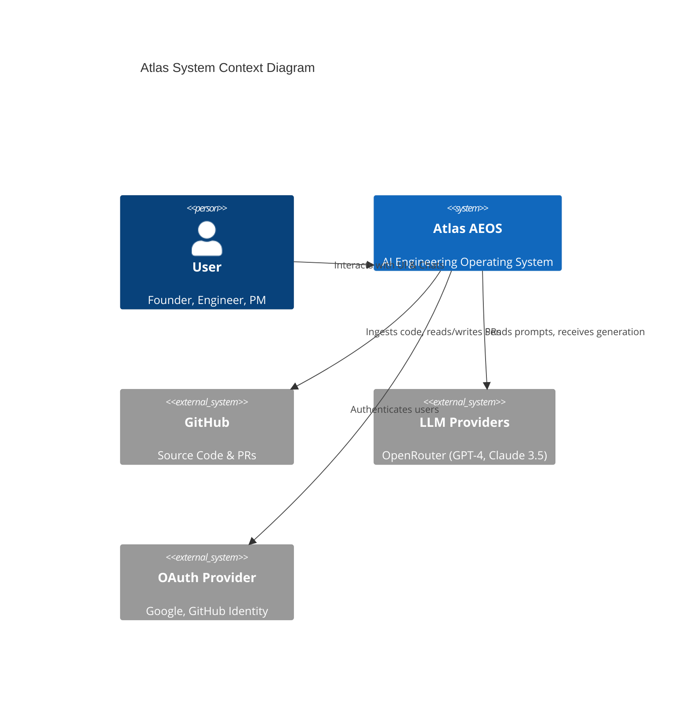
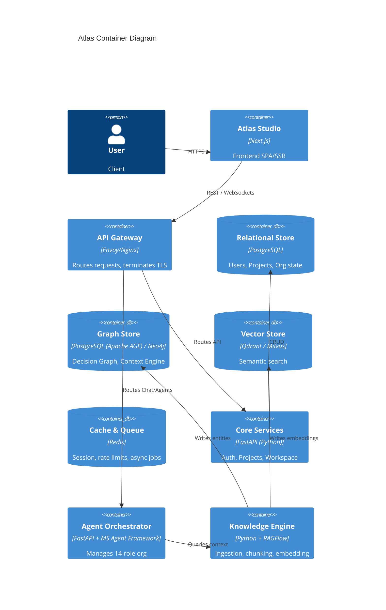
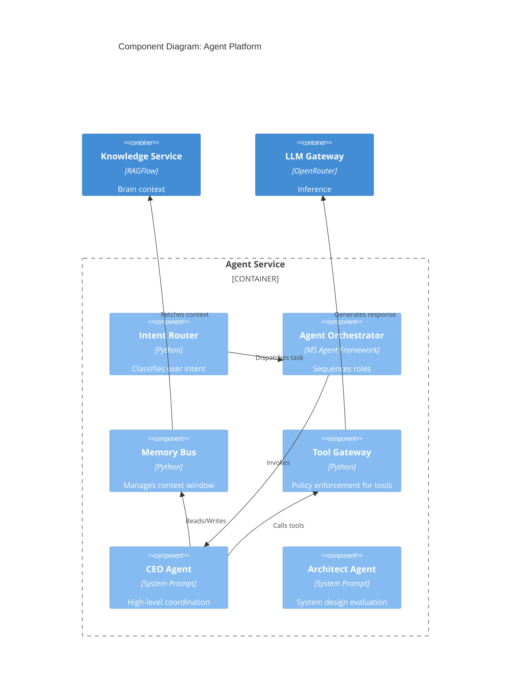
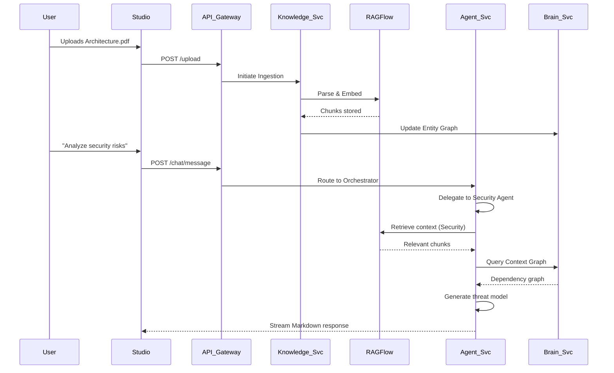

# Atlas System Architecture

| Field | Value |
|---|---|
| **Document Name** | Atlas System Architecture |
| **Version** | 1.0 |
| **Status** | Draft Approved |
| **Product Name** | Atlas |
| **Document Class** | Architecture Blueprint |
| **Owner** | Chief Software Architect |
| **Reviewers** | Principal Distributed Systems Architect, Principal Cloud Architect, Principal AI Infrastructure Engineer, Principal Security Architect |

---

## 1. Executive Summary

This document serves as the canonical implementation blueprint for Atlas Version 1.0. It defines *how* the AI Engineering Operating System is constructed. Moving beyond product requirements (PRD), this architecture specifies the container and component levels of the system, strict service boundaries, data flows, communication protocols, and technology selections. 

Atlas V1 is designed to support multi-tenant organizations, project ingestion, Project Brain construction, and orchestration of a 14-role engineering organization using the Microsoft Agent Framework and RAGFlow.

---

## 2. Architectural Principles

Every technical decision in Atlas V1 must adhere to these foundational principles:

- **Understand before Generate:** The system must strictly separate context-gathering from code generation. Code is never generated statelessly.
- **Event-Driven:** Asynchronous communication (via message brokers) is preferred for long-running tasks (e.g., repository ingestion, agent planning) to ensure system resilience and responsiveness.
- **Platform First:** Capabilities must be exposed as platform primitives (e.g., Knowledge API, Agent API) rather than tightly coupled monolithic features, enabling future composability.
- **Model Agnostic:** The system must not be hardcoded to a specific LLM provider. Abstractions (via OpenRouter) must allow seamless swapping of models based on cost, speed, and reasoning capabilities.
- **API First:** The backend must expose a comprehensive, versioned REST/GraphQL API. The Atlas Studio (Frontend) is merely the first consumer of this API.
- **Security by Design:** Zero-trust principles apply internally. Services must mutually authenticate. Tenant isolation is enforced at the database level (Row Level Security).
- **Human in Control:** No agent in V1 is permitted to execute autonomous actions that mutate external production state without an explicit, recorded human approval step.

---

## 3. C4 Architecture

### Level 1 – System Context

### Level 2 – Container Diagram

### Level 3 – Component Diagram (Agent Platform)

---

## 4. Platform Architecture

Atlas is composed of six distinct platforms, interacting via well-defined API boundaries:

1. **Studio Platform:** The Next.js frontend presentation layer. Renders the Project Workspace, Task Board, and Chat Interfaces. Responsible for client-side state and real-time WebSocket updates.
2. **Brain Platform:** The operational memory of the project. Manages the Graph Store (Decision Graph) and Relational Store (Entity mapping).
3. **Knowledge Platform:** Powered heavily by RAGFlow. Handles document parsing, repository AST extraction, chunking, embedding generation, and vector retrieval.
4. **Runtime Platform:** The Execution Sandbox. Manages isolated Docker containers for running code verifications, tests, and static analysis without risking platform integrity.
5. **Agent Platform:** Powered by Microsoft Agent Framework. Houses the 14 defined roles, the Orchestrator, and the Communication Bus that allows agents to debate and exchange context.
6. **Trust Platform (Governance):** The security and compliance layer. Manages RBAC, Audit Trails, and the Tool Gateway (preventing agents from executing unauthorized actions).

---

## 5. Service Architecture

All services operate as containerized microservices communicating primarily via gRPC/REST internally and Kafka/Redis for asynchronous events.

### API Gateway
- **Purpose:** Single entry point for all frontend traffic.
- **Responsibilities:** TLS termination, rate limiting, request routing, JWT validation.
- **Scaling Strategy:** Horizontally scaled via Kubernetes HPA based on CPU.

### Authentication Service
- **Purpose:** Identity provider.
- **Responsibilities:** OAuth handshakes (GitHub, Google), MFA verification, JWT issuance.
- **Dependencies:** PostgreSQL (Users table).

### Project Service
- **Purpose:** Manages core domain models.
- **Responsibilities:** CRUD for Organizations, Projects, Settings, Integrations.
- **Dependencies:** PostgreSQL.

### Knowledge Service
- **Purpose:** RAG pipeline controller.
- **Responsibilities:** Webhooks from GitHub, document uploads, triggering RAGFlow indexing, managing indexing states.
- **Dependencies:** RAGFlow, PostgreSQL, Vector Store.

### Project Brain Service
- **Purpose:** Interface to the Knowledge and Decision Graphs.
- **Responsibilities:** GraphQL/REST endpoints for querying the architecture canvas, decision history, and dependency trees.
- **Dependencies:** Graph Database, PostgreSQL.

### Agent Service
- **Purpose:** Hosts the AI workforce.
- **Responsibilities:** Maintaining agent sessions, routing messages via MS Agent Framework, maintaining short-term memory.
- **Dependencies:** Project Brain Service, OpenRouter API.

### Runtime Service
- **Purpose:** Code execution environment.
- **Responsibilities:** Spinning up ephemeral sandboxes, executing verification scripts, returning stdout/stderr.
- **Dependencies:** Kubernetes/Docker Daemon.

### Workflow Service
- **Purpose:** Asynchronous state machine.
- **Responsibilities:** Managing long-running workflows (e.g., "Analyze entire repository") using Temporal or Celery.
- **Dependencies:** Redis / Message Queue.

### Search Service
- **Purpose:** Global search across project.
- **Responsibilities:** Hybrid search (Keyword + Semantic) returning unified results.
- **Dependencies:** Vector Store, PostgreSQL.

### Security Service
- **Purpose:** Policy enforcement.
- **Responsibilities:** Verifying agent tool calls against tenant policies, managing ephemeral credentials.
- **Dependencies:** PostgreSQL, HashiCorp Vault.

### Notification Service
- **Purpose:** Outbound user communication.
- **Responsibilities:** Emails, in-app WebSocket alerts, Slack integrations.
- **Dependencies:** Redis (PubSub), SendGrid.

### Audit Service
- **Purpose:** Immutable logging.
- **Responsibilities:** Recording every agent decision and human approval.
- **Dependencies:** Append-only Datastore.

---

## 6. Microsoft Agent Framework Integration

Atlas utilizes the Microsoft Agent Framework to coordinate its 14-role organization.

- **Agent Registration:** Each of the 14 roles is registered as an independent agent class with specific system prompts, memory configurations, and allowed tools.
- **Orchestration:** The CEO Agent acts as the primary orchestrator, taking the user prompt and delegating sub-tasks (e.g., routing a security question to the Security Agent).
- **Message Routing:** Agents communicate via a shared message bus within the framework, allowing the Reviewer Agent to read the output of the Backend Engineer Agent.
- **Tool Invocation:** Tools are registered centrally in the Tool Gateway. When an agent requests a tool (e.g., `query_graph`), the MS framework intercepts it, checks the Security Service policy, and then executes.
- **Human Approval Points:** If an agent attempts an action flagged with `requires_human=true`, the framework pauses execution, emits a WebSocket event to the UI for human approval, and resumes upon signed confirmation.

---

## 7. RAGFlow Integration

Atlas delegates complex document ingestion and semantic processing to RAGFlow.

- **Document Ingestion:** PDFs, Markdown, and TXT files uploaded to Atlas are passed to RAGFlow's ingestion pipeline.
- **Chunking:** RAGFlow handles intelligent chunking (e.g., code-aware chunking for AST parsing vs. semantic chunking for PRDs).
- **Embeddings:** Generated via an embedded or external model (e.g., OpenAI `text-embedding-3-large`) and stored in the Vector Store.
- **Retrieval:** When an agent queries context, Atlas uses RAGFlow's retrieval engine to perform hybrid search (BM25 + Vector) and re-ranking.
- **Search Pipeline:** RAGFlow serves as the underlying engine for the Global Search Service.

---

## 8. Communication Architecture

- **External to API:** RESTful JSON APIs and WebSockets (for chat streaming and progress bars).
- **Service to Service (Synchronous):** gRPC for high-performance internal calls (e.g., Agent Service querying the Brain Service).
- **Service to Service (Asynchronous):** Redis Pub/Sub for real-time events (notifications); Kafka/RabbitMQ for durable job queues (repo ingestion, background reporting).
- **Background Jobs:** Managed via Temporal to ensure stateful workflow execution and robust retries.

---

## 9. Data Flow

### Workflow: Idea to Actionable Insight

---

## 10. Error Handling

- **System Failures:** Handled at the API Gateway with generic 500 errors. Internal services use Temporal for durable workflow retries.
- **Model Failures:** If an LLM endpoint (via OpenRouter) times out or returns a 5xx, the Agent Service implements exponential backoff. If max retries are hit, it falls back to a secondary model family (e.g., GPT-4o -> Claude 3.5 Sonnet).
- **Partial Indexing:** If a repository contains unsupported files or parsing fails, the Knowledge Service flags the specific files in the database, allows the rest of the ingestion to succeed, and notifies the user via the Dashboard.
- **Timeouts:** Long-running queries to the Project Brain are capped at 15 seconds. If exceeded, the agent is instructed to narrow its query.

---

## 11. Scalability

- **Horizontal Scaling:** All FastAPI backend services are strictly stateless, allowing horizontal scaling via Kubernetes HPA based on CPU and memory metrics.
- **Caching:** Redis caches frequent Graph queries (e.g., top-level service boundaries) and user session data.
- **Queues:** Heavy lifting (RAG chunking, git cloning) is pushed to Celery/Temporal background workers.
- **Database Scaling:** PostgreSQL uses connection pooling (PgBouncer). Vector stores are deployed in clustered configurations to handle high concurrent search loads.

---

## 12. Reliability

- **Health Checks:** Every service exposes a `/healthz` and `/readyz` endpoint for Kubernetes liveness/readiness probes.
- **Circuit Breakers:** Implemented on all calls to external LLM providers and GitHub APIs to prevent cascading failures.
- **Graceful Degradation:** If the Agent Service is down, the Studio Platform can still serve read-only dashboards and reports from the PostgreSQL replica.

---

## 13. Security Architecture (High-Level)

- **Authentication:** Strict OIDC implementation. Stateless JWTs with 15-minute expiry and rotating refresh tokens.
- **Authorization:** Enforced at the API Gateway and Service level via RBAC middleware. Agents operate under the authorization scope of the user invoking them.
- **Tenant Isolation:** Postgres employs Row Level Security (RLS) ensuring `tenant_id` is applied to every query. Vector stores partition collections by `project_id`.
- **Secrets:** Stored in HashiCorp Vault. Injected into containers at runtime. Code sandboxes are isolated via gVisor.

---

## 14. Deployment View

Atlas V1 is designed to be cloud-native, initially targeted for AWS or Azure.

- **Orchestration:** Managed Kubernetes (EKS/AKS).
- **Ingress:** NGINX Ingress Controller -> API Gateway.
- **Compute:** Auto-scaling Node Groups for generic services; GPU-enabled Node Groups for local embedding generation if required.
- **Storage:** Managed PostgreSQL (RDS/Azure SQL), Managed Redis (ElastiCache). Object Storage (S3/Blob) for raw uploaded files.
- **CI/CD:** GitHub Actions building Docker containers and pushing to ECR, deployed via ArgoCD.

---

## 15. Technology Decisions

| Technology | Purpose | Rationale / Justification |
|---|---|---|
| **Next.js** | Frontend Studio | Best-in-class React framework, excellent SSR for performance, robust ecosystem for UI components. |
| **FastAPI** | Backend Services | High performance, native async support, auto-generated OpenAPI specs, dominant in AI/Python ecosystems. |
| **Microsoft Agent Framework** | Orchestration | Enterprise-grade agent coordination, proven abstraction over multi-agent debates, superior to bare LangChain for complex state. |
| **RAGFlow** | Knowledge Engine | Out-of-the-box advanced chunking (layout aware) and hybrid search, reducing custom pipeline engineering. |
| **PostgreSQL** | Primary Datastore | Proven reliability. Can handle relational data, JSONB for flexible schemas, and Graph data via extensions (Apache AGE). |
| **Redis** | Caching / PubSub | Industry standard for low-latency session management and asynchronous event bus. |
| **Object Storage (S3)** | File Storage | Infinitely scalable, cheap storage for uploaded documents and raw git clones prior to parsing. |
| **OpenRouter** | LLM Gateway | Prevents vendor lock-in. Allows dynamic routing between OpenAI, Anthropic, and open-source models based on capability and cost. |

---

## 16. Architecture Decision Records

The following ADRs support this architecture (to be fully documented in the `docs/04-architecture-decision-records/` directory):

- **ADR-0003: Use OpenRouter over direct provider APIs.** (Ensures model agnosticism and cost control).
- **ADR-0004: Select Microsoft Agent Framework over AutoGen/CrewAI.** (Prioritizes deterministic enterprise coordination).
- **ADR-0005: Use RAGFlow for ingestion pipeline.** (Accelerates time-to-market for complex document parsing).
- **ADR-0006: Enforce statelessness on all Agent Services.** (Ensures horizontal scalability; state remains in Redis/Postgres).
- **ADR-0007: Implement strict Row Level Security (RLS) in PostgreSQL.** (Foundational requirement for multi-tenant trust).

---

## 17. Engineering Review

### Internal Review Notes

- **Chief Architect:** The service boundaries clearly respect the platform definitions. Using OpenRouter is a critical defensive move against vendor lock-in.
- **Principal Security Architect:** RLS is excellent. We must ensure the Execution Sandbox section (Runtime) is strictly network-isolated; gVisor should be mandated in the deployment spec.
- **Principal AI Infrastructure Engineer:** RAGFlow simplifies our pipeline, but we must monitor its performance on massive repositories. We will need a fallback strategy for repos > 1M LoC.
- **Principal Database Architect:** PostgreSQL handles Relational well, but if the Decision Graph becomes highly interconnected, we may need to migrate the Graph store to Neo4j in V2. For V1, Postgres + Apache AGE or Recursive CTEs is acceptable.

### Implementation Readiness Assessment

- **Architecture:** CLEAR and ACTIONABLE.
- **Boundaries:** DEFINED.
- **Technology Stack:** APPROVED.
- **Readiness:** READY FOR DETAILED DESIGN.

---

**Recommended Next Document:** Database Design
