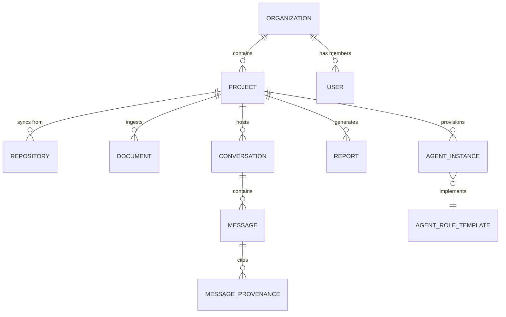

# Engineering Intelligence Core (Database Design)

| Field | Value |
|---|---|
| **Document Name** | Engineering Intelligence Core (Database Design) |
| **Version** | 1.0 |
| **Status** | Draft Approved |
| **Product Name** | Atlas |
| **Document Class** | Architecture Blueprint |
| **Owner** | Principal Database Architect |
| **Reviewers** | Chief Software Architect, Principal AI Infrastructure Engineer |

---

## 1. Executive Summary

This document defines the data foundation of Atlas Version 1—specifically the **Engineering Intelligence Core**, which serves as the physical manifestation of the Project Brain. 

Unlike traditional applications where the database merely stores CRUD state, the Atlas database layer must support complex agentic reasoning, graph traversals over architectural decisions, and semantic similarity searches over massive codebases. This document provides the blueprint for the PostgreSQL relational model, the Vector storage strategy, the Knowledge and Decision Graphs, the memory model, and the hybrid retrieval strategies.

---

## 2. Core Architectural Tenets

1. **Polyglot Persistence:** No single database technology solves all AI engineering needs. We use PostgreSQL for relational integrity, Apache AGE (within Postgres) or Neo4j for graph traversal, and Qdrant/Milvus for vector similarity.
2. **Strict Tenant Isolation:** Multi-tenancy is enforced at the lowest level via Row Level Security (RLS) in Postgres and Tenant/Project partitions in Vector/Graph stores.
3. **Graph Over Text:** While code and documents are parsed into vectors, the *relationships* between a requirement, a decision, and a service are strictly modeled in a Graph to enable deterministic architectural reasoning.
4. **Immutable Audit:** Agent actions, decisions, and knowledge ingestion events are append-only. We track the provenance of every fact.

---

## 3. PostgreSQL Relational Model

The relational store manages the scaffolding of the application: Identity, Access, and State.

### 3.1 Core Entities

- **Organizations:** The top-level billing and access boundary.
- **Users & Roles:** RBAC definitions tying identities to Organizations.
- **Projects:** The boundary of a single Project Brain.
- **Documents & Repositories:** Metadata about ingested sources (GitHub repos, PDFs, PRDs).
- **Conversations & Messages:** The chat history between users and agents.
- **Reports:** Generated artifacts (e.g., Security Threat Models).
- **Agents:** Instance state for the 14-role engineering org within a project.

### 3.2 Entity-Relationship (ER) Diagram



### 3.3 Strict Row Level Security (RLS)
Every table in the relational schema includes a `tenant_id` and `project_id`. PostgreSQL RLS policies enforce that a database session (mapped to an authenticated user or authorized agent token) can only SELECT, INSERT, UPDATE, or DELETE rows where the `tenant_id` matches the session context.

---

## 4. The Project Brain: Knowledge Graph

The Knowledge Graph maps the structural reality of the codebase and project requirements.

### 4.1 Graph Schema (Nodes and Edges)

**Nodes:**
- `Requirement` (Properties: id, title, status, priority)
- `Service` (Properties: id, name, language, framework)
- `Interface` (Properties: id, route, protocol)
- `DataStore` (Properties: id, type, schema_version)
- `Developer` (Properties: id, github_handle)

**Edges (Relationships):**
- `[:IMPLEMENTS]` (Service -> Requirement)
- `[:DEPENDS_ON]` (Service -> Service, Service -> DataStore)
- `[:EXPOSES]` (Service -> Interface)
- `[:OWNS]` (Developer -> Service)

### 4.2 Traversal Example (Cypher)

When the Architect Agent is asked: *"What services depend on the Auth Service, and who owns them?"*

```cypher
MATCH (target:Service {name: 'Auth Service'})<-[:DEPENDS_ON]-(dependent:Service)
MATCH (owner:Developer)-[:OWNS]->(dependent)
RETURN dependent.name, owner.github_handle
```

---

## 5. The Project Brain: Decision Graph

The Decision Graph is a specialized subgraph that records the *why* behind the architecture. 

### 5.1 Decision Schema

**Nodes:**
- `Decision` (Properties: statement, rationale, status, date)
- `Alternative` (Properties: description, trade_offs)
- `Evidence` (Properties: link_to_source)

**Edges:**
- `[:RESOLVES]` (Decision -> Requirement)
- `[:SUPERSEDES]` (Decision -> Decision)
- `[:GOVERNS]` (Decision -> Service)
- `[:REJECTED]` (Decision -> Alternative)

### 5.2 Deterministic Reasoning
By mapping Decisions to Services, the Architect Agent can automatically flag drift when code changes violate a `[:GOVERNS]` edge without an accompanying `[:SUPERSEDES]` decision node.

---

## 6. Vector Storage Strategy

For semantic understanding (e.g., "Find code that handles password resets"), we utilize a distributed Vector Database (Qdrant or Milvus).

### 6.1 Chunking Strategy
- **Code (AST-Aware Chunking):** Code is not chunked arbitrarily by character count. It is parsed into Abstract Syntax Trees (AST). Chunks represent whole functions, classes, or modules to preserve logical boundaries.
- **Documents (Semantic Chunking):** Markdown and PDFs are chunked by headers and paragraphs, retaining document hierarchy metadata.

### 6.2 Embedding Model
- **Primary:** `text-embedding-3-large` (OpenAI) or `voyage-code-2` (for highly specific code embeddings).

### 6.3 Vector Metadata Payload
Every vector includes strict metadata for pre-filtering (critical for multi-tenant security and speed):

```json
{
  "tenant_id": "org_123",
  "project_id": "proj_456",
  "source_type": "github_repo",
  "file_path": "src/auth/login.ts",
  "entity_type": "function",
  "commit_hash": "a1b2c3d"
}
```

---

## 7. Memory Model

Atlas Agents require distinct tiers of memory to function effectively without exhausting LLM context windows.

### 7.1 Short-Term (Session) Memory
- **Storage:** Redis (Ephemeral).
- **Scope:** Bound to a single `conversation_id`.
- **Function:** Stores the recent dialogue turns, current active task, and temporary reasoning scratchpads.

### 7.2 Working (Task) Memory
- **Storage:** PostgreSQL (JSONB payload attached to an Agent Task).
- **Scope:** Bound to a specific agent's execution loop.
- **Function:** Stores the plan, dependencies, and state of an ongoing multi-step workflow.

### 7.3 Long-Term (Institutional) Memory
- **Storage:** Knowledge Graph and Vector Store.
- **Scope:** Bound to the `project_id`.
- **Function:** The immutable, queryable truth of the project (decisions, codebase, ingested documents).

---

## 8. Retrieval Strategy (The Cognition Engine)

When an Agent needs context, it rarely uses a single retrieval method. Atlas utilizes **Hybrid Multi-Step Retrieval**.

1. **Intent Classification:** The Agent formulates a query intent (e.g., "I need architectural dependencies for the Payment API").
2. **Graph Traversal (Deterministic):** Atlas queries the Knowledge Graph to find exact nodes (e.g., the `Payment API` Service node) and its `[:DEPENDS_ON]` edges.
3. **Vector Search (Semantic):** Atlas simultaneously queries the Vector Store for semantic matches to "Payment API architectural constraints" in PRDs and ADRs.
4. **Re-ranking (Cross-Encoder):** Results from both Graph and Vector stores are merged, scored for relevance using a lightweight Cross-Encoder model, and top-K results are injected into the Agent's context window.
5. **Provenance Tagging:** Every injected chunk is tagged with its source ID so the Agent can explicitly cite it in its response.

---

## 9. Data Lifecycles and Sync

### 9.1 Repository Synchronization
- **Trigger:** Webhook from GitHub on `push` to `main`.
- **Action:** 
  1. Identify changed files.
  2. Parse updated AST.
  3. Generate new vectors; mark old vectors as `stale`.
  4. Update Knowledge Graph edges based on new dependencies.
  5. Fire event to Architect Agent to evaluate drift.

### 9.2 Data Deletion (Compliance)
- When a project is deleted, all relational data, Graph nodes, and Vector embeddings tied to that `project_id` are hard-deleted.
- Deletions are cascaded via strict foreign keys and API coordination.

---

## 10. Engineering Review

### Internal Review Notes

- **Principal Database Architect:** Combining Graph and Vector is ambitious but absolutely necessary for the "judgment" capabilities described in the PRD. Qdrant handles payload-based filtering extremely efficiently, which covers our multi-tenant boundary needs in the vector space.
- **Chief Software Architect:** The AST-aware chunking is a critical differentiator. We must ensure the parsing library supports all target languages for V1 (e.g., TypeScript, Python, Go).
- **Principal AI Infrastructure Engineer:** The Hybrid Multi-Step Retrieval will require careful tuning. We should implement telemetry immediately to measure the latency of the Cross-Encoder re-ranking phase.

### Implementation Readiness Assessment

- **Data Models:** DEFINED.
- **Storage Strategy:** DEFINED.
- **Retrieval Pipeline:** DEFINED.
- **Readiness:** READY FOR AGENT SPECIFICATIONS.

---

**Recommended Next Document:** Agent Specifications
