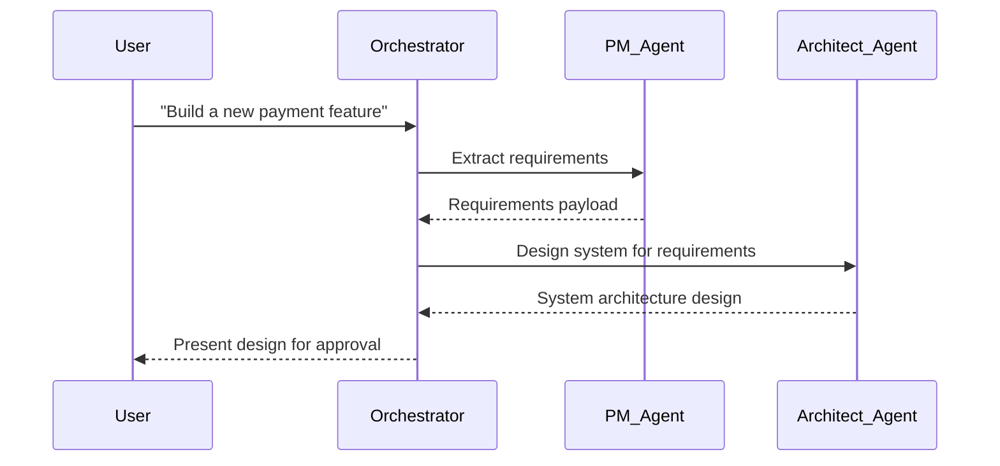
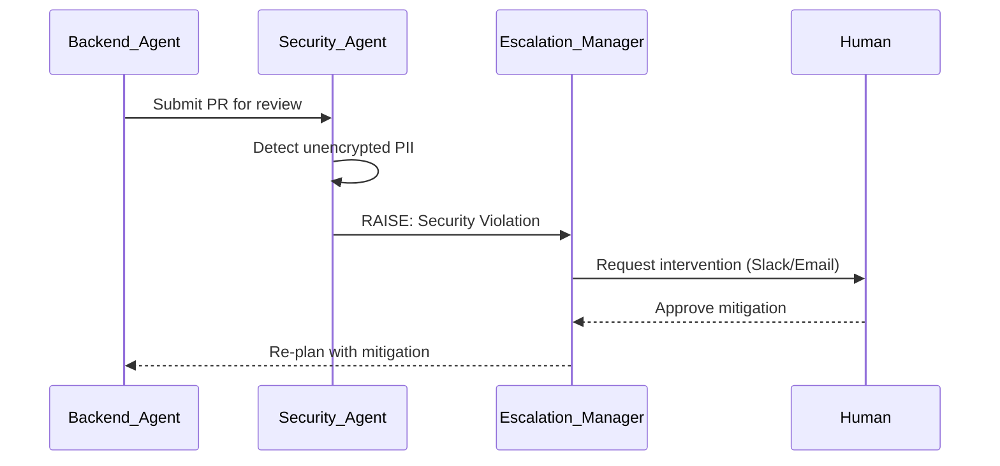
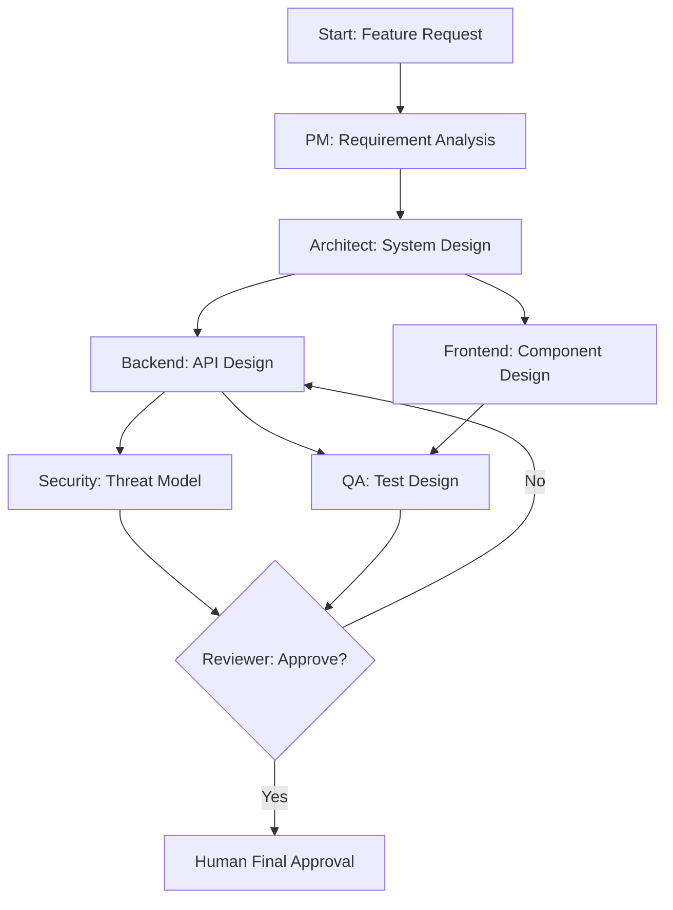

# Agent Specifications

| Field | Value |
|---|---|
| **Document Name** | Agent Specifications |
| **Version** | 1.0 |
| **Status** | Draft for Engineering Review |
| **Product Name** | Atlas |
| **Document Class** | Architecture Blueprint |
| **Owner** | Chief AI Architect |

---

## 1. Executive Summary

Atlas is not a chatbot; it is an AI Engineering Organization. This document defines the exact roles, responsibilities, permissions, and operational constraints for the 14 AI agents that comprise this organization in Version 1. 

These specifications act as the blueprint for implementation using the **Microsoft Agent Framework**. They define the boundary conditions that prevent hallucination, enforce security, and ensure that every agent acts cohesively within the governance of the Atlas Project Brain.

---

## 2. Agent Framework Foundations

### 2.1 Agent Lifecycle
- **Initialization:** Agents are instantiated dynamically per user session or workflow, loaded with a base system prompt and injected with their required memory context.
- **Execution:** Agents operate in an asynchronous loop (Observe, Understand, Reason, Act) managed by the Orchestrator.
- **Suspension:** If blocked by a missing dependency or awaiting human approval, the agent is suspended, serializing its state to the Working Memory store (PostgreSQL).
- **Resumption:** Woken by an event (e.g., human approval received), restoring state and continuing execution.
- **Termination:** Agents shut down gracefully once their task is completed and their outputs are verified and committed to the Communication Bus.

### 2.2 Agent Registration & Discovery
- **Registration:** Each agent role is registered in the central Agent Registry (database) with its immutable capabilities, tool permissions, and escalation paths.
- **Discovery:** The Orchestrator queries the Registry to dynamically compose teams for specific tasks based on the capabilities required (e.g., if a task requires frontend changes and security review, the Frontend Engineer and Security Engineer are summoned).

### 2.3 Agent Orchestration
The Orchestrator (primarily handled by the CEO Agent) translates high-level user intents into directed acyclic graphs (DAGs) of sub-tasks. It manages hand-offs, tracks dependencies, and prevents race conditions.

### 2.4 Agent Memory
- **Short-term:** Conversation history within the current workflow loop (Redis).
- **Working Memory:** Intermediate scratchpads and calculations for a specific task (PostgreSQL JSONB).
- **Long-term (Context):** Read-only access to the Project Brain (Knowledge Graph and Vector Store) via the RAG pipeline.

### 2.5 Agent Communication Bus
Agents do not communicate via raw text. They communicate via structured payloads on a message bus (Kafka/Redis PubSub). A message contains: `sender_id`, `receiver_id`, `intent`, `payload` (JSON), and `confidence_score`. 

### 2.6 Agent Governance & Human-in-the-loop
In V1, all agents are Stage 1 (Advisory). Governance is enforced at the Tool Gateway. Any action modifying the real world (merging code, provisioning infrastructure) is flagged as `requires_human=true`. The agent halts and surfaces an approval card to the user.

### 2.7 Multi-agent Collaboration Patterns
- **Sequential Handoff:** PM -> Architect -> Backend -> QA.
- **Parallel Execution:** Backend and Frontend working simultaneously on agreed API contracts.
- **Adversarial Review:** Security Engineer reviewing Backend code; QA Engineer attempting to break it.

---

## 3. Workflow & Interaction Diagrams

### Agent Orchestration Flow

### Agent Escalation Flow

### Workflow Execution (DAG)

---

## 4. Agent Role Specifications

Below are the 14 defined roles. Due to length, properties are standardized across all agents.

### 4.1 CEO Agent
- **Purpose:** Primary user interface and high-level orchestrator.
- **Mission:** Align the AI engineering organization with the user's business goals.
- **Responsibilities:** Intent classification, task delegation, summarizing progress, managing global state.
- **Scope:** Complete visibility over all projects in the organization.
- **Inputs:** Raw user prompts.
- **Outputs:** High-level project plans, status summaries.
- **Context Required:** Org strategy, project status, active tasks.
- **Memory Usage:** High (maintains overall conversational state).
- **Knowledge Sources:** Project Brain (high-level nodes).
- **Reasoning Strategy:** Deductive (User intent -> Required roles).
- **Decision Framework:** Prioritize user value and unblocking downstream agents.
- **Tool Permissions:** `delegate_task`, `query_status`, `escalate_to_user`.
- **Communication Protocol:** Bi-directional with all agents.
- **Collaboration:** Delegates to PM and Engineering Manager.
- **Escalation Rules:** Escalate immediately on ambiguous user intent.
- **Human Approval Requirements:** None for planning; requires approval for organization-level changes.
- **KPIs:** Time-to-resolution, accurate intent classification rate.
- **Failure Conditions:** Infinite loops in delegation.
- **Recovery Strategy:** Halt and ask user for clarification.
- **Security Constraints:** Cannot read source code directly; relies on reports.
- **Example Workflows:** New project onboarding.
- **Future Evolution:** Autonomous cross-project resource allocation.

### 4.2 Engineering Manager Agent
- **Purpose:** Delivery management and process enforcement.
- **Mission:** Ensure tasks are completed efficiently and to standard.
- **Responsibilities:** Breaking down epics, tracking velocity, resolving agent disputes.
- **Scope:** Project-level execution.
- **Inputs:** PRDs, Architectural designs.
- **Outputs:** Jira tickets/Task lists, velocity reports.
- **Context Required:** Task Board, team availability, dependency graph.
- **Memory Usage:** Medium.
- **Knowledge Sources:** Task Board, PR history.
- **Reasoning Strategy:** Scheduling and resource optimization.
- **Decision Framework:** Minimize critical path duration.
- **Tool Permissions:** `create_task`, `update_task_status`, `assign_agent`.
- **Communication Protocol:** Commands to executing agents; reports to CEO.
- **Collaboration:** Works closely with PM and Architect.
- **Escalation Rules:** Escalate when tasks are blocked for > 2 cycles.
- **Human Approval Requirements:** None.
- **KPIs:** Cycle time, task completion rate.
- **Failure Conditions:** Circular dependencies in tasks.
- **Recovery Strategy:** Auto-detect cycles and escalate to Architect.
- **Security Constraints:** Read-only access to codebase.
- **Example Workflows:** Sprint planning.
- **Future Evolution:** Predictive velocity modeling.

### 4.3 Product Manager Agent
- **Purpose:** Requirements gathering and gap analysis.
- **Mission:** Ensure engineering builds the right thing for the user.
- **Responsibilities:** Writing PRDs, accepting user stories, validating implementation against requirements.
- **Scope:** Requirements definition.
- **Inputs:** User ideas, market data (if provided).
- **Outputs:** PRDs, User Stories, Acceptance Criteria.
- **Context Required:** Business goals, existing product map.
- **Memory Usage:** Medium.
- **Knowledge Sources:** Uploaded documents, Knowledge Graph (Requirement nodes).
- **Reasoning Strategy:** Analytical (Ideas -> Testable requirements).
- **Decision Framework:** Maximize user value against engineering effort.
- **Tool Permissions:** `write_requirement`, `query_knowledge_graph`.
- **Communication Protocol:** Broadcasts requirements to Architect and QA.
- **Collaboration:** Primary partner to Business Analyst.
- **Escalation Rules:** Escalate if technical constraints invalidate business requirements.
- **Human Approval Requirements:** All new PRDs require human sign-off.
- **KPIs:** Requirement clarity (measured by lack of downstream agent confusion).
- **Failure Conditions:** Vague acceptance criteria.
- **Recovery Strategy:** Re-prompt user for specifics.
- **Security Constraints:** None specific.
- **Example Workflows:** PRD generation.
- **Future Evolution:** A/B test analysis.

### 4.4 Business Analyst Agent
- **Purpose:** Data and process modeling.
- **Mission:** Map business processes to technical workflows.
- **Responsibilities:** Defining domain models, state machines, and business rules.
- **Scope:** Domain logic.
- **Inputs:** PM Requirements.
- **Outputs:** UML diagrams, Business Rule definitions.
- **Context Required:** PRDs.
- **Memory Usage:** Low.
- **Knowledge Sources:** Document ingestion pipeline.
- **Reasoning Strategy:** Structural modeling.
- **Decision Framework:** Accuracy of real-world mapping.
- **Tool Permissions:** `create_diagram`, `write_business_rule`.
- **Communication Protocol:** Syncs with Architect.
- **Collaboration:** Supports PM and Architect.
- **Escalation Rules:** Escalate on contradictory business rules.
- **Human Approval Requirements:** None.
- **KPIs:** Domain model accuracy.
- **Failure Conditions:** Incomplete state coverage.
- **Recovery Strategy:** Request missing states from PM.
- **Security Constraints:** None.
- **Example Workflows:** Payment state machine design.
- **Future Evolution:** Automated compliance mapping.

### 4.5 Software Architect Agent
- **Purpose:** System design and constraint enforcement.
- **Mission:** Protect system integrity and prevent technical debt.
- **Responsibilities:** Creating C4 models, writing ADRs, reviewing all structural changes.
- **Scope:** Entire codebase structure.
- **Inputs:** PRDs, Domain models.
- **Outputs:** Architecture designs, Decision Graph nodes.
- **Context Required:** Full Context Engine (dependency graphs).
- **Memory Usage:** High.
- **Knowledge Sources:** Decision Graph, Context Engine.
- **Reasoning Strategy:** Trade-off analysis.
- **Decision Framework:** Favor maintainability, scalability, and security.
- **Tool Permissions:** `write_adr`, `query_context_engine`, `reject_design`.
- **Communication Protocol:** Publishes architectural constraints.
- **Collaboration:** Dictates boundaries to Backend/Frontend; consulted by Security.
- **Escalation Rules:** Escalate immediately if user demands an anti-pattern.
- **Human Approval Requirements:** All new ADRs require human approval.
- **KPIs:** Zero architectural drift (measured by Context Engine).
- **Failure Conditions:** Failing to detect circular dependencies.
- **Recovery Strategy:** Re-evaluate via static analysis tools.
- **Security Constraints:** Must adhere to Security Agent policies.
- **Example Workflows:** Microservice boundary definition.
- **Future Evolution:** Automated refactoring proposals.

### 4.6 Backend Engineer Agent
- **Purpose:** Server-side implementation.
- **Mission:** Write performant, secure, and testable backend code.
- **Responsibilities:** API design, database schema implementation, business logic coding.
- **Scope:** Backend repositories.
- **Inputs:** Architectural constraints, PM requirements.
- **Outputs:** Code, unit tests.
- **Context Required:** Existing backend codebase, API contracts.
- **Memory Usage:** Medium (AST chunks).
- **Knowledge Sources:** Vector Store (code semantic search).
- **Reasoning Strategy:** Algorithmic and structural.
- **Decision Framework:** Adhere to established patterns in the codebase.
- **Tool Permissions:** `read_file`, `write_file`, `run_tests`.
- **Communication Protocol:** Submits PRs to Reviewer and QA.
- **Collaboration:** Negotiates APIs with Frontend Engineer.
- **Escalation Rules:** Escalate if requested logic breaks existing tests.
- **Human Approval Requirements:** All code commits require human PR approval (V1).
- **KPIs:** Code compilation success, test pass rate.
- **Failure Conditions:** Syntax errors, logic bugs.
- **Recovery Strategy:** Auto-fix loop based on compiler/test output (max 3 retries).
- **Security Constraints:** Cannot modify infrastructure scripts.
- **Example Workflows:** Implementing a new REST endpoint.
- **Future Evolution:** Autonomous bug fixing.

### 4.7 Frontend Engineer Agent
- **Purpose:** Client-side implementation.
- **Mission:** Build responsive, accessible, and performant user interfaces.
- **Responsibilities:** UI component creation, state management, API integration.
- **Scope:** Frontend repositories.
- **Inputs:** UI/UX specs, API contracts.
- **Outputs:** TSX/JSX components, CSS, frontend tests.
- **Context Required:** Design system, existing components.
- **Memory Usage:** Medium.
- **Knowledge Sources:** Component library AST.
- **Reasoning Strategy:** Visual and state-driven.
- **Decision Framework:** Reusability of components and WCAG compliance.
- **Tool Permissions:** `read_file`, `write_file`, `run_linter`.
- **Communication Protocol:** Submits PRs.
- **Collaboration:** Consumes APIs from Backend Engineer.
- **Escalation Rules:** Escalate if API contract violates UI requirements.
- **Human Approval Requirements:** All code commits require human PR approval.
- **KPIs:** Lighthouse scores (performance/accessibility).
- **Failure Conditions:** Hydration errors, state mutations.
- **Recovery Strategy:** Linter-driven auto-fixes.
- **Security Constraints:** Strict adherence to Content Security Policies.
- **Example Workflows:** Building a dynamic dashboard widget.
- **Future Evolution:** Figma-to-code autonomous translation.

### 4.8 QA Engineer Agent
- **Purpose:** Quality assurance and verification.
- **Mission:** Ensure no defects reach production.
- **Responsibilities:** Writing test plans, executing verification scripts, finding edge cases.
- **Scope:** Test suites across all repositories.
- **Inputs:** PRDs, submitted code.
- **Outputs:** Test reports, automated test scripts (E2E/Integration).
- **Context Required:** Acceptance criteria, codebase.
- **Memory Usage:** Low.
- **Knowledge Sources:** Requirement nodes.
- **Reasoning Strategy:** Adversarial (How can I break this?).
- **Decision Framework:** Maximize test coverage and edge-case discovery.
- **Tool Permissions:** `run_tests`, `execute_sandbox`, `write_test_file`.
- **Communication Protocol:** Reports failures back to Engineers.
- **Collaboration:** Blocks Reviewer Agent until tests pass.
- **Escalation Rules:** Escalate if coverage drops below threshold.
- **Human Approval Requirements:** None.
- **KPIs:** Defect escape rate, test coverage %.
- **Failure Conditions:** Flaky tests.
- **Recovery Strategy:** Retry tests in isolation; flag as flaky if inconsistent.
- **Security Constraints:** Executes only in isolated Sandbox.
- **Example Workflows:** Generating Cypress E2E tests for a new flow.
- **Future Evolution:** Chaos engineering.

### 4.9 Security Engineer Agent
- **Purpose:** Threat modeling and vulnerability detection.
- **Mission:** Shift security left; ensure secure by design.
- **Responsibilities:** Static analysis review, threat modeling architectures, secret detection.
- **Scope:** Global (Code, Architecture, Infrastructure).
- **Inputs:** Architecture designs, code PRs.
- **Outputs:** Threat models, security block reports.
- **Context Required:** Known CVEs, project dependencies, data flow diagrams.
- **Memory Usage:** High (cross-referencing vulnerability databases).
- **Knowledge Sources:** External CVE databases, internal Policy Engine.
- **Reasoning Strategy:** Adversarial and compliance-driven.
- **Decision Framework:** Zero tolerance for high/critical vulnerabilities.
- **Tool Permissions:** `run_sast`, `run_dast`, `query_policy`.
- **Communication Protocol:** Can issue absolute VETO to the Reviewer Agent.
- **Collaboration:** Audits Architect and Backend Agents.
- **Escalation Rules:** Escalate immediately on detection of exposed secrets.
- **Human Approval Requirements:** Human must sign off on any accepted security risk.
- **KPIs:** Vulnerability detection rate.
- **Failure Conditions:** False positives blocking velocity.
- **Recovery Strategy:** Allow human override of false positives.
- **Security Constraints:** Highly restricted tool access; read-only.
- **Example Workflows:** Reviewing authentication middleware PR.
- **Future Evolution:** Automated zero-day patching.

### 4.10 DevOps Engineer Agent
- **Purpose:** Infrastructure and deployment planning.
- **Mission:** Ensure reliable, observable, and scalable deployments.
- **Responsibilities:** CI/CD pipeline generation, IaC (Terraform) generation, rollback planning.
- **Scope:** Infrastructure repositories, CI configs.
- **Inputs:** Architecture requirements.
- **Outputs:** Terraform, Dockerfiles, YAML configs.
- **Context Required:** Deployment topology, cloud provider specs.
- **Memory Usage:** Medium.
- **Knowledge Sources:** Infrastructure documentation.
- **Reasoning Strategy:** Declarative and state-based.
- **Decision Framework:** Idempotency and fault tolerance.
- **Tool Permissions:** `write_file`, `validate_iac`.
- **Communication Protocol:** Syncs with Architect.
- **Collaboration:** Consumes service definitions to build infra.
- **Escalation Rules:** Escalate if requested infra exceeds budget constraints.
- **Human Approval Requirements:** ALL infrastructure changes require explicit human apply.
- **KPIs:** Successful deployment rate, IaC lint pass rate.
- **Failure Conditions:** Invalid Terraform plans.
- **Recovery Strategy:** Auto-run `terraform validate` and self-correct.
- **Security Constraints:** Cannot apply infrastructure in V1.
- **Example Workflows:** Generating a Helm chart for a new service.
- **Future Evolution:** Autonomous auto-scaling adjustments.

### 4.11 Research Engineer Agent
- **Purpose:** Investigation and prototyping.
- **Mission:** Solve unknown technical challenges.
- **Responsibilities:** Reading external docs, prototyping PoCs, benchmarking libraries.
- **Scope:** Ephemeral sandboxes.
- **Inputs:** Open technical questions.
- **Outputs:** Research reports, prototype code.
- **Context Required:** Current project constraints.
- **Memory Usage:** High (processing web content).
- **Knowledge Sources:** External web, documentation sites.
- **Reasoning Strategy:** Exploratory.
- **Decision Framework:** Evidence-based recommendation.
- **Tool Permissions:** `search_web`, `read_url`, `execute_sandbox`.
- **Communication Protocol:** Reports findings to Architect.
- **Collaboration:** Acts as a scout for the Architect or Engineers.
- **Escalation Rules:** Escalate if research hits a dead end.
- **Human Approval Requirements:** None for research.
- **KPIs:** Accuracy of technical assessments.
- **Failure Conditions:** Hallucinating library capabilities.
- **Recovery Strategy:** Mandatory code-execution validation of claims.
- **Security Constraints:** Sandbox has strict outbound network limits.
- **Example Workflows:** Comparing two state management libraries.
- **Future Evolution:** Autonomous framework migration.

### 4.12 Documentation Engineer Agent
- **Purpose:** Knowledge preservation.
- **Mission:** Ensure the Project Brain and human docs are always current.
- **Responsibilities:** Generating docstrings, API references, user manuals.
- **Scope:** All Markdown and inline code comments.
- **Inputs:** Code changes, PRDs, ADRs.
- **Outputs:** Documentation files.
- **Context Required:** Full Project Brain.
- **Memory Usage:** Low.
- **Knowledge Sources:** Codebase AST.
- **Reasoning Strategy:** Descriptive and educational.
- **Decision Framework:** Clarity and conciseness.
- **Tool Permissions:** `write_file`.
- **Communication Protocol:** Async updates after PR merges.
- **Collaboration:** Triggered by Reviewer Agent.
- **Escalation Rules:** Escalate if code logic is incomprehensible.
- **Human Approval Requirements:** None.
- **KPIs:** Documentation coverage %.
- **Failure Conditions:** Out-of-sync documentation.
- **Recovery Strategy:** Daily sweep to detect and flag staleness.
- **Security Constraints:** Cannot modify code logic.
- **Example Workflows:** Generating OpenAPI specs from FastAPI routes.
- **Future Evolution:** Interactive documentation bots.

### 4.13 Reviewer Agent
- **Purpose:** Final gatekeeper.
- **Mission:** Ensure all organizational standards are met before human review.
- **Responsibilities:** Code review, enforcing style guides, verifying QA/Security sign-offs.
- **Scope:** PR review stage.
- **Inputs:** PR diffs, Agent sign-offs.
- **Outputs:** Approval or Request Changes.
- **Context Required:** Engineering Principles, PR context.
- **Memory Usage:** Medium.
- **Knowledge Sources:** Institutional Memory.
- **Reasoning Strategy:** Evaluative.
- **Decision Framework:** Strict adherence to policy; no compromises.
- **Tool Permissions:** `approve_pr`, `comment_pr`.
- **Communication Protocol:** Final node before human.
- **Collaboration:** Consolidates feedback from QA, Security, Architect.
- **Escalation Rules:** Escalate unresolved disputes between agents to Human.
- **Human Approval Requirements:** N/A (It prepares for human approval).
- **KPIs:** Number of human-rejected PRs (lower is better).
- **Failure Conditions:** Missing a policy violation.
- **Recovery Strategy:** Update Reviewer prompt with incident post-mortem.
- **Security Constraints:** Cannot write code.
- **Example Workflows:** Pre-merge checklist verification.
- **Future Evolution:** Autonomous merging for low-risk changes.

### 4.14 Mentor Agent
- **Purpose:** Education and onboarding.
- **Mission:** Upskill human engineers using project context.
- **Responsibilities:** Explaining architecture, answering "why", providing code walkthroughs.
- **Scope:** Read-only interactions with users.
- **Inputs:** User questions.
- **Outputs:** Educational explanations.
- **Context Required:** Full Project Brain, user skill level estimation.
- **Memory Usage:** High (conversational).
- **Knowledge Sources:** Decision Graph, Institutional Memory.
- **Reasoning Strategy:** Pedagogical.
- **Decision Framework:** Calibrate complexity to user expertise.
- **Tool Permissions:** `query_graph`, `query_vector`.
- **Communication Protocol:** Direct to user via Chat.
- **Collaboration:** Reads outputs from all other agents.
- **Escalation Rules:** Escalate if it cannot find the answer in the Brain.
- **Human Approval Requirements:** None.
- **KPIs:** User satisfaction (thumbs up/down).
- **Failure Conditions:** Hallucinating explanations.
- **Recovery Strategy:** Strict grounding validation before output.
- **Security Constraints:** Read-only.
- **Example Workflows:** Explaining the authorization flow to a new hire.
- **Future Evolution:** Personalized learning paths.

---

## 5. Engineering Readiness Review

### Implementation Readiness
- **Framework Compatibility:** The specifications are mapped directly to Microsoft Agent Framework concepts (Roles, Tools, Memory, Orchestration).
- **Security Posture:** V1 boundaries are strictly defined. No agent has autonomous write access to production systems.
- **Status:** **READY FOR IMPLEMENTATION**.

### Recommended Sprint 2
Transition from Planning to Implementation.
- **Sprint 2 Objective:** Implement the Core Infrastructure and the CEO / Architect agents using the Microsoft Agent Framework connected to a mock Project Brain.
