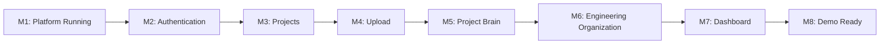
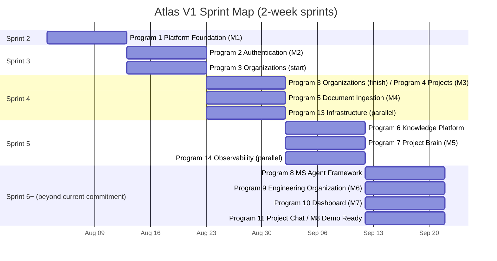
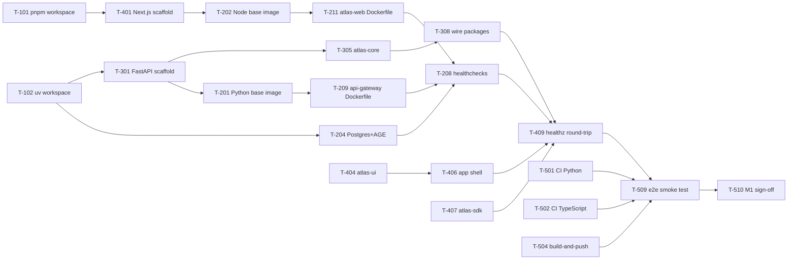
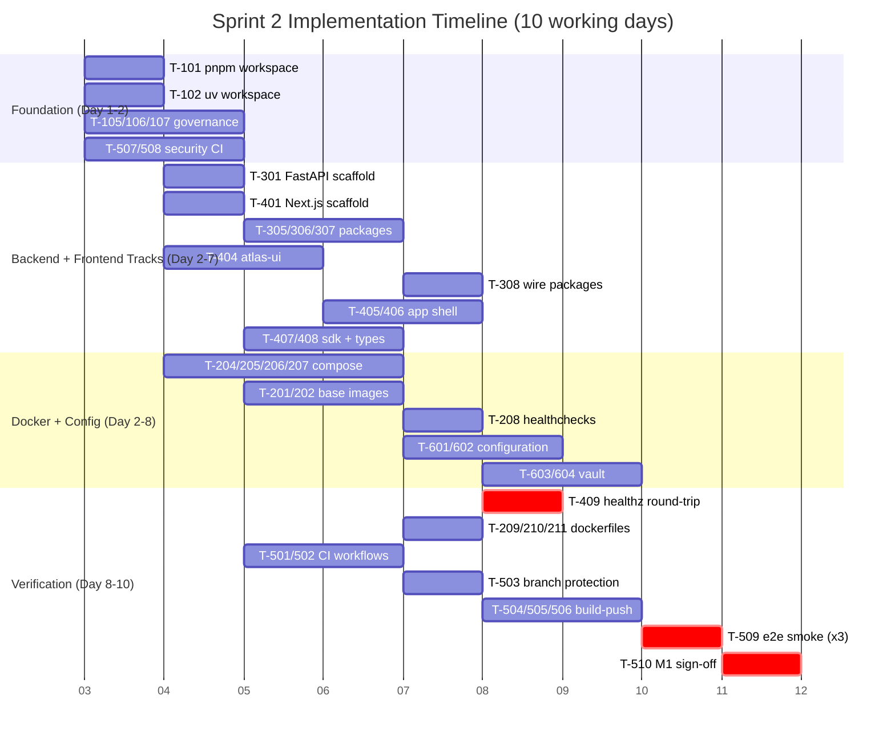

# Atlas Sprint 2 Implementation Backlog

## Version 1.0 — Master Execution Plan

| Field                                                | Value                                                                                                                                                                                                                                                                                                                                                                                                                                                                                                                                                                                                                                                                                                       |
| ---------------------------------------------------- | ----------------------------------------------------------------------------------------------------------------------------------------------------------------------------------------------------------------------------------------------------------------------------------------------------------------------------------------------------------------------------------------------------------------------------------------------------------------------------------------------------------------------------------------------------------------------------------------------------------------------------------------------------------------------------------------------------------- |
| **Document Class**                             | Engineering Execution Plan                                                                                                                                                                                                                                                                                                                                                                                                                                                                                                                                                                                                                                                                                  |
| **Status**                                     | Active — Sprint 2 In Planning                                                                                                                                                                                                                                                                                                                                                                                                                                                                                                                                                                                                                                                                              |
| **Mode**                                       | Engineering Program Management (not design)                                                                                                                                                                                                                                                                                                                                                                                                                                                                                                                                                                                                                                                                 |
| **Owner**                                      | VP Engineering / Principal Engineering Manager                                                                                                                                                                                                                                                                                                                                                                                                                                                                                                                                                                                                                                                              |
| **Reviewers**                                  | CTO · Principal Architect · Engineering Manager · QA Lead · Security Architect                                                                                                                                                                                                                                                                                                                                                                                                                                                                                                                                                                                                                          |
| **Frozen inputs (read-only, never rewritten)** | [ATLAS_CONSTITUTION.md](../../00-company/ATLAS_CONSTITUTION.md) · [Company Bible](../../00-company/COMPANY_BIBLE.md) · [Product Vision](../../01-product/PRODUCT_VISION.md) · [Product Map](../../01-product/PRODUCT_MAP.md) · [Atlas Reference Architecture](../../../Sprint-1/01-atlas-reference-architecture/README.md) · [Product Strategy](../../../Sprint-1/02-product-strategy/README.md) · [Product Requirements Document](../../../Sprint-1/03-product-requirements-document/README.md) · [System Architecture](../Sprint-1/05-system-architecture/README.md) · Engineering Intelligence Core (Reference Architecture §4) · [Agent Specifications](../Sprint-1/07-agent-specifications/README.md) |

> [!IMPORTANT]
> This document does not redefine architecture, does not restate strategy, and does not reopen any decision recorded in the frozen inputs above. Every objective, service name, and technology reference below is taken directly from those documents and from the actual repository scaffold. Where this document makes a scoping judgment (what fits in Sprint 2 versus a later sprint), that judgment is stated explicitly with its reasoning, consistent with the Constitution's requirement that authority is earned through evidence, not asserted.

---

## 0. How to Read This Backlog

This backlog follows the mandated hierarchy: **Portfolio → Programs → Epics → Features → User Stories → Engineering Tasks → Subtasks**. It applies **progressive elaboration**, a standard agile practice also consistent with the Constitution's principle that simplicity is earned through understanding, not declared in advance:

- All **15 Programs** are defined at Portfolio level (Objectives, Business Value, Dependencies, Success Criteria, Milestones, Risks) with their Epics named — Section 2. This is the complete map of Atlas V1 engineering work.
- Only **Program 1 (Platform Foundation)** — the committed scope of Sprint 2 — is decomposed all the way to atomic Engineering Tasks and Subtasks with full metadata — Section 6.
- Programs 2–15 will each receive the same atomic decomposition **one sprint ahead of their execution window** (Section 4), following the identical template established in Section 6, so no engineer ever begins work without an equivalently detailed backlog.

> [!NOTE]
> Decomposing all 15 programs to atomic task level today would produce approximately 800–1,000 engineering tasks defined against a codebase that does not exist yet, most of which would be revised or discarded once Sprint 2's actual platform decisions land. That is speculative planning, not execution readiness. It is rejected for the same reason the Product Map rejects speculative architecture.

---

## 1. Portfolio Overview

**Portfolio:** Atlas Version 1 ("Grounded Generation" — Product Map §10.1)

**Portfolio capability threshold (from the Product Requirements Document, frozen):** Construct a single-project Project Brain, ground code generation in it, and demonstrate measurably fewer reversed decisions and post-merge defects than ungrounded generation — with all 14 Engineering Organization agent roles operating at Maturity Stage 1 (Advisory) only, per the Agent Specifications.

**Portfolio-to-Sprint-2 relationship.** Sprint 2 is the first implementation sprint following Sprint 0 (repository setup) and Sprint 1 (complete design package, now frozen). Sprint 2's committed exit condition is **M1: Platform Running**. This document is the complete, atomic backlog for that commitment, plus the full program-level map for everything that follows it.

---

## 2. Program Portfolio (All 15 Programs)

Each program below lists its Epics using the real repository scaffold (`services/`, `apps/`, `packages/`, `agents/`, `integrations/`, `infrastructure/`) so that no program references a service, package, or app that does not already exist as a named directory.

### Program 1 — Platform Foundation

| Field                      | Detail                                                                                                                                                                                     |
| -------------------------- | ------------------------------------------------------------------------------------------------------------------------------------------------------------------------------------------ |
| **Objectives**       | Stand up the monorepo tooling, containerization, backend/frontend skeletons, CI/CD, and configuration strategy that every other program builds on.                                         |
| **Business Value**   | Zero customer-facing value directly; it is the multiplier on every subsequent program's velocity. Without it, every later program re-solves the same infrastructure problem independently. |
| **Dependencies**     | None — this is the root of the dependency graph (Section 9).                                                                                                                              |
| **Success Criteria** | `docker compose up` boots the full local stack; CI is green on `main`; one API round-trip from `atlas-web` to `api-gateway` succeeds in every environment (local, CI, staging).    |
| **Milestone**        | M1 — Platform Running                                                                                                                                                                     |
| **Risks**            | Tooling choices (uv, Turborepo) unfamiliar to some engineers; Docker Desktop resource limits on contributor laptops; scope creep into Program 2 work before M1 exit is confirmed.          |
| **Epics**            | Repository · Docker · FastAPI · Next.js · CI/CD · Configuration                                                                                                                       |

### Program 2 — Authentication

| Field                      | Detail                                                                                                                                                                                                     |
| -------------------------- | ---------------------------------------------------------------------------------------------------------------------------------------------------------------------------------------------------------- |
| **Objectives**       | Deliver OIDC-based authentication, JWT issuance/refresh, and Row Level Security (RLS) tenant isolation in PostgreSQL.                                                                                      |
| **Business Value**   | No user can safely use Atlas without provable identity and tenant isolation; this is the first line of the Trust Platform (Reference Architecture §9).                                                    |
| **Dependencies**     | Program 1 (Platform Foundation) complete.                                                                                                                                                                  |
| **Success Criteria** | A user can register, log in, receive a 15-minute JWT with rotating refresh token, and cannot query another tenant's data even with a crafted request.                                                      |
| **Milestone**        | M2 — Authentication                                                                                                                                                                                       |
| **Risks**            | RLS policy authoring errors are a security-critical class of bug; OIDC provider selection (self-hosted vs. managed) not yet finalized in System Architecture and must be confirmed before Sprint 3 starts. |
| **Epics**            | Identity Provider Integration · JWT Issuance & Refresh · Row Level Security Enforcement · Session & Account Management                                                                                  |

### Program 3 — Organizations

| Field                      | Detail                                                                                                                                                                                                    |
| -------------------------- | --------------------------------------------------------------------------------------------------------------------------------------------------------------------------------------------------------- |
| **Objectives**       | Implement the`organization-service`: tenant creation, membership, and role assignment (Constitution's requirement that Atlas serve solo founders and enterprises without forcing identical governance). |
| **Business Value**   | Enables multi-seat accounts, which is required before any enterprise or team persona (Product Map §7) can be served.                                                                                     |
| **Dependencies**     | Program 2 (Authentication) — organizations require authenticated identities to attach membership to.                                                                                                     |
| **Success Criteria** | An authenticated user can create an organization, invite a member, assign a role, and see role-scoped access enforced across the API.                                                                     |
| **Milestone**        | M2/M3 boundary                                                                                                                                                                                            |
| **Risks**            | Role model must anticipate Program 9 (Engineering Organization) agent-authority scoping without over-designing for it now.                                                                                |
| **Epics**            | Organization CRUD · Membership & Invitations · Role-Based Access Control                                                                                                                                |

### Program 4 — Projects

| Field                      | Detail                                                                                                                                                                                              |
| -------------------------- | --------------------------------------------------------------------------------------------------------------------------------------------------------------------------------------------------- |
| **Objectives**       | Implement the`project-service`: project creation, ownership, and the container object every other platform (Brain, Agents, Runtime) attaches to.                                                  |
| **Business Value**   | The Project is Atlas's fundamental unit of value delivery — it is the object the Project Brain is built for (Product Map §11).                                                                    |
| **Dependencies**     | Program 3 (Organizations) — a project always belongs to an organization.                                                                                                                           |
| **Success Criteria** | A user can create a project scoped to their organization, see it in the Project Workspace, and archive/delete it with RLS-enforced isolation.                                                       |
| **Milestone**        | M3 — Projects                                                                                                                                                                                      |
| **Risks**            | Premature coupling to Project Brain schema before Program 7 begins; must keep the Project entity minimal per Reference Architecture §1.1 ("do not distribute what can be modular-monolith today"). |
| **Epics**            | Project CRUD · Project Workspace API · Project Health Summary                                                                                                                                     |

### Program 5 — Document Ingestion

| Field                      | Detail                                                                                                                                                                                                  |
| -------------------------- | ------------------------------------------------------------------------------------------------------------------------------------------------------------------------------------------------------- |
| **Objectives**       | Implement the`connector-service` and the ten `integrations/` connectors (GitHub, GitLab, Jira, Confluence, Slack, Notion, Google Drive, OneDrive, Figma, plus RAGFlow as the ingestion engine).     |
| **Business Value**   | This is the Knowledge Ingestion stage of the primary lifecycle workflow (Product Vision §3.1) — no Project Brain can be constructed without it.                                                       |
| **Dependencies**     | Program 4 (Projects) — ingested sources attach to a project.                                                                                                                                           |
| **Success Criteria** | A user can connect a GitHub repository to a project and see ingestion progress and completion status.                                                                                                   |
| **Milestone**        | M4 — Upload                                                                                                                                                                                            |
| **Risks**            | Ten integrations is a large surface; Sprint 4 must sequence GitHub first (highest persona demand) and treat the remainder as parallelizable, independent features rather than a single monolithic epic. |
| **Epics**            | Connector Framework · GitHub Connector · File & Document Upload · Ingestion Status Tracking                                                                                                          |

### Program 6 — Knowledge Platform

| Field                      | Detail                                                                                                                                                                                                    |
| -------------------------- | --------------------------------------------------------------------------------------------------------------------------------------------------------------------------------------------------------- |
| **Objectives**       | Implement the`knowledge-service` and `packages/atlas-rag`, wiring RAGFlow for layout-aware chunking and hybrid BM25+vector retrieval, and the `search-service` for query serving.                   |
| **Business Value**   | Directly implements the Knowledge Intelligence pillar (Product Vision §10.3) — the mechanism that keeps engineering knowledge current and sourced.                                                      |
| **Dependencies**     | Program 5 (Document Ingestion) — there is nothing to index without ingested content.                                                                                                                     |
| **Success Criteria** | A natural-language query against a project's ingested documents returns a sourced, provenance-linked answer through the`search-service`.                                                                |
| **Milestone**        | M5 boundary (feeds Project Brain)                                                                                                                                                                         |
| **Risks**            | RAGFlow operational complexity in a constrained local/staging environment; vector store (Qdrant) partitioning by`project_id` must be verified for tenant isolation before any customer data is indexed. |
| **Epics**            | RAGFlow Integration · Vector Store Partitioning · Hybrid Retrieval API · Knowledge Provenance Tagging                                                                                                  |

### Program 7 — Project Brain

| Field                      | Detail                                                                                                                                                                                                                  |
| -------------------------- | ----------------------------------------------------------------------------------------------------------------------------------------------------------------------------------------------------------------------- |
| **Objectives**       | Implement the`project-brain-service`, `packages/atlas-memory`, and `packages/atlas-graphs` — the Knowledge Graph, Decision Graph, Context Graph, and Engineering Memory described in Product Map §2.1 and §11. |
| **Business Value**   | This is Atlas's central architectural bet (Reference Architecture §1.2): the primary object the rest of the product reasons over.                                                                                      |
| **Dependencies**     | Program 6 (Knowledge Platform) for source material; Program 1's PostgreSQL + Apache AGE setup for graph storage.                                                                                                        |
| **Success Criteria** | A connected repository's entities, relationships, and at least one recorded decision are queryable through the Project Brain API and visible in the Architecture Canvas.                                                |
| **Milestone**        | M5 — Project Brain                                                                                                                                                                                                     |
| **Risks**            | Apache AGE (V1 graph choice) has a smaller operational track record than Neo4j (planned V2 migration per System Architecture); query performance must be validated early, not assumed.                                  |
| **Epics**            | Knowledge Graph Schema & API · Decision Graph Schema & API · Context Engine Reconciliation · Engineering Memory Ingestion                                                                                            |

### Program 8 — Microsoft Agent Framework

| Field                      | Detail                                                                                                                                                                                    |
| -------------------------- | ----------------------------------------------------------------------------------------------------------------------------------------------------------------------------------------- |
| **Objectives**       | Implement the`orchestration-service` on the Microsoft Agent Framework substrate — Agent Registry, Agent Orchestrator, Communication Bus, and Memory Interface (Product Map §2.3).     |
| **Business Value**   | This is the orchestration substrate every one of the fourteen agent roles depends on; without it, Program 9 has no runtime to execute in.                                                 |
| **Dependencies**     | Program 7 (Project Brain) — agents cannot reason without a Memory Interface into it.                                                                                                     |
| **Success Criteria** | A single agent role (Planner) can be invoked through the orchestrator, read from the Project Brain via the Memory Interface, and post a structured finding to the Communication Bus.      |
| **Milestone**        | M6 boundary                                                                                                                                                                               |
| **Risks**            | This is a new, less mature framework choice (ADR-0004) relative to alternatives like AutoGen/CrewAI; the team's operational familiarity is a training risk, not just an integration risk. |
| **Epics**            | Agent Runtime Bootstrap · Agent Registry · Communication Bus · Memory Interface Bridge                                                                                                 |

### Program 9 — Engineering Organization

| Field                      | Detail                                                                                                                                                                                                                                                                                                           |
| -------------------------- | ---------------------------------------------------------------------------------------------------------------------------------------------------------------------------------------------------------------------------------------------------------------------------------------------------------------- |
| **Objectives**       | Implement the fourteen agent roles in`agents/` (CEO, Engineering Manager, Product Manager, Business Analyst, Software Architect, Backend Engineer, Frontend Engineer, QA Engineer, Security Engineer, DevOps Engineer, Research Engineer, Documentation Engineer, Reviewer, Mentor) via the `agent-service`. |
| **Business Value**   | This is Atlas's structural differentiator (Product Vision §12) — multi-role reasoning instead of single-pass generation.                                                                                                                                                                                       |
| **Dependencies**     | Program 8 (Microsoft Agent Framework).                                                                                                                                                                                                                                                                           |
| **Success Criteria** | The worked example in Product Vision §12.3 (bulk export feature request) can be run end-to-end in V1's Advisory mode: every role produces a finding, disagreement is surfaced, and a human approves or rejects the final recommendation.                                                                        |
| **Milestone**        | M6 — Engineering Organization                                                                                                                                                                                                                                                                                   |
| **Risks**            | Largest program in the portfolio by role count; must be sequenced role-by-role (Planner and Architect first) rather than attempted simultaneously.                                                                                                                                                               |
| **Epics**            | Planner & Business Analyst Roles · Architect & Database Roles · Implementation Roles (Backend/Frontend) · Verification Roles (QA/Security/Reviewer) · Operational Roles (DevOps) · Advisory Roles (Mentor/Researcher/PM/EM/CEO)                                                                             |

### Program 10 — Dashboard

| Field                      | Detail                                                                                                                           |
| -------------------------- | -------------------------------------------------------------------------------------------------------------------------------- |
| **Objectives**       | Implement the Analytics Dashboard (Product Map §2.2) in`apps/atlas-web`, backed by the `analytics-service`.                 |
| **Business Value**   | Gives Engineering Managers and Product Managers the visibility promised in Product Map §4 without manual status reporting.      |
| **Dependencies**     | Program 9 (Engineering Organization) for agent-activity metrics; Program 4 (Projects) for project-scoped views.                  |
| **Success Criteria** | A project's Success Metrics (Product Vision §14) render on a live dashboard sourced from real service data, not mock data.      |
| **Milestone**        | M7 — Dashboard                                                                                                                  |
| **Risks**            | Temptation to ship mock/static data to hit the milestone date; explicitly rejected — Section 13 flags this as a review finding. |
| **Epics**            | Metrics Pipeline · Dashboard UI · Cross-Project Rollups (deferred to V2 per Product Map §10.3)                                |

### Program 11 — Project Chat

| Field                      | Detail                                                                                                                                                                      |
| -------------------------- | --------------------------------------------------------------------------------------------------------------------------------------------------------------------------- |
| **Objectives**       | Implement the primary conversational surface in`atlas-web`, connecting a user's natural-language input to the Engineering Organization and Project Brain.                 |
| **Business Value**   | This is the most visible, demo-critical surface — the entry point for the "Idea" stage of the primary lifecycle workflow (Product Vision §3.1).                           |
| **Dependencies**     | Program 9 (Engineering Organization), Program 7 (Project Brain).                                                                                                            |
| **Success Criteria** | A user can type a request, see which agent roles engaged, see their individual findings, and see the final Reviewer/Engineering-Manager recommendation with full rationale. |
| **Milestone**        | M8 boundary                                                                                                                                                                 |
| **Risks**            | Highest UX risk in the portfolio — must not present agent output as more authoritative or certain than its actual confidence, per the Trust Intelligence pillar.           |
| **Epics**            | Chat UI Shell · Streaming Agent Response Rendering · Disagreement & Rationale Display                                                                                     |

### Program 12 — Reports

| Field                      | Detail                                                                                                                                                        |
| -------------------------- | ------------------------------------------------------------------------------------------------------------------------------------------------------------- |
| **Objectives**       | Implement exportable engineering reports (readiness summaries, decision logs, compliance evidence) via the`analytics-service` and `notification-service`. |
| **Business Value**   | Serves the Business Intelligence pillar (Product Vision §10.13) and enterprise compliance reporting needs (Product Map §2.6).                               |
| **Dependencies**     | Program 10 (Dashboard) for the underlying metrics pipeline.                                                                                                   |
| **Success Criteria** | A project's decision history and readiness status can be exported as a shareable report.                                                                      |
| **Milestone**        | Post-M8 (V1.1 candidate if capacity does not permit inclusion before Demo Ready)                                                                              |
| **Risks**            | Lowest-priority program for the Demo Ready milestone; explicitly deferrable without breaking the demo narrative.                                              |
| **Epics**            | Decision Log Export · Readiness Report Generation · Scheduled Report Delivery                                                                               |

### Program 13 — Infrastructure

| Field                      | Detail                                                                                                                                                       |
| -------------------------- | ------------------------------------------------------------------------------------------------------------------------------------------------------------ |
| **Objectives**       | Provision the staging and production environments in`infrastructure/` (Kubernetes manifests, Terraform, Azure/AWS configuration, networking).              |
| **Business Value**   | Without this, nothing built in any other program can run outside a developer's laptop.                                                                       |
| **Dependencies**     | Program 1 (Platform Foundation) provides the container images this program deploys.                                                                          |
| **Success Criteria** | A merge to`main` deploys automatically to a staging Kubernetes namespace with health checks passing.                                                       |
| **Milestone**        | Parallel to M2–M5; must be exit-ready before M8.                                                                                                            |
| **Risks**            | Cloud provider choice (Azure AKS vs. AWS EKS) must be finalized in System Architecture before Terraform modules are written, to avoid dual-maintaining both. |
| **Epics**            | Kubernetes Manifests · Terraform Modules · Staging Environment Provisioning · Secrets & Vault Production Setup                                            |

### Program 14 — Observability

| Field                      | Detail                                                                                                                                     |
| -------------------------- | ------------------------------------------------------------------------------------------------------------------------------------------ |
| **Objectives**       | Implement logs, metrics, and traces across all services, and the`audit-service` for the Governance Audit Trail (Product Map §2.6).      |
| **Business Value**   | Required for both operational reliability and the Trust Intelligence pillar's calibration requirements (Product Vision §10.12).           |
| **Dependencies**     | Program 13 (Infrastructure) for the environment to instrument; Program 1's`/metrics` and tracing bootstrap (Section 6, Epic 3).          |
| **Success Criteria** | Every consequential agent action and human approval is queryable in the Audit Trail within one second of occurrence.                       |
| **Milestone**        | Parallel to M5–M7; must be exit-ready before M8.                                                                                          |
| **Risks**            | Specific observability tool stack is marked "TBD" in the frozen System Architecture document; must be finalized as an ADR before Sprint 4. |
| **Epics**            | Structured Logging Standardization · Metrics Dashboards · Distributed Tracing · Audit Trail Service                                     |

### Program 15 — Developer Experience

| Field                      | Detail                                                                                                                                      |
| -------------------------- | ------------------------------------------------------------------------------------------------------------------------------------------- |
| **Objectives**       | Build the CLI tooling in`tools/`, the documentation site in `apps/atlas-docs-site`, and SDK ergonomics in `packages/atlas-sdk`.       |
| **Business Value**   | Directly serves the Developer persona (Product Map §4) and reduces onboarding time for every engineer joining Atlas, internal or external. |
| **Dependencies**     | Program 1 for the API surface the CLI and SDK wrap.                                                                                         |
| **Success Criteria** | A developer can run a single CLI command to scaffold a new Atlas-connected project and see live API documentation on the docs site.         |
| **Milestone**        | Continuous; not gated to a single milestone, tracked against Programs 1–4 API stability.                                                   |
| **Risks**            | Lowest urgency program; must not consume capacity that M1–M8 milestones need — explicitly the last program staffed.                       |
| **Epics**            | CLI Scaffolding Tool · API Reference Documentation Site · SDK Ergonomics & Examples                                                       |

---

## 3. Milestones (M1–M8): Entry and Exit Criteria

| Milestone                                | Entry Criteria                                             | Exit Criteria (Definition of Done)                                                                                                                                                                                           | Primary Program(s)                                |
| ---------------------------------------- | ---------------------------------------------------------- | ---------------------------------------------------------------------------------------------------------------------------------------------------------------------------------------------------------------------------- | ------------------------------------------------- |
| **M1 — Platform Running**         | Sprint 2 kicked off; repository scaffold exists (verified) | `docker compose up` boots Postgres+AGE, Redis, Qdrant, RAGFlow-stub, `api-gateway`, and `atlas-web` healthy; CI green on `main`; `atlas-web` successfully calls `api-gateway /healthz` in local, CI, and staging | Program 1                                         |
| **M2 — Authentication**           | M1 exit met                                                | User can register/log in via OIDC; JWT issuance and rotating refresh verified; RLS cross-tenant isolation proven by an automated negative test                                                                               | Program 2                                         |
| **M3 — Projects**                 | M2 exit met                                                | Authenticated, org-scoped user can create/read/update/archive a project; RLS isolation verified at the project level                                                                                                         | Program 3, Program 4                              |
| **M4 — Upload**                   | M3 exit met                                                | User can connect a GitHub repository or upload a file to a project and observe ingestion status through completion                                                                                                           | Program 5                                         |
| **M5 — Project Brain**            | M4 exit met                                                | Ingested repository's entities and relationships are queryable via the Project Brain API; at least one Decision Graph entry exists and is visible in the Architecture Canvas                                                 | Program 6, Program 7                              |
| **M6 — Engineering Organization** | M5 exit met                                                | The Product Vision §12.3 worked example runs end-to-end in Advisory mode with human approval captured in the Audit Trail                                                                                                    | Program 8, Program 9                              |
| **M7 — Dashboard**                | M6 exit met                                                | Analytics Dashboard renders real, service-sourced Success Metrics for at least one live project                                                                                                                              | Program 10                                        |
| **M8 — Demo Ready**               | M7 exit met                                                | Full Idea → Brain → Agent Recommendation → Human Approval → Task Generated flow is scripted, rehearsed, and reproducible in staging                                                                                      | Program 11, Programs 12–15 (as capacity permits) |

---

## 4. Release and Sprint Map

> [!CAUTION]
> The Gantt chart above shows the honest projection, not an aspirational one: reaching **M8 — Demo Ready** requires at least one sprint beyond the four sprints (Sprint 2–5) explicitly named in this request. This finding is carried into the Engineering Review (Section 13) rather than concealed to make the roadmap look shorter than the evidence supports.

| Sprint              | Primary Milestone Target     | Programs in Scope                                               | Decomposition Status              |
| ------------------- | ---------------------------- | --------------------------------------------------------------- | --------------------------------- |
| **Sprint 2**  | M1 — Platform Running       | Program 1 (full)                                                | Atomic (Section 6)                |
| **Sprint 3**  | M2 — Authentication         | Program 2 (full), Program 3 (start)                             | To be atomized at Sprint 2 Review |
| **Sprint 4**  | M3 — Projects, M4 — Upload | Program 3 (finish), Program 4, Program 5, Program 13 (parallel) | To be atomized at Sprint 3 Review |
| **Sprint 5**  | M5 — Project Brain          | Program 6, Program 7, Program 14 (parallel)                     | To be atomized at Sprint 4 Review |
| **Sprint 6+** | M6, M7, M8                   | Programs 8, 9, 10, 11, 12, 15                                   | To be atomized at Sprint 5 Review |

---

## 5. Sprint 2 Scope Statement

**Committed scope:** Program 1 — Platform Foundation, all six Epics (Repository, Docker, FastAPI, Next.js, CI/CD, Configuration), fully decomposed to Engineering Tasks and Subtasks below.

**Explicitly out of scope for Sprint 2:** Any Program 2–15 work, including database schema for Users/Organizations (Database Design document defines it, but implementation starts Sprint 3), any real authentication logic (only the configuration *pattern* is built now), and any agent or AI functionality.

**Reasoning.** The Reference Architecture's governing constraint (§1.1) requires the minimum architecture that satisfies the current capability threshold. For Sprint 2, that threshold is M1, not M2. Beginning Authentication work before the platform can reliably build, containerize, and deploy would violate the Constitution's sequencing principle ("understand before generating") applied at the program level: Atlas cannot safely reason about authentication code review, testing, or deployment before the pipeline that will build, test, and deploy it exists and is trusted.

---

## 6. Sprint 2 Master Backlog: Program 1 — Platform Foundation

### 6.1 Epic: Repository

**Purpose.** Establish monorepo tooling, governance conventions, and onboarding tooling so every subsequent Epic (and every subsequent Program) has one consistent way to install dependencies, run code, and get reviewed.

#### Feature F1.1.1 — Monorepo Tooling Setup

> **User Story US-1.1.1-A:** As a Frontend Engineer, I want a single `pnpm`/Turborepo workspace covering `apps/` and the TypeScript `packages/`, so that I can install all dependencies and run any app with one command.
>
> **Acceptance Criteria:** `pnpm install` at repo root succeeds from a clean clone; `pnpm turbo run dev --filter=atlas-web` starts the web app; workspace resolution links `packages/atlas-ui`, `packages/atlas-sdk`, `packages/atlas-types` locally without publishing.

> **User Story US-1.1.1-B:** As a Backend Engineer, I want a single `uv`-based Python workspace covering `services/` and the Python `packages/`, so that I can install all dependencies and run any service with one command.
>
> **Acceptance Criteria:** `uv sync` at repo root succeeds from a clean clone; `uv run --package api-gateway uvicorn main:app` starts the gateway; local packages (`atlas-core`, `atlas-common`, `atlas-security`, `atlas-events`, `atlas-graphs`, `atlas-memory`, `atlas-rag`, `atlas-prompts`) resolve as editable installs.

| ID    | Task                                                                  | Type           | Priority | Owner             | Hours | Depends On   |
| ----- | --------------------------------------------------------------------- | -------------- | -------- | ----------------- | ----- | ------------ |
| T-101 | Configure pnpm workspace + Turborepo pipeline                         | Infrastructure | P0       | Frontend Engineer | 6     | —           |
| T-102 | Configure uv-based Python workspace                                   | Infrastructure | P0       | Backend Engineer  | 8     | —           |
| T-103 | Author root Makefile (bootstrap/lint/test/format/dev)                 | DevOps         | P0       | DevOps Engineer   | 4     | T-101, T-102 |
| T-104 | Write CONTRIBUTING quickstart + cross-platform bootstrap verification | Documentation  | P1       | DevOps Engineer   | 6     | T-103        |

**T-101 — Configure pnpm workspace + Turborepo pipeline**

- Subtasks: (a) add `pnpm-workspace.yaml` covering `apps/*` and `packages/*`; (b) add root `turbo.json` with `build`/`dev`/`lint`/`test` pipeline tasks; (c) verify workspace linking for `atlas-ui`, `atlas-sdk`, `atlas-types`.
- Definition of Done: `pnpm install` succeeds from clean clone on a fresh CI runner; `pnpm turbo run build` completes with zero errors across all five `apps/`.
- Acceptance Criteria: matches US-1.1.1-A above.
- Files likely to change: `pnpm-workspace.yaml`, `turbo.json`, `package.json` (root).
- Required Services: none (tooling only).
- Required Packages: `atlas-ui`, `atlas-sdk`, `atlas-types`, `atlas-common` (JS side, if applicable).
- Required Tests: CI smoke test — `pnpm install && pnpm turbo run build` in a clean container.

**T-102 — Configure uv-based Python workspace**

- Subtasks: (a) add root `pyproject.toml` with `[tool.uv.workspace]` members for `services/*` and Python `packages/*`; (b) pin Python version (3.12) in `.python-version`; (c) verify editable install resolution for all eight Python packages.
- Definition of Done: `uv sync` succeeds from clean clone; `uv run pytest --collect-only` discovers test roots in every service without import errors.
- Acceptance Criteria: matches US-1.1.1-B above.
- Files likely to change: `pyproject.toml` (root), `.python-version`, `services/*/pyproject.toml`, `packages/*/pyproject.toml`.
- Required Services: none (tooling only).
- Required Packages: `atlas-core`, `atlas-common`, `atlas-security`, `atlas-events`, `atlas-graphs`, `atlas-memory`, `atlas-rag`, `atlas-prompts`.
- Required Tests: CI smoke test — `uv sync && uv run pytest --collect-only`.

**T-103 — Author root Makefile**

- Subtasks: (a) `make bootstrap` runs both T-101 and T-102 installs; (b) `make lint`, `make test`, `make format` fan out to both toolchains; (c) `make dev` starts docker-compose plus both dev servers.
- Definition of Done: a contributor on a clean clone runs `make bootstrap && make dev` and reaches a working local stack without reading further documentation.
- Acceptance Criteria: all four Make targets exit 0 on a clean environment; `make dev` opens `atlas-web` reachable at `localhost:3000`.
- Files likely to change: `Makefile`.
- Required Services: none.
- Required Packages: none directly; invokes T-101/T-102 tooling.
- Required Tests: manual clean-clone verification recorded in PR description; automated in T-104.

**T-104 — CONTRIBUTING quickstart + cross-platform verification**

- Subtasks: (a) write "5-minute quickstart" section in `CONTRIBUTING.md`; (b) verify bootstrap on macOS, Linux (Ubuntu CI image), and Windows (PowerShell); (c) capture any platform-specific gotchas as a troubleshooting subsection.
- Definition of Done: three engineers (or three CI jobs, one per OS) independently complete bootstrap using only the written quickstart, with no undocumented step required.
- Acceptance Criteria: quickstart section merged; at least one CI job verifies bootstrap on a non-default OS runner.
- Files likely to change: `CONTRIBUTING.md`.
- Required Services: none.
- Required Packages: none.
- Required Tests: CI job `bootstrap-verify` matrix across `ubuntu-latest` and `windows-latest`.

#### Feature F1.1.2 — Repository Conventions & Governance

> **User Story US-1.1.2:** As an Engineering Manager, I want branch protection, CODEOWNERS enforcement, and conventional commits, so that no unreviewed or unattributed change reaches `main`.
>
> **Acceptance Criteria:** direct pushes to `main` are rejected; a PR touching `services/project-brain-service/` cannot merge without `@atlas-brain-team` approval per the existing CODEOWNERS file; non-conventional commit messages are flagged in CI.

| ID    | Task                                              | Type              | Priority | Owner           | Hours | Depends On |
| ----- | ------------------------------------------------- | ----------------- | -------- | --------------- | ----- | ---------- |
| T-105 | Configure branch protection on`main`            | DevOps / Security | P0       | DevOps Engineer | 4     | —         |
| T-106 | Validate and extend CODEOWNERS for Sprint 2 paths | DevOps            | P1       | DevOps Engineer | 3     | T-105      |
| T-107 | Add conventional-commits enforcement              | DevOps            | P2       | DevOps Engineer | 5     | —         |

**T-105 — Configure branch protection on `main`**

- Subtasks: (a) require pull request before merge; (b) require CODEOWNERS review; (c) require passing status checks (placeholder until T-501/T-502 exist, then wired).
- Definition of Done: a direct push to `main` is rejected by GitHub; a PR without required review cannot merge.
- Acceptance Criteria: verified with a test PR from a non-owner branch.
- Files likely to change: GitHub repository settings (recorded via `.github/settings.yml` if repository-settings-as-code is adopted, otherwise documented in `docs/03-sprints/Sprint-2/`).
- Required Services: none.
- Required Packages: none.
- Required Tests: manual verification test PR, documented in PR description.

**T-106 — Validate and extend CODEOWNERS**

- Subtasks: (a) confirm existing `.github/CODEOWNERS` entries still resolve to valid team handles; (b) add ownership lines for `docker/`, `.github/workflows/`, and root config files introduced in Sprint 2; (c) add `@atlas-devops-team` as owner of new CI paths.
- Definition of Done: every file path touched in Sprint 2 has exactly one clear owning team in CODEOWNERS.
- Acceptance Criteria: `git log` diff of CODEOWNERS reviewed and approved by `@atlas-principal-architect`.
- Files likely to change: `.github/CODEOWNERS`.
- Required Services: none.
- Required Packages: none.
- Required Tests: none (config validation only, verified by GitHub's CODEOWNERS syntax checker).

**T-107 — Conventional commits enforcement**

- Subtasks: (a) add commit-lint configuration; (b) add a CI job validating PR title/commits against the convention; (c) document the convention in `CONTRIBUTING.md`.
- Definition of Done: a PR with a non-conforming commit message fails CI with an actionable error message.
- Acceptance Criteria: verified with one conforming and one non-conforming test PR.
- Files likely to change: `.github/workflows/commit-lint.yml`, `commitlint.config.js`, `CONTRIBUTING.md`.
- Required Services: none.
- Required Packages: none.
- Required Tests: CI job `commit-lint`.

#### Feature F1.1.3 — Developer Onboarding Tooling

> **User Story US-1.1.3:** As a new engineer joining Atlas, I want one setup script and pre-commit hooks, so that I am productive on day one and cannot accidentally commit a secret or malformed code.
>
> **Acceptance Criteria:** `scripts/bootstrap.sh` (and `.ps1` equivalent) completes environment setup unattended; pre-commit hooks block a commit containing a detected secret or failing lint.

| ID    | Task                                             | Type              | Priority | Owner             | Hours | Depends On   |
| ----- | ------------------------------------------------ | ----------------- | -------- | ----------------- | ----- | ------------ |
| T-108 | Write cross-platform bootstrap script            | DevOps            | P1       | DevOps Engineer   | 8     | T-101, T-102 |
| T-109 | Add pre-commit hooks (lint, format, secret-scan) | Security / DevOps | P1       | Security Engineer | 6     | T-108        |
| T-110 | Document local development guide                 | Documentation     | P2       | DevOps Engineer   | 4     | T-104        |

**T-108 — Cross-platform bootstrap script**

- Subtasks: (a) write `scripts/bootstrap.sh` for macOS/Linux; (b) write `scripts/bootstrap.ps1` for Windows; (c) both scripts install `uv`, `pnpm`, verify Docker is running, then invoke `make bootstrap`.
- Definition of Done: both scripts run to completion on a clean machine image without manual intervention.
- Acceptance Criteria: verified on one macOS, one Linux, and one Windows machine (or equivalent CI images).
- Files likely to change: `scripts/bootstrap.sh`, `scripts/bootstrap.ps1`.
- Required Services: none.
- Required Packages: none.
- Required Tests: CI job reusing the bootstrap-verify matrix from T-104.

**T-109 — Pre-commit hooks**

- Subtasks: (a) configure `pre-commit` framework with `ruff`/`eslint` hooks; (b) add `gitleaks` secret-scan hook; (c) document hook bypass policy (must never be silently disabled).
- Definition of Done: a commit containing a fake AWS key pattern is blocked locally before it reaches the remote.
- Acceptance Criteria: verified with a deliberately planted test secret in a scratch branch (never pushed).
- Files likely to change: `.pre-commit-config.yaml`.
- Required Services: none.
- Required Packages: `atlas-security` (shared secret-pattern definitions, if reused from CI's gitleaks config in T-507).
- Required Tests: local verification only; enforced authoritatively by CI (T-507).

**T-110 — Local development guide**

- Subtasks: (a) document `make dev` workflow; (b) document how to reset the local database/volumes; (c) document common troubleshooting steps (port conflicts, stale containers).
- Definition of Done: guide merged and cross-linked from `CONTRIBUTING.md` and the Sprint-2 README.
- Acceptance Criteria: a new engineer using only this guide resolves at least one seeded "common problem" scenario without asking for help.
- Files likely to change: `docs/03-sprints/Sprint-2/LOCAL_DEVELOPMENT.md`.
- Required Services: none.
- Required Packages: none.
- Required Tests: none (documentation).

**Epic 1 subtotal:** 10 tasks · 54 hours

---

### 6.2 Epic: Docker

**Purpose.** Give every service and app a consistent, reproducible runtime, and give every engineer a one-command local stack that mirrors staging.

#### Feature F1.2.1 — Base Docker Images

> **User Story US-1.2.1:** As a DevOps Engineer, I want standardized, non-root, multi-stage base images for Python services and Next.js apps, so that every service builds consistently and securely.
>
> **Acceptance Criteria:** base images build in under 3 minutes on CI cache-hit; containers run as non-root; image size is minimized via multi-stage builds.

| ID    | Task                                      | Type                      | Priority | Owner           | Hours | Depends On   |
| ----- | ----------------------------------------- | ------------------------- | -------- | --------------- | ----- | ------------ |
| T-201 | Author Python service base Dockerfile     | Infrastructure / Security | P0       | DevOps Engineer | 8     | T-102        |
| T-202 | Author Next.js app base Dockerfile        | Infrastructure            | P0       | DevOps Engineer | 6     | T-101        |
| T-203 | Publish base images to container registry | DevOps                    | P1       | DevOps Engineer | 4     | T-201, T-202 |

**T-201 — Python service base Dockerfile**

- Subtasks: (a) multi-stage build (builder + slim runtime); (b) create non-root `atlas` user; (c) install `uv` in builder stage only.
- Definition of Done: base image builds reproducibly and passes a container security lint (e.g., `hadolint`).
- Acceptance Criteria: `docker run` as non-root confirmed via `whoami` check in CI.
- Files likely to change: `infrastructure/docker/python-base/Dockerfile`.
- Required Services: none directly (base image consumed by all services).
- Required Packages: none.
- Required Tests: `hadolint` lint job; container smoke test (`docker run <image> python -c "print('ok')"`).

**T-202 — Next.js app base Dockerfile**

- Subtasks: (a) multi-stage build (deps, builder, runner); (b) leverage Next.js standalone output; (c) non-root runtime user.
- Definition of Done: base image builds reproducibly; final runtime image excludes dev dependencies and source maps not needed at runtime.
- Acceptance Criteria: image size documented and reviewed; container starts and serves a placeholder route.
- Files likely to change: `infrastructure/docker/node-base/Dockerfile`.
- Required Services: none directly.
- Required Packages: none.
- Required Tests: container smoke test (`curl` against placeholder route inside CI).

**T-203 — Publish base images to registry**

- Subtasks: (a) authenticate to GitHub Container Registry; (b) tag images with semantic + git-sha tags; (c) document the base-image versioning policy.
- Definition of Done: both base images visible in the registry and pullable by service Dockerfiles.
- Acceptance Criteria: `docker pull ghcr.io/atlas/python-base:<sha>` succeeds from a clean environment.
- Files likely to change: `.github/workflows/publish-base-images.yml`.
- Required Services: none.
- Required Packages: none.
- Required Tests: registry pull verification step in the same workflow.

#### Feature F1.2.2 — Local Development Environment

> **User Story US-1.2.2:** As any engineer, I want `docker compose up` to start the full local stack (Postgres+AGE, Redis, Qdrant, RAGFlow stub), so that I can develop without any cloud dependency.
>
> **Acceptance Criteria:** all services report healthy within 90 seconds on a clean start; dependent services wait for upstream health before starting.

| ID    | Task                                  | Type                      | Priority | Owner                               | Hours | Depends On                 |
| ----- | ------------------------------------- | ------------------------- | -------- | ----------------------------------- | ----- | -------------------------- |
| T-204 | Add PostgreSQL + Apache AGE service   | Database / Infrastructure | P0       | Backend Engineer                    | 8     | —                         |
| T-205 | Add Redis service                     | Infrastructure            | P0       | DevOps Engineer                     | 3     | —                         |
| T-206 | Add Qdrant vector store service       | Infrastructure            | P0       | DevOps Engineer                     | 4     | —                         |
| T-207 | Add RAGFlow dev-mode stub service     | Infrastructure / AI       | P1       | Research Engineer + DevOps Engineer | 6     | —                         |
| T-208 | Add healthchecks and startup ordering | Infrastructure / Testing  | P0       | DevOps Engineer                     | 5     | T-204, T-205, T-206, T-207 |

**T-204 — PostgreSQL + Apache AGE service**

- Subtasks: (a) select AGE-enabled Postgres image; (b) mount an init script that enables the `age` extension; (c) create a default `atlas_dev` database and role.
- Definition of Done: `docker compose up postgres` exposes a Postgres instance with `CREATE EXTENSION age;` already applied.
- Acceptance Criteria: a connection test query using `ag_catalog` succeeds.
- Files likely to change: `docker-compose.yml`, `infrastructure/docker/postgres/init.sql`.
- Required Services: none consuming yet (Program 7 consumes this in a later sprint); this task only provisions it.
- Required Packages: none.
- Required Tests: CI job that starts the container and runs a smoke query.

**T-205 — Redis service**

- Subtasks: (a) add Redis 7 service to compose; (b) configure persistence volume for local dev; (c) expose default port with dev-only auth.
- Definition of Done: `redis-cli ping` returns `PONG` against the compose service.
- Acceptance Criteria: verified in CI smoke test.
- Files likely to change: `docker-compose.yml`.
- Required Services: none yet.
- Required Packages: none.
- Required Tests: CI smoke test (`redis-cli -h redis ping`).

**T-206 — Qdrant vector store service**

- Subtasks: (a) add Qdrant service to compose; (b) expose REST and gRPC ports; (c) configure a persistent volume.
- Definition of Done: Qdrant's `/healthz` endpoint returns healthy.
- Acceptance Criteria: verified in CI smoke test.
- Files likely to change: `docker-compose.yml`.
- Required Services: none yet.
- Required Packages: none.
- Required Tests: CI smoke test (`curl qdrant:6333/healthz`).

**T-207 — RAGFlow dev-mode stub**

- Subtasks: (a) evaluate RAGFlow's minimal local deployment configuration (spike, Research Engineer); (b) add a compose service running RAGFlow in dev mode; (c) document known limitations of the stub versus production RAGFlow deployment (feeds Program 6 planning).
- Definition of Done: RAGFlow dev-mode container starts and its health endpoint is reachable from `api-gateway`'s network.
- Acceptance Criteria: spike findings recorded in `docs/03-sprints/Sprint-2/research/ragflow-spike.md`; container health verified.
- Files likely to change: `docker-compose.yml`, `docs/03-sprints/Sprint-2/research/ragflow-spike.md`.
- Required Services: none yet (Program 6 is the real consumer, Sprint 5).
- Required Packages: none.
- Required Tests: CI smoke test (container health check only; no functional RAGFlow test in Sprint 2).

**T-208 — Healthchecks and startup ordering**

- Subtasks: (a) add `healthcheck:` blocks to every compose service; (b) set `depends_on: condition: service_healthy` across the dependency graph; (c) verify full-stack cold start time.
- Definition of Done: `docker compose up` from a cold start reaches "all services healthy" within 90 seconds, verified three consecutive times.
- Acceptance Criteria: cold-start timing captured and attached to the PR description.
- Files likely to change: `docker-compose.yml`.
- Required Services: all of the above.
- Required Packages: none.
- Required Tests: CI job `compose-smoke-test` that runs `docker compose up -d && docker compose ps` and asserts all healthy.

#### Feature F1.2.3 — Service Dockerfiles

> **User Story US-1.2.3:** As a Backend Engineer, I want a working Dockerfile for `api-gateway` and a placeholder Dockerfile for `project-service`, so both can run identically in local, CI, and staging.
>
> **Acceptance Criteria:** both services build from the shared base image (T-201) and boot successfully under `docker compose up`.

| ID    | Task                                                           | Type                      | Priority | Owner             | Hours | Depends On   |
| ----- | -------------------------------------------------------------- | ------------------------- | -------- | ----------------- | ----- | ------------ |
| T-209 | Write Dockerfile for`services/api-gateway`                   | Backend / Infrastructure  | P0       | Backend Engineer  | 6     | T-201, T-301 |
| T-210 | Write Dockerfile for`services/project-service` (placeholder) | Backend / Infrastructure  | P2       | Backend Engineer  | 5     | T-201        |
| T-211 | Write Dockerfile for`apps/atlas-web`                         | Frontend / Infrastructure | P0       | Frontend Engineer | 5     | T-202, T-401 |

**T-209 — Dockerfile for `api-gateway`**

- Subtasks: (a) `FROM` the Python base image; (b) copy only `services/api-gateway` plus its resolved workspace dependencies; (c) set `CMD` to run `uvicorn` bound to `0.0.0.0:8000`.
- Definition of Done: `docker compose up api-gateway` serves `/healthz` with HTTP 200.
- Acceptance Criteria: verified via CI smoke test and manual `curl`.
- Files likely to change: `services/api-gateway/Dockerfile`, `docker-compose.yml`.
- Required Services: `api-gateway`.
- Required Packages: `atlas-core`, `atlas-types`, `atlas-common`.
- Required Tests: CI smoke test hitting `/healthz` inside the container network.

**T-210 — Dockerfile for `project-service` (placeholder)**

- Subtasks: (a) scaffold minimal FastAPI app returning `{"status": "placeholder"}`; (b) reuse `api-gateway`'s Dockerfile pattern; (c) register in compose for future Program 4 use.
- Definition of Done: container builds and boots; explicitly labeled as a placeholder in its README so Program 4 does not mistake it for real functionality.
- Acceptance Criteria: `/healthz` responds; README states placeholder status clearly.
- Files likely to change: `services/project-service/Dockerfile`, `services/project-service/main.py`, `services/project-service/README.md`.
- Required Services: `project-service`.
- Required Packages: `atlas-core`.
- Required Tests: CI smoke test hitting `/healthz`.

**T-211 — Dockerfile for `atlas-web`**

- Subtasks: (a) `FROM` the Node base image; (b) leverage Next.js standalone build output; (c) set runtime port and healthcheck route.
- Definition of Done: `docker compose up atlas-web` serves the placeholder home page.
- Acceptance Criteria: verified via CI smoke test and manual browser check.
- Files likely to change: `apps/atlas-web/Dockerfile`, `docker-compose.yml`.
- Required Services: `atlas-web`.
- Required Packages: `atlas-ui`, `atlas-sdk`.
- Required Tests: CI smoke test hitting the app's root route.

**Epic 2 subtotal:** 11 tasks · 60 hours

---

### 6.3 Epic: FastAPI

**Purpose.** Establish the backend skeleton — `api-gateway` plus the shared Python packages every service will depend on — with health, logging, error handling, and baseline observability in place before any business logic is written.

#### Feature F1.3.1 — API Gateway Skeleton

> **User Story US-1.3.1:** As a Backend Engineer, I want a running FastAPI gateway with health endpoints, request-ID middleware, structured logging, and a typed error envelope, so that every downstream service inherits a consistent, debuggable entry point.
>
> **Acceptance Criteria:** `/healthz` and `/readyz` respond correctly; every log line includes a request ID; every error response follows the shared error envelope schema from `atlas-common`.

| ID    | Task                                                         | Type              | Priority | Owner            | Hours | Depends On   |
| ----- | ------------------------------------------------------------ | ----------------- | -------- | ---------------- | ----- | ------------ |
| T-301 | Scaffold FastAPI app structure for`api-gateway`            | Backend           | P0       | Backend Engineer | 8     | T-102        |
| T-302 | Implement`/healthz` and `/readyz` endpoints              | Backend / Testing | P0       | Backend Engineer | 4     | T-301        |
| T-303 | Implement request-ID middleware + structured JSON logging    | Backend           | P1       | Backend Engineer | 6     | T-301        |
| T-304 | Implement global exception handler with typed error envelope | Backend           | P1       | Backend Engineer | 5     | T-301, T-307 |

**T-301 — Scaffold FastAPI app structure**

- Subtasks: (a) create `main.py`, `routers/`, `dependencies.py`; (b) wire `atlas-core` settings loader; (c) set up `pytest` test scaffold with a working sample test.
- Definition of Done: `uv run uvicorn main:app --reload` starts locally without errors; one passing sample test exists.
- Acceptance Criteria: matches US-1.3.1 above (partial — foundational task).
- Files likely to change: `services/api-gateway/main.py`, `services/api-gateway/routers/__init__.py`, `services/api-gateway/dependencies.py`, `services/api-gateway/tests/test_app.py`.
- Required Services: `api-gateway`.
- Required Packages: `atlas-core`.
- Required Tests: `pytest` sample test asserting app import succeeds.

**T-302 — `/healthz` and `/readyz` endpoints**

- Subtasks: (a) `/healthz` returns liveness (process up); (b) `/readyz` returns readiness (dependency checks, e.g., DB reachable — stubbed in Sprint 2 since no DB dependency yet); (c) both return the shared response schema.
- Definition of Done: both endpoints return HTTP 200 with a JSON body matching the documented schema.
- Acceptance Criteria: covered by an automated test asserting status code and schema.
- Files likely to change: `services/api-gateway/routers/health.py`, `services/api-gateway/tests/test_health.py`.
- Required Services: `api-gateway`.
- Required Packages: `atlas-types` (response schema).
- Required Tests: `pytest` unit tests for both endpoints; included in the CI smoke test (T-208, T-209).

**T-303 — Request-ID middleware + structured logging**

- Subtasks: (a) generate or propagate `X-Request-ID` header; (b) bind request ID to the logging context; (c) emit JSON-formatted logs.
- Definition of Done: every log line for a given request shares the same request ID; log format is valid JSON.
- Acceptance Criteria: verified with a test request asserting the response header and correlated log line.
- Files likely to change: `services/api-gateway/middleware/request_id.py`, `packages/atlas-core/logging.py`.
- Required Services: `api-gateway`.
- Required Packages: `atlas-core`.
- Required Tests: unit test asserting header presence; integration test asserting log correlation.

**T-304 — Global exception handler + typed error envelope**

- Subtasks: (a) define the shared error envelope schema in `atlas-common`; (b) register a FastAPI exception handler mapping uncaught exceptions to the envelope; (c) ensure stack traces are logged but never returned to the client.
- Definition of Done: an intentionally raised test exception returns the documented envelope shape with no internal details leaked in the response body.
- Acceptance Criteria: unit test asserting response shape and absence of stack trace in the body; log confirms the full trace was captured server-side.
- Files likely to change: `services/api-gateway/exception_handlers.py`, `packages/atlas-common/errors.py`.
- Required Services: `api-gateway`.
- Required Packages: `atlas-common`.
- Required Tests: unit test for the handler; a negative test confirming no sensitive detail leakage (Security Engineer review required — OWASP A05 Security Misconfiguration / information exposure).

#### Feature F1.3.2 — Shared Backend Package Integration

> **User Story US-1.3.2:** As a Backend Engineer, I want `atlas-core`, `atlas-types`, and `atlas-common` scaffolded and wired into `api-gateway`, so future services don't duplicate settings, DTO, or error-handling boilerplate.
>
> **Acceptance Criteria:** all three packages are installable as editable workspace dependencies and are imported by `api-gateway` without circular dependency errors.

| ID    | Task                                                       | Type    | Priority | Owner            | Hours | Depends On                 |
| ----- | ---------------------------------------------------------- | ------- | -------- | ---------------- | ----- | -------------------------- |
| T-305 | Scaffold`packages/atlas-core`                            | Backend | P0       | Backend Engineer | 8     | T-102                      |
| T-306 | Scaffold`packages/atlas-types`                           | Backend | P0       | Backend Engineer | 6     | T-102                      |
| T-307 | Scaffold`packages/atlas-common`                          | Backend | P0       | Backend Engineer | 6     | T-102                      |
| T-308 | Wire`api-gateway` to consume all three as workspace deps | Backend | P0       | Backend Engineer | 5     | T-301, T-305, T-306, T-307 |

**T-305 — Scaffold `atlas-core`**

- Subtasks: (a) implement Pydantic `Settings` base class reading from environment; (b) implement shared logging setup function; (c) add unit tests for settings precedence (env var > `.env` > default).
- Definition of Done: `atlas-core` is importable from any workspace service; settings precedence test passes.
- Acceptance Criteria: covered by the precedence unit test.
- Files likely to change: `packages/atlas-core/pyproject.toml`, `packages/atlas-core/atlas_core/settings.py`, `packages/atlas-core/atlas_core/logging.py`.
- Required Services: consumed by `api-gateway` (T-308).
- Required Packages: `atlas-core` (this task).
- Required Tests: `pytest` unit tests for settings precedence and logging setup.

**T-306 — Scaffold `atlas-types`**

- Subtasks: (a) define shared enums (e.g., environment, role); (b) define the shared health-response DTO used by T-302; (c) add serialization round-trip tests.
- Definition of Done: `atlas-types` is importable; round-trip tests pass.
- Acceptance Criteria: covered by serialization tests.
- Files likely to change: `packages/atlas-types/pyproject.toml`, `packages/atlas-types/atlas_types/dto.py`, `packages/atlas-types/atlas_types/enums.py`.
- Required Services: consumed by `api-gateway` (T-302, T-308).
- Required Packages: `atlas-types` (this task).
- Required Tests: `pytest` serialization round-trip tests.

**T-307 — Scaffold `atlas-common`**

- Subtasks: (a) implement the error envelope schema referenced by T-304; (b) implement pagination helper utilities (used starting Program 3/4); (c) add unit tests.
- Definition of Done: `atlas-common` is importable; error envelope and pagination helpers pass unit tests.
- Acceptance Criteria: covered by unit tests.
- Files likely to change: `packages/atlas-common/pyproject.toml`, `packages/atlas-common/atlas_common/errors.py`, `packages/atlas-common/atlas_common/pagination.py`.
- Required Services: consumed by `api-gateway` (T-304, T-308).
- Required Packages: `atlas-common` (this task).
- Required Tests: `pytest` unit tests for both modules.

**T-308 — Wire `api-gateway` to the three packages**

- Subtasks: (a) add workspace dependency declarations in `services/api-gateway/pyproject.toml`; (b) replace any inline scaffolding from T-301–T-304 with imports from the shared packages; (c) run full `api-gateway` test suite to confirm no regressions.
- Definition of Done: `api-gateway` has zero duplicated logic that exists in the shared packages.
- Acceptance Criteria: code review confirms no duplication; full test suite green.
- Files likely to change: `services/api-gateway/pyproject.toml`, `services/api-gateway/main.py`, `services/api-gateway/routers/health.py`, `services/api-gateway/exception_handlers.py`.
- Required Services: `api-gateway`.
- Required Packages: `atlas-core`, `atlas-types`, `atlas-common`.
- Required Tests: full existing `api-gateway` test suite re-run in CI.

#### Feature F1.3.3 — Observability Middleware

> **User Story US-1.3.3:** As a DevOps Engineer, I want a `/metrics` endpoint and a tracing bootstrap in `api-gateway`, so I can verify service health in staging before any business logic exists.
>
> **Acceptance Criteria:** `/metrics` returns Prometheus-format output; a trace span is emitted for every request (no-op exporter acceptable for V1).

| ID    | Task                                           | Type                     | Priority | Owner            | Hours | Depends On |
| ----- | ---------------------------------------------- | ------------------------ | -------- | ---------------- | ----- | ---------- |
| T-309 | Add Prometheus-compatible`/metrics` endpoint | Backend / Infrastructure | P1       | Backend Engineer | 6     | T-301      |
| T-310 | Add OpenTelemetry tracing bootstrap            | Backend                  | P2       | Backend Engineer | 8     | T-301      |

**T-309 — `/metrics` endpoint**

- Subtasks: (a) integrate `prometheus-fastapi-instrumentator` or equivalent; (b) expose request count, latency histogram, and error rate; (c) exclude `/metrics` itself from its own instrumentation loop.
- Definition of Done: `/metrics` returns valid Prometheus exposition format.
- Acceptance Criteria: verified with a Prometheus format-lint check in CI.
- Files likely to change: `services/api-gateway/main.py`, `services/api-gateway/routers/metrics.py`.
- Required Services: `api-gateway`.
- Required Packages: `atlas-core`.
- Required Tests: unit test asserting `/metrics` returns HTTP 200 and expected content type.

**T-310 — OpenTelemetry tracing bootstrap**

- Subtasks: (a) add OpenTelemetry SDK with a console/no-op exporter for V1; (b) instrument incoming requests automatically; (c) document the exporter swap point for Program 14 (Observability) to wire a real backend later.
- Definition of Done: a request produces a trace span visible in local console output; no production exporter is wired yet (explicitly deferred to Program 14).
- Acceptance Criteria: verified via local console trace output in a manual test.
- Files likely to change: `services/api-gateway/main.py`, `packages/atlas-core/tracing.py`.
- Required Services: `api-gateway`.
- Required Packages: `atlas-core`.
- Required Tests: manual verification; automated test asserting the tracer provider is registered.

**Epic 3 subtotal:** 10 tasks · 62 hours

---

### 6.4 Epic: Next.js

**Purpose.** Establish the frontend skeleton — `atlas-web` — with the design system, routing shell, and a typed API client wired to `api-gateway`.

#### Feature F1.4.1 — atlas-web App Bootstrap

> **User Story US-1.4.1:** As a Frontend Engineer, I want a Next.js 14 App Router project with TypeScript strict mode, ESLint, and Prettier, so the codebase starts clean and consistent.
>
> **Acceptance Criteria:** `pnpm turbo run build --filter=atlas-web` succeeds; `tsc --noEmit` passes with strict mode enabled; lint has zero warnings on a clean scaffold.

| ID    | Task                                               | Type     | Priority | Owner             | Hours | Depends On |
| ----- | -------------------------------------------------- | -------- | -------- | ----------------- | ----- | ---------- |
| T-401 | Scaffold Next.js 14 App Router project             | Frontend | P0       | Frontend Engineer | 6     | T-101      |
| T-402 | Configure TypeScript strict mode + path aliases    | Frontend | P0       | Frontend Engineer | 3     | T-401      |
| T-403 | Configure ESLint + Prettier with Atlas conventions | Frontend | P1       | Frontend Engineer | 4     | T-401      |

**T-401 — Scaffold Next.js 14 App Router project**

- Subtasks: (a) initialize `apps/atlas-web` with the App Router template; (b) remove unused starter boilerplate; (c) verify `pnpm dev` serves the default route.
- Definition of Done: app builds and serves locally.
- Acceptance Criteria: `pnpm turbo run dev --filter=atlas-web` reaches `localhost:3000` with a working placeholder page.
- Files likely to change: `apps/atlas-web/**` (initial scaffold), `apps/atlas-web/package.json`.
- Required Services: none (consumes `api-gateway` starting T-409).
- Required Packages: none yet.
- Required Tests: CI build check.

**T-402 — TypeScript strict mode + path aliases**

- Subtasks: (a) set `"strict": true` in `tsconfig.json`; (b) configure `@/*` path alias to `src/*`; (c) fix any strict-mode errors surfaced by the starter template.
- Definition of Done: `tsc --noEmit` passes with zero errors.
- Acceptance Criteria: CI type-check job passes.
- Files likely to change: `apps/atlas-web/tsconfig.json`.
- Required Services: none.
- Required Packages: none.
- Required Tests: CI type-check job (shared with T-502).

**T-403 — ESLint + Prettier configuration**

- Subtasks: (a) extend the shared Atlas ESLint config (create if not present); (b) configure Prettier with project conventions (2-space indent, single quotes); (c) add `lint` and `format:check` scripts.
- Definition of Done: `pnpm turbo run lint --filter=atlas-web` passes with zero warnings on the clean scaffold.
- Acceptance Criteria: CI lint job passes.
- Files likely to change: `apps/atlas-web/.eslintrc.json`, `apps/atlas-web/.prettierrc`, `package.json`.
- Required Services: none.
- Required Packages: none.
- Required Tests: CI lint job (shared with T-502).

#### Feature F1.4.2 — Design System Integration

> **User Story US-1.4.2:** As a Frontend Engineer, I want the shared `atlas-ui` design system wired in with a base app shell, so every future page uses consistent components from day one.
>
> **Acceptance Criteria:** `atlas-ui` exports at least a `Button` and a `Layout` primitive; `atlas-web` renders an app shell (nav + header + empty Dashboard placeholder) using only `atlas-ui` components.

| ID    | Task                                | Type     | Priority | Owner             | Hours | Depends On   |
| ----- | ----------------------------------- | -------- | -------- | ----------------- | ----- | ------------ |
| T-404 | Scaffold`packages/atlas-ui`       | Frontend | P0       | Frontend Engineer | 10    | T-101        |
| T-405 | Wire`atlas-ui` into `atlas-web` | Frontend | P0       | Frontend Engineer | 4     | T-401, T-404 |
| T-406 | Implement base app shell            | Frontend | P1       | Frontend Engineer | 8     | T-405        |

**T-404 — Scaffold `atlas-ui`**

- Subtasks: (a) define design tokens (color, spacing, typography); (b) implement `Button` and `Layout` primitives with Storybook-less unit tests (Storybook deferred); (c) publish as a workspace-resolvable package.
- Definition of Done: both primitives render and pass a snapshot/unit test.
- Acceptance Criteria: `pnpm turbo run test --filter=atlas-ui` passes.
- Files likely to change: `packages/atlas-ui/src/tokens.ts`, `packages/atlas-ui/src/Button.tsx`, `packages/atlas-ui/src/Layout.tsx`.
- Required Services: none.
- Required Packages: `atlas-ui` (this task).
- Required Tests: component unit tests via `vitest`/`jest` + React Testing Library.

**T-405 — Wire `atlas-ui` into `atlas-web`**

- Subtasks: (a) add workspace dependency; (b) replace any raw HTML scaffolding from T-401 with `atlas-ui` components; (c) verify no styling conflicts.
- Definition of Done: the placeholder page renders exclusively via `atlas-ui` components.
- Acceptance Criteria: visual review confirms no unstyled/raw elements remain on the placeholder page.
- Files likely to change: `apps/atlas-web/package.json`, `apps/atlas-web/src/app/page.tsx`.
- Required Services: none.
- Required Packages: `atlas-ui`.
- Required Tests: existing build/lint CI checks.

**T-406 — Base app shell**

- Subtasks: (a) implement nav and header components; (b) implement an empty Dashboard route per Product Map §7 navigation structure; (c) wire basic client-side routing between two placeholder pages.
- Definition of Done: navigating between two routes preserves the shell without a full page reload.
- Acceptance Criteria: manual verification plus a Playwright smoke test navigating between routes.
- Files likely to change: `apps/atlas-web/src/app/layout.tsx`, `apps/atlas-web/src/components/Nav.tsx`, `apps/atlas-web/src/app/dashboard/page.tsx`.
- Required Services: none.
- Required Packages: `atlas-ui`.
- Required Tests: Playwright E2E smoke test (navigation).

#### Feature F1.4.3 — API Client Scaffold

> **User Story US-1.4.3:** As a Frontend Engineer, I want a typed API client in `atlas-sdk`, so calls to `api-gateway` are type-safe and environment-aware.
>
> **Acceptance Criteria:** `atlas-web` successfully calls `api-gateway`'s `/healthz` through `atlas-sdk` and renders the result, with the base URL sourced from environment configuration.

| ID    | Task                                                | Type               | Priority | Owner                                | Hours | Depends On                 |
| ----- | --------------------------------------------------- | ------------------ | -------- | ------------------------------------ | ----- | -------------------------- |
| T-407 | Scaffold`packages/atlas-sdk` typed client         | Frontend           | P0       | Frontend Engineer                    | 8     | T-101                      |
| T-408 | Define TypeScript types from FastAPI OpenAPI schema | Frontend / Backend | P1       | Frontend Engineer + Backend Engineer | 6     | T-301, T-407               |
| T-409 | Implement`/healthz` round-trip from `atlas-web` | Frontend / Testing | P0       | Frontend Engineer                    | 4     | T-406, T-407, T-408, T-209 |

**T-407 — Scaffold `atlas-sdk`**

- Subtasks: (a) implement a typed `fetch` wrapper with base-URL configuration; (b) implement error handling matching `atlas-common`'s error envelope shape; (c) add unit tests using a mocked fetch.
- Definition of Done: `atlas-sdk` is importable and its client methods are fully typed.
- Acceptance Criteria: unit tests cover success and error response handling.
- Files likely to change: `packages/atlas-sdk/src/client.ts`, `packages/atlas-sdk/src/types.ts`.
- Required Services: none directly (consumes `api-gateway` responses).
- Required Packages: `atlas-sdk` (this task), `atlas-types` (shared shape reference).
- Required Tests: unit tests with mocked `fetch`.

**T-408 — TypeScript types from OpenAPI schema**

- Subtasks: (a) export `api-gateway`'s OpenAPI schema via FastAPI's built-in `/openapi.json`; (b) manually define matching TypeScript interfaces in `atlas-sdk` for V1 (codegen automation deferred to Program 15); (c) document the manual-sync process and its planned automation.
- Definition of Done: TypeScript types for the health-response DTO match the FastAPI schema exactly.
- Acceptance Criteria: a contract test confirms schema-to-type parity for at least the health endpoint.
- Files likely to change: `packages/atlas-sdk/src/generated-types.ts`, `docs/03-sprints/Sprint-2/api-type-sync.md`.
- Required Services: `api-gateway` (schema source).
- Required Packages: `atlas-sdk`, `atlas-types`.
- Required Tests: contract test comparing `/openapi.json` schema fields to the TypeScript interface fields.

**T-409 — `/healthz` round-trip**

- Subtasks: (a) call `api-gateway`'s `/healthz` from the Dashboard placeholder page using `atlas-sdk`; (b) render the result (status + timestamp); (c) handle the loading and error states explicitly.
- Definition of Done: the Dashboard page displays a live "Platform Healthy" indicator sourced from a real network call, in local, CI, and staging.
- Acceptance Criteria: this is the **M1 exit-criteria verification task** — its passing is the concrete, observable proof that Program 1 / Sprint 2 is complete.
- Files likely to change: `apps/atlas-web/src/app/dashboard/page.tsx`.
- Required Services: `api-gateway`, `atlas-web`.
- Required Packages: `atlas-sdk`.
- Required Tests: Playwright E2E test asserting the health indicator renders "Healthy" against a running local stack.

**Epic 4 subtotal:** 9 tasks · 53 hours

---

### 6.5 Epic: CI/CD

**Purpose.** Ensure no code reaches `main` or staging without automated linting, type-checking, testing, security scanning, and a reproducible build artifact.

#### Feature F1.5.1 — Continuous Integration Workflows

> **User Story US-1.5.1:** As an Engineering Manager, I want every pull request automatically linted, type-checked, and tested for both the Python and TypeScript stacks, so broken code cannot merge.
>
> **Acceptance Criteria:** a PR introducing a lint violation, a type error, or a failing test is blocked from merging by a required status check.

| ID    | Task                                                  | Type   | Priority | Owner           | Hours | Depends On          |
| ----- | ----------------------------------------------------- | ------ | -------- | --------------- | ----- | ------------------- |
| T-501 | Author`ci-python.yml` workflow                      | CI/CD  | P0       | DevOps Engineer | 8     | T-102, T-301        |
| T-502 | Author`ci-typescript.yml` workflow                  | CI/CD  | P0       | DevOps Engineer | 8     | T-101, T-401        |
| T-503 | Configure required status checks on branch protection | DevOps | P0       | DevOps Engineer | 2     | T-105, T-501, T-502 |

**T-501 — `ci-python.yml`**

- Subtasks: (a) checkout + `uv sync`; (b) run `ruff` lint and `mypy` type-check; (c) run `pytest` with coverage reporting.
- Definition of Done: workflow runs on every PR touching Python paths and reports pass/fail as a GitHub status check.
- Acceptance Criteria: verified with one intentionally failing test PR (reverted after verification) and one clean PR.
- Files likely to change: `.github/workflows/ci-python.yml`.
- Required Services: none (CI infrastructure).
- Required Packages: all Python packages and services (subjects of the checks).
- Required Tests: this workflow *is* the test-execution mechanism for all Python `pytest` suites authored above.

**T-502 — `ci-typescript.yml`**

- Subtasks: (a) checkout + `pnpm install`; (b) run `pnpm turbo run lint` and `pnpm turbo run type-check`; (c) run `pnpm turbo run test`.
- Definition of Done: workflow runs on every PR touching TypeScript paths and reports pass/fail as a GitHub status check.
- Acceptance Criteria: verified with one intentionally failing test PR (reverted) and one clean PR.
- Files likely to change: `.github/workflows/ci-typescript.yml`.
- Required Services: none (CI infrastructure).
- Required Packages: all TS packages and apps.
- Required Tests: this workflow executes all `vitest`/`jest`/Playwright suites authored above.

**T-503 — Required status checks**

- Subtasks: (a) mark `ci-python` and `ci-typescript` as required checks in branch protection; (b) verify a failing check blocks merge; (c) document the check names for future workflow additions.
- Definition of Done: a PR cannot merge while either required check is red or pending.
- Acceptance Criteria: verified with a test PR.
- Files likely to change: repository branch-protection settings.
- Required Services: none.
- Required Packages: none.
- Required Tests: manual verification test PR.

#### Feature F1.5.2 — Continuous Delivery Workflows

> **User Story US-1.5.2:** As a DevOps Engineer, I want Docker images built, scanned, and pushed automatically on merge to `main`, so staging always has a deployable, security-scanned artifact.
>
> **Acceptance Criteria:** a merge to `main` produces tagged images for `api-gateway` and `atlas-web` in the registry, with a vulnerability scan report attached to the workflow run.

| ID    | Task                                        | Type              | Priority | Owner             | Hours | Depends On          |
| ----- | ------------------------------------------- | ----------------- | -------- | ----------------- | ----- | ------------------- |
| T-504 | Author`build-and-push.yml` workflow       | CI/CD             | P0       | DevOps Engineer   | 10    | T-209, T-211, T-203 |
| T-505 | Configure container registry authentication | DevOps / Security | P0       | DevOps Engineer   | 4     | T-504               |
| T-506 | Add image vulnerability scan step           | Security / CI/CD  | P1       | Security Engineer | 5     | T-504               |

**T-504 — `build-and-push.yml`**

- Subtasks: (a) detect changed services/apps via path filters; (b) build only the affected images (matrix strategy); (c) tag with git SHA and `latest` on `main`.
- Definition of Done: a merge to `main` touching only `atlas-web` rebuilds and pushes only the `atlas-web` image, not `api-gateway`.
- Acceptance Criteria: verified with two separate test merges, each touching only one service/app.
- Files likely to change: `.github/workflows/build-and-push.yml`.
- Required Services: `api-gateway`, `atlas-web` (build subjects).
- Required Packages: none directly.
- Required Tests: workflow run itself is the test; verified via registry state after each test merge.

**T-505 — Container registry authentication**

- Subtasks: (a) configure GitHub Container Registry (GHCR) authentication via `GITHUB_TOKEN` or a scoped PAT; (b) set least-privilege permissions on the workflow; (c) document rotation policy for any long-lived credential used.
- Definition of Done: workflow authenticates and pushes without a manually managed long-lived secret where a scoped `GITHUB_TOKEN` suffices.
- Acceptance Criteria: Security Engineer review confirms no credential is broader in scope than required (OWASP A01 Broken Access Control / least privilege).
- Files likely to change: `.github/workflows/build-and-push.yml`.
- Required Services: none.
- Required Packages: none.
- Required Tests: workflow authentication success/failure is self-verifying on each run.

**T-506 — Image vulnerability scan**

- Subtasks: (a) add a Trivy (or equivalent) scan step against each built image; (b) fail the workflow on Critical/High severity findings with no known fix suppressed; (c) publish the scan report as a workflow artifact.
- Definition of Done: a deliberately vulnerable test image (scratch branch, never merged) fails the scan step; a clean image passes.
- Acceptance Criteria: verified with both test cases.
- Files likely to change: `.github/workflows/build-and-push.yml`.
- Required Services: `api-gateway`, `atlas-web` (scan subjects).
- Required Packages: none.
- Required Tests: the scan step itself; verified via the two test cases above.

#### Feature F1.5.3 — Branch Protection & Required Checks (Security Hardening)

> **User Story US-1.5.3:** As a Security Engineer, I want secret-scanning on every PR and enforcement of the PR template checklist, so credentials never reach the repository and every PR documents its security review status.
>
> **Acceptance Criteria:** a PR containing a plausible secret pattern is blocked; a PR with an unchecked security-review box in the PR template is flagged for reviewer attention.

| ID    | Task                                       | Type                    | Priority | Owner                             | Hours | Depends On                        |
| ----- | ------------------------------------------ | ----------------------- | -------- | --------------------------------- | ----- | --------------------------------- |
| T-507 | Add secret-scanning workflow (gitleaks)    | Security / CI/CD        | P0       | Security Engineer                 | 5     | —                                |
| T-508 | Add PR template compliance check           | DevOps                  | P2       | DevOps Engineer                   | 4     | —                                |
| T-509 | Author end-to-end platform smoke test      | Testing                 | P0       | QA Engineer                       | 8     | T-208, T-409, T-501, T-502, T-504 |
| T-510 | Author M1 milestone verification checklist | Testing / Documentation | P0       | QA Engineer + Engineering Manager | 4     | T-509                             |

**T-507 — Secret-scanning workflow**

- Subtasks: (a) add `gitleaks` as a required CI job scanning the full diff on every PR; (b) configure an allowlist mechanism for verified false positives only, requiring Security Engineer sign-off to add an entry; (c) document the escalation path if a real secret is ever detected in history.
- Definition of Done: a deliberately planted fake credential in a scratch branch (never merged) is caught and blocks the PR.
- Acceptance Criteria: verified with the scratch-branch test.
- Files likely to change: `.github/workflows/secret-scan.yml`.
- Required Services: none.
- Required Packages: none.
- Required Tests: the scan itself; verified via the scratch-branch test case.

**T-508 — PR template compliance check**

- Subtasks: (a) parse the PR body for the existing `PULL_REQUEST_TEMPLATE.md` checklist items; (b) fail or comment-warn if required boxes (Security review, Tests added, Observability) are unchecked; (c) document override process for genuinely not-applicable items.
- Definition of Done: an unchecked required box produces a visible warning comment on the PR.
- Acceptance Criteria: verified with one test PR containing unchecked boxes.
- Files likely to change: `.github/workflows/pr-template-check.yml`.
- Required Services: none.
- Required Packages: none.
- Required Tests: workflow behavior verified via the test PR.

**T-509 — End-to-end platform smoke test**

- Subtasks: (a) author a Playwright (or equivalent) test that runs `docker compose up`, waits for all health checks, then verifies the `/healthz` round-trip on the live Dashboard page; (b) wire this as a required, separate CI workflow (`e2e-smoke.yml`) distinct from unit-test workflows; (c) ensure the test tears down the stack cleanly on both success and failure.
- Definition of Done: this single test is the automated, repeatable proof of M1's exit criteria (Section 3).
- Acceptance Criteria: passes consistently across three consecutive CI runs (flake check).
- Files likely to change: `.github/workflows/e2e-smoke.yml`, `tests/e2e/platform-smoke.spec.ts`.
- Required Services: `api-gateway`, `atlas-web`, plus the full `docker-compose.yml` stack.
- Required Packages: `atlas-sdk`.
- Required Tests: itself, run three times to confirm non-flakiness before being trusted as a milestone gate.

**T-510 — M1 milestone verification checklist**

- Subtasks: (a) write the sign-off checklist mirroring Section 3's M1 exit criteria; (b) attach the last three green runs of T-509 as evidence; (c) circulate for CTO/Principal Engineer/QA sign-off (Section 13).
- Definition of Done: checklist merged with all items checked and evidence linked.
- Acceptance Criteria: sign-off recorded from Engineering Manager and QA Engineer.
- Files likely to change: `docs/03-sprints/Sprint-2/M1_MILESTONE_SIGNOFF.md`.
- Required Services: none directly (documentation of evidence from other tasks).
- Required Packages: none.
- Required Tests: none (this task documents test evidence, it does not add new tests).

**Epic 5 subtotal:** 10 tasks · 58 hours

---

### 6.6 Epic: Configuration

**Purpose.** Establish a consistent environment-configuration, secrets, and feature-flag pattern that every future service inherits rather than reinventing.

#### Feature F1.6.1 — Environment Configuration Strategy

> **User Story US-1.6.1:** As a Backend Engineer, I want a documented `.env` schema and a shared Pydantic Settings pattern, so configuration is consistent across every service from Sprint 3 onward.
>
> **Acceptance Criteria:** `.env.example` documents every variable needed for the current stack; `atlas-core`'s settings base class is the only sanctioned way any service reads configuration.

| ID    | Task                                                    | Type                    | Priority | Owner            | Hours | Depends On                 |
| ----- | ------------------------------------------------------- | ----------------------- | -------- | ---------------- | ----- | -------------------------- |
| T-601 | Define`.env.example` schema                           | Backend / Documentation | P0       | Backend Engineer | 5     | T-204, T-205, T-206, T-207 |
| T-602 | Implement Pydantic Settings base class in`atlas-core` | Backend                 | P0       | Backend Engineer | 6     | T-305                      |

**T-601 — `.env.example` schema**

- Subtasks: (a) enumerate all variables needed by the current compose stack (DB, Redis, Qdrant, RAGFlow-stub connection strings; OpenRouter API key placeholder for future use); (b) annotate each variable with purpose and whether it is secret; (c) verify `.env.example` combined with `make bootstrap` produces a working `.env` for a new contributor.
- Definition of Done: a new contributor copies `.env.example` to `.env`, fills in only the placeholders marked secret, and the full stack starts.
- Acceptance Criteria: verified in the bootstrap cross-platform check (T-104/T-108).
- Files likely to change: `.env.example`.
- Required Services: none directly (documents configuration for all services).
- Required Packages: none.
- Required Tests: covered by the bootstrap-verify CI matrix.

**T-602 — Pydantic Settings base class**

- Subtasks: (a) implement `AtlasBaseSettings` in `atlas-core` reading `.env` via `pydantic-settings`; (b) support environment-specific overrides (local/CI/staging); (c) add validation that fails fast with a clear error if a required variable is missing.
- Definition of Done: `api-gateway` uses `AtlasBaseSettings` exclusively; a missing required variable produces a clear startup error rather than a silent default.
- Acceptance Criteria: unit test asserting startup fails clearly when a required variable is absent.
- Files likely to change: `packages/atlas-core/atlas_core/settings.py` (extends T-305).
- Required Services: `api-gateway` (consumer).
- Required Packages: `atlas-core`.
- Required Tests: unit test for missing-variable failure mode; unit test for correct precedence.

#### Feature F1.6.2 — Secrets Management Local Stub

> **User Story US-1.6.2:** As a Security Engineer, I want a local HashiCorp Vault dev-mode container and a shared secrets-loading client, so secret-handling patterns match production from day one instead of being retrofitted later.
>
> **Acceptance Criteria:** `api-gateway` retrieves at least one placeholder secret through the `atlas-security` client rather than reading it directly from an environment variable.

| ID    | Task                                                  | Type                      | Priority | Owner             | Hours | Depends On   |
| ----- | ----------------------------------------------------- | ------------------------- | -------- | ----------------- | ----- | ------------ |
| T-603 | Add HashiCorp Vault dev-mode service                  | Security / Infrastructure | P1       | Security Engineer | 6     | T-208        |
| T-604 | Implement secrets-loading client in`atlas-security` | Security / Backend        | P1       | Security Engineer | 8     | T-603, T-305 |

**T-603 — Vault dev-mode service**

- Subtasks: (a) add Vault dev-mode container to `docker-compose.yml`; (b) seed one placeholder secret at a documented path; (c) document that dev-mode Vault is explicitly not production-representative for durability/HA (Program 13 handles production Vault setup).
- Definition of Done: Vault UI/API reachable locally; placeholder secret retrievable via `vault kv get`.
- Acceptance Criteria: verified manually and via CI smoke test.
- Files likely to change: `docker-compose.yml`.
- Required Services: none consuming yet besides T-604.
- Required Packages: none.
- Required Tests: CI smoke test confirming Vault container health.

**T-604 — Secrets-loading client**

- Subtasks: (a) implement a thin Vault client wrapper in `atlas-security`; (b) integrate it as an optional source in `atlas-core`'s settings resolution (falls back to `.env` locally, required in staging/production per Program 13); (c) add unit tests using a mocked Vault client.
- Definition of Done: `api-gateway` demonstrates retrieving one placeholder value through this client in local dev.
- Acceptance Criteria: unit tests pass with a mocked client; manual verification against the real dev-mode Vault container.
- Files likely to change: `packages/atlas-security/atlas_security/vault_client.py`.
- Required Services: `api-gateway` (consumer, demonstration only in Sprint 2).
- Required Packages: `atlas-security`, `atlas-core`.
- Required Tests: unit tests with mocked Vault client; manual integration check against the dev-mode container.

#### Feature F1.6.3 — Feature Flag Foundation

> **User Story US-1.6.3:** As a Product Manager, I want a simple, config-based feature-flag mechanism, so V1 features can be toggled without a redeploy starting in Sprint 3.
>
> **Acceptance Criteria:** a flag defined in configuration can be read by any service through `atlas-core` and toggled without a code change.

| ID    | Task                                                        | Type          | Priority | Owner            | Hours | Depends On |
| ----- | ----------------------------------------------------------- | ------------- | -------- | ---------------- | ----- | ---------- |
| T-605 | Implement config-based feature flag reader in`atlas-core` | Backend       | P2       | Backend Engineer | 5     | T-602      |
| T-606 | Document feature flag usage convention                      | Documentation | P2       | Backend Engineer | 3     | T-605      |

**T-605 — Feature flag reader**

- Subtasks: (a) implement a simple `is_enabled(flag_name)` helper reading from configuration (environment or a flags file); (b) support per-environment overrides; (c) add unit tests for default-off behavior on unknown flags (fail-safe default).
- Definition of Done: an example flag can be toggled via `.env` and observed to change `api-gateway` behavior in a test route.
- Acceptance Criteria: unit test confirms unknown flags default to `False` (fail-safe, not fail-open).
- Files likely to change: `packages/atlas-core/atlas_core/feature_flags.py`.
- Required Services: `api-gateway` (demonstration).
- Required Packages: `atlas-core`.
- Required Tests: unit tests for known-flag and unknown-flag (default) behavior.

**T-606 — Feature flag documentation**

- Subtasks: (a) document naming convention (`atlas.<program>.<feature>`); (b) document the review process for adding a new flag; (c) document the removal policy (flags are debt and must have a removal owner).
- Definition of Done: convention doc merged and linked from `CONTRIBUTING.md`.
- Acceptance Criteria: reviewed and approved by Engineering Manager.
- Files likely to change: `docs/03-sprints/Sprint-2/FEATURE_FLAGS.md`.
- Required Services: none.
- Required Packages: none.
- Required Tests: none (documentation).

**Epic 6 subtotal:** 6 tasks · 33 hours

---

### 6.7 Program 1 Task Summary

| Epic            | Tasks        | Hours         |
| --------------- | ------------ | ------------- |
| Repository      | 10           | 54            |
| Docker          | 11           | 60            |
| FastAPI         | 10           | 62            |
| Next.js         | 9            | 53            |
| CI/CD           | 10           | 58            |
| Configuration   | 6            | 33            |
| **Total** | **56** | **320** |

---

## 7. Critical Path, Parallel Work, and Blocking Tasks

### 7.1 Critical Path Diagram

**Critical path (longest dependency chain):** T-102 → T-301 → T-305 → T-308 → T-409 → T-509 → T-510. This chain is entirely on the **Backend Engineer**, which is why Program 1 staffs two Backend Engineers (Section 8) — one drives this exact chain, the second parallelizes T-201/T-204/T-209.

### 7.2 Parallel Work Streams

| Stream              | Tasks                                                                                                                              | Can start once              |
| ------------------- | ---------------------------------------------------------------------------------------------------------------------------------- | --------------------------- |
| Frontend track      | T-401 → T-402/T-403 → T-404 → T-405 → T-406 → T-407 → T-408 → T-409                                                         | T-101 complete              |
| Backend track       | T-301 → T-302/T-303/T-304, T-305/T-306/T-307 → T-308                                                                             | T-102 complete              |
| Infra/Docker track  | T-201/T-202 → T-203; T-204/T-205/T-206/T-207 → T-208                                                                             | T-101 and T-102 complete    |
| Governance track    | T-105 → T-106; T-107 (independent)                                                                                                | Repository exists (day 1)   |
| CI/CD track         | T-501 (needs T-301), T-502 (needs T-401), T-503, T-504 (needs T-209/T-211), T-505, T-506, T-507 (independent), T-508 (independent) | Staggered — see Section 11 |
| Configuration track | T-601 (needs T-204–T-207), T-602 (needs T-305), T-603 → T-604, T-605 → T-606                                                    | Mid-sprint                  |

### 7.3 Blocking Tasks (highest fan-out — delay here delays the most downstream work)

| Task                                            | Direct downstream tasks blocked                                                                      |
| ----------------------------------------------- | ---------------------------------------------------------------------------------------------------- |
| **T-101** (pnpm workspace)                | T-401, T-404, T-407, and everything in the Frontend track (8 tasks)                                  |
| **T-102** (uv workspace)                  | T-301, T-305, T-306, T-307, T-204, and everything in the Backend and part of Infra tracks (9+ tasks) |
| **T-208** (healthchecks/startup ordering) | T-409, T-509 — the entire M1 verification chain                                                     |
| **T-409** (`/healthz` round-trip)       | T-509, T-510 — cannot verify the milestone without it                                               |

> [!IMPORTANT]
> T-101 and T-102 must be the first two tasks started on Day 1 of Sprint 2, in parallel, by two different engineers. Any delay here is a delay to the entire sprint, not just one epic.

---

## 8. Team Allocation

**Assumed Sprint 2 core team (consistent with the Engineering Organization's human-accountable-owner model, Constitution Ch. 6.9):**

| Role                                    | FTE Allocation                  | Sprint 2 Responsibility                                                                                                                   |
| --------------------------------------- | ------------------------------- | ----------------------------------------------------------------------------------------------------------------------------------------- |
| **CEO**                           | Informed only                   | Attends M1 milestone review (Section 12); no task assignments                                                                             |
| **Engineering Manager**           | 0.25 FTE                        | Escalation resolution, milestone sign-off (T-510), daily standup facilitation                                                             |
| **Architect**                     | 0.5 FTE                         | Reviews Epic-level design choices (workspace tooling, Dockerfile patterns), approves ADR-linked decisions, unblocks cross-track conflicts |
| **Backend Engineer** (×2)        | 2.0 FTE                         | Owns the Backend and part of the Infra tracks (Section 7.2); Engineer A drives the critical path                                          |
| **Frontend Engineer** (×2)       | 2.0 FTE                         | Owns the Frontend track; Engineer A drives T-401→T-409, Engineer B drives`atlas-ui` (T-404) in parallel                                |
| **DevOps Engineer**               | 1.0 FTE                         | Owns Docker, CI/CD, and Governance tracks                                                                                                 |
| **QA Engineer**                   | 0.5 FTE                         | Authors T-509/T-510; reviews acceptance criteria across all tasks                                                                         |
| **Security Engineer**             | 0.5 FTE                         | Owns T-109, T-507, T-603/T-604, T-506; reviews T-304, T-505                                                                               |
| **Research Engineer**             | 0.25 FTE                        | Owns the RAGFlow spike (T-207); remaining capacity reserved for Sprint 5 (Program 6) prep reading                                         |
| **Reviewer** (rotating senior IC) | Ongoing, not separately staffed | Every PR requires Reviewer sign-off per CODEOWNERS; rotates among the above ICs, never the task's own author                              |

**Capacity check.** Ticketed work totals 320 hours (Section 6.7). Effective two-week capacity at the allocations above (assuming 80% focus time after meetings/reviews) is approximately: (2+2+1+0.5+0.5+0.25) × 80h × 0.8 ≈ **422 hours**, leaving roughly **100 hours (≈24%) of buffer** for code review, unplanned rework, and onboarding friction with the new tooling (uv, Turborepo) — consistent with the risk noted in Program 1's risk row (Section 2).

---

## 9. GitHub Project Configuration

### 9.1 Labels

| Label                                                                    | Purpose                                                             |
| ------------------------------------------------------------------------ | ------------------------------------------------------------------- |
| `type:frontend`                                                        | Frontend engineering task                                           |
| `type:backend`                                                         | Backend engineering task                                            |
| `type:database`                                                        | Database/schema task                                                |
| `type:infrastructure`                                                  | Infrastructure/Docker/Kubernetes task                               |
| `type:security`                                                        | Security-specific task                                              |
| `type:ai`                                                              | AI/model-integration task                                           |
| `type:ragflow`                                                         | RAGFlow-specific task                                               |
| `type:agent-framework`                                                 | Microsoft Agent Framework task                                      |
| `type:testing`                                                         | Test-authoring task                                                 |
| `type:documentation`                                                   | Documentation task                                                  |
| `type:ci-cd`                                                           | CI/CD workflow task                                                 |
| `type:devops`                                                          | General DevOps task                                                 |
| `priority:P0`                                                          | Milestone-blocking                                                  |
| `priority:P1`                                                          | Sprint-blocking, not milestone-blocking                             |
| `priority:P2`                                                          | Should-have this sprint, deferrable to next                         |
| `program:1-platform-foundation` … `program:15-developer-experience` | One label per Program (15 total)                                    |
| `milestone:M1` … `milestone:M8`                                     | One label per Milestone (8 total)                                   |
| `status:blocked`                                                       | Blocked on a dependency — must reference the blocking issue number |
| `needs-security-review`                                                | Requires Security Engineer sign-off before merge                    |
| `needs-architecture-review`                                            | Requires Architect sign-off before merge                            |

### 9.2 Milestones (as GitHub Milestones)

`M1: Platform Running`, `M2: Authentication`, `M3: Projects`, `M4: Upload`, `M5: Project Brain`, `M6: Engineering Organization`, `M7: Dashboard`, `M8: Demo Ready` — each with the due-date target implied by the Sprint Map (Section 4) and the entry/exit criteria of Section 3 pasted into the milestone description.

### 9.3 Issue Templates

In addition to the existing `bug_report.md` and `feature_request.md` templates, add:

- **`engineering-task.md`** — fields: ID (matches this backlog's `T-###` numbering), Program, Epic, Feature, Priority, Owner, Estimated Hours, Dependencies, Definition of Done, Acceptance Criteria, Files Likely to Change, Required Services, Required Packages, Required Tests.
- **`epic.md`** — fields: Program, Objective, Features (checklist linking to Feature issues), Success Criteria, Milestone.

### 9.4 Project Board Columns

| Column                | Entry Condition                                      | Exit Condition                                         |
| --------------------- | ---------------------------------------------------- | ------------------------------------------------------ |
| **Todo**        | Task created and dependencies not yet met            | Dependencies satisfied                                 |
| **Ready**       | Dependencies satisfied, owner assigned               | Owner begins work                                      |
| **In Progress** | Owner actively working                               | PR opened                                              |
| **Blocked**     | An explicit blocking condition exists (linked issue) | Blocking condition resolved                            |
| **Review**      | PR opened, CI green                                  | Reviewer approval + CODEOWNERS approval obtained       |
| **Testing**     | Merged to a testing/staging branch                   | T-509-class verification passes for the relevant scope |
| **Done**        | Verification passed, DoD checklist complete          | —                                                     |

---

## 10. Estimation Rollup

### 10.1 Sprint 2 (Program 1 — Atomic, Confirmed)

| Metric                                                                 | Count                                |
| ---------------------------------------------------------------------- | ------------------------------------ |
| Total Epics                                                            | 6                                    |
| Total Features                                                         | 18                                   |
| Total User Stories                                                     | 19                                   |
| Total Engineering Tasks                                                | 56                                   |
| Total Subtasks                                                         | 162                                  |
| Total Engineering Hours                                                | 320                                  |
| Total Story Points (Fibonacci; 4h≈2pt, 5–6h≈3pt, 8h≈5pt, 10h≈8pt) | ≈ 195 points                        |
| Calendar Duration                                                      | 1 sprint (2 weeks / 10 working days) |

### 10.2 Full V1 Portfolio (Projected — Section 4 caveat applies)

> [!CAUTION]
> The figures below are a **projection**, not a commitment. They are derived by treating Program 1 (the smallest, purely infrastructural program, with no business logic or AI complexity) as a lower-bound unit and scaling by each remaining program's relative scope as judged in Section 2. They exist so leadership can see the honest total, not to lock in a date.

| Metric                                            | Projected Total (Programs 1–15)             |
| ------------------------------------------------- | -------------------------------------------- |
| Total Programs                                    | 15                                           |
| Total Epics (projected, ≈4–6 per program)       | ≈ 70                                        |
| Total Features (projected, ≈3 per epic)          | ≈ 210                                       |
| Total User Stories (projected, ≈1.1 per feature) | ≈ 230                                       |
| Total Engineering Tasks (projected)               | ≈ 780–850                                  |
| Total Engineering Hours (projected)               | ≈ 9,000–11,500                             |
| Total Calendar Duration at current team size      | ≈ 20–27 two-week sprints (≈ 9–13 months) |

This is the evidence behind the Section 4 finding that M8 (Demo Ready) will not be reached within Sprint 2–5, and it is carried forward as the top finding of the Engineering Review (Section 13).

---

## 11. Implementation Order (Sprint 2, Exact Sequence)

1. **Day 1 AM:** T-101, T-102 start in parallel (blocking everything).
2. **Day 1 PM:** T-105, T-107, T-507, T-508 start (independent, no dependencies).
3. **Day 2:** T-103 (needs T-101+T-102); T-301 and T-401 start (each needs only its respective workspace); T-106 (needs T-105); T-204, T-205, T-206 start (need only T-102's Docker-adjacent tooling, effectively day 1 environment).
4. **Day 3:** T-104, T-108 (need T-103); T-305, T-306, T-307 start (need T-301 scaffold conventions); T-402, T-403 (need T-401); T-404 starts (needs only T-101); T-207 starts (independent spike).
5. **Day 4:** T-109 (needs T-108); T-302, T-303 (need T-301); T-308 (needs T-301+T-305+T-306+T-307); T-201, T-202 start (need T-301/T-401 conventions to know what to containerize).
6. **Day 5 (Week 1 close):** T-304 (needs T-301+T-307); T-405, T-406 (need T-404); T-407 starts (needs T-101); T-601 (needs T-204–T-207); T-602 (needs T-305). **Week 1 goal (Section 14.5) checkpoint.**
7. **Day 6:** T-203 (needs T-201+T-202); T-208 (needs T-204–T-207 running); T-309, T-310 (need T-301); T-408 (needs T-301+T-407); T-603 (needs T-208).
8. **Day 7:** T-209, T-210 (need T-201); T-211 (needs T-202); T-604 (needs T-603+T-305); T-605 (needs T-602).
9. **Day 8:** T-409 (needs T-208+T-308+T-406+T-407+T-408+T-209) — **the M1 verification pivot task**; T-501, T-502 start (need T-301/T-401 respectively); T-606 (needs T-605); T-110 (needs T-104).
10. **Day 9:** T-503 (needs T-105+T-501+T-502); T-504 (needs T-209+T-211+T-203); T-505 (needs T-504); T-506 (needs T-504).
11. **Day 10 (Week 2 close):** T-509 (needs T-409+T-501+T-502+T-504) — full E2E smoke test, run three times for non-flakiness; T-510 (needs T-509) — milestone sign-off; **Sprint 2 review and M1 go/no-go (Section 12/14.7).**

---

## 12. Milestone M1 — Detailed Definition of Done

|                          | Criteria                                                                                                                                                                                                                                                                                                                                                                             |
| ------------------------ | ------------------------------------------------------------------------------------------------------------------------------------------------------------------------------------------------------------------------------------------------------------------------------------------------------------------------------------------------------------------------------------ |
| **Entry Criteria** | Sprint 2 kicked off; team allocated per Section 8; repository scaffold confirmed present (verified pre-Sprint 2).                                                                                                                                                                                                                                                                    |
| **Exit Criteria**  | All 56 tasks in Section 6 marked Done on the project board (Section 9.4); T-509 passes three consecutive times; T-510 sign-off document merged with Engineering Manager and QA Engineer approval; CI is green on`main` for both `ci-python` and `ci-typescript`; `build-and-push` has successfully produced at least one tagged image for `api-gateway` and `atlas-web`. |

---

## 13. Engineering Review

The backlog above was reviewed from each of the following perspectives before being finalized. Findings that changed the backlog are marked **[Revised]**; findings accepted as documented risk are marked **[Accepted]**.

### 13.1 As CTO

**Finding:** The single biggest risk to the *portfolio*, not just Sprint 2, is that M8 (Demo Ready) is implied by the request's own milestone list to be reachable within roughly four sprints, and the estimation in Section 10.2 shows this is very unlikely at the current team size. **[Accepted, surfaced]** — Section 4 and Section 10.2 now state this explicitly rather than presenting an falsely optimistic roadmap. Recommendation to leadership: either extend the timeline to 9–13 months or scale the team; do not compress scope by silently dropping agent role coverage in Program 9, since that is the product's core differentiator (Product Vision §1.1).

### 13.2 As Principal Engineer

**Finding:** Task T-408 ("manually define matching TypeScript interfaces") is a known source of drift the moment `api-gateway`'s schema changes. **[Revised]** — added an explicit note in T-408's Definition of Done requiring a contract test, and flagged in the task detail that automated OpenAPI-to-TypeScript codegen is deferred to Program 15 (Developer Experience) rather than silently accepted as permanent manual toil.

**Finding:** T-310 (OpenTelemetry bootstrap with a no-op exporter) risks being forgotten and never wired to a real backend. **[Revised]** — added an explicit cross-reference in T-310's subtasks to Program 14 (Observability) as the owning program for the real exporter, so the hand-off is traceable rather than implicit.

### 13.3 As Architect

**Finding:** T-210 (`project-service` placeholder Dockerfile) risks Program 4 engineers mistaking the placeholder for a real starting point and building on top of throwaway code. **[Revised]** — T-210's Definition of Done now explicitly requires the README to state placeholder status, and Program 4's future atomic backlog must include an explicit "replace placeholder" task rather than an "extend placeholder" task.

**Finding:** Choosing Apache AGE for V1 (per the frozen System Architecture) versus Neo4j is a real technical risk for Program 7, not Program 1 — no change needed to this backlog, but flagged in the Risk Register (Section 14.6) since Program 1's T-204 is the first place Apache AGE is actually provisioned and tested.

### 13.4 As Engineering Manager

**Finding:** Team allocation in Section 8 shows only 24% buffer, which is thin for a team's first sprint using new tooling (`uv`, Turborepo) they may not have deep experience with. **[Revised]** — added an explicit note in Section 8's capacity check naming this as the reason for the buffer size, and recommend in the Risk Register that if Day 3 checkpoint (Section 11) shows the Backend or Frontend track behind schedule, P2-priority tasks (T-210, T-309, T-310, T-508, T-605, T-606) are the first candidates to slip to Sprint 3 without endangering M1.

### 13.5 As QA

**Finding:** The original draft under-specified how T-509's "three consecutive passes" requirement would be verified in practice (manual re-runs vs. automated repetition). **[Revised]** — Section 11's Day 10 entry now explicitly states T-509 must be run three times before T-510 sign-off, making this a checklist item in T-510 rather than an implicit assumption.

**Finding:** No task explicitly owns writing the negative/adversarial test for T-304's error envelope (confirming no stack trace leaks to the client). **[Revised]** — T-304's Required Tests field was updated to explicitly require this negative test with Security Engineer review, closing a gap that existed in the first draft.

### 13.6 As Security

**Finding:** T-505 (registry authentication) as originally scoped risked defaulting to a long-lived PAT out of convenience. **[Revised]** — T-505's Definition of Done and Acceptance Criteria now explicitly require preferring the scoped, short-lived `GITHUB_TOKEN` over a long-lived credential, with Security Engineer review as the enforcement mechanism (OWASP A01 least-privilege principle, consistent with the frozen System Architecture's "no long-lived secret held by an agent or workflow directly" constraint).

**Finding:** Pre-commit hooks (T-109) and CI secret-scanning (T-507) had overlapping but not identical scope in the first draft, risking a false sense of security if one was assumed to cover the other. **[Revised]** — T-109's Definition of Done now explicitly states it is a local, best-effort first line of defense, and T-507 (CI-enforced) is stated as the authoritative, non-bypassable control.

### 13.7 Summary of Revisions Applied

| # | Area               | Change                                                                                 |
| - | ------------------ | -------------------------------------------------------------------------------------- |
| 1 | T-408              | Added contract-test requirement; documented manual-sync process explicitly             |
| 2 | T-310              | Added explicit hand-off note to Program 14                                             |
| 3 | T-210              | Added explicit placeholder-status documentation requirement                            |
| 4 | Section 8          | Added explicit rationale for buffer size and a named de-scope order (P2 tasks first)   |
| 5 | Section 11 / T-510 | Made "three consecutive passes" an explicit checklist item, not an implicit assumption |
| 6 | T-304              | Added explicit negative-test requirement for error-envelope leakage                    |
| 7 | T-505              | Added explicit least-privilege credential requirement                                  |
| 8 | T-109 / T-507      | Clarified authoritative vs. best-effort control boundary                               |

---

## 14. Final Execution Plan

### 14.1 Engineering Roadmap (Recap)

See Section 4 (Release and Sprint Map) and Section 2 (Program Portfolio) for the complete roadmap; Section 10.2 for the honest, evidence-based full-portfolio duration projection.

### 14.2 Critical Path (Recap)

See Section 7.1. The single-sentence summary for daily standups: **"T-102 → T-301 → T-305 → T-308 → T-409 → T-509 → T-510 is the chain that determines whether M1 lands on time."**

### 14.3 Implementation Timeline

### 14.4 Daily Execution Plan

| Day              | Focus                                                                                                                                                                                              |
| ---------------- | -------------------------------------------------------------------------------------------------------------------------------------------------------------------------------------------------- |
| **Day 1**  | Kick off both workspace tracks (T-101, T-102) and all independent governance/security tasks (T-105, T-107, T-507, T-508). Standup: confirm no engineer is blocked waiting on another's Day 1 task. |
| **Day 2**  | Backend and Frontend scaffolds begin (T-301, T-401). Docker compose services begin (T-204, T-205, T-206). Makefile (T-103) lands.                                                                  |
| **Day 3**  | Shared packages begin (T-305/306/307). TypeScript config hardens (T-402/403).`atlas-ui` begins (T-404). RAGFlow spike begins (T-207). CODEOWNERS validated (T-106).                              |
| **Day 4**  | Health/logging middleware (T-302/303). Pre-commit hooks (T-109). Package wiring begins (T-308 dependencies complete). Base Docker images begin (T-201/202).                                        |
| **Day 5**  | **Week 1 checkpoint** (Section 14.5). Error handling (T-304). App shell (T-405/406). SDK scaffold begins (T-407). Configuration schema (T-601/602).                                          |
| **Day 6**  | Base images published (T-203). Healthchecks wired (T-208). Observability middleware (T-309/310). Type generation (T-408). Vault container (T-603).                                                 |
| **Day 7**  | Service Dockerfiles (T-209/210/211). Vault client (T-604). Feature flags (T-605).                                                                                                                  |
| **Day 8**  | **M1 verification pivot:** `/healthz` round-trip (T-409). CI workflows begin (T-501/502). Feature flag docs (T-606). Local dev guide (T-110).                                              |
| **Day 9**  | Branch protection finalized (T-503). Build-and-push pipeline (T-504/505/506).                                                                                                                      |
| **Day 10** | **Week 2 checkpoint** (Section 14.5). E2E smoke test run three times (T-509). Milestone sign-off (T-510). Sprint 2 review and M1 go/no-go decision.                                          |

### 14.5 Weekly Goals

| Week                          | Goal                                                                                                                                                                                                                              |
| ----------------------------- | --------------------------------------------------------------------------------------------------------------------------------------------------------------------------------------------------------------------------------- |
| **Week 1 (Days 1–5)**  | Both workspace toolchains operational; backend and frontend scaffolds boot independently; local Docker Compose stack starts (even if not yet fully healthchecked); no engineer blocked past Day 2 waiting on a foundational task. |
| **Week 2 (Days 6–10)** | Full stack healthchecked and wired end-to-end; CI/CD pipeline enforced on`main`; `/healthz` round-trip demonstrable in local, CI, and staging; M1 formally signed off.                                                        |

### 14.6 Risk Register

| Risk                                                                                                           | Likelihood                                | Impact                                                       | Owner               | Mitigation                                                                                                                                                  |
| -------------------------------------------------------------------------------------------------------------- | ----------------------------------------- | ------------------------------------------------------------ | ------------------- | ----------------------------------------------------------------------------------------------------------------------------------------------------------- |
| Team unfamiliarity with`uv`/Turborepo slows Days 1–2                                                        | Medium                                    | High (blocks everything)                                     | Engineering Manager | Pair less-experienced engineers with whoever selected the tooling in Sprint 1; timebox exploration to half a day before escalating                          |
| Docker Desktop resource limits on contributor laptops                                                          | Medium                                    | Medium                                                       | DevOps Engineer     | Document minimum resource requirements in T-110; provide a cloud-based dev-container fallback if needed                                                     |
| Apache AGE operational unknowns surface early (in T-204)                                                       | Low (Sprint 2 scope is provisioning only) | Low in Sprint 2, High in Sprint 5 (Program 7)                | Architect           | Capture any friction found in T-204 as an early input to Program 7 planning, do not attempt to solve graph-query performance now                            |
| RAGFlow dev-mode stub (T-207) proves harder than a 6-hour spike                                                | Medium                                    | Low (P1, not P0)                                             | Research Engineer   | Timebox strictly; if incomplete by Day 3, document findings and continue with a minimal stub, defer full evaluation to Sprint 5                             |
| Buffer (24%) consumed by unplanned rework                                                                      | Medium                                    | High (endangers M1 date)                                     | Engineering Manager | De-scope order defined in Section 13.4 finding (P2 tasks slip first): T-210, T-309, T-310, T-508, T-605, T-606                                              |
| Full-portfolio timeline (Section 10.2) creates pressure to cut scope from Program 9 (Engineering Organization) | Medium                                    | Critical (would undermine the product's core differentiator) | CTO                 | Explicitly flagged in Section 13.1; any scope reduction must be an executive decision made with the projection in hand, not a silent engineering compromise |
| Flaky E2E smoke test (T-509) blocks milestone sign-off                                                         | Low                                       | Medium                                                       | QA Engineer         | Three-consecutive-pass requirement (Section 13.5) catches this before sign-off rather than after                                                            |

### 14.7 Implementation Readiness Checklist

- [ ] Team allocated per Section 8; each engineer has confirmed access to the repository and required local tooling.
- [ ] Section 11's Day 1 tasks (T-101, T-102, T-105, T-107, T-507, T-508) have named owners and are moved to **Ready** on the project board (Section 9.4).
- [ ] GitHub labels, milestones, and issue templates from Section 9 are created before Day 1 standup.
- [ ] Risk Register (Section 14.6) reviewed with the team; de-scope order acknowledged by Engineering Manager.
- [ ] M1 Definition of Done (Section 12) circulated to all engineers before Day 1.
- [ ] This document linked from `docs/03-sprints/README.md` Sprint-2 row, updating its status from "Planned" to "In Progress."

> [!IMPORTANT]
> Engineering work on Program 1 may begin immediately upon completion of this checklist. No further planning artifact is required before Day 1.

---

## Appendix: Document Control

| Field        | Value                                                                                                                                        |
| ------------ | -------------------------------------------------------------------------------------------------------------------------------------------- |
| Version      | 1.0 — Founding Sprint 2 backlog                                                                                                             |
| Status       | Ready for team kickoff, pending Implementation Readiness Checklist (Section 14.7)                                                            |
| Traceability | Every Program (Section 2) traces to Product Map §1–§10; every Task (Section 6) traces to a named Epic/Feature/User Story within Program 1 |
| Next update  | At Sprint 2 Review — Programs 2–15 receive their first atomic decomposition per the template in Section 6                                  |
