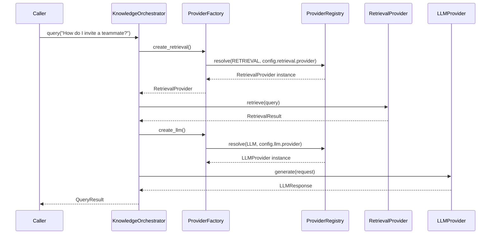

# AI Platform — Architecture

**Status:** Sprint 5 — Foundation
**Location:** `services/api/app/ai/`

## Purpose

`app/ai` is the operating system beneath every future AtlasHQ AI capability
(chat, RAG, agents, copilot workflows, ...). It defines vendor-neutral
abstractions and the machinery to resolve concrete implementations from
configuration, so business logic never depends on a specific AI vendor.

## Core principle

> Business logic must never know which provider is active.

This is enforced structurally:

- Every capability (LLM, retrieval, embeddings, vector store, documents,
  memory, prompts, agents) is defined as an abstract **interface** in
  `app/ai/interfaces/`.
- Concrete providers live in their own package (`app/ai/llm/`,
  `app/ai/retrieval/`, ...) and are the *only* place a vendor SDK or
  vendor-specific logic may appear.
- The **`ProviderRegistry`** (`app/ai/registry/`) is the only place a
  provider is instantiated. It resolves `(category, name)` to an
  initialized provider instance, lazily importing the provider's module.
- The **`ProviderFactory`** (`app/ai/factory/`) is what business logic
  actually calls. It reads `AIConfig` and asks the registry to resolve
  whichever provider is configured — callers never see a provider class
  name in their own code.
- **`AIConfig`** (`app/ai/config/`) is the single source of truth for which
  provider is active per category, loaded from YAML, environment
  variables, and runtime overrides, in that precedence order.

## Module map

```
app/ai/
  interfaces/     Abstract contracts (LLMProvider, RetrievalProvider, ...)
  registry/       ProviderRegistry — registration, discovery, lazy loading,
                  resolution, health, dependency graph, runtime switching
  factory/        ProviderFactory — config-driven provider construction
  config/         AIConfig schema + YAML/env/override loader
  llm/            LLM providers (mock + vendor stubs)
  retrieval/      Retrieval providers (mock + RAGFlow stub)
  embeddings/     Embedding providers (mock + vendor stubs)
  vectorstores/   Vector store providers (mock + vendor stubs)
  documents/      Document source providers (mock + vendor stubs)
  memory/         Memory providers (mock + vendor stubs)
  prompts/        PromptManager + filesystem/database prompt providers
  agents/         Agent interfaces/skeletons (Base/Tool/Planner/Execution/
                  Coordinator/Memory)
  orchestration/  KnowledgeOrchestrator — composes providers into a pipeline
  telemetry/      Vendor-neutral tracing/metrics/logging hooks
  exceptions/     AIError hierarchy
  utils/          chunking helper, bootstrap wiring (build_default_registry)
  docs/           This documentation set
```

## Request flow (knowledge query example)



## What Sprint 5 deliberately does NOT do

- No AI chat feature, no working RAG, no real embeddings, no real vector
  search, no real provider calling an external API.
- No frontend changes.
- No hardcoded provider logic outside `app/ai/<category>/`.

## Extending the platform

See [AddingProvider.md](AddingProvider.md) for the step-by-step guide to
adding a new provider without touching business logic.

## Sprint Extensions

- Sprint 6 production knowledge providers: [Sprint6KnowledgeProviders.md](Sprint6KnowledgeProviders.md)
- Sprint 7 runtime and tool execution platform: [Sprint7AgentRuntime.md](Sprint7AgentRuntime.md)
